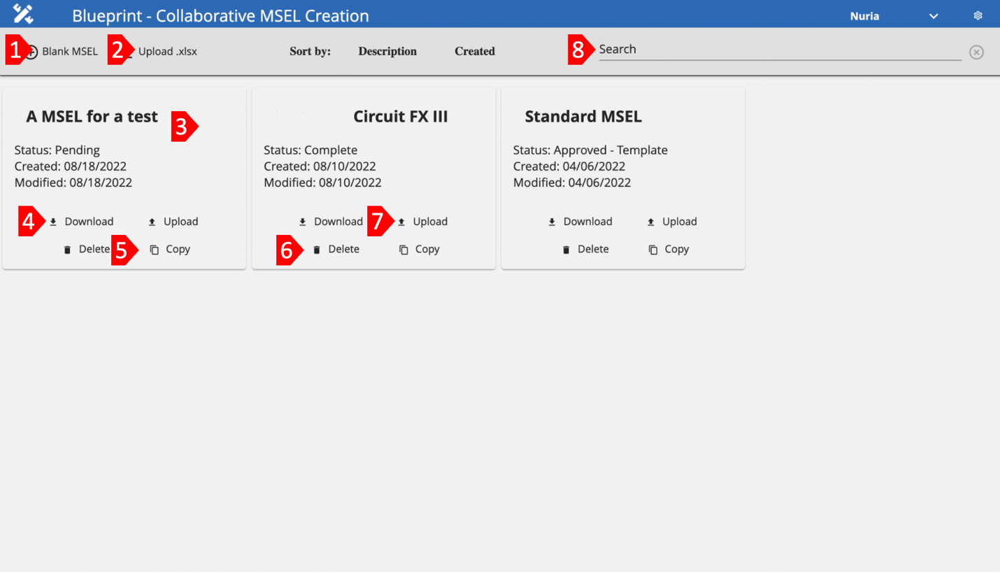

# Blueprint Dashboard

The Blueprint **Dashboard** provides access to the following features:

1. Create a Blank MSEL

    One of the main features of Blueprint is the ability to be able to create a MSEL from scratch using the application. This feature is helpful for users since it will eliminate the hassle of using Excel spreadsheets and have a more user-friendly application that will help users visualize their information easier.
2. Upload an Existing MSEL

    If creating a new MSEL from scratch is not desired, users can upload an already created MSEL and continue editing it on the application by using this functionality. Useful to share existing MSEL work without having to add the pieces of information to a blank MSEL one by one.
3. MSEL Cards

    Click on the desire MSEL Card to access its information. Here, you can also edit or update the existing information. Changes made will be seen live by other users, without the need of sharing a new document every time.
4.  Download

    If users desire to have an offline copy of any desired MSEL, users will have the ability to download a copy to their devices by using the Download feature. If by any chance, users don’t have an internet connection, this feature will be useful since users will be able to work offline on the MSEL and then upload the MSEL back to the application, so that other users can see any changes made. Although users are able to work on the MSEL offline, it is not recommended since they will be missing of all of the helpful features that Blueprint offers.
5. Copy

    With the Copy feature, users will be able to create a copy of an existing MSEL Card. With this feature, you will be able to modify the copy, instead of the original. Useful if you aren’t sure of any new changes or to have a foothold of the information that is needed, instead of creating a new MSEL from scratch.
6.  Delete
    With the Delete feature, you will be able to delete existing MSEL Cards. By deleting the MSEL Card, all the information that was included in the MSEL will be deleted too.
7.  Upload
    With the Upload feature, users can update the information from the MSEL Card with the new uploaded information. This feature will modify all the existing information with the one found on the .xlsx file.

