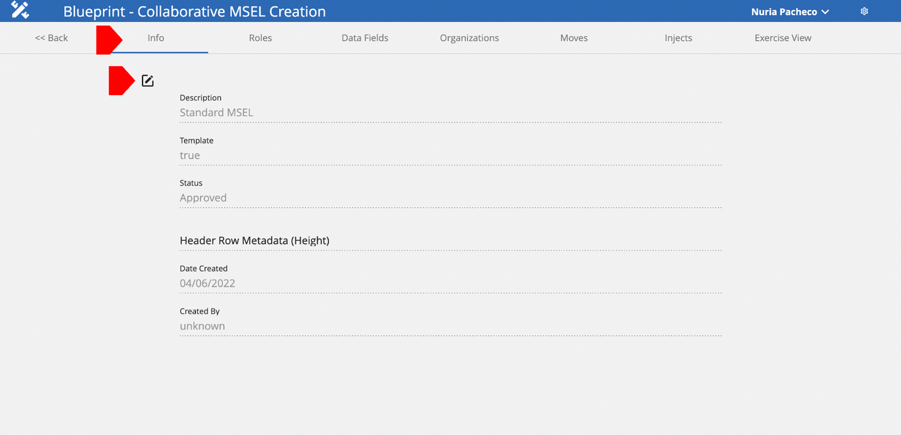
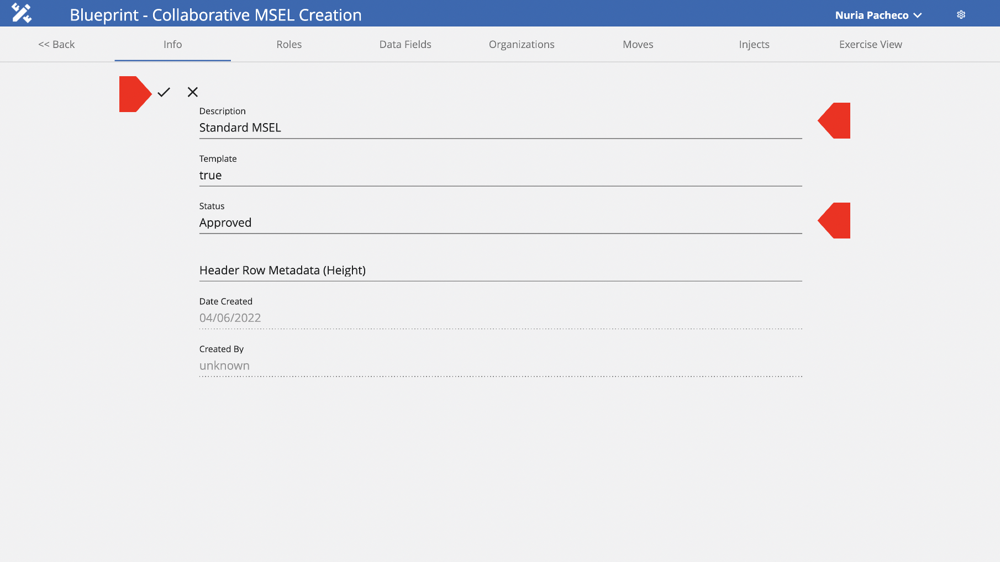

# Info Tab

On this tab, users will be able to edit basic information, such as MSEL Description and MSEL Status.

To edit the MSEL’s Basic Information, follow these next steps:

1. Select the MSEL you want to edit.
2. Once selected, make sure you are in the Info tab.
3. Then, click on the Edit button.

4. After clicking on the edit button, you will be able to change the MSEL’s Description.
5. Also, you will be able to change the MSEL’s status.
6. To save your current changes, click on the checkmark.

Changes made are now saved and can be seen by other users.
