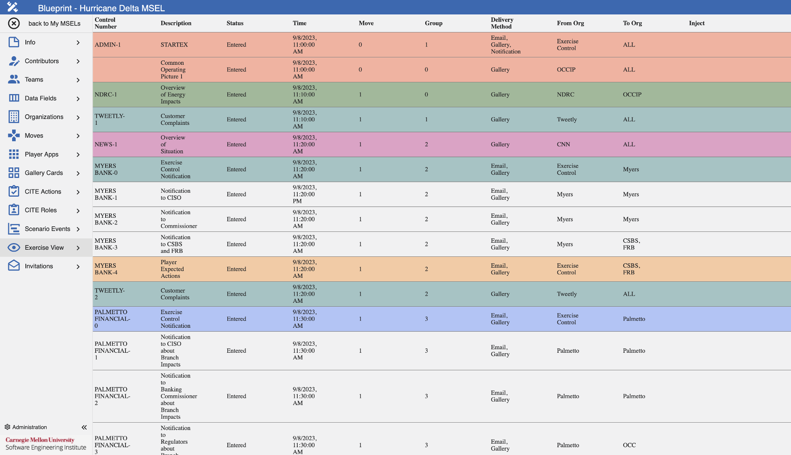
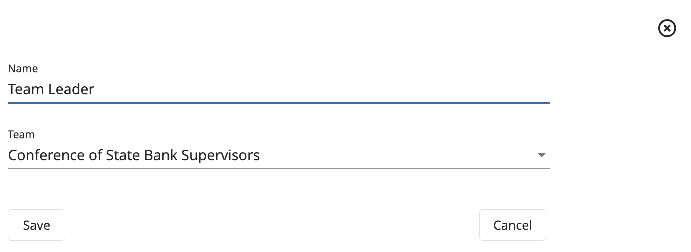
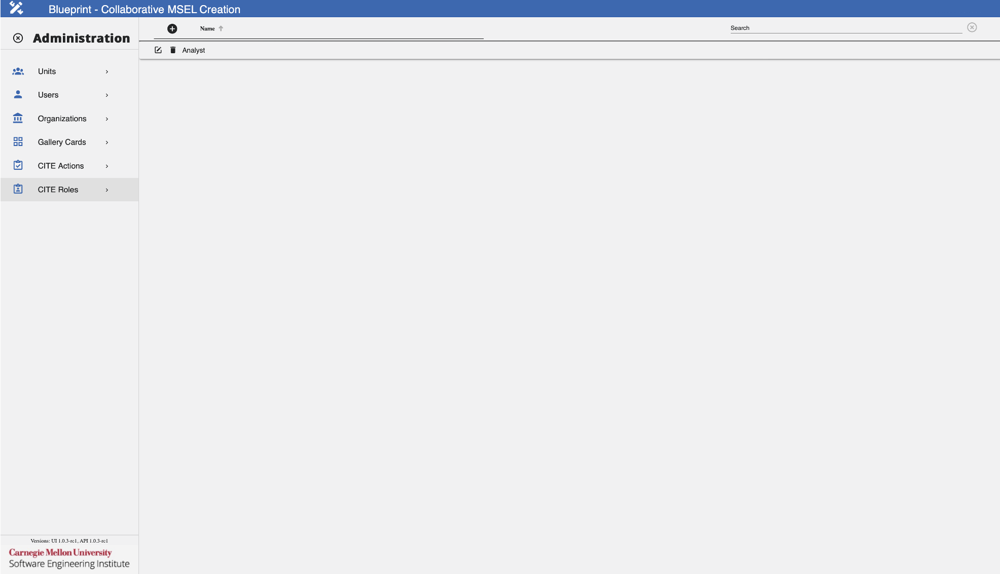

#  **Blueprint:** Building a MSEL

## Overview

### What Is Blueprint?

[**Blueprint**](#glossary) is a web application created to make the development of a [Master Scenario Event List (MSEL)](#glossary) and [events](#glossary) easier. With this application, it will further simplify the creation and visualization of the MSEL, allowing the user to select/define the simulated entities, attacks, timeframe, and regulators impacted by the scenario, etc. Additionally, it will leverage many advantages over the traditional method of using an excel spreadsheet by facilitating the collaboration between exercise designers belonging to multiple teams.

Additionally, Blueprint can be integrated with Player, Gallery, CITE and Steamfitter. Integrating Blueprint with these applications will automate the configuration process for an [exercise](#glossary).

In summary, Blueprint will allow users to view, edit, create, and approve events on the MSEL.

For installation, refer to these GitHub repositories.

- [Blueprint UI Repository](https://github.com/cmu-sei/Blueprint.Ui)
- [Blueprint API Repository](https://github.com/cmu-sei/Blueprint.Api)

### Blueprint Permissions

To use Blueprint, a user must be assigned Content Developer permissions and be added to their respective team.

There are three levels of permissions in Blueprint that affect the way a user interacts with the Blueprint application and collaborates on the MSEL creation.

- [System Admin](#glossary): Can add users to a team, as well as assign the required permissions to users. Additionally, users with this permission can view, edit, create, and approve events on the MSEL.
- [Content Developer](#glossary): Can view, edit, create, and approve events on the MSEL.
- [Facilitator](#glossary): Manages the exercise, can advance moves, execute events, and check events as completed.

Most users will have the Content Developer permission, since that is all that is required to be able to create and collaborate with other teams on the MSEL creation.

Refer to this section [Administrator Guide](#administrator-guide) for more information on additional administrative actions.

## User Guide

### Blueprint Landing Page

The landing page of Blueprint provides a variety of interaction modalities for exercises, tailored according to the permissions assigned to each user. The functionalities available are as follows:

#### Join Event

This feature becomes available when an event is in progress and the user has either been invited or is a member of the participating team. In such cases, the user is able to access and join the ongoing event.

After clicking on Join Event, users will be redirected to a page where all ongoing events that the user has been invited to are going to be shown. Here, an event should be selected, then the user will be redirected to Player where all exercise information and applications involved can be found.

#### Start Event

Users who have been invited to an exercise MSEL designated as a template possess the capability to initiate the event and engage with the exercise.

After clicking on Start Event, users will be redirected to a page where all available templates that the user has been invited to are going to be shown. Here, an event should be selected, then the user will be able to launch the event and get redirected to Player where all exercise information and applications involved can be found once deployed.

#### Manage an Event

This option is visible to users who hold administrative roles or are content developers within Blueprint, or have been assigned as contributors to the exercise MSEL. Such users are empowered to continue developing the current MSEL or to create new ones.

#### End Event

For those launched events, an extra Blueprint functionality is going to be added to the Player View, where users can manage their event. This feature further enables users to invite others to the event or even end the event after the user has completed the exercise.

*Launched Event User Invitations*

To invite other users to the launched event, follow these steps:

1. Navigate to the **Manage Event** application from Player's side panel.
2. Click on **Invite Others**.
3. Fill the fields as necessary following the Data Format Table specifications.

**Data Format Table**

| Field      | Data Type  | Description | Example    |
| ---------- | ---------- | ----------- | ---------- |
| **Team**         | Dropdown Text | Team user should be assigned to | SEI - Software Engineering Institute |
| **Email Domain** | String | User's email domain tied to the invitation | @sei.cmu.edu |
| **Expiration Date/Time** | Datetime | Date/Time when the invitation should expire | 04/20/2024 11:17:25 |
| **Maximum Number of Users Allowed to Use this Invitation** | Integer | Number of users allowed to use the invitation | 5 |
| **Can Invite Others to this team** | Boolean | Permission to be assigned to allow new users to invite others to the exercise | False |

After all desired configurations have been added, click **Save**.

*Ending a Launched Event*

To end an event, follow these steps:

1. Navigate to the **Manage Event** application from Player's side panel.
2. Click on **End Event**.
3. On the confirmation screen, click **Yes** to successfully end the event.

### MSEL Catalog

The MSEL Catalog shows created MSELs. Here, users are able to select the desired MSEL to work on, as well as create or delete them.

The following image will show some important hotspots about the MSEL Catalog. Reference the number on the hotspot to know more about this section.

#### Add Blank MSEL

*Hotspot 1:*

One of the main features of Blueprint is the ability to be able to create a MSEL from scratch via the application. This feature is helpful for users since it will eliminate the hassle of using Excel spreadsheets and provide a more user-friendly application that will provide an easier visualization of the information.

#### Upload an Existing MSEL

*Hotspot 2:*

If creating a new MSEL from scratch is not desired, users can upload a pre-existing MSEL and continue editing it on the application by using this functionality. This is useful to share existing MSEL work without having to add the pieces of information to a blank MSEL one by one.

#### Filter Display

**Types**

*Hotspot 3:*

Users can use this filter to narrow down MSELs presented on the dashboard based on their categorization. Selections available are: All Types, Templates, and Not Templates.

**Statuses**

*Hotspot 4:*

Users can use this filter to narrow down MSELs presented on the dashboard based on their current status. Selections available are: All Statuses, Pending, Entered, Approved, and Completed.

**Search**

*Hotspot 5:*

This functionality will enable users to search for a specific MSEL, in case it is not presented at the top on the dashboard.

**Load All MSELs**

*Hotspot 6:*

This functionality will enable users with the proper administrative permissions to load and view all MSELs created.

**Settings Cog**

*Hotspot 7:*

Users with the proper administrative permissions will be able to use this feature to access Blueprint's administrative settings.

#### Manage MSEL

Hotspot 8:*

**Download**

If users desire to have an offline copy of any desired MSEL, they will have the ability to download a copy to their devices by using the Download feature. If by any chance users don't have an internet connection, this feature will be useful since they will be able to work offline on the MSEL and then upload the MSEL back to the application, so that other users can see any changes made. Although users can work on the MSEL offline, it is not recommended since they will be missing on all of the helpful features that Blueprint offers.

**Upload**

With the Upload feature, users can update the information from the MSEL Card with the new uploaded information. This feature will modify all the existing information with the one found on the .xlsx file.

!!! important

    When engaging in the export and import process of MSELs from the Blueprint application, it is imperative to ensure that events and settings of the MSEL align with your particular preferences. It is worth noting that on occasion, during the import process of MSELs into the application, it may be necessary to reconfigure settings and specific fields.

**Delete**

With the Delete feature, users will be able to delete existing MSEL Cards. By deleting the MSEL Card, all the information that was included in the MSEL will be deleted too.

**Copy**

With the Copy feature, users will be able to create a copy of an existing MSEL Card. With this feature, users will be able to modify the copy, instead of the original. This is useful if the user isn't sure of any new changes or to have a foothold of the information that is needed, instead of creating a new MSEL from scratch.

#### MSEL Cards

*Hotspot 9:*

Click on the desire MSEL card to access its information. Here, users can also edit or update the existing information. Changes made will be seen live by other users without the need of sharing a new document every time.

### MSEL Definition

After uploading or creating a MSEL, users will be given the ability to edit any desired information, as well as add additional information to the MSEL.

With this functionality, users can now edit the same MSEL, instead of each user having their own copy and then sending their edits to the individual responsible of recompiling all the edits. By allowing users to access the MSEL on-the-fly, this will ensure that everyone will have the same copy of the MSEL on the day of the live scenario.

#### Basic Information

On this tab, users will be able to edit and configure MSEL settings, as well as enable/disable integrations.

To edit the MSEL's basic information and configuration, follow these next steps:

1. Navigate to the **Info** tab.
2. Be sure to be in the **Config** section.
3. Fill the fields as necessary following the Data Format Table specifications.

**Data Format Table**

| Field      | Data Type  | Description | Example    |
| ---------- | ---------- | ----------- | ---------- |
| **Name**         | String        | Name of the MSEL | Hurricane Delta MSEL |
| **Description** | String | Details and or characteristics of the MSEL | Hurricane Delta Fort Myers Scenario |
| **Start Date/Time** | Datetime | Start date/time of the MSEL | 09/10/2024 20:00:00 |
| **End Date/Time** | Datetime | End date/time of the MSEL | 10/10/2024 08:00:00 |
| **Is a Template** | Boolean | Designate if this MSEL should be a system template | True |
| **Integrate Player** | Boolean | Add Player integration functionality to the MSEL | True |
| **Integrate Gallery**| Boolean | Add Gallery integration functionality to the MSEL | True |
| **Integrate CITE** | Boolean | Add CITE integration functionality to the MSEL | True |
| **Select Scoring Model** | Dropdown Text | Select a CITE Scoring Model | CISA NCISS |
| **Integrate Steamfitter** | Boolean | Add Steamfitter integration functionality to the MSEL | False |
| **MSEL Status** | Dropdown Text | Select MSEL status designation | Active |
| **Header Row Metadata (Height)** | Integer | An integer value that defines the height of the header row when this MSEL is exported as an .xlsx file | 30 |

To save these settings, click the **checkmark** at the top.

Integrations:

- **[Gallery](#glossary):** Blueprint will add the collections, exhibits, cards, articles, teams, and users specified on the MSEL. To know more about this integration reference this section [Gallery](#gallery).
- **[CITE](#glossary):** Blueprint will add the evaluation, moves, actions, roles, teams, and users specified on the MSEL. To know more about this integration reference this section [CITE](#cite).
- **[Player](#glossary) & [Steamfitter](#glossary):** Blueprint will automate the adding of events specified on the MSEL, as well as configure exercise details in Player.

#### Add Page

On this tab, users can add notes to the MSEL to be worked and accessed by other team members with appropriate permissions.

To add MSEL notes, follow these next steps:

1. Navigate to the **Info** tab.
2. Click on **Add Page**.
3. Fill the fields as necessary following the Data Format Table specifications.

**Data Format Table**

| Field      | Data Type  | Description | Example    |
| ---------- | ---------- | ----------- | ---------- |
| **Page Name** | String | Name of the Page | Core Planning Group Notes |
| **All MSEL users can view this page** | Boolean | Enable other users who don't have elevated permissions to access this page | True |
| **Notes** | Rich Text | Field to add page notes | Next meeting is on 12/7 at 0800 |

After all changes have been added, click on the **checkmark** to save the page.

#### Contributors

On this tab, users will be able to add and assign contributor teams, as well as their respective roles related to the creation and management of the MSEL. Assigned teams will be able to view and edit the MSEL.

*Add a Contributor*

To add a contributor unit to the MSEL, follow these steps:

1. Navigate to the **Contributors** tab.
2. Click on the **Add a Contributor Unit** button and then select the desired unit to be added.
3. After selecting the unit, click on the **+** button.

*Remove a Contributor*

To remove a contributor unit from the MSEL, follow these steps:

1. Navigate to the **Contributors** tab.
2. Select the desired team to be removed and click on the **-** button.

Now the unit has been added to the MSEL and members will be able to view and edit the MSEL based on the role assigned to each unit member.

The available roles are:

- **[Editor](#glossary):** Edit the events that they are assigned to, but not other events. They cannot delete them or create new ones.
- **[Approver](#glossary):** Can view and edit the MSEL, but will have the added feature of approving a MSEL.
- **[Move Editor](#glossary):** Can edit moves on the MSEL, as well as increment them during an exercise.
- **[Owner](#glossary):** Owner of the MSEL, can view and edit the MSEL, as well as perform all of the functionalities that the MSEL provides (e.g.: Add Teams, Add Integrations, Events, etc).
- **[Evaluator](#glossary):** Manages the exercise, can advance moves, execute events, and check events as completed.
- **[Viewer](#glossary):** Can view the MSEL, but can't do any edits to it.

#### Teams

On this tab, users will be able to add and assign teams, as well as their respective roles during an event to the MSEL.

*Add a Team*

To add a team to the MSEL, follow these steps:

1. Navigate to the **Teams** tab.
2. Click on the **Add a Team** button and then select the desired team to be added.
3. After selecting the team, click on the **+** button.

*Remove a Team*

To remove a team from the MSEL, follow these steps:

1. Navigate to the **Teams** tab.
2. Select the desired team to be removed and click on the **-** button.

Now the team has been added to the MSEL and members will be able to participate on the MSEL event based on the role assigned to each team member.

The available roles are:

- **[`Inviter`](#glossary):** This role will allow a user to invite others to the MSEL event.
- **[`Observer`](#glossary):** When Gallery or CITE integrations are enabled, this role will allow a user to observe other team's progress on CITE and Gallery applications.
- **[`Incremeter`](#glossary):** When the CITE integration is enabled, this role will allow a user to advance the current move.
- **[`Modifier`](#glossary):** When the CITE integration is enabled, this role will allow a user to modify the team's score.
- **[`Submitter`](#glossary):** When the CITE integration is enabled, this role will allow a user to submit the team's score.

#### Data Fields

On this tab, users will be able to add data fields that are going to be used on the MSEL. These [data fields](#glossary) can be compared to the column fields used on Excel spreadsheets.

As it can be seen, there are two categories of Data Fields.

- **[System Defined](#glossary):** Added by default in MSEL creation, since data fields under this category are essential for MSEL features to work.
- **[User Defined](#glossary):** These are added by the user on an as-needed basis.

*Add a Data Field*

To add a Data Field to the MSEL, follow these steps:

1. Navigate to the **Data Fields** tab.
2. Click on the **+** icon from the top left of the screen.
3. Fill the fields as necessary following the Data Format Table specifications.

**Data Format Table**

| Field      | Data Type  | Description | Example    |
| ---------- | ---------- | ----------- | ---------- |
| **Display Order** | Integer | Indicate the order of the data field | 1 |
| **Name** | String | Name of the data field | Description |
| **Data Type** | Dropdown Text | Data type for the data field | String |
| **Use Option List** | Boolean | Add options to be selected when adding an event | True |
| **Display on the Events list** | Boolean | Display this data field on the Events list tab | True |
| **Display on the Exercise View** | Boolean | Display this data field on the Exercise View tab | True |
| **Display on "Advanced" edit tab** | Boolean | Display this data field on the data field edit component Advanced tab | True |
| **Display for Content Developers and MSEL Owners ONLY!!!** | Boolean | Display this data field for users who are Content Developers or MSEL Owners only | True |
| **Gallery Article Parameter** | Dropdown Text | If using the Gallery integration, select the Gallery parameter that aligns with the data field | Description |
| **Column Metadata (Width)** | Integer | Width of the column when displayed | 30 |
| **Cell Metadata (Color, Tint, Font-Weight)** | String | Column color and font style | (Red, 20%, bold) |

After all desired configurations have been added, click **Save**.

*Delete a Data Field*

To delete a Data Field from the MSEL, follow these steps:

1. Navigate to the **Data Fields** tab.
2. Select the desired data field to be deleted and click on the **Trash Can** icon.

*Edit a Data Field*

To edit an existing Data Field, follow these steps:

1. Navigate to the **Data Fields** tab.
2. Select the data field to be edited and click on the **Edit** button to make any changes to the existing configurations.
3. After making all the necessary changes, click on the **checkmark** to save them.

*Search For a Data Field*

To search for a specific Data Field, follow these steps:

1. Navigate to the **Data Fields** tab.
2. Click on the **Search Bar** and add the name of the data field desired.

#### Organizations

On this tab, users will be able to add all the related [organizations](#glossary) that are going to be used on the MSEL, as well as on the live exercise. Here, organizations with their information are added. Additionally, users can create organizations from scratch or from a template.

*Add an Organization Card From Scratch*

To add an Organization Card from scratch, follow these steps:

1. Navigate to the **Organizations** tab.
2. Click on **Add Organization**.
3. Select **New Organization** from the dropdown.
4. Fill the fields as necessary following the Data Format Table specifications.

**Data Format Table**

| Field      | Data Type  | Description | Example    |
| ---------- | ---------- | ----------- | ---------- |
| **Name** | String | Name of the organization | Twitter |
| **Short Name** | String | Organization's short name, such as an acronym | TW |
| **Summary** | String | Organization's short summary | Social media platform |
| **Email** | String | Organization's email contact | `user@twitter.com` |
| **Description** | Rich Text | Information, details, and characteristics of the organization | Twitter is a micro-blogging and social networking service on which users post and interact with messages known as "tweets", owned by American company Twitter, Inc. |

After all desired configurations have been added, click **Save**.

*Add an Organization Card From Template*

To create an organization from a template, follow these steps:

1. Navigate to the **Organizations** tab.
2. Click on **Add Organization**.
3. Select the desired template to be used from the dropdown.
4. Here, users will be able to edit all necessary information to create a new organization.
5. After modifying the desired details, click **Save**.

*Edit an Organization*

To edit an existing organization, follow these steps:

1. Navigate to the **Organizations** tab.
2. Select the desired card to be edited and click on the **Edit** button next to the organization name.
3. Here, users will be able to edit all necessary information.
4. Click **Save**.

*Delete an Organization*

To delete an organization, follow these steps:

1. Navigate to the **Organizations** tab.
2. Select the desired card to be deleted and click on the **Trash Can** icon next to the organization name.

*Search for an Organization*

To search for a specific organization, follow these steps:

1. Navigate to the **Organizations** tab.
2. Click on the **Search Bar** and type the name of the desired organization.

#### Moves

On this tab, users will be able to add all the related exercise [moves](#glossary) to the MSEL.

*Add a Move*

To add a move, follow these steps:

1. Navigate to the **Moves** tab.
2. Click on the **+** icon.
3. Fill the fields as necessary following the Data Format Table specifications.

**Data Format Table**

| Field      | Data Type  | Description | Example    |
| ---------- | ---------- | ----------- | ---------- |
| **Move Number** | Integer | Designated number for the move | 1 |
| **Start Date/Time** | Datetime | Start date/time of the move real-time | 11/20/2023, 09:00:00 |
| **Move Description** | String | Information, details, and characteristics of the move | Scene Setter |
| **Situation Date/Time** | Datetime | Start date/time of the move exercise-time | 1/24/2024, 14:18:27 |
| **Situation Description** | Rich Text | Information, details, and characteristics of the exercise | Hurricane Delta has landed in Fort Myers |

After all desired configurations have been added, click **Save**.

*Edit a Move*

To edit the move's details, follow these steps:

1. Navigate to the **Moves** tab.
2. Select the move you want to edit and click on the **Edit** button for the corresponding move.
3. Here, users will be able to edit all the desired details.
4. Click **Save**.

*Delete a Move*

To delete a move from the MSEL, follow these steps:

1. Navigate to the **Moves** tab.
2. Select the move you want to delete and click on the **Trash Can** button for the corresponding move.

*Search For a Move*

To search for a specific move, follow these steps:

1. Navigate to the **Moves** tab.
2. Click on the **Search Bar** and type the name of the desired move.

#### Scenario Events

On this tab, users will be able to add all the related events to the MSEL.

*Add an Event*

To add a new event, follow these steps:

1. Navigate to the **Events** tab.
2. Click on the **Hamburger** icon found on the top left.
3. Click on **Add New Event**.

On the **Default** tab, fill the fields as necessary following the Data Format Table specifications.

**Data Format Table**

| Field       | Data Type     | Description  | Example    |
| ----------- | ------------- | ------------ | ---------- |
| **Control Number** | String | Event control number, used to identify and categorize events | ADMIN-1 |
| **Description** | String |  Information, details, and characteristics of the event | STARTEX |
| **Status** | Dropdown Text | Approval status of the event to be used on the MSEL | Approved |
| **Time** | Datetime | Start date/time of the move real-time | 11/20/2023, 09:00:00 |
| **Move** | Dropdown Text | Move number the event is part of | 1 |
| **Group** | Integer | Groups events within a move, often times executed within the same time range | 1 |
| **Exercise Date** | Datetime | Start date/time of the move exercise-time | 1/24/2024, 14:18:27 |
| **Type** | String | Source type for the event | Email |
| **Delivery Method** | Dropdown Text | How is the event going to be delivered to participants | Email |

If not already completed on the previous tab, fill the fields from the **Advanced** tab following the Data Format Table specifications. This tab focuses on the MSEL's metadata and style.

**Data Format Table**

F| Field      | Data Type  | Description | Example    |
| ---------- | ---------- | ----------- | ---------- |
**Exercise Date/Time** | Datetime | Start date/time of the move exercise-time | 1/24/2024, 14:18:27
**Row Metadata** | Integer |  Defines the size of this event on the Events and Exercise View tabs | 15,199,21,133

If Gallery integration is enabled and not already completed on the Default tab, fill the fields from the **Gallery** tab following the Data Format Table specifications. This tab focuses on the Gallery fields necessary for the integration to work.

**Data Format Table**

| Field      | Data Type  | Description | Example    |
| ---------- | ---------- | ----------- | ---------- |
| **Description** | String |  Information, details, and characteristics of the event | STARTEX |
| **Status** | Dropdown Text | Approval status of the event to be used on the MSEL | Approved |
| **Move** | Dropdown Text | Move number the event is part of | 1 |
| **Group** | Integer | Groups events within a move, often times executed within the same time range | 1 |
| **Exercise Date** | Datetime | Start date/time of the move exercise-time | 1/24/2024, 14:18:27 |
| **Delivery Method** | Dropdown Text | How is the event going to be delivered to participants | Gallery |
| **Title** | String | Title of the event | Bank Consortium Falls Victim to Ransomware Attack |
| **From Org** | Dropdown Text | Select the organization that sends this event | CC News |
| **To Org** | Dropdown Text | Select the organization that receives this event | ALL |

After all desired configurations have been added, click **Save**.

*Add Color to an Event*

To add a color to an existing event, follow these steps:

1. Navigate to the **Events** tab.
2. Select the desired event to be edited and click on the **Hamburger** icon next to the event.
3. Hover over **Highlight**.
4. Here, users will be able to select the desired color.

*Edit an Event*

To edit the event's details, follow these steps:

1. Navigate to the **Events** tab.
2. Select the desired event to be edited and click on the **Hamburger** icon next to the event.
3. Click on **Edit**.
4. Here, users will be prompted the same event's edit component as when adding a new event.
5. After doing all the necessary edits, click **Save**.

*Delete an Event*

To delete an event, follow these steps:

1. Navigate to the **Events** tab.
2. Select the desired event to be deleted and click on the **Trash Can** icon next to the event.

*Search For an Event*

To search for a specific event, follow these steps:

1. Navigate to the **Events** tab.
2. Click on the **Search Bar** and type the name of the desired event.

#### Exercise View

Whereas the Events tab is for MSEL Owners and Content Developers to add, edit, and delete MSEL events, the Exercise View tab is meant to be used to allow participants access to MSEL events on-the-fly in a read-only format. This will allow the tracking of current and future events to be executed during an exercise.

#### Invitations

In the Invitations tab, users who possess roles as Administrators or Content Developers, or those who have been designated as contributors to the MSEL, have the capability to create invitations. These invitations permit other users to either join or start the MSEL event.

To facilitate this process, email domains are specified on these invitations, along with a maximum number of users who may use these invitations. Furthermore, these invitations are associated with specific teams that have been integrated into the MSEL. Consequently, upon joining the event using the invitation, the user will be automatically affiliated with the corresponding team for the duration of the event.

*Add an Invitation*

To add a new invitation, follow these steps:

1. Navigate to the **Invitations** tab.
2. Click on the **Invite Others** button.
3. Fill the fields as necessary following the Data Format Table specifications.

**Data Format Table**

| Field      | Data Type  | Description | Example    |
| ---------- | ---------- | ----------- | ---------- |
| **Team** | Dropdown Text | Team tied to the invitation | SEI - Software Engineering Institute |
| **Email Domain** | String | User's email domain | `@sei.cmu.edu` |
| **Expiration Date/Time** | Datetime | Date and time of when should the invitation expire | 04/15/2024 15:12:03 |
| **Maximum Number of Users Allowed to Use this Invitation** | Integer | Number of users that can use the invitation | 5 |
| **Can Invite others to this Team** | Boolean | Permission to add others to the team | False |

After all desired configurations have been added, click **Save**.

*Edit an Invitation*

To edit an invitation, follow these steps:

1. Navigate to the **Invitations** tab.
2. Select the desired invitation to be edited and click on the **Edit Icon** next to the invitation.
3. Here, users will be prompted the same invitation's edit component as when adding a new invitation.
4. After doing all the necessary edits, click **Save**.

*Delete an Invitation*

To delete an invitation, follow these steps:

1. Navigate to the **Invitations** tab.
2. Select the desired invitation to be deleted and click on the **Trash Can Icon** next to the invitation.

*Search For an Invitation*

To search for a specific invitation, follow these steps:

1. Navigate to the **Invitations** tab.
2. Click on the **Search Bar** and type the name of the team tied to the invitation.

### Integrations

Integrations to the following applications have been added to facilitate the extra configurations that should be done in each of these applications. With this functionality, no more repetitive steps are needed to be done in multiple applications.

#### CITE

If enabled, Blueprint will be able to push MSEL information to the CITE Application. For this, additional tabs will be added to the Blueprint side panel, which will be needed to be configured.

To enable the full CITE integration functionality the following tabs should be configured.

##### Teams

On the Teams tab, extra CITE configurations should be done on teams that have been added to the MSEL. To do so, follow these steps.

First, a CITE Team Type should be assigned to each team. To do this, follow these steps:

1. Navigate to the **Teams** tab.
2. Select the desired team and click on the **Edit Icon**.
3. Fill the fields as necessary following the Data Format Table specifications.

**Data Format Table**

| Field      | Data Type  | Description | Example    |
| ---------- | ---------- | ----------- | ---------- |
| **Team Email** | String | Team's email contact | `seicmu@cmu.edu` |
| **CITE Team Type** | Dropdown Text | Classifies the team within a certain type | Individual Organization |

After all desired configurations have been added, click **Save**.

Next, roles should be assigned to each member of the team. To do this, follow these steps:

1. Navigate to the **Teams** tab.
2. Select the desired team, and click on it to expand its configurations.
3. Assign the necessary roles to each team member.

##### CITE Actions

On this tab, [CITE Actions](#glossary) can be added to be pushed from Blueprint. These actions will allow team members to customize their response by tracking tasks during the exercise.

*Add a CITE Action*

To add a CITE Action, follow these steps:

1. Navigate to the **CITE Actions** tab.
2. Click on the **+** icon.
3. Fill the fields as necessary following the Data Format Table specifications.

**Data Format Table**

| Field      | Data Type  | Description | Example    |
| ---------- | ---------- | ----------- | ---------- |
| **Move** | Dropdown Text | Select the move where this action should be displayed | 0 - Hurricane Delta Scene Setter |
| **Team** | Dropdown Text | Select the team this action applies to | Conference of State Bank Supervisors |
| **Display Order** | Integer | Indicates the order this action should be displayed on the CITE Dashboard | 1 |
| **Description of the Action** | String |  Information, details, and characteristics of the action | Assign users to roles |

After all desired configurations have been added, click **Save**.

*Edit a CITE Action*

To edit the CITE Action's details, follow these steps:

1. Navigate to the **CITE Actions** tab.
2. Select the desired action to be edited and click on the **Edit** icon next to the action.
3. Here, users will be prompted the same action's edit component as when adding a new action.
4. After doing all the necessary edits, click **Save**.

*Delete a CITE Action*

To delete a CITE Action, follow these steps:

1. Navigate to the **CITE Actions** tab.
2. Select the desired action to be deleted and click on the **Trash Can** icon next to the action.

*Filter Actions by Team*

To filter CITE Actions by teams, follow these steps:

1. Navigate to the **CITE Actions** tab.
2. On the **Team** dropdown, select the desired team to filter by.

*Search For an Action*

To search for a specific action, follow these steps:

1. Navigate to the **CITE Actions** tab.
2. Click on the **Search Bar** and type the name of the desired action.

##### CITE Roles

On this tab, [CITE Roles](#glossary) can be added to be pushed from Blueprint. These roles will allow team members to customize their response by tracking their responsibilities during an exercise.

*Add a CITE Role*

To add a CITE Role, follow these steps:

1. Navigate to the **CITE Roles** tab.
2. Click on the **+** icon.
3. Fill the fields as necessary following the Data Format Table specifications.

**Data Format Table**

| Field      | Data Type  | Description | Example    |
| ---------- | ---------- | ----------- | ---------- |
| **Name** | String| Name of the role | Team Leader |
| **Team** | Dropdown Text | Select the team this role applies to | Conference of State Bank Supervisors |

After all desired configurations have been added, click **Save**.

*Edit a CITE Role*

To edit the CITE Role's details, follow these steps:

1. Navigate to the **CITE Roles** tab.
2. Select the desired role to be edited and click on the **Edit** icon next to the role.
3. Here, users will be prompted the same role's edit component as when adding a new role.
4. After doing all the necessary edits, click **Save**.

*Delete a CITE Role*

To delete a CITE Role, follow these steps:

1. Navigate to the **CITE Roles** tab.
2. Select the desired role to be deleted and click on the **Trash Can** icon next to the role.

*Filter Roles by Team*

To filter Roles by team, follow these steps:

1. Navigate to the **CITE Roles** tab.
2. On the **Team** dropdown, select the desired team to filter by.

*Search For a Role*

To search for a specific role, follow these steps:

1. Navigate to the **CITE Roles** tab.
2. Click on the **Search Bar** and type the name of the desired role.

#### Gallery

If enabled, Blueprint will be able to push MSEL information to the Gallery application. For this, additional tabs will be added to the Blueprint side panel, which will be needed to be configured.

To enable the full Gallery integration functionality the following tabs should be configured.

##### Gallery Data Fields

On the Data Fields tab, additional data fields should be configured to be able to push MSEL information to Gallery.

Data fields that should be added are:

**Data Format Table**

| Field      | Data Type  | Description | Example    |
| ---------- | ---------- | ----------- | ---------- |
| **Description** | String |  Information, details, and characteristics of the event | STARTEX |
| **Date Posted** | Datetime | Date of when the event was posted | 1/24/2024, 14:18:27 |
| **Delivery Method** | Dropdown Text | How is the event going to be delivered to participants | Gallery |
| **Name** | String | Name of the event | Common Operating Picture 1 |
| **From Org** | Dropdown Text | Select the organization that sends this event | CC News |
| **To Org** | Dropdown Text | Select the organization that receives this event | ALL |
| **Summary** | Rich Text | Complete information and details of the event | Bank XYZ has been affected by a ransomware attack... |
| **Card** | Dropdown Text | Select the Gallery Card this event should be categorized with | Information Technology Sector |
| **Status** | Dropdown Text | Approval status of the event to be used on the MSEL | Approved |
| **Source Type** | Dropdown Text | Select from where the event's details come from | News |
| **Source Name** | String | Add the author of the event | BBC News |
| **Move** | Dropdown Text | Move number the event is part of | 1 |
| **Group** | Integer | Groups events within a move, often times executed within the same time range | 1 |
| **Url** | String | Provide a URL if more information is necessary for participants to access | `www.bbcnews.com/ransomware-attack-xyzbank` |
| **Open in a New Tab** | Boolean | If a URL was provided, select this option if desired to open the URL in a new tab | True |

After adding these data fields, these should be mapped to their appropriate Gallery field. This can be done by selecting an option from the **Gallery Article Parameter** dropdown when adding/editing a data field.

##### Gallery Cards

On this tab, [Gallery Cards](#glossary) can be added to be pushed from Blueprint. These are the different cards presented in the Gallery Wall and where different articles related to that card can be found.

*Add a Gallery Card*

To add a Gallery card, follow these steps:

1. Navigate to the **Gallery Cards** tab.
2. Click on the **+** icon.
3. Fill the fields as necessary following the Data Format Table specifications.

**Data Format Table**

| Field      | Data Type  | Description | Example    |
| ---------- | ---------- | ----------- | ---------- |
| **Name** | String | Name of the Gallery card | Energy Sector |
| **Card Description** | String |  Information, details, and characteristics of the Gallery card | The current state of the Energy Sector |
| **Move** | Dropdown Text | Select the move where this Gallery card should be displayed | 0 |

After all desired configurations have been added, click **Save**.

*Edit a Gallery Card*

To edit the Gallery card's details, follow these steps:

1. Navigate to the **Gallery Cards** tab.
2. Select the desired card to be edited and click on the **Edit** icon next to the card.
3. Here, users will be prompted the same card's edit component as when adding a new card.
4. After doing all the necessary edits, click **Save**.

*Delete a Gallery Card*

To delete a Gallery card, follow these steps:

1. Navigate to the **Gallery Cards** tab.
2. Select the desired card to be deleted and click on the **Trash Can** icon next to the card.

*Search For a Gallery Card*

To search for a specific card, follow these steps:

1. Navigate to the **Gallery Cards** tab.
2. Click on the **Search Bar** and type the name of the desired card.

#### Player

If enabled, Blueprint will be able to push MSEL information to the Player application. For this, additional tabs will be added to the Blueprint side panel, which will be needed to be configured.

To enable the full Player integration functionality the following tabs should be configured.

##### Player Apps

On this tab, [Player Apps](#glossary) configurations can be added to be pushed from Blueprint. These are the different applications accessible from the [Player View](#glossary).

*Add a Player App*

To add a Player App, follow these steps:

1. Navigate to the **Player Apps** tab.
2. Click on the **+** icon.
3. Select an app template from the provided list.
4. Fill the fields as necessary following the Data Format Table specifications.

**Data Format Table**

| Field      | Data Type  | Description | Example    |
| ---------- | ---------- | ----------- | ---------- |
| **Name** | String | Name of the application | Chat |
| **Url** | String | URL of the application | `roundcube.hamilton.treasury.gov` |
| **Icon Url** | String | URL of the application's icon | `roundcube.hamilton.treasury.gov/roundcube.png` |
| **Embeddable** | Boolean | Select whether the app should be embedded in Player's iframe | True |
| **Load in Background** | Boolean | Select whether the app should load in the background | True |

**URL Parameters**

URL Parameters can be added in the URL to point to a specific CITE evaluation, Gallery exhibit, Player view, etc. To do this, the variables should be added in braces in the URL when adding a new application. For this, take into considerations the following variables:

- **{citeEvaluationId}:** Add this variable to the URL to point to a specific CITE evaluation.
- **{galleryExhibitId}:** Add this variable to the URL to point to a specific Gallery exhibit.
- **{steamFitterScenarioId}:** Add this variable to the URL to point to a specific Steamfitter scenario.
- **{playerViewId}:** Add this variable to the URL to point to a specific Player view.

After all desired configurations have been added, click **Save**.

*Edit a Player App*

To edit the Player app's details, follow these steps:

1. Navigate to the **Player Apps** tab.
2. Select the desired app to be edited and click on the **Edit** icon next to the app.
3. Here, users will be prompted the same app's edit component as when adding a new app.
4. After doing all the necessary edits, click **Save**.

*Delete a Player App*

To delete a Player App, follow these steps:

1. Navigate to the **Player Apps** tab.
2. Select the desired app to be deleted and click on the **Trash Can** icon next to the app.

*Search For a Player App*

To search for a specific app, follow these steps:

1. Navigate to the **Player Apps** tab.
2. Click on the **Search Bar** and type the name of the desired app.

#### Push Integrations

After adding all of the MSEL information and performing all of the configurations necessary, information from the different enabled integrations can be pushed to their respective applications.

To push MSEL information to their respective applications, follow these steps:

1. Navigate to the **Info** tab.
2. Click the **Push Integrations** button.

#### Remove Integrations

If desired, MSEL information can be removed after being pushed to their respective applications

To remove MSEL information from the applications, follow these steps:

1. Navigate to the **Info** tab.
2. Click the **Remove Integrations** button.

## Administrator Guide

### Units

The following image shows the Units Administration Page. Here, administrators can add, edit, and delete units. To be able to use the Blueprint application, the administrator should assign a unit to desired users.

**Add a Unit**

Assuming that the user has been granted the appropriate permissions by the exercise administrator, follow these steps to add a unit.

1. Click on the **Settings Cog** found in the top-right corner of the screen.
2. Under the Units Administration View, click **+**.
3. Fill the fields as necessary following the Data Format Table specifications.

**Data Format Table**

| Field      | Data Type  | Description | Example    |
| ---------- | ---------- | ----------- | ---------- |
| **Name** | String | Name for the unit | Carnegie Mellon University |
| **Short Name** | String | Short name for the unit | CMU |

After all desired configurations have been added, click **Save**.

**Edit a Unit**

To edit the unit's details, follow these steps:

1. Click on the **Settings Cog** found in the top-right corner of the screen.
2. Under the Units Administration View, select the unit to be edited and click on the **Edit Icon** next to the unit.
3. Here, users will be prompted the same unit's edit component as when adding a new unit.
4. After doing all the necessary edits, click **Save**.

**Delete a Unit**

To delete a unit, follow these steps:

1. Click on the **Settings Cog** found in the top-right corner of the screen.
2. Under the Units Administration View, select the unit to be deleted and click on the **Trash Can Icon** next to the unit.

**Search For a Unit**

To search for a specific unit, follow these steps:

1. Click on the **Settings Cog** found in the top-right corner of the screen.
2. Under the Units Administration View, click on the **Search Bar** and type the name of the desired unit.

**Add/Remove Users From a Unit**

To configure a unit for an exercise, administrators will need to add users to their respective units. To do this, follow these steps.

1. Select the unit to be configured and click on it to expand its configuration details.
2. Under the **All Users** tab, users that have not been assigned to the unit will be shown. To add them to the unit, click on **Add User**.
3. Under the **Unit Users** tab, users that have already been assigned to the unit will be shown. To remove a user from the unit, click on **Remove**.

### Users

The following image shows the Users Administration Page. Here, administrators can add and delete users. Additionally, administrators will be able to assign the necessary permissions to each user.

The available permissions are:

- **System Admin:** Can use all administration privileges on the Blueprint application.
- **Content Developer:** Can view, edit, create, and approve events on the MSEL.

**Add a User**

Assuming that the user has been granted the appropriate permissions by the exercise administrator, follow these steps to add a user.

1. Under the Users Administration View, click **+**.
2. Fill the fields as necessary following the Data Format Table specifications.

**Data Format Table**

| Field      | Data Type  | Description | Example    |
| ---------- | ---------- | ----------- | ---------- |
| **User ID** | GUID | Unique ID for the user | 9dd4e3d8-5098-4b0a-9216-697cda5553f8 |
| **User Name** | String | User name identifier  | user-2 |

Click **Save** represented by a user with a + sign and select the desired permissions to be assigned by clicking on the checkboxes next to the user.

**Delete a User**

To delete a user, follow these steps:

1. Click on the **Settings Cog** found in the top-right corner of the screen.
2. Under the Users Administration View, select the user to be deleted and click on the **Trash Can Icon** next to the user.

**Search For a User**

To search for a specific user, follow these steps:

1. Click on the **Settings Cog** found in the top-right corner of the screen.
2. Under the Users Administration View, click on the **Search Bar** and type the name of the desired user.

### Organization Templates

The following image shows the Organization Templates Administration Page. Here, administrators can add and delete organization templates.

**Add an Organization Template**

Assuming that the user has been granted the appropriate permissions by the exercise administrator, follow these steps to add an organization template.

1. Under the Organizations Administration View, click **+**.
2. Fill the fields as necessary following the Data Format Table specifications.

**Data Format Table**

| Field      | Data Type  | Description | Example    |
| ---------- | ---------- | ----------- | ---------- |
| **Long Name** | String | Add the complete name for the organization | Cybersecurity and Infrastructure Security Agency |
| **Short Name** | String | Add a short name for the organization, such as an acronym | CISA |
| **Summary** | String | Organization's short summary | Security agency |
| **Email** | String | Organization's email contact | `john@cisa.gov` |
| **Description** | Rich Text | Information, details, and characteristics of the organization | The Cybersecurity and Infrastructure Security Agency (CISA) is an agency of the DHS that is responsible for strengthening cybersecurity and infrastructure protection. |

After all desired configurations have been added, click **Save**.

**Edit an Organization Template**

To edit the organization template's details, follow these steps:

1. Click on the **Settings Cog** found in the top-right corner of the screen.
2. Under the Organizations Administration View, select the organization to be edited and click on the **Edit Icon** next to the organization template.
3. Here, users will be prompted the same organization's edit component as when adding a new organization template.
4. After doing all the necessary edits, click **Save**.

**Delete an Organization Template**

To delete an organization template, follow these steps:

1. Click on the **Settings Cog** found in the top-right corner of the screen.
2. Under the Organizations Administration View, select the organization to be deleted and click on the **Trash Can Icon** next to the organization template.

**Search For an Organization Template**

To search for a specific organization template, follow these steps:

1. Click on the **Settings Cog** found in the top-right corner of the screen.
2. Under the Organizations Administration View, click on the **Search Bar** and type the name of the desired organization template.

### Gallery Card Templates

The following image shows the Gallery Card Templates Administration Page. Here, administrators can add and delete Gallery card templates.

**Add a Gallery Card Template**

Assuming that the user has been granted the appropriate permissions by the exercise administrator, follow these steps to add a Gallery card template.

1. Under the Gallery Cards Administration View, click **+**.
2. Fill the fields as necessary following the Data Format Table specifications.

**Data Format Table**

| Field      | Data Type  | Description | Example    |
| ---------- | ---------- | ----------- | ---------- |
| **Name** | String | Gallery card name | Information Technology Sector |
| **Card Description** | String |  Information, details, and characteristics of the Gallery card | Status of the Information Technology Sector |

After all desired configurations have been added, click **Save**.

**Edit a Gallery Card Template**

To edit the Gallery card template's details, follow these steps:

1. Click on the **Settings Cog** found in the top-right corner of the screen.
2. Under the Gallery Cards Administration View, select the card template to be edited and click on the **Edit Icon** next to the Gallery card template.
3. Here, users will be prompted the same Gallery card's edit component as when adding a new card template.
4. After doing all the necessary edits, click **Save**.

**Delete a Gallery Card Template**

To delete an Gallery card template, follow these steps:

1. Click on the **Settings Cog** found in the top-right corner of the screen.
2. Under the Gallery Cards Administration View, select the card template to be deleted and click on the **Trash Can Icon** next to the card template.

**Search For a Gallery Card Template**

To search for a specific Gallery card template, follow these steps:

1. Click on the **Settings Cog** found in the top-right corner of the screen.
2. Under the Gallery Cards Administration View, click on the **Search Bar** and type the name of the desired card template.

### CITE Actions Templates

The following image shows the CITE Action Templates Administration Page. Here, administrators can add and delete CITE action templates.

**Add a CITE Action Template**

Assuming that the user has been granted the appropriate permissions by the exercise administrator, follow these steps to add a CITE action template.

1. Under the CITE Actions Administration View, click **+**.
2. Fill the fields as necessary following the Data Format Table specifications.

**Data Format Table**

| Field      | Data Type  | Description | Example    |
| ---------- | ---------- | ----------- | ---------- |
| **Description of the Action** | String |  Information, details, and characteristics of the CITE action | Score the incident |

After all desired configurations have been added, click **Save**.

**Edit a CITE Action Template**

To edit the CITE action template's details, follow these steps:

1. Click on the **Settings Cog** found in the top-right corner of the screen.
2. Under the CITE Actions Administration View, select the action template to be edited and click on the **Edit Icon** next to the action template.
3. Here, users will be prompted the same CITE action's edit component as when adding a new action template.
4. After doing all the necessary edits, click **Save**.

**Delete a CITE Action Template**

To delete an CITE action template, follow these steps:

1. Click on the **Settings Cog** found in the top-right corner of the screen.
2. Under the CITE Actions Administration View, select the action template to be deleted and click on the **Trash Can Icon** next to the action template.

**Search For a CITE Action Template**

To search for a specific CITE action template, follow these steps:

1. Click on the **Settings Cog** found in the top-right corner of the screen.
2. Under the CITE Actions Administration View, click on the **Search Bar** and type the name of the desired action template.

### CITE Roles Templates

The following image shows the CITE Roles Templates Administration Page. Here, administrators can add and delete CITE roles templates.

**Add a CITE Role Template**

Assuming that the user has been granted the appropriate permissions by the exercise administrator, follow these steps to add a CITE role template.

1. Under the CITE Roles Administration View, click **+**.
2. Fill the fields as necessary following the Data Format Table specifications.

**Data Format Table**

| Field      | Data Type  | Description | Example    |
| ---------- | ---------- | ----------- | ---------- |
| **Name** | String |  Name of the role | Reviewer |

After all desired configurations have been added, click **Save**.

**Edit a CITE Role Template**

To edit the CITE role template's details, follow these steps:

1. Click on the **Settings Cog** found in the top-right corner of the screen.
2. Under the CITE Roles Administration View, select the role template to be edited and click on the **Edit Icon** next to the role template.
3. Here, users will be prompted the same CITE role's edit component as when adding a new role template.
4. After doing all the necessary edits, click **Save**.

**Delete a CITE Role Template**

To delete a CITE role template, follow these steps:

1. Click on the **Settings Cog** found in the top-right corner of the screen.
2. Under the CITE Roles Administration View, select the role template to be deleted and click on the **Trash Can Icon** next to the role template.

**Search For a CITE Role Template**

To search for a specific CITE role template, follow these steps:

1. Click on the **Settings Cog** found in the top-right corner of the screen.
2. Under the CITE Roles Administration View, click on the **Search Bar** and type the name of the desired role template.

## Glossary

The following glossary provides a brief definition of key terms and concepts as they are used in the context of the Blueprint application.

1. **Approver Role:** Can view and edit the MSEL, but will have the added feature of approving a MSEL.
2. **Blueprint**: Web application created to make the development of a MSEL and events easier.
3. **CITE:** Web application that allows multiple participants from different organizations to evaluate, score, and comment on cyber incidents.
4. **CITE Action:** Series of steps to guide users on an appropriate course of action during an exercise.
5. **CITE Role:** Provide a set of responsibilities assigned to a user during an exercise.
6. **Content Developer Permission:** Can view, edit, create, and approve events on the MSEL.
7. **Data Fields:** Structured components containing essential information about the event's characteristics, context, and implications.
8. **Editor Role:** Edit the events that they are assigned to, but not other events. They cannot delete them or create new ones.
9. **Events**: Specific scenario events or messages within the scenario that prompt users to implement designated actions.
10. **Exercises**: Structured and simulated activity designed to assess, train, or evaluate the capabilities, preparedness, and responses of individuals, teams, or organizations in dealing with various situations, especially emergencies or crisis scenarios.
11. **Evaluator Permission**: Manages the exercise, can advance moves, execute events, and check events as completed.
12. **Gallery:** Web application where participants receive incident information.
13. **Gallery Card:** Groups articles into their respective categories, the categories can be defined in the administration panel.
14. **`Incrementer` Role:** When the CITE integration is enabled, this role will a allow a user to advance the current move.
15. **`Inviter` Role:** This role will allow a user to invite others to the MSEL event.
16. **Modifier Role:** When the CITE integration is enabled, this role will allow a user to modify the team's score.
17. **Move Editor:** Can edit moves on the MSEL, as well as increment them during an exercise.
18. **Moves:** A defined period of time during an exercise, in which a series of events are distributed for users to discuss and assess the current incident severity.
19. **MSEL:** (Master Scenario Events List) provides a timeline for all expected events, affiliated users and organizations during an exercise.
20. **Observer Role:** When Gallery or CITE integrations are enabled, this role will allow a user to observe other team's progress on CITE and Gallery applications.
21. **Organizations:** Entities within an exercise with defined roles, responsibilities, and functions.
22. **Owner Role:** Owner of the MSEL, can view and edit the MSEL, as well as perform all of the functionalities that the MSEL provides (e.g.: Add Teams, Add Integrations, Events, etc).
23. **Player:** Centralized web interface where participants, teams, and administrators go to engage in a cyber event.
24. **Player Apps:** List of applications accessible from the same Player view.
25. **Player View:** These are the settings associated with building a view. A view can be edited, cloned, and deleted.
26. **Steamfitter:** Gives content developers the ability to create scenarios consisting of a series of scheduled tasks, manual tasks, and events which run against virtual machines during an event.
27. **Submitter Role:** When the CITE integration is enabled, this role will allow a user to submit the team's score.
28. **System Admin Permission:** Can add users to a team, as well as assign the required permissions.
29. **System Defined Data Fields:** Added by default in MSEL creation, since data fields under this category are essential for MSEL features to work.
30. **User Defined Data Fields:** These are added by the user on an as-needed basis.
31. **Viewer Role:** Can view the MSEL, but can't do any edits to it.
