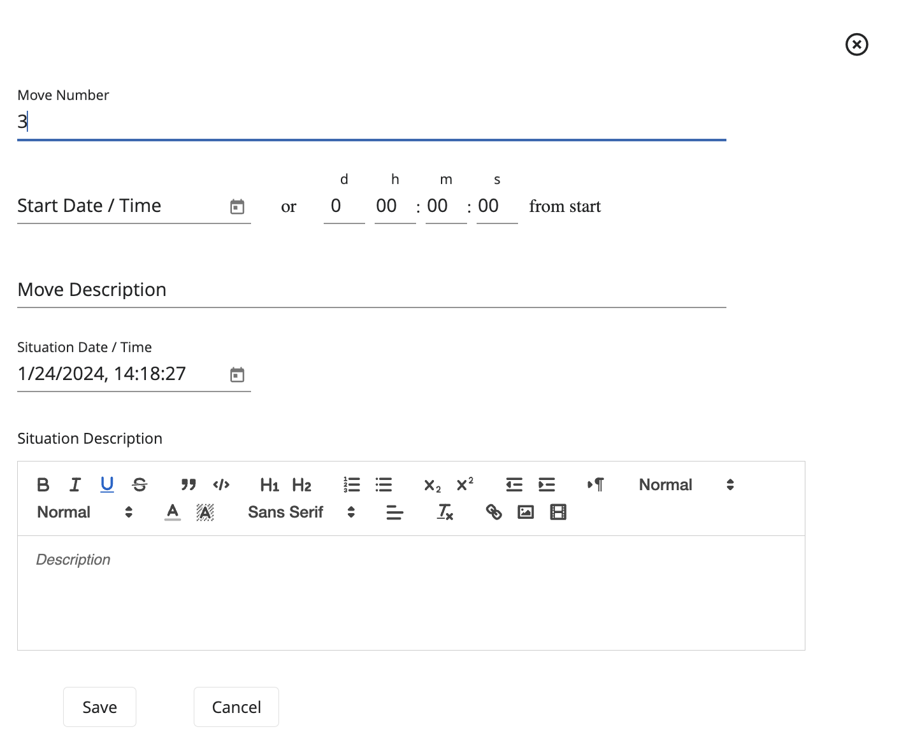
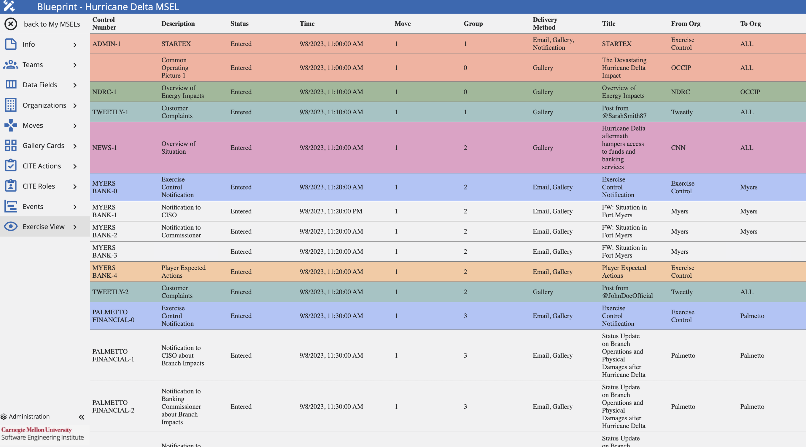

# **Blueprint**
*Building a MSEL*

## Overview

### What is Blueprint?

[**Blueprint**](#glossary) is a web application created to make the development of a [Master Scenario Event Lists (MSEL)](#glossary) and [events](#glossary) easier. With this application, it will further simplify the creation and visualization of the MSEL, allowing the user to select/define the simulated entities, attacks, timeframe, regulators impacted by the scenario, etc. Additionally, it will leverage many advantages over the traditional method of using an excel spreadsheet by facitilating the collaboration between exercise designer's belonging to multiple teams.

Additionally, Blueprint can be integrated with Player, Gallery, CITE and Steamfitter. Integrating Blueprint with these applications will automate the configuration process for an exercise.

In summary, Blueprint will allow users to view, edit, create, and approve events on the MSEL.

For installation, refer to these GitHub repositories.

- [Blueprint UI Repository](https://github.com/cmu-sei/Blueprint.Ui)
- [Blueprint API Repository](https://github.com/cmu-sei/Blueprint.Api)

### Blueprint Permissions

To use Blueprint, a user must be assigned Content Developer permissions and be added to their respective team.

There are three levels of permissions in Blueprint that affect the way a user interacts with the Blueprint application and collaborates on the MSEL creation. 

- [System Admin](#glossary): Can add users to a team, as well as assign the required permissions to the users. Additionally, users with this permission can view, edit, create, and approve events on the MSEL.
- [Content Developer](#glossary): Can view, edit, create, and approve events on the MSEL.
- [Facilitator](#glossary): Manages the exercise, can advance moves, execute events, and check events as completed.

Most users will have the Content Developer permission, since that is all that is required to be able to create and collaborate with other teams on the MSEL creation. 

Refer to this section [Administrator Guide](#administrator-guide) for more information on additional administrative actions.

## User Guide

### Blueprint Dashboard

The Blueprint Dashboard shows created MSELs. Here, users are able to select the desired MSEL to work on, as well as create or delete them.

The following image will show some important hotspots about the Blueprint Dashboard. Reference the number on the hotspot to know more about this section.

#### Create a Blank MSEL
*Hotspot 1:*

One of the main features of Blueprint is the ability to be able to create a MSEL from scratch via the application. This feature is helpful for users since it will eliminate the hassle of using Excel spreadsheets and provide a more user-friendly application that will provide an easier visualization of the information.

#### Upload an Existing MSEL
*Hotspot 2:*

If creating a new MSEL from scratch is not desired, users can upload a pre-existing MSEL and continue editing it on the application by using this functionality. This is useful to share existing MSEL work without having to add the pieces of information to a blank MSEL one by one.

#### Types Filter
*Hotspot 3:*

Users can use this filter to narrow down MSELs presented on the dashboard based on their categorization. Selections available are: All Types, Templates, and Not Templates.

#### Status Filter
*Hotspot 4:*

Users can use this filter to narrow down MSELs presented on the dashboard based on their current status. Selections available are: All Statuses, Pending, Entered, Approved, and Completed.

#### Search
*Hotspot 5:*

This functionality will enable users to search for an specific MSEL, in case it is not presented at the top on the dashboard.

#### MSEL Management Features
*Hotspot 6:*

**1. Download**

If users desire to have an offline copy of any desired MSEL, they will have the ability to download a copy to their devices by using the Download feature. If by any chance users don’t have an internet connection, this feature will be useful since they will be able to work offline on the MSEL and then upload the MSEL back to the application, so that other users can see any changes made. Although users can work on the MSEL offline, it is not recommended since they will be missing on all of the helpful features that Blueprint offers.

**2. Upload**

With the Upload feature, users can update the information from the MSEL Card with the new uploaded information. This feature will modify all the existing information with the one found on the .xlsx file.

**Note:** When engaging in the export and import process of MSELs from the Blueprint application, it is imperative to ensure that injects and settings of the MSEL align with your particular preferences. It is worth noting that on occasion, during the import process of MSELs into the application, it may be necessary to reconfigure settings and specific fields.

**3. Delete**

With the Delete feature, users will be able to delete existing MSEL Cards. By deleting the MSEL Card, all the information that was included in the MSEL will be deleted too.

**4. Copy**

With the Copy feature, users will be able to create a copy of an existing MSEL Card. With this feature, users will be able to modify the copy, instead of the original. This is useful if the user isn't sure of any new changes or to have a foothold of the information that is needed, instead of creating a new MSEL from scratch.

#### MSEL Cards
*Hotspot 7:*

Click on the desire MSEL card to access its information. Here, users can also edit or update the existing information. Changes made will be seen live by other users without the need of sharing a new document every time.

#### Template Feature
*Hotspot 8:*

Checkbox used to identify and/or assign which MSELs should be a Template. 

### MSEL Editing Functionalities

After uploading or creating a MSEL, users will be given the ability to edit any desired information, as well as add additional information to the MSEL. 

With this functionality, users can now edit the same MSEL, instead of each user having their own copy and then sending their edits to the individual responsible of recompiling all the edits. By allowing users to access the MSEL on-the-fly, this will ensure that everyone will have the same copy of the MSEL on the day of the live scenario.

#### Basic Information Tab

On this tab, users will be able to edit and configure MSEL settings, as well as enable/disable integrations.

To edit the MSEL's basic information and configuration, follow these next steps:

1. Navigate to the **Info** tab.
2. Be sure to be in the **Config** section.
3. Provide a **Name** for the MSEL.
4. Provide a **Description** about the MSEL.
5. Add a **Start Date/Time**.
6. Add an **End Date/Time**.
7. If desired to convert into a template, check the **Is a Template** box.
8. If desired to be integrated with Player, check the **Integrate Player** box.
9. If desired to be integrated with Gallery, check the **Integrate Gallery** box.
10. If desired to be integrated with CITE, check the **Integrate CITE** box.
11. If desired to be integrated with Steamfitter, check the **Integrate Steamfitter** box.
12. To change the MSEL's status to approved, select **Aprove** within the available options under the **MSEL Status** field.
13. If desired, an Exercise View of the MSEL can be shared with other users by sharing the **Exercise View Url** automatically generated.
14. To save these settings, click on the **checkmark** at the top.

 Integrations:

- **[Gallery](#glossary):** Blueprint will add the collections, exhibits, cards, articles, teams, and users specified on the MSEL. To know more about this integration reference this section [Gallery](#gallery).
- **[CITE](#glossary):** Blueprint will add the evaluation, moves, actions, roles, teams, and users specified on the MSEL. To know more about this integration reference this section [CITE](#cite).
- **[Player](#glossary) & [Steamfitter](#glossary):** Blueprint will automate the adding of events specified on the MSEL, as well as configure exercise details in Player.

**Note:** Player and Steamfitter integrations are currently a work in progress.

#### Notes Tab

On this tab, users can add notes to the MSEL to be worked and accessed by other team members with appropriate permissions.

To add MSEL notes, follow these next steps:

1. Navigate to the **Info** tab. 
2. Click on **Add Page**.
3. Add a **Page Name**.
4. If desired, users can enable other users who don't have elevated permissions to access this page by checking the **All MSEL users can view this page** box.
5. Add your desired notes to the HTML editor.
6. After all changes have been added, click on the **checkmark** to save the page.

#### Teams Tab

On this tab, users will be able to add and assign teams to the MSEL. Assigned teams will be able to view and edit the MSEL.

*Add a Team*

To add a team to the MSEL, follow these steps:

1. Navigate to the **Teams** tab.
2. Click on the **Add a Team** section and then select the desired team to be added.
3. After selecting the team, click on the **+** button.

*Delete a Team*

To delete a team from the MSEL, follow these steps:

1. Navigate to the **Teams** tab.
2. Select the desired team to be removed and click on the **-** button.

Now the team has been added to the MSEL and members will be able to view and edit the MSEL based on the role assigned to each team member. 

The available roles are:

- **[Editor](#glossary):** Can view and edit the MSEL.
- **[Approver](#glossary):** Can view and edit the MSEL, but will have the added feature of approving a MSEL.
- **[Move Editor](#glossary):** Can edit moves on the MSEL, as well as increment them during an exercise.
- **[Owner](#glossary):** Owner of the MSEL, can view and edit the MSEL.
- **[Facilitator](#glossary):** Manages the exercise, can advance moves, execute events, and check events as completed.
- **[Viewer](#glossary):** Can view the MSEL, but can't do any edits to it.
- **[Gallery Observer](#glossary):** When Gallery integration is enabled, this role will allow a user to observe other team's progress on the Gallery application during an exercise.
- **[CITE Observer](#glossary):** When CITE integration is enabled, this role will allow a user to observe other team's progress on the CITE application during an exercise.

#### Data Fields Tab

On this tab, users will be able to add data fields that are going to be used on the MSEL. These data fields can be compared to the column fields used on Excel spreadsheets.

As it can be seen, there are two categories of Data Fields.

- **[System Defined](#glossary):** Added by default in MSEL creation, since data fields under this category are essential for MSEL features to work.
- **[User Defined](#glossary):** These are added by the user on an as-needed basis.

*Add a Data Field*

To add a Data Field to the MSEL, follow these steps:

1. Navigate to the **Data Fields** tab.
2. Click on the **+** icon from the top left of the screen.
3. Add a **Display Order** to indicate where to place the data field.
4. Add a **Name** for the data field.
5. If necessary, check the **Use Option List** box and add the desired options.
6. If necessary, check the **Display on the Events List** box and it will appear on the Events tab.
7. If necessary, check the **Display on the Exercise View** box and it will appear on the Exercise View tab.
8. If necessary, check the **Display on "Advanced" edit tab** box and it will appear on the Advanced section when adding new events to the MSEL.
9. If necessary, check the **Display for Content Developers and MSEL Owners ONLY!!!** box to limit who can view this data field.
10. If integrated with Gallery, add the **Gallery Article Parameter** the data field should be mapped to.
11. If desired to be a specific size, add the **Column Metadata (Width)**.
12. If desired to be a specific color, add the **Column Metadata (Color)**.
13. After all desired configurations have been added, click **Save**.

*Delete a Data Field*

To delete a Data Field from the MSEL, follow these steps:

1. Navigate to the **Data Fields** tab.
2. Select the desired data field to be deleted and click on the **Trash Can** icon.

*Edit a Data Field*

To edit an existing Data Field, follow these steps:

1. Navigate to the **Data Fields** tab.
2. Select the data field to be edited and click on the **Edit** button to make any changes to the existing configurations.
3. After making all the necessary changes, click on the **checkmark** to save them.

*Search For a Data Field*

To search for a specific Data Field, follow these steps:

1. Navigate to the **Data Fields** tab.
2. Click on the **Search Bar** and add the name of the data field desired.

#### Organizations Tab

On this tab, users will be able to add all the related organizations that are going to be used on the MSEL, as well as on the live exercise. Here, organizations with their information are added. Additionally, users can create organizations from scratch or from a template.

*Add an Organization Card From Scratch*

To add an Organization Card from scratch, follow these steps:

1. Navigate to the **Organizations** tab.
2. Click on **Add Organization**.
3. Select **New Organization** from the dropdown.
4. Then, you will get a pop up to add the organization's details.
5. Add a **Name** for the organization.
6. Add a **Short Name** for the organization, such as an acronym. 
7. Add a **Summary** describing the organization.
8. Add an **Email** from the organization.
9. If desired, a **Description** can be added.
10. Click **Save**.

*Add an Organization Card From Template*

To create an organization from a template, follow these steps:

1. Navigate to the **Organizations** tab.
2. Click on **Add Organization**.
3. Select the desired template to be used from the dropdown.
4. Here, users will be able to edit all necessary information to create a new organization.
5. After modifying the desired details, click **Save**.

*Edit an Organization*

To edit an existing organization, follow these steps:

1. Navigate to the **Organizations** tab.
2. Select the desired card to be edited and click on the **Edit** button next to the organization name.
3. Here, users will be able to edit all necessary information.
4. Click **Save**.

*Delete an Organization*

To delete an organization, follow these steps:

1. Navigate to the **Organizations** tab.
2. Select the desired card to be deleted and click on the **Trash Can** icon next to the organization name.

*Search for an Organization*

To search for a specific organization, follow these steps:

1. Navigate to the **Organizations** tab.
2. Click on the **Search Bar** and type the name of the desired organization.

#### Moves Tab

On this tab, users will be able to add all the related exercise [moves](#glossary) to the MSEL.

*Add a Move*

To add a move, follow these steps:

1. Navigate to the **Moves** tab.
2. Click on the **+** icon.
3. Add the **Move Number** to indicate its order.
4. Indicate the **Start Date/Time** of the move.
5. Add the **Move Description** to describe the move.
6. Indicate the **Situation Date/Time** of the move.
7. Add a **Situation Description** to describe the situation.
8. Click **Save**.

*Edit a Move*

To edit the move's details, follow these steps:

1. Navigate to the **Moves** tab.
2. Select the move you want to edit and click on the **Edit** button for the corresponding move.
3. Here, users will be able to edit all the desired details.
4. Click **Save**.

*Delete a Move*

To delete a move from the MSEL, follow these steps:

1. Navigate to the **Moves** tab.
2. Select the move you want to delete and click on the **Trash Can** button for the corresponding move.

*Search For a Move*

To search for a specific move, follow these steps:

1. Navigate to the **Moves** tab.
2. Click on the **Search Bar** and type the name of the desired move.

#### Events Tab

On this tab, users will be able to add all the related events to the MSEL.

*Add a New Event*

To add a new event, follow these steps:

1. Navigate to the **Events** tab.
2. Click on the **Hamburger** icon found on the top left.
3. Click on **Add New Event**.
4. Click on **Default** tab.
5. Add a **Control Number**.
6. Add the **Description** for the event.
7. Add the **Status** for the event.
8. Add the **Date/Time** for the event.
9. Indicate the **Move** for the event.
10. Add a **Group**.
11. Add an **Exercise Date**.
12. Add a **Type**.
13. Select the **Delivery Method** from the given options.
14. Add a **Title** for the event.
15. Select the **From Org** from the given options.
16. Select the **To Org** from the given options.
17. If necessary, add any additional **Details**.
18. Click **Save**.

*Add Color to an Event*

To add a color to an existing event, follow these steps:

1. Navigate to the **Events** tab.
2. Select the desired event to be edited and click on the **Hamburger** icon next to the event.
3. Hover over **Highlight**.
4. Here, users will be able to select the desired color.

*Delete an Event*

To delete an event, follow these steps:

1. Navigate to the **Events** tab.
2. Select the desired event to be deleted and click on the **Trash Can** icon next to the event.

#### Exercise View

After making all the necessary edits, the "Exercise View" tab will recompile all the information added during the edits and display it to the users in an organized view. Here, users will be able to see all the information from the MSEL and be able to locate if anything is wrong or missing.

With this organized view, users will be able to understand the important key factors of the MSEL, as well as provide an on-the-fly view to access and see any edits done to the MSEL.

Additionally, the Exercise View allows participants to be on track of current and future events to be executed during an exercise.

### Integrations

Integrations to the following applications have been added to facilitate the extra configurations that should be done in each of these applications. With this functionality, no more repetitive steps are needed to be done in multiple applications.

#### CITE

If enabled, Blueprint will be able to push MSEL information to the CITE Application. For this, additional tabs will be added to the Blueprint side panel, which will be needed to be configured.

To enable the full CITE integration functionality the following tabs should be configured.

##### Teams Tab

On the Teams tab, extra CITE configurations should be done on teams that have been added to the MSEL. To do so, follow these steps.

1. Navigate to the **Teams** tab.
2. Select the desired team, and click on it to expand its configurations.
3. From the **CITE Team Type** field, select the appropriate option from the dropdown.
4. Add an organization email to the **Team Email** field.

##### CITE Actions Tab

On this tab, [CITE Actions](#glossary) can be added to be pushed from Blueprint. These actions will allow team members to customize their response by tracking tasks during the exercise.

*Add a CITE Action*

To add a CITE Action, follow these steps:

1. Navigate to the **CITE Actions** tab.
2. Click on the **+** icon.
3. Select an option from the **Move** dropdown.
4. Select a team option from the **Team** dropdown.
5. Add a number to the **Display Order** field to indicate the order it should be displayed on CITE.
6. Add a **Description of the Action**.
7. Click **Save**.

*Filter Actions by Team*

1. Navigate to the **CITE Actions** tab.
2. On the **Team** dropdown, select the desired team to filter by.

*Search For an Action*

To search for a specific action, follow these steps:

1. Navigate to the **CITE Actions** tab.
2. Click on the **Search Bar** and type the name of the desired action.

*Delete a CITE Action*

1. Navigate to the **CITE Actions** tab.
2. Select the desired action to be deleted and click on the **Trash Can** icon next to the action.

##### CITE Roles Tab

On this tab, [CITE Roles](#glossary) can be added to be pushed from Blueprint. These roles will allow team members to customize their response by tracking their responsibilities during an exercise.

*Add a CITE Role*

To add a CITE Role, follow these steps:

1. Navigate to the **CITE Roles** tab.
2. Click on the **+** icon.
3. Add a **Name**.
4. Select an option from the **Team** dropdown.
5. Click **Save**.

*Filter Roles by Team*

1. Navigate to the **CITE Roles** tab.
2. On the **Team** dropdown, select the desired team to filter by.

*Search For a Role*

To search for a specific role, follow these steps:

1. Navigate to the **CITE Roles** tab.
2. Click on the **Search Bar** and type the name of the desired role.

*Delete a CITE Role*

1. Navigate to the **CITE Roles** tab.
2. Select the desired role to be deleted and click on the **Trash Can** icon next to the role.

##### Push to CITE

After adding all of the MSEL information and performing all of the configurations necessary, this information can be pushed to the CITE application.

To push MSEL information to CITE, follow these steps:

1. Navigate to the **Info** tab.
2. Select an option from the **Select Scoring Model** dropdown.
3. Click the **Push to CITE** button.

#### Gallery

If enabled, Blueprint will be able to push MSEL information to the Gallery Application. For this, additional tabs will be added to the Blueprint side panel, which will be needed to be configured.

To enable the full Gallery integration functionality the following tabs should be configured.

##### Gallery Data Fields 

On the Data Fields tab, additional data fields should be configured to be able to push MSEL information to Gallery. 

Data fields that should be added are:

- Description
- Date Posted
- Delivery Method
- Name
- From Org
- To Org
- Summary
- Card
- Status
- Source Type
- Source Name
- Move
- Group
- Url
- Open in a New Tab

After adding these data fields, these should be mapped to their appropriate Gallery field. This can be done by selecting an option from the **Gallery Article Parameter** dropdown when adding/editing a data field.

##### Gallery Cards Tab

On this tab, [Gallery Cards](#glossary) can be added to be pushed from Blueprint. These are the different cards presented in the Gallery Wall and where different articles related to that card can be found.

*Add a Gallery Card*

To add a Gallery Card, follow these steps:

1. Navigate to the **Gallery Cards** tab.
2. Click on the **+** icon.
3. Add a **Name**.
4. Add a **Card Description**.
5. Select an option from the **Move** dropdown.
6. Click **Save**.

*Search For a Gallery Card*

To search for a specific card, follow these steps:

1. Navigate to the **Gallery Cards** tab.
2. Click on the **Search Bar** and type the name of the desired card.

*Delete a Gallery Card*

1. Navigate to the **Gallery Cards** tab.
2. Select the desired card to be deleted and click on the **Trash Can** icon next to the card.

##### Push to Gallery

After adding all of the MSEL information and performing all of the configurations necessary, this information can be pushed to the Gallery application.

To push MSEL information to Gallery, follow these steps:

1. Navigate to the **Info** tab.
2. Click the **Push to Gallery** button.

## Administrator Guide

### Teams
The following image shows the Teams Administration Page. Here, administrators can add, edit, and delete teams. To be able to use the Blueprint application, the administrator should assign a team to desired users. 

**Add a Team**

Assuming that the user has been granted the appropriate permissions by the exercise administrator, follow these steps to add a team.

1. Click on the **Settings Cog** found in the top-right corner of the screen.
2. Under the Teams Administration View, click **+**.
3. Add a **Name** for the team.
4. Add a **Short Name** for the team, which could be the team's acronym.
5. Click **Save**.

If necessary, a team can be deleted by clicking on the **Trash Icon** next to the desired team.

In the same way, a team can be edited by clicking on the **Edit Icon** next to the desired team.

**Add/Remove Users From a Team**

To configure a team for an exercise, administrators will need to add users to their respective teams. To do this, follow these steps. 

1. Select the team to be configured and click on it to expand its configuration details.
2. Under the **All Users** tab, users that have not been assigned to the team will be shown. To add them to the team, click on **Add User**.
3. Under the **Team Users** tab, users that have already been assigned to the team will be shown. To remove a user from the team, click on **Remove**.

### Users

The following image shows the Users Administration Page. Here, administrators can add and delete users. Additionally, administrators will be able to assign the necessary permissions to each user. 

The available permissions are:

- **System Admin:** Can use all administration privileges on the Blueprint application.
- **Content Developer:** Can view, edit, create, and approve events on the MSEL.
- **Facilitator:** Manages the exercise, can advance moves, execute events, and check events as completed.

**Add a User**

Assuming that the user has been granted the appropriate permissions by the exercise administrator, follow these steps to add a user.

1. Under the Users Administration View, click **+**.
2. Add a **User ID** that will be unique for the user.
3. Add a **User Name** that will identify the user to be added.
4. Click **Save** represented by a user with a + sign.
5. After adding the user to Blueprint, select the desired permissions to be assigned by clicking on the checkboxes next to the user.

If necessary, a user can be deleted by clicking on the **Trash Icon** next to the desired user.

In the same way, a user can be edited by clicking on the **Edit Icon** next to the desired user.

### Organizations

The following image shows the Organization Templates Administration Page. Here, administrators can add and delete organization templates.

**Add an Organization Template**

Assuming that the user has been granted the appropriate permissions by the exercise administrator, follow these steps to add an organization template.

1. Under the Organizations Administration View, click **+**.
2. Add a **Long Name** for the organization.
3. Add a **Short Name** for the organization.
4. Add a **Summary**.
5. Add an **Email** for the organizaiton.
6. Add the organization's **Description**.

If necessary, an organization template can be deleted by clicking on the **Trash Icon** next to the desired organization template.

In the same way, an organization template can be edited by clicking on the **Edit Icon** next to the desired organization template.

### Gallery Cards

The following image shows the Gallery Card Templates Administration Page. Here, administrators can add and delete Gallery card templates.

**Add a Gallery Card Template**

Assuming that the user has been granted the appropriate permissions by the exercise administrator, follow these steps to add a Gallery card template.

1. Under the Gallery Cards Administration View, click **+**.
2. Add a **Name**.
3. Add a **Card Description**.
4. Click **Save**.

If necessary, a Gallery card template can be deleted by clicking on the **Trash Icon** next to the desired card template.

In the same way, a Gallery card template can be edited by clicking on the **Edit Icon** next to the desired card template.

### CITE Actions

The following image shows the CITE Action Templates Administration Page. Here, administrators can add and delete CITE action templates.

**Add a CITE Action Template**

Assuming that the user has been granted the appropriate permissions by the exercise administrator, follow these steps to add a CITE action template.

1. Under the CITE Actions Administration View, click **+**.
2. Add a **Description of the Action**.
3. Click **Save**.

If necessary, a CITE action template can be deleted by clicking on the **Trash Icon** next to the desired action template.

In the same way, a CITE action template can be edited by clicking on the **Edit Icon** next to the desired action template.

### CITE Roles

The following image shows the CITE Roles Templates Administration Page. Here, administrators can add and delete CITE roles templates.

**Add a CITE Role Template**

Assuming that the user has been granted the appropriate permissions by the exercise administrator, follow these steps to add a CITE role template.

1. Under the CITE Roles Administration View, click **+**.
2. Add a **Name** for the role.
3. Click **Save**.

If necessary, a CITE role template can be deleted by clicking on the **Trash Icon** next to the desired role template.

In the same way, a CITE role template can be edited by clicking on the **Edit Icon** next to the desired role template.

## Glossary

The following glossary provides a brief definition of key terms and concepts as they are used in the context of the Blueprint application. 

1. **Approver Role:** Can view and edit the MSEL, but will have the added feature of approving a MSEL.
2. **Blueprint**: Web application created to make the development of a MSEL and events easier.
3. **CITE:** Web application that allows multiple participants from different organizations to evaluate, score, and comment on cyber incidents.
4. **CITE Action:** Series of steps to guide users on an appropriate course of action during an exercise.
5. **CITE Observer Role:** When CITE integration is enabled, this role will allow a user to observe other team's progress on the CITE application during an exercise.
6. **CITE Role:** Provide a set of responsibilities assigned to a user during an exercise.
7. **Content Developer Permission**: Can view, edit, create, and approve events on the MSEL.
8. **Editor Role:** Can view and edit the MSEL.
9. **Events**: Specific scenario events or messages within the scenario that prompt users to implement designated actions.
10. **Facilitator Permission**: Manages the exercise, can advance moves, execute events, and check events as completed.
11. **Gallery:** Web application where participants receive incident information.
12. **Gallery Card:** Groups articles into their respective categories, the categories can be defined in the administration panel.
13. **Gallery Observer Role:** When Gallery integration is enabled, this role will allow a user to observe other team's progress on the Gallery application during an exercise.
14. **Move Editor:** Can edit moves on the MSEL, as well as increment them during an exercise.
15. **Moves**: A defined period of time during an exercise, in which a series of events are distributed for users to discuss and assess the current incident severity.
16. **Owner Role:** Owner of the MSEL, can view and edit the MSEL.
17. **Player:** Centralized web interface where participants, teams, and administrators go to engage in a cyber event.
18. **MSEL**: (Master Scenario Events List) provides a timeline for all expected events.
19. **Steamfitter:** Gives content developers the ability to create scenarios consisting of a series of scheduled tasks, manual tasks, and events which run against virtual machines during an event.
20. **System Admin Permission**: Can add users to a team, as well as assign the required permissions. 
21. **System Defined Data Fields:** Added by default in MSEL creation, since data fields under this category are essential for MSEL features to work.
22. **User Defined Data Fields:** These are added by the user on an as-needed basis.
23. **Viewer Role:** Can view the MSEL, but can't do any edits to it.