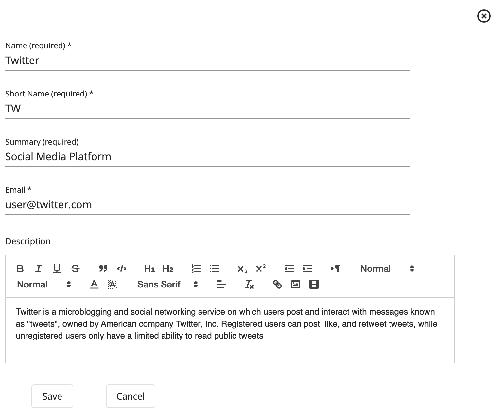
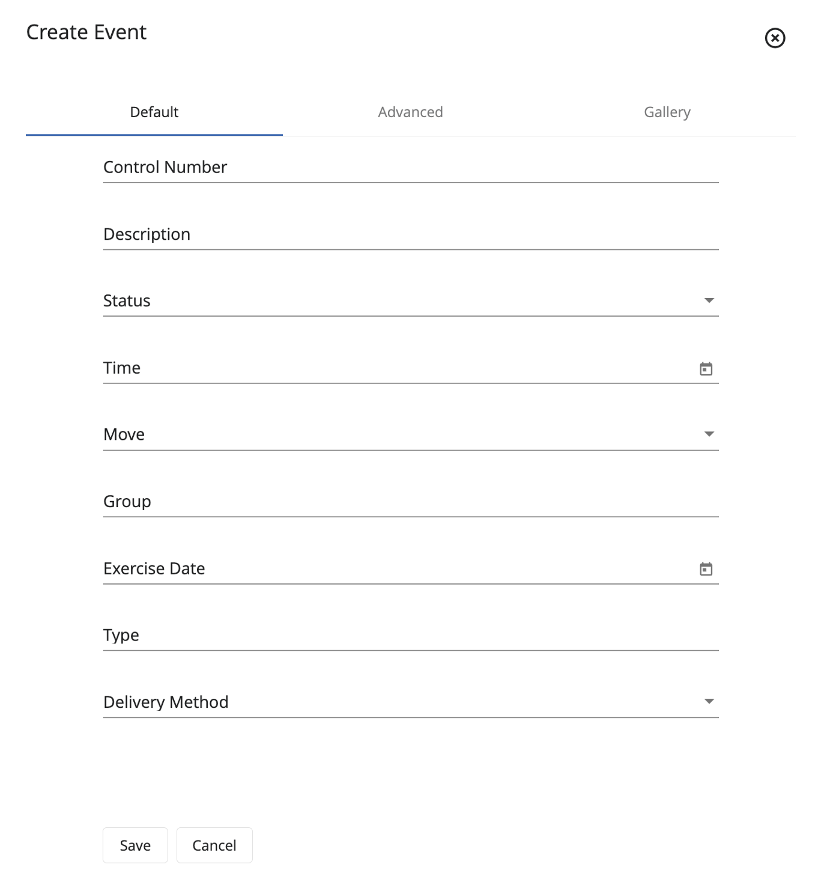
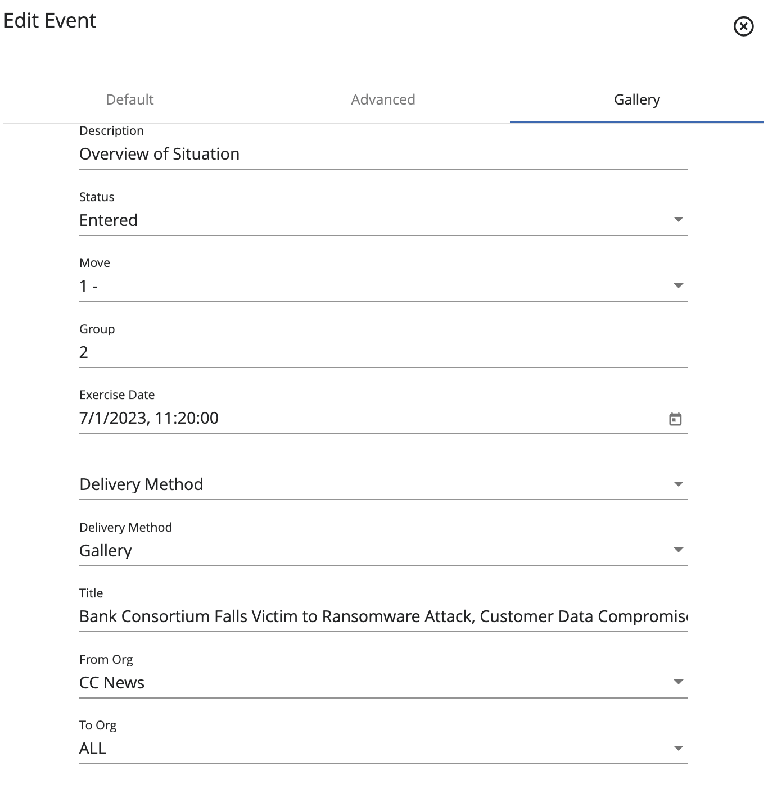
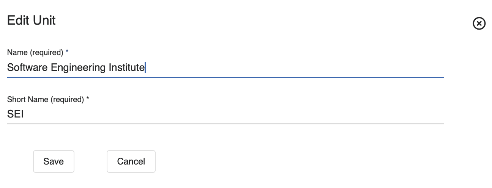
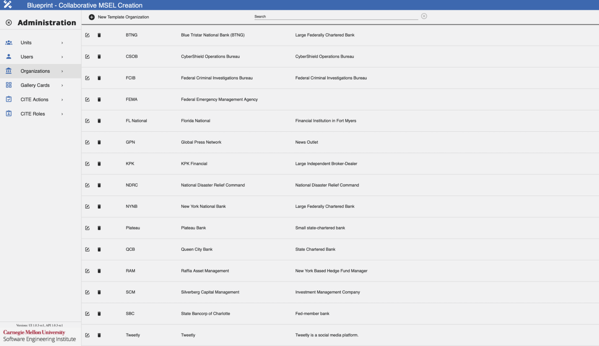
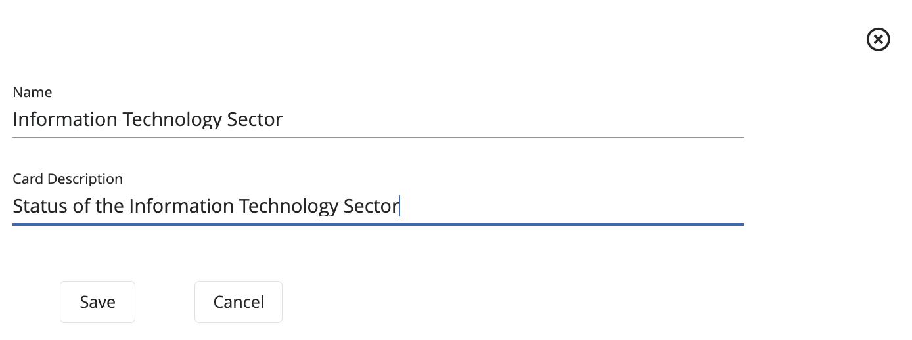

#  Blueprint: Building a MSEL

## Overview

[**Blueprint**](#glossary) is a web app that helps users create a [Master Scenario Event List (MSEL)](#glossary) and [events](#glossary) more easily. It lets users choose and define simulated entities, attacks, time frames, and regulators affected by the scenario. Users can view, edit, create, and approve events in the MSEL using Blueprint.

Blueprint makes it easier to build and view the MSEL compared to using an Excel spreadsheet. It also helps teams collaborate, even if they are from different teams. Blueprint can connect with Player, Gallery, CITE, and Steamfitter to help automate exercise setup.

For installation, refer to these GitHub repositories.

- [Blueprint UI Repository](https://github.com/cmu-sei/Blueprint.Ui)
- [Blueprint API Repository](https://github.com/cmu-sei/Blueprint.Api)

### Blueprint Permissions

To use Blueprint, a System Admin must assign Content Developer permissions to the user and add them to a team.

There are three levels of permissions in Blueprint that affect the way a user interacts with the Blueprint application and collaborates on the MSEL creation.

- [System Admin](#glossary): Can add users to a team, as well as assign the required permissions to users. Additionally, users with this permission can view, edit, create, and approve events on the MSEL.
- [Content Developer](#glossary): Can view, edit, create, and approve events on the MSEL.
- [Facilitator](#glossary): Manages the exercise, can advance moves, execute events, and check events as completed.

Most users will have the Content Developer permission, because it is the minimum required permission to create and collaborate with other teams on MSEL creation.

Refer to this section [Administrator Guide](#administrator-guide) for more information on additional administrative actions.

## User Guide

### Blueprint Landing Page

The landing page of Blueprint provides a variety of interaction modalities for exercises, tailored according to the permissions assigned to each user. The functionalities available are as follows:

#### Join an Event

Users with an invitation or membership on a participating team can join an event already in progress. Users click **Join Event** to open a page that lists all ongoing events available to them. They select an event to proceed to Player, where they access exercise information and related applications.

#### Start an Event

Users with an invitation to an exercise MSEL designated as a template can initiate the event and engage with the exercise.

After users click **Start Event**, the system redirects them to a page listing all available events other users have invited them to. They should select a template to launch the event and proceed to Player, where they can access all exercise information and deployed applications.

#### Manage an Event

Users with administrative roles, content developer permissions, or contributor designation on the MSEL can see this option. They can continue developing the current MSEL or create a new one.

### Player Manage Event Page

When a user starts an event (as described above), Blueprint adds a **Manage Event** application to the left side panel of the Player view. The Manage Event application lets the user change the event end time, end the event, and invite others to join.

#### Launched Event User Invitations

To invite other users to the launched event, follow these steps:

1. Navigate to the **Manage Event** application from Player's side panel.
2. Click **Invite Others**.
3. Fill the fields as necessary following the Data Format Table specifications.

#### Data Format Table

| Field                                                      | Data Type     | Description                                       | Example                              |
| ---------------------------------------------------------- | ------------- | ------------------------------------------------- | ------------------------------------ |
| **Team**                                                   | Dropdown Text | User's team                                       | SEI - Software Engineering Institute |
| **Email Domain**                                           | String        | User's email domain tied to the invitation        | @sei.cmu.edu                         |
| **Expiration Date/Time**                                   | Datetime      | Date/Time when the invitation should expire       | 04/20/2024 11:17:25                  |
| **Maximum Number of Users Allowed to Use this Invitation** | Integer       | Number of users allowed to use the invitation     | 5                                    |
| **Can Invite Others to this team**                         | Boolean       | Allows new users to invite others to the exercise | False                                |

After you've added all desired configurations, click **Save**.

#### Ending a Launched Event

To end an event, follow these steps:

1. Navigate to the **Manage Event** application from Player's side panel.
2. Click **End Event**.
3. On the confirmation screen, click **Yes** to successfully end the event.

### MSEL Catalog

The MSEL Catalog shows created MSELs. Here, users are able to select the desired MSEL to work on, as well as create or delete them.

The following image shows some important hotspots about the MSEL Catalog. Reference the number on the hotspot to learn more about this section.

#### Add Blank MSEL

##### Hotspot 1

Blueprint lets users create a MSEL from scratch directly in the application. This removes the hassle of Excel and makes visualizing information easier.

#### Upload an Existing MSEL

##### Hotspot 2

If creating a new MSEL from scratch is not desired, users can upload a pre-existing MSEL and continue editing it on the application by using this functionality. This is useful to share existing MSEL work without having to add the pieces of information to a blank MSEL one by one.

#### Filter Display

##### Types

###### Hotspot 3

Users can apply this filter to narrow down MSELs presented on the dashboard based on their categorization. Selections available are: All Types, Templates, and Not Templates.

##### Statuses

###### Hotspot 4

Users can apply this filter to narrow down MSELs presented on the dashboard based on their current status. Selections available are: All Statuses, Pending, Entered, Approved, and Completed.

##### Search

##### Hotspot 5

This functionality enables users to search for a specific MSEL, in case it is not presented at the top on the dashboard.

#### Load All MSELs

##### Hotspot 6

This functionality enables users with the proper administrative permissions to load and view all MSELs created.

#### Settings Cog

##### Hotspot 7

Users with the proper administrative permissions can use this feature to access Blueprint's administrative settings.

#### Manage MSEL

##### Hotspot 8

#### Download

Users can download a copy of any MSEL for offline use using the Download feature. This is useful if they lack internet access, allowing them to work on the MSEL offline and upload changes later. However, offline work is not recommended as users will miss Blueprint's features and updates.

#### Upload

With the Upload feature, users can update the information from the MSEL Card with the new uploaded information. This feature will modify all the existing information with the one found on the .xlsx file.

!!! important

    When engaging in the export and import process of MSELs from the Blueprint application, it is imperative to ensure that events and settings of the MSEL align with your particular preferences. It is worth noting that on occasion, during the import process of MSELs into the application, it may be necessary to reconfigure settings and specific fields.

#### Delete

The Delete feature lets users remove existing MSEL cards including all associated information.

#### Copy

The Copy feature lets users duplicate an existing MSEL Card and modify the copy instead of the original. This helps when unsure about new changes or starting from a known reference.

#### MSEL Cards

##### Hotspot 9

Click a MSEL card to view its information. Users can also edit or update the existing information, and changes appear live for others without needing to share a new document.

### MSEL Definition

After uploading or creating a MSEL, users can edit any information and add additional information to the MSEL. Users edit the same MSEL, instead of working on separate copies and sending edits to one person. This ensures everyone has the same version during the live scenario.

#### Basic Information

On this tab, users can edit and configure MSEL settings, as well as enable/disable integrations.

To edit the MSEL's basic information and configuration, follow these steps:

1. Navigate to the **Info** tab.
2. Ensure you are in the **Config** section.
3. Fill the fields as necessary following the Data Format Table specifications.

#### Data Format Table

| Field                            | Data Type     | Description                                                                                          | Example                             |
| -------------------------------- | ------------- | ---------------------------------------------------------------------------------------------------- | ----------------------------------- |
| **Name**                         | String        | Name of the MSEL                                                                                     | Hurricane Delta MSEL                |
| **Description**                  | String        | Details and/or characteristics of the MSEL                                                           | Hurricane Delta Fort Myers Scenario |
| **Start Date/Time**              | Datetime      | Start date/time of the MSEL                                                                          | 09/10/2024 20:00:00                 |
| **End Date/Time**                | Datetime      | End date/time of the MSEL                                                                            | 10/10/2024 08:00:00                 |
| **Is a Template**                | Boolean       | Designate if this MSEL should be a system template                                                   | True                                |
| **Integrate Player**             | Boolean       | Add Player integration functionality to the MSEL                                                     | True                                |
| **Integrate Gallery**            | Boolean       | Add Gallery integration functionality to the MSEL                                                    | True                                |
| **Integrate CITE**               | Boolean       | Add CITE integration functionality to the MSEL                                                       | True                                |
| **Select Scoring Model**         | Dropdown Text | Select a CITE Scoring Model                                                                          | CISA NCISS                          |
| **Integrate Steamfitter**        | Boolean       | Add Steamfitter integration functionality to the MSEL                                                | False                               |
| **MSEL Status**                  | Dropdown Text | Select MSEL status designation                                                                       | Active                              |
| **Header Row Metadata (Height)** | Integer       | An integer value that defines the height of the header row when exporting this MSEL as an .xlsx file | 30                                  |

To save these settings, click the **checkmark** at the top.

#### Integrations

- **[Gallery](#glossary):** Blueprint will add the collections, exhibits, cards, articles, teams, and users specified on the MSEL. To learn more about this integration, reference the [Gallery](#gallery) section.
- **[CITE](#glossary):** Blueprint will add the evaluation, moves, actions, roles, teams, and users specified on the MSEL. To learn more about this integration, reference the [CITE](#cite) section.
- **[Player](#glossary) & [Steamfitter](#glossary):** Blueprint will automate the adding of events specified on the MSEL, as well as configure exercise details in Player.

#### Add Page

On this tab, users can add notes to the MSEL for team members with the appropriate permissions to work on and access.

To add MSEL notes, follow these steps:

1. Navigate to the **Info** tab.
2. Click **Add Page**.
3. Fill the fields as necessary following the Data Format Table specifications.

#### Data Format Table

| Field                                 | Data Type | Description                                                                | Example                         |
| ------------------------------------- | --------- | -------------------------------------------------------------------------- | ------------------------------- |
| **Page Name**                         | String    | Name of the Page                                                           | Core Planning Group Notes       |
| **All MSEL users can view this page** | Boolean   | Enable other users who don't have elevated permissions to access this page | True                            |
| **Notes**                             | Rich Text | Field to add page notes                                                    | Next meeting is on 12/7 at 0800 |

After you've made your changes, click the **checkmark** to save the page.

#### Contributors

On this tab, users can add and assign contributor teams, as well as their respective roles related to the creation and management of the MSEL. Assigned teams can view and edit the MSEL.

##### Add a Contributor

To add a contributor unit to the MSEL, follow these steps:

1. Navigate to the **Contributors** tab.
2. Click **Add a Contributor Unit**, then select the unit you want to add.
3. After selecting the unit, click the **+** button.

##### Remove a Contributor

To remove a contributor unit from the MSEL, follow these steps:

1. Navigate to the **Contributors** tab.
2. Select the team you want to remove and click the **-** button.

Now that you've added the unit to the MSEL, members can view and edit it based on each unit member's role.

The available roles are:

- **[`Editor`](#glossary):** Can edit the events assigned to them by the MSEL owner, but not other events. They cannot delete events or create new events.
- **[`Approver`](#glossary):** Can view and edit the MSEL, and will have the added feature of approving a MSEL.
- **[`Move Editor`](#glossary):** Can edit moves on the MSEL, as well as increment them during an exercise.
- **[`Owner`](#glossary):** Owner of the MSEL, can view and edit the MSEL, as well as perform all of the functionalities that the MSEL provides (e.g., Add Teams, Add Integrations, Events).
- **[`Evaluator`](#glossary):** Manages the exercise, can advance moves, execute events, and check events as completed.
- **[`Viewer`](#glossary):** Can view the MSEL, but can't edit it.

#### Teams

On this tab, users can add and assign teams as well as their respective roles during an event to the MSEL.

##### Add a Team

To add a team to the MSEL, follow these steps:

1. Navigate to the **Teams** tab.
2. Click **Add a Team**, then select the team you want to add.
3. After selecting the team, click the **+** button.

##### Remove a Team

To remove a team from the MSEL, follow these steps:

1. Navigate to the **Teams** tab.
2. Select the team you want to remove and click the **-** button.

Now that you've added the team to the MSEL, members can participate on the MSEL event based on each team member's assigned role.

The available roles are:

- **[`Inviter`](#glossary):** This role allows a user to invite others to the MSEL event.
- **[`Observer`](#glossary):** When the MSEL owner has enabled Gallery or CITE integrations, this role allows a user to observe other team's progress on CITE and Gallery applications.
- **[`Incrementer`](#glossary):** When the MSEL owner has enabled CITE integration, this role allows a user to advance the current move.
- **[`Modifier`](#glossary):** When the MSEL owner has enabled CITE integration, this role allows a user to modify the team's score.
- **[`Submitter`](#glossary):**When the MSEL owner has enabled integration, this role allows a user to submit the team's score.

#### Data Fields

On this tab, users can add data fields used on the MSEL. Compare these [data fields](#glossary) to the column fields on Excel spreadsheets.

There are two categories of Data Fields:

- **[System Defined](#glossary):** Added by default in MSEL creation, since data fields under this category are essential for MSEL features to work.
- **[User Defined](#glossary):** Added by the user on an as-needed basis.

##### Add a Data Field

To add a Data Field to the MSEL, follow these steps:

1. Navigate to the **Data Fields** tab.
2. Click the **+** icon from the top left of the screen.
3. Fill the fields as necessary following the Data Format Table specifications.

#### Data Format Table

| Field                                                      | Data Type     | Description                                                                                    | Example          |
| ---------------------------------------------------------- | ------------- | ---------------------------------------------------------------------------------------------- | ---------------- |
| **Display Order**                                          | Integer       | Indicate the order of the data field                                                           | 1                |
| **Name**                                                   | String        | Name of the data field                                                                         | Description      |
| **Data Type**                                              | Dropdown Text | Data type for the data field                                                                   | String           |
| **Use Option List**                                        | Boolean       | Add options to select when adding an event                                                     | True             |
| **Display on the Events list**                             | Boolean       | Display this data field on the Events list tab                                                 | True             |
| **Display on the Exercise View**                           | Boolean       | Display this data field on the Exercise View tab                                               | True             |
| **Display on "Advanced" edit tab**                         | Boolean       | Display this data field on the data field edit component Advanced tab                          | True             |
| **Display for Content Developers and MSEL Owners ONLY!!!** | Boolean       | Display this data field for users who are Content Developers or MSEL Owners only               | True             |
| **Gallery Article Parameter**                              | Dropdown Text | If using the Gallery integration, select the Gallery parameter that aligns with the data field | Description      |
| **Column Metadata (Width)**                                | Integer       | Width of the column when displayed                                                             | 30               |
| **Cell Metadata (Color, Tint, Font-Weight)**               | String        | Column color and font style                                                                    | (Red, 20%, bold) |

After you've added all desired configurations, click **Save**.

##### Delete a Data Field

To delete a Data Field from the MSEL, follow these steps:

1. Navigate to the **Data Fields** tab.
2. Select the data field you want to delete and click the **Trash Can**.

##### Edit a Data Field

To edit an existing Data Field, follow these steps:

1. Navigate to the **Data Fields** tab.
2. Select the data field you wish to edit and click **Edit** to make any changes to the existing configurations.
3. After making all necessary changes, click the **checkmark** to save them.

##### Search For a Data Field

To search for a specific Data Field, follow these steps:

1. Navigate to the **Data Fields** tab.
2. Click the **Search Bar** and add the name of the data field desired.

#### Organizations

On this tab, users add all related [organizations](#glossary) (with their information) used on the MSEL and the live exercise. Users can create organizations from scratch or from a template.

##### Add an Organization Card From Scratch

To add an Organization Card from scratch, follow these steps:

1. Navigate to the **Organizations** tab.
2. Click **Add Organization**.
3. Select **New Organization** from the dropdown.
4. Fill the fields as necessary following the Data Format Table specifications.

##### Data Format Table

| Field           | Data Type | Description                                                   | Example                                                                                                                                                             |
| --------------- | --------- | ------------------------------------------------------------- | ------------------------------------------------------------------------------------------------------------------------------------------------------------------- |
| **Name**        | String    | Name of the organization                                      | Twitter                                                                                                                                                             |
| **Short Name**  | String    | Organization's short name, such as an acronym                 | TW                                                                                                                                                                  |
| **Summary**     | String    | Organization's short summary                                  | Social media platform                                                                                                                                               |
| **Email**       | String    | Organization's email contact                                  | `user@twitter.com`                                                                                                                                                  |
| **Description** | Rich Text | Information, details, and characteristics of the organization | Twitter is a micro-blogging and social networking service on which users post and interact with messages known as "tweets", owned by American company Twitter, Inc. |

After you've added all desired configurations, click **Save**.

##### Add an Organization Card From Template

To create an organization from a template, follow these steps:

1. Navigate to the **Organizations** tab.
2. Click **Add Organization**.
3. Select the template you want to use from the dropdown.
4. Here, users can edit all necessary information to create a new organization.
5. After modifying the desired details, click **Save**.

##### Edit an Organization

To edit an existing organization, follow these steps:

1. Navigate to the **Organizations** tab.
2. Select the card you want to edit and click **Edit** next to the organization name.
3. Here, users can edit all necessary information.
4. Click **Save**.

##### Delete an Organization

To delete an organization, follow these steps:

1. Navigate to the **Organizations** tab.
2. Select the card you want to delete and click the **Trash Can** next to the organization name.

##### Search for an Organization

To search for a specific organization, follow these steps:

1. Navigate to the **Organizations** tab.
2. Click the **Search Bar** and type the name of the desired organization.

#### Moves

On this tab, users can add all related exercise [moves](#glossary) to the MSEL.

##### Add a Move

To add a move, follow these steps:

1. Navigate to the **Moves** tab.
2. Click the **+** icon.
3. Fill the fields as necessary following the Data Format Table specifications.

##### Data Format Table

| Field                     | Data Type | Description                                               | Example                                  |
| ------------------------- | --------- | --------------------------------------------------------- | ---------------------------------------- |
| **Move Number**           | Integer   | Designated number for the move                            | 1                                        |
| **Start Date/Time**       | Datetime  | Start date/time of the move real-time                     | 11/20/2023, 09:00:00                     |
| **Move Description**      | String    | Information, details, and characteristics of the move     | Scene Setter                             |
| **Situation Date/Time**   | Datetime  | Start date/time of the move exercise-time                 | 1/24/2024, 14:18:27                      |
| **Situation Description** | Rich Text | Information, details, and characteristics of the exercise | Hurricane Delta has landed in Fort Myers |

After you've added all desired configurations, click **Save**.

##### Edit a Move

To edit the move's details, follow these steps:

1. Navigate to the **Moves** tab.
2. Select the move you want to edit and click **Edit** for the corresponding move.
3. Here, users can edit all desired details.
4. Click **Save**.

##### Delete a Move

To delete a move from the MSEL, follow these steps:

1. Navigate to the **Moves** tab.
2. Select the move you want to delete and click the **Trash Can** for the corresponding move.

##### Search for a Move

To search for a specific move, follow these steps:

1. Navigate to the **Moves** tab.
2. Click the **Search Bar** and type the name of the desired move.

#### Scenario Events

On this tab, users can add all related events to the MSEL.

##### Add an Event

To add a new event, follow these steps:

1. Navigate to the **Events** tab.
2. Click the **Hamburger** icon found on the top left.
3. Click **Add New Event**.

On the **Default** tab, fill the fields as necessary following the Data Format Table specifications.

##### Data Format Table

| Field               | Data Type     | Description                                                                  | Example              |
| ------------------- | ------------- | ---------------------------------------------------------------------------- | -------------------- |
| **Control Number**  | String        | Event control number, used to identify and categorize events                 | ADMIN-1              |
| **Description**     | String        | Information, details, and characteristics of the event                       | STARTEX              |
| **Status**          | Dropdown Text | Approval status of the event used on the MSEL                                | Approved             |
| **Time**            | Datetime      | Start date/time of the move real-time                                        | 11/20/2023, 09:00:00 |
| **Move**            | Dropdown Text | Move number the event is part of                                             | 1                    |
| **Group**           | Integer       | Groups events within a move, often times executed within the same time range | 1                    |
| **Exercise Date**   | Datetime      | Start date/time of the move exercise-time                                    | 1/24/2024, 14:18:27  |
| **Type**            | String        | Source type for the event                                                    | Email                |
| **Delivery Method** | Dropdown Text | How is the event delivered to participants                                   | Email                |

If not already completed on the previous tab, fill the fields from the **Advanced** tab following the Data Format Table specifications. This tab focuses on the MSEL's metadata and style.

##### Data Format Table

| Field                  | Data Type | Description                                                         | Example             |
| ---------------------- | --------- | ------------------------------------------------------------------- | ------------------- |
| **Exercise Date/Time** | Datetime  | Start date/time of the move exercise-time                           | 1/24/2024, 14:18:27 |
| **Row Metadata**       | Integer   | Defines the size of this event on the Events and Exercise View tabs | 15,199,21,133       |

If the MSEL owner enabled Gallery integration, the user should verify that all fields on the **Gallery** tab are complete, following the Data Format Table specifications below. This tab includes the fields required for the Gallery integration to function properly.

##### Data Format Table

| Field               | Data Type     | Description                                                                  | Example                                           |
| ------------------- | ------------- | ---------------------------------------------------------------------------- | ------------------------------------------------- |
| **Description**     | String        | Information, details, and characteristics of the event                       | STARTEX                                           |
| **Status**          | Dropdown Text | Approval status of the event used on the MSEL                                | Approved                                          |
| **Move**            | Dropdown Text | Move number that the event is part of                                        | 1                                                 |
| **Group**           | Integer       | Groups events within a move, often times executed within the same time range | 1                                                 |
| **Exercise Date**   | Datetime      | Start date/time of the move exercise-time                                    | 1/24/2024, 14:18:27                               |
| **Delivery Method** | Dropdown Text | How is the event delivered to participants                                   | Gallery                                           |
| **Title**           | String        | Title of the event                                                           | Bank Consortium Falls Victim to Ransomware Attack |
| **From Org**        | Dropdown Text | Select the organization that sends this event                                | CC News                                           |
| **To Org**          | Dropdown Text | Select the organization that receives this event                             | ALL                                               |

After you've added all desired configurations, click **Save**.

##### Add Color to an Event

To add a color to an existing event, follow these steps:

1. Navigate to the **Events** tab.
2. Select the event you want to edit and click the **Hamburger** icon next to it.
3. Hover over **Highlight**.
4. Here, users can select the desired color.

##### Edit an Event

To edit the event's details, follow these steps:

1. Navigate to the **Events** tab.
2. Select the event you want to edit and click the **Hamburger** icon next to it.
3. Click **Edit**.
4. The system opens the same edit component used when creating a new event.
5. Make your changes, then click **Save**.

##### Delete an Event

To delete an event, follow these steps:

1. Navigate to the **Events** tab.
2. Select the event you want to delete and click the **Trash Can** icon next to it.

##### Search for an Event

To search for a specific event, follow these steps:

1. Navigate to the **Events** tab.
2. Click the **Search Bar** and type the name of the desired event.

#### Exercise View

While the **Events** tab lets MSEL owners and content developers manage events, the **Exercise View** tab gives participants read-only access to track current and future events during an exercise.

#### Invitations

Users with Administrator, Content Developer, or designated MSEL contributor roles can create invitations from the Invitations tab. These invitations allow others to join or start the MSEL event.

You can specify email domains and a maximum number of users on the invitations. Invitations link to specific teams added to the MSEL. When users join the event using an invitation, the system assigns them to the corresponding team for the duration of the event.

##### Add an Invitation

To add a new invitation, follow these steps:

1. Navigate to the **Invitations** tab.
2. Click **Invite Others**.
3. Fill the fields as necessary following the Data Format Table specifications.

##### Data Format Table

| Field                                                      | Data Type     | Description                                     | Example                              |
| ---------------------------------------------------------- | ------------- | ----------------------------------------------- | ------------------------------------ |
| **Team**                                                   | Dropdown Text | Team tied to the invitation                     | SEI - Software Engineering Institute |
| **Email Domain**                                           | String        | User's email domain                             | `@sei.cmu.edu`                       |
| **Expiration Date/Time**                                   | Datetime      | Date and time when the invitation should expire | 04/15/2024 15:12:03                  |
| **Maximum Number of Users Allowed to Use this Invitation** | Integer       | Number of users that can use the invitation     | 5                                    |
| **Can Invite others to this Team**                         | Boolean       | Permission to add others to the team            | False                                |

After you've added all desired configurations, click **Save**.

##### Edit an Invitation

To edit an invitation, follow these steps:

1. Navigate to the **Invitations** tab.
2. Select the invitation you want to edit and click **Edit**.
3. The system opens the same edit component used when creating a new invitation.
4. Make your changes, then click **Save**.

##### Delete an Invitation

To delete an invitation, follow these steps:

1. Navigate to the **Invitations** tab.
2. Select the invitation you want to delete and click the **Trash Can** next to it.

##### Search for an Invitation

To search for a specific invitation, follow these steps:

1. Navigate to the **Invitations** tab.
2. Click the **Search Bar** and type the name of the team tied to the invitation.

### Integrations

Integrations with the following applications simplify configuration steps. This functionality eliminates the need to repeat the same steps in multiple applications.

#### CITE

If enabled, Blueprint can push MSEL information to the CITE application. When the MSEL owner enables CITE integration, additional tabs appear in the Blueprint side panel. The MSEL owner must configure the additional tabs to complete the integration. To enable full CITE integration, the MSEL owner must configure the following tabs:

##### Teams

Use the **Teams** tab to configure CITE settings for teams added to the MSEL. To do this, follow these steps.

First, assign a CITE Team Type to each team.

1. Navigate to the **Teams** tab.
2. Select the desired team and click **Edit**.
3. Fill the fields as necessary following the Data Format Table specifications.

##### Data Format Table

| Field              | Data Type     | Description                               | Example                 |
| ------------------ | ------------- | ----------------------------------------- | ----------------------- |
| **Team Email**     | String        | Team's email contact                      | `seicmu@cmu.edu`        |
| **CITE Team Type** | Dropdown Text | Classifies the team within a certain type | Individual Organization |

After you've made all desired configurations, click **Save**.

Next, assign roles to each member of the team. To do this, follow these steps:

1. Navigate to the **Teams** tab.
2. Select the desired team, and click it to expand its configurations.
3. Assign the necessary roles to each team member.

##### CITE Actions

On this tab, the MSEL owner can add [CITE Actions](#glossary) to push from Blueprint. These actions allow team members to customize their response by tracking tasks during the exercise.

##### Add a CITE Action

To add a CITE Action, follow these steps:

1. Navigate to the **CITE Actions** tab.
2. Click the **+** icon.
3. Fill the fields as necessary following the Data Format Table specifications.

##### Data Format Table

| Field                         | Data Type     | Description                                                      | Example                              |
| ----------------------------- | ------------- | ---------------------------------------------------------------- | ------------------------------------ |
| **Move**                      | Dropdown Text | Select the move to display this action                           | 0 - Hurricane Delta Scene Setter     |
| **Team**                      | Dropdown Text | Select the team this action applies to                           | Conference of State Bank Supervisors |
| **Display Order**             | Integer       | Indicates the order to display this action on the CITE Dashboard | 1                                    |
| **Description of the Action** | String        | Information, details, and characteristics of the action          | Assign users to roles                |

After you've added all desired configurations, click **Save**.

##### Edit a CITE Action

To edit the CITE Action's details, follow these steps:

1. Navigate to the **CITE Actions** tab.
2. Select the action you want to edit and click **Edit** next to it.
3. The system opens the same edit component used when creating a new action.
4. Make your changes, then click **Save**.

##### Delete a CITE Action

To delete a CITE Action, follow these steps:

1. Navigate to the **CITE Actions** tab.
2. Select the action you want to delete and click the **Trash Can** next to it.

##### Filter Actions by Team

To filter CITE Actions by teams, follow these steps:

1. Navigate to the **CITE Actions** tab.
2. On the **Team** dropdown, select the desired team to filter by.

##### Search for an Action

To search for a specific action, follow these steps:

1. Navigate to the **CITE Actions** tab.
2. Click the **Search Bar** and type the name of the desired action.

##### CITE Roles

On this tab, the MSEL owner can add [CITE Roles](#glossary) to push from Blueprint. These roles allow team members to customize their response by tracking their responsibilities during an exercise.

##### Add a CITE Role

To add a CITE role, follow these steps:

1. Navigate to the **CITE Roles** tab.
2. Click the **+** icon.
3. Fill the fields as necessary following the Data Format Table specifications.

##### Data Format Table

| Field    | Data Type     | Description                          | Example                              |
| -------- | ------------- | ------------------------------------ | ------------------------------------ |
| **Name** | String        | Name of the role                     | Team Leader                          |
| **Team** | Dropdown Text | Select the team this role applies to | Conference of State Bank Supervisors |

After you've added all desired configurations, click **Save**.

##### Edit a CITE Role

To edit the CITE Role's details, follow these steps:

1. Navigate to the **CITE Roles** tab.
2. Select the role you want to edit and click **Edit** next to it.
3. The system opens the same edit component used when creating a new role.
4. Make your changes, then click **Save**.

##### Delete a CITE Role

To delete a CITE Role, follow these steps:

1. Navigate to the **CITE Roles** tab.
2. Select the role you want to delete and click the **Trash Can** next to it.

##### Filter Roles by Team

To filter Roles by team, follow these steps:

1. Navigate to the **CITE Roles** tab.
2. On the **Team** dropdown, select the desired team to filter by.

##### Search for a Role

To search for a specific role, follow these steps:

1. Navigate to the **CITE Roles** tab.
2. Click the **Search Bar** and type the name of the desired role.

#### Gallery

If enabled, Blueprint can push MSEL information to the Gallery application. When the MSEL owner enables Gallery integration, additional tabs appear in the Blueprint side panel. The MSEL owner must configure the additional tabs to complete the integration.

To enable full Gallery integration, the MSEL owner should configure the following tabs.

##### Gallery Data Fields

On the **Data Fields** tab, configure additional data fields to push MSEL information to Gallery.

The MSEL owner should add these fields:

##### Data Format Table

| Field                 | Data Type     | Description                                                               | Example                                     |
| --------------------- | ------------- | ------------------------------------------------------------------------- | ------------------------------------------- |
| **Description**       | String        | Information, details, and characteristics of the event                    | STARTEX                                     |
| **Date Posted**       | Datetime      | Posted date of the event                                                  | 1/24/2024, 14:18:27                         |
| **Delivery Method**   | Dropdown Text | How is the event delivered to participants                                | Gallery                                     |
| **Name**              | String        | Name of the event                                                         | Common Operating Picture 1                  |
| **From Org**          | Dropdown Text | Select the organization that sends this event                             | CC News                                     |
| **To Org**            | Dropdown Text | Select the organization that receives this event                          | ALL                                         |
| **Summary**           | Rich Text     | Complete information and details of the event                             | A ransomware attack affected Bank XYZ...    |
| **Card**              | Dropdown Text | Select the Gallery Card to categorize this event                          | Information Technology Sector               |
| **Status**            | Dropdown Text | Approval status of the event used on the MSEL                             | Approved                                    |
| **Source Type**       | Dropdown Text | Select where the event's details come from                                | News                                        |
| **Source Name**       | String        | Add the author of the event                                               | BBC News                                    |
| **Move**              | Dropdown Text | Move number that the event is part of                                     | 1                                           |
| **Group**             | Integer       | Groups events within a move, often executed within the same time range    | 1                                           |
| **Url**               | String        | Provide a URL if more information is necessary for participants to access | `www.bbcnews.com/ransomware-attack-xyzbank` |
| **Open in a New Tab** | Boolean       | Use this option to open the URL in a new tab                              | True                                        |

After adding data fields, map each one to the appropriate Gallery field by selecting an option from the **Gallery Article Parameter** dropdown when adding or editing the field.

##### Gallery Cards

On this tab, the MSEL owner can add [Gallery Cards](#glossary) to push from Blueprint. These are the different cards in the Gallery Wall. You can also find articles related to that card here.

##### Add a Gallery Card

To add a Gallery card, follow these steps:

1. Navigate to the **Gallery Cards** tab.
2. Click the **+** icon.
3. Fill the fields as necessary following the Data Format Table specifications.

##### Data Format Table

| Field                | Data Type     | Description                                                   | Example                                |
| -------------------- | ------------- | ------------------------------------------------------------- | -------------------------------------- |
| **Name**             | String        | Name of the Gallery card                                      | Energy Sector                          |
| **Card Description** | String        | Information, details, and characteristics of the Gallery card | The current state of the Energy Sector |
| **Move**             | Dropdown Text | Select the move to display this Gallery card                  | 0                                      |

After you've added all desired configurations, click **Save**.

##### Edit a Gallery Card

To edit a Gallery card, follow these steps:

1. Navigate to the **Gallery Cards** tab.
2. Select the card you want to edit and click **Edit** next to it.
3. The system opens the same edit component used when creating a new card.
4. Make your changes, then click **Save**.

##### Delete a Gallery Card

To delete a Gallery card, follow these steps:

1. Navigate to the **Gallery Cards** tab.
2. Select the card you want to delete and click the **Trash Can** next to it.

##### Search For a Gallery Card

To search for a specific card, follow these steps:

1. Navigate to the **Gallery Cards** tab.
2. Click the **Search Bar** and type the name of the desired card.

#### Player

If enabled, Blueprint pushes MSEL information to the Player application. The system adds additional tabs to the Blueprint side panel, which the MSEL owner will need to configure.

To enable the full Player integration, configure the following tabs.

##### Player Apps

On the [Player Apps](#glossary) tab, the MSEL owner can add configurations to push from Blueprint. These are the different applications accessible from the [Player View](#glossary).

##### Add a Player App

To add a Player app, follow these steps:

1. Navigate to the **Player Apps** tab.
2. Click the **+** icon.
3. Select an app template from the provided list.
4. Fill the fields as necessary following the Data Format Table specifications.

##### Data Format Table

| Field                  | Data Type | Description                                          | Example                                         |
| ---------------------- | --------- | ---------------------------------------------------- | ----------------------------------------------- |
| **Name**               | String    | Name of the application                              | Chat                                            |
| **Url**                | String    | URL of the application                               | `roundcube.hamilton.treasury.gov`               |
| **Icon Url**           | String    | URL of the application's icon                        | `roundcube.hamilton.treasury.gov/roundcube.png` |
| **Embeddable**         | Boolean   | Select whether to embed the app in Player's iframe   | True                                            |
| **Load in Background** | Boolean   | Select whether the app should load in the background | True                                            |

##### URL Parameters

You can add URL parameters to point to a specific CITE evaluation, Gallery exhibit, Player view, or other content. To do this, include the variables in braces when adding a new application. Consider using the following variables:

- **{citeEvaluationId}:** Add this variable to the URL to point to a specific CITE evaluation.
- **{galleryExhibitId}:** Add this variable to the URL to point to a specific Gallery exhibit.
- **{steamFitterScenarioId}:** Add this variable to the URL to point to a specific Steamfitter scenario.
- **{playerViewId}:** Add this variable to the URL to point to a specific Player view.

After you've added all desired configurations, click **Save**.

##### Edit a Player App

To edit a Player app, follow these steps:

1. Navigate to the **Player Apps** tab.
2. Select the app you want to edit and click **Edit** next to it.
3. The system opens the same edit component used when creating a new app.
4. Make your changes, then click **Save**.

##### Delete a Player App

To delete a Player app, follow these steps:

1. Navigate to the **Player Apps** tab.
2. Select the app you want to delete and click the **Trash Can** next to it.

##### Search for a Player App

To search for a specific app, follow these steps:

1. Navigate to the **Player Apps** tab.
2. Click the **Search Bar** and type the name of the desired app.

#### Push Integrations

After adding all of the MSEL information and performing all necessary configurations, you can push information from enabled integrations to their respective applications.

To push MSEL information to their respective applications, follow these steps:

1. Navigate to the **Info** tab.
2. Click **Push Integrations**.

#### Remove Integrations

If desired, the MSEL owner can remove MSEL information after the enabled integrations have pushed it to their respective applications.

To remove MSEL information from the applications, follow these steps:

1. Navigate to the **Info** tab.
2. Click **Remove Integrations**.

## Administrator Guide

### Units

The following image shows the Units Administration Page. Here, administrators can add, edit, and delete units. To use the Blueprint application, the administrator should assign a unit to desired users.

#### Add a Unit

If the exercise administrator has granted the appropriate permissions, follow these steps to add a unit.

1. Click the **Settings Cog** in the top-right corner of the screen.
2. Under the Units Administration View, click **+**.
3. Fill the fields as necessary following the Data Format Table specifications.

#### Data Format Table

| Field          | Data Type | Description             | Example                    |
| -------------- | --------- | ----------------------- | -------------------------- |
| **Name**       | String    | Name for the unit       | Carnegie Mellon University |
| **Short Name** | String    | Short name for the unit | CMU                        |

After you've added all desired configurations, click **Save**.

#### Edit a Unit

To edit a unit, follow these steps:

1. Click the **Settings Cog** in the top-right corner of the screen.
2. Under Units Administration View, select the unit you want to edit and click **Edit** next to it.
3. The system opens the same edit component used when creating a new unit.
4. Make your changes, then click **Save**.

#### Delete a Unit

To delete a unit, follow these steps:

1. Click the **Settings Cog** in the top-right corner of the screen.
2. Under the Units Administration View, select the unit you want to delete and click the **Trash Can** next to it.

#### Search for a Unit

To search for a specific unit, follow these steps:

1. Click the **Settings Cog** in the top-right corner of the screen.
2. Under the Units Administration View, click the **Search Bar** and type the name of the desired unit.

#### Add/Remove Users from a Unit

To configure a unit for an exercise, administrators add users to their respective units. To do this, follow these steps.

1. Select the unit you want to configure and click to expand its configuration details.
2. The **All Users** tab shows _unassigned_ users. To add a user to the unit, click **Add User**.
3. The **Unit Users** tab shows _assigned_ users. To remove a user from the unit, click **Remove**.

### Users

The following image shows the Users Administration Page. Here, administrators can add and delete users. Additionally, administrators can assign the necessary permissions to each user.

The available permissions are:

- **System Admin:** Can use all administration privileges on the Blueprint application.
- **Content Developer:** Can view, edit, create, and approve events on the MSEL.

#### Add a User

If the exercise administrator has granted the appropriate permissions, follow these steps to add a user.

1. Under the Users Administration View, click **+**.
2. Fill the fields as necessary following the Data Format Table specifications.

#### Data Format Table

| Field         | Data Type | Description            | Example                              |
| ------------- | --------- | ---------------------- | ------------------------------------ |
| **User ID**   | GUID      | Unique ID for the user | 9dd4e3d8-5098-4b0a-9216-697cda5553f8 |
| **User Name** | String    | User name identifier   | user-2                               |

Click the **Save** icon (a user with a **+** sign), then select the permissions you want to assign by checking the boxes next to the user's name.

#### Delete a User

To delete a user, follow these steps:

1. Click the **Settings Cog** in the top-right corner of the screen.
2. Under the Users Administration View, select the user you want to delete and click the **Trash Can** next to the user.

#### Search for a User

To search for a specific user, follow these steps:

1. Click the **Settings Cog** in the top-right corner of the screen.
2. Under the Users Administration View, click the **Search Bar** and type the name of the desired user.

### Organization Templates

The following image shows the Organization Templates Administration Page. Here, administrators can add and delete organization templates.

#### Add an Organization Template

If the exercise administrator has granted the appropriate permissions, follow these steps to add an organization template.

1. Under the Organizations Administration View, click **+**.
2. Fill the fields as necessary following the Data Format Table specifications.

#### Data Format Table

| Field           | Data Type | Description                                                   | Example                                                                                                                                                                |
| --------------- | --------- | ------------------------------------------------------------- | ---------------------------------------------------------------------------------------------------------------------------------------------------------------------- |
| **Long Name**   | String    | Add the complete name for the organization                    | Cybersecurity and Infrastructure Security Agency                                                                                                                       |
| **Short Name**  | String    | Add a short name for the organization, such as an acronym     | CISA                                                                                                                                                                   |
| **Summary**     | String    | Organization's short summary                                  | Security agency                                                                                                                                                        |
| **Email**       | String    | Organization's email contact                                  | `john@cisa.gov`                                                                                                                                                        |
| **Description** | Rich Text | Information, details, and characteristics of the organization | The Cybersecurity and Infrastructure Security Agency (CISA) is an agency of the DHS that is responsible for strengthening cybersecurity and infrastructure protection. |

After you've added all desired configurations, click **Save**.

#### Edit an Organization Template

To edit an organization template, follow these steps:

1. Click the **Settings Cog** in the top-right corner of the screen.
2. Under Organizations Administration View, select the organization you want to edit and click **Edit** next to the organization template.
3. The system opens the same edit form used when creating a new organization template.
4. Make your changes, then click **Save**.

#### Delete an Organization Template

To delete an organization template, follow these steps:

1. Click the **Settings Cog** in the top-right corner of the screen.
2. Under the Organizations Administration View, select the organization you want to delete and click the **Trash Can** next to the organization template.

#### Search For an Organization Template

To search for a specific organization template, follow these steps:

1. Click the **Settings Cog** in the top-right corner of the screen.
2. Under the Organizations Administration View, click the **Search Bar** and type the name of the desired organization template.

### Gallery Card Templates

The following image shows the Gallery Card Templates Administration Page. Here, administrators can add and delete Gallery card templates.

#### Add a Gallery Card Template

If the exercise administrator has granted the appropriate permissions, follow these steps to add a Gallery card template.

1. Under the Gallery Cards Administration View, click **+**.
2. Fill the fields as necessary following the Data Format Table specifications.

#### Data Format Table

| Field                | Data Type | Description                                                   | Example                                     |
| -------------------- | --------- | ------------------------------------------------------------- | ------------------------------------------- |
| **Name**             | String    | Gallery card name                                             | Information Technology Sector               |
| **Card Description** | String    | Information, details, and characteristics of the Gallery card | Status of the Information Technology Sector |

After you've added all desired configurations, click **Save**.

#### Edit a Gallery Card Template

To edit a Gallery card template, follow these steps:

1. Click the **Settings Cog** in the top-right corner of the screen.
2. Under Gallery Cards Administration View, select the card template you want to edit and click **Edit** next to it.
3. The system opens the same edit component used when creating a new card template.
4. Make your changes, then click **Save**.

#### Delete a Gallery Card Template

To delete an Gallery card template, follow these steps:

1. Click the **Settings Cog** in the top-right corner of the screen.
2. Under the Gallery Cards Administration View, select the card template you want to delete and click the **Trash Can** next to it.

#### Search for a Gallery Card Template

To search for a specific Gallery card template, follow these steps:

1. Click the **Settings Cog** in the top-right corner of the screen.
2. Under the Gallery Cards Administration View, click the **Search Bar** and type the name of the desired card template.

### CITE Actions Templates

The following image shows the CITE Action Templates administration page. Here, administrators can add and delete CITE action templates.

#### Add a CITE Action Template

If the exercise administrator has granted the appropriate permissions, follow these steps to add a CITE action template.

1. Under the CITE Actions Administration View, click **+**.
2. Fill the fields as necessary following the Data Format Table specifications.

#### Data Format Table

| Field                         | Data Type | Description                                                  | Example            |
| ----------------------------- | --------- | ------------------------------------------------------------ | ------------------ |
| **Description of the Action** | String    | Information, details, and characteristics of the CITE action | Score the incident |

After you've added all desired configurations, click **Save**.

#### Edit a CITE Action Template

To edit a CITE action template, follow these steps:

1. Click the **Settings Cog** in the top-right corner of the screen.
2. Under CITE Actions Administration View, select the action template you want to edit and click **Edit** next to it.
3. The system opens the same edit component used when creating a new action template.
4. Make your changes, then click **Save**.

#### Delete a CITE Action Template

To delete an CITE action template, follow these steps:

1. Click the **Settings Cog** in the top-right corner of the screen.
2. Under the CITE Actions Administration View, select the action template you want to delete and click the **Trash Can** next to it.

#### Search for a CITE Action Template

To search for a specific CITE action template, follow these steps:

1. Click the **Settings Cog** in the top-right corner of the screen.
2. Under the CITE Actions Administration View, click the **Search Bar** and type the name of the desired action template.

### CITE Roles Templates

The following image shows the CITE Roles Templates Administration Page. Here, administrators can add and delete CITE roles templates.

#### Add a CITE Role Template

If the exercise administrator has granted the appropriate permissions, follow these steps to add a CITE role template.

1. Under the CITE Roles Administration View, click **+**.
2. Fill the fields as necessary following the Data Format Table specifications.

#### Data Format Table

| Field    | Data Type | Description      | Example  |
| -------- | --------- | ---------------- | -------- |
| **Name** | String    | Name of the role | Reviewer |

After you've added all desired configurations, click **Save**.

#### Edit a CITE Role Template

To edit a CITE role template, follow these steps:

1. Click the **Settings Cog** in the top-right corner of the screen.
2. Under CITE Roles Administration View, select the role template you want to edit and click **Edit** next to it.
3. The system opens the same edit component used when creating a new role template.
4. Make your changes, then click **Save**.

#### Delete a CITE Role Template

To delete a CITE role template, follow these steps:

1. Click the **Settings Cog** in the top-right corner of the screen.
2. Under the CITE Roles Administration View, select the role template you want to delete and click the **Trash Can** next to it.

#### Search For a CITE Role Template

To search for a specific CITE role template, follow these steps:

1. Click the **Settings Cog** in the top-right corner of the screen.
2. Under the CITE Roles Administration View, click the **Search Bar** and type the name of the desired role template.

## Glossary

This glossary defines key terms and concepts used in the Blueprint application.

**`Approver` Role:** Can view and edit the MSEL, but will have the added feature of approving a MSEL.

**Blueprint**: Web application created to make the development of a MSEL and events easier.

**CITE:** Web application that allows multiple participants from different organizations to evaluate, score, and comment on cyber incidents.

**CITE Action:** Series of steps to guide users on an appropriate course of action during an exercise.

**`CITE` Role:** Provide a set of responsibilities assigned to a user during an exercise.

**Content Developer Permission:** Can view, edit, create, and approve events on the MSEL.

**Data Fields:** Structured components containing essential information about the event's characteristics, context, and implications.

**`Editor` Role:** Can edit the events assigned to them by the MSEL owner, but not other events. They cannot delete events or create new events.

**Events**: Specific scenario events or messages within the scenario that prompt users to implement designated actions.

**Exercises**: Structured and simulated activity designed to assess, train, or evaluate the capabilities, preparedness, and responses of individuals, teams, or organizations in dealing with various scenarios, especially emergencies or crises.

**Evaluator Permission**: Manages the exercise, can advance moves, execute events, and check events as completed.

**Gallery:** Web application where participants receive incident information.

**Gallery Card:** The Gallery wall displays Gallery cards. Each Gallery card represents an article category. Cards show a background color based on the most recent article's status and the number of unread articles. Content developers define cards within each Gallery collection.

**`Incrementer` Role:** When the MSEL owner has enabled CITE integration, this role allows a user to advance the current move.

**`Inviter` Role:** This role will allow a user to invite others to the MSEL event.

**`Modifier` Role:** When the MSEL owner has enabled CITE integration, this role allows a user to modify the team's score.

**Move Editor:** Can edit moves on the MSEL, as well as increment them during an exercise.

**Moves:** A defined period of time during an exercise, where exercise organizers distribute a series of events for users to discuss and assess current incident severity.

**MSEL:** (Master Scenario Events List) provides a timeline for all expected events, affiliated users and organizations during an exercise.

**`Observer` Role:** When the MSEL owner has enabled Gallery or CITE integrations, this role allows a user to observe other team's progress on CITE and Gallery applications.

**Organizations:** Entities within an exercise with defined roles, responsibilities, and functions.

**`Owner` Role:** Owner of the MSEL, can view and edit as well as perform all functionality that the MSEL provides (e.g., Add Teams, Add Integrations, Events).

**Player:** Centralized web interface where participants, teams, and administrators go to engage in a cyber event.

**Player Apps:** List of applications accessible from the same Player view.

**Player View:** These are the settings associated with building a view. You can edit, clone, and delete a view.

**Steamfitter:** Gives content developers the ability to create scenarios consisting of a series of scheduled tasks, manual tasks, and events which run against virtual machines during an event.

**`Submitter` Role:** When the MSEL owner has enabled CITE integration, this role allows a user to submit the team's score.

**System Admin Permission:** Can add users to a team, as well as assign the required permissions.

**System Defined Data Fields:** Added by default in MSEL creation, since data fields under this category are essential for MSEL features to work.

**User Defined Data Fields:** The user adds on an as-needed basis.

**`Viewer` Role:** Can view the MSEL, but can't do any edits to it.
