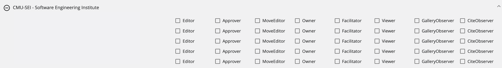

# **Blueprint**
*MSEL Builder Application*

## Overview

### What is Blueprint?

**Blueprint** is a web application created to make the build-out process of Master Scenario Event List (MSELs) and injects easier to perform. This application simplifies the creation and visualization of the MSEL, allowing the user to select/define the simulated entities, attacks, timeframe, and regulators impacted by the scenario. This approach has many advantages over the traditional method of using an excel spreadsheet and facilitates the collaboration between exercise designers belonging to multiple teams.

Additionally, Blueprint can be integrated with Player, Gallery, CITE and Steamfitter. Integrating Blueprint with these applications will automate the configuration process for an exercise.

In summary, Blueprint will allow users to view, edit, create, and approve events on the MSEL.

For installation, refer to these GitHub repositories.

- [Blueprint UI Repository](https://github.com/cmu-sei/Blueprint.Ui)
- [Blueprint API Repository](https://github.com/cmu-sei/Blueprint.Api)

### Blueprint Permissions

In order to use Blueprint, a user must be assigned a Content Developer permissions and be added to their respective team.

There are two levels of permissions in Blueprint that affect the way a user interacts with the Blueprint application and collaborates on the MSEL creation. 

- System Admin: Can add users to a team, as well as assigned the required permissions to the users. Additionally, users with this permission can view, edit, create, and approve events on the MSEL.
- Content Developer: Can view, edit, create, and approve events on the MSEL.

Most users will have the Content Developer permission, since that is all that is required to be able to create and collaborate with other teams on the MSEL creation. 

Refer to this section for more information on additional administrative actions. [Administrator Guide]

## Administrator Guide

### Teams
The following image shows the Teams Administration Page. Here, administrators can add, edit, and delete teams. To be able to use the Blueprint application, administrator should assign a team to desired users. 

**Add a Team**

Assuming that the user has been granted the appropriate permissions by the exercise administrator, follow these steps to add a Team.

1. Under the Teams Administration View, click **+**.
2. Add a **Name** for the team.
3. Add a **Short Name** for the team, which could be the team's acronym.
4. Click **Save**.

If necessary, a Team can be deleted by clicking on the **Trash Icon** next to the desired Team.

In the same way, a Team can be edited by clicking on the **Edit Icon** next to the desired Team.

**Add/Remove Users From a Team**

To configure a team for an exercise, administrators will need to add users to their respective teams. To do this, follow these steps. 

1. Select the team to be configured and click on it to expand its configuration details.
2. Under the **All Users** tab, users that have not been assigned to the team will be shown. To add them to the team, click on **Add User**.
3. Under the **Team Users** tab, users that have already been assigned to the team will be shown. To remove a user from the team, click on **Remove**.

### Users

The following image shows the Users Administration Page. Here, administrators can add and delete users. Additionally, administrators will be able to assign the necessary permissions to each user. 

The available permissions are:

- System Admin: Permission that will grant a user all administration privileges on the Blueprint application.
- Content Developer: Can view, edit, create, and approve events on the MSEL.

**Add a User**

Assuming that the user has been granted the appropriate permissions by the exercise administrator, follow these steps to add a User.

1. Under the Users Administration View, click **+**.
2. Add a **User ID** that will be unique for the user.
3. Add a **User Name** that will identify the user to be added.
4. Click **Save** represented by a user with a + sign.
5. After adding the user to Blueprint, select the desired permissions to be assigned by clicking on the checkboxes next to the user.

If necessary, a User can be deleted by clicking on the **Trash Icon** next to the desired User.

In the same way, a User can be edited by clicking on the **Edit Icon** next to the desired User.

## User Guide

### Blueprint Dashboard

The Blueprint Dashboard shows created MSELS. Here, users are able to select the desired MSEL to work on, as well create or delete them.

The following image will show some important hotspots about the Blueprint Dashboard. Reference the number on the hotspot to know more about this section.

#### Create a Blank MSEL
*Hotspot 1:*

One of the main features of Blueprint is the ability to be able to create a MSEL from scratch using the application. This feature is helpful for users since it will eliminate the hassle of using Excel spreadsheets and have a more user-friendly application that will help users visualize their information easier.

#### Upload an Existing MSEL
*Hotspot 2:*

If creating a new MSEL from scratch is not desired, users can upload an already created MSEL and continue editing it on the application by using this functionality. Useful to share existing MSEL work without having to add the pieces of information to a blank MSEL one by one.

#### MSEL Cards
*Hotspot 3:*

Click on the desire MSEL Card to access its information. Here, users can also edit or update the existing information. Changes made will be seen live by other users without the need of sharing a new document every time.

#### Download
*Hotspot 4:*

If users desire to have an offline copy of any desired MSEL, users will have the ability to download a copy to their devices by using the Download feature. If by any chance, users don’t have an internet connection, this feature will be useful since users will be able to work offline on the MSEL and then upload the MSEL back to the application, so that other users can see any changes made. Although users can work on the MSEL offline, it is not recommended since they will be missing of all of the helpful features that Blueprint offers.

#### Upload
*Hotspot 5:*

With the Upload feature, users can update the information from the MSEL Card with the new uploaded information. This feature will modify all the existing information with the one found on the .xlsx file.

#### Delete
*Hotspot 6:*

With the Delete feature, users will be able to delete existing MSEL Cards. By deleting the MSEL Card, all the information that was included in the MSEL will be deleted too.

#### Copy
*Hotspot 7:*

With the Copy feature, users will be able to create a copy of an existing MSEL Card. With this feature, users will be able to modify the copy, instead of the original. Useful if the user isn't sure of any new changes or to have a foothold of the information that is needed, instead of creating a new MSEL from scratch.

#### Search
*Hotspot 8:*

This functionality will enable users to search for an specific MSEL, in case it is not presented at the top on the dashboard.

### MSEL Editing Functionalities

After uploading or creating a MSEL, users will be given the ability to edit any desired information, as well as add additional information to the MSEL. 

With this functionality, users can now edit the same MSEL, instead of each user having their own copy and then sending their edits to the user responsible of recompiling all the edits together. By allowing users to access the MSEL on-the-fly, this will ensure that everyone will have the same copy of the MSEL on the day of the live scenario.

#### Basic Information Tab

On this tab, users will be able to edit basic information and configuration about the MSEL.

To edit the MSEL's basic information and configuration, follow these next steps:

1. Navigate to the **Info** tab.
2. Click on the **Edit** button.
3. Provide a **Name** for the MSEL.
4. Provide a **Description** about the MSEL.
5. If desired to convert into a template, check the **Is a Template** box.
6. If desired to be integrated with Player, add the link for the **Link Player View**.
7. If desired to be integrated with Gallery, check the **Integrate Gallery** box.
8. If desired to be integrated with CITE, check the **Integrate CITE** box.
9. If desired to be integrated with Steamfitter, check the **Integrate Steamfitter** box.
10. To change the MSEL's status to approved, select **Aprove** within the available options.
11. To add an exercise view, add the link to the **Exercise View URL** field.

 Integrations:

- Gallery: Blueprint will add the collections, exhibits, cards, articles, teams, and users specified on the MSEL.
- CITE: Blueprint will add the evaluation, moves, actions, roles, teams, and users specified on the MSEL.
- Player & Steamfitter: Blueprint will automate the adding of injects specified on the MSEL.

#### Roles Tab

On this tab, users will be able to add and assign teams to the MSEL. Assigned teams will be able to view and edit the MSEL.

*Add a Team*

To add a team to the MSEL's Roles, follow these steps:

1. Navigate to the **Roles** tab.
2. Click on the **Add a Team** section and then select the desired team to be added.
3. After selecting the team, click on the **+** button.

*Delete a Team*

To delete a team from the MSEL's Roles, follow these steps:

1. Navigate to the **Roles** tab.
2. Select the desired team to be removed and click on the **-** button.

Now the team has been added to the MSEL's Roles and members will be able to view and edit the MSEL based on the role assigned to the team. The available roles are:

- Editor: Can view and edit the MSEL.
- Approver: Can view and edit the MSEL, but will have the added feature of approving a MSEL.
- Owner: Owner of the MSEL, can view and edit the MSEL.

#### Data Fields Tab

On this tab, users will be able to add data fields that are going to be used on the MSEL. These data fields can be compared to the column fields used on Excel spreadsheets.

*Add a Data Field*

To add a Data Field to the MSEL, follow these steps:

1. Navigate to the **Data Fields** tab.
2. Click on the **+** icon from the top left of the screen.
3. Add a **Display Order** to indicate where to place the data field.
4. Add a **Name** for the data field.
5. If necessary, check the **Selected From a List?** box.
6. If desired to be hidden, check the **Hidden under "More Fields" section** box.
7. If wanted to be restricted for some users, select the **ONLY Display for Content Developers and Owners** box.
8. If desired, select the **Display in header of Injects** box.
9. If desired, select the **Display in header of Exercise View** box.
10. If integrated with Gallery, add the **Gallery Article Parameter**.
11. If desired to be a specific size, add the **Column Metadata (Width)**.
12. If desired to be a specific color, add the **Column Metadata (Color)**.

*Delete a Data Field*

To delete a Data Field from the MSEL, follow these steps:

1. Navigate to the **Data Fields** tab.
2. Select the desired data field to be deleted and click on the **Trash Can** icon.

*Edit a Data Field*

To edit an existing Data Field, follow these steps:

1. Navigate to the **Data Fields** tab.
2. Select the data field to be edited and click on the **Edit** button to make any changes to the existing configurations.
3. After making all the necessary changes, click on the **checkmark** to save them.

*Search For a Data Field*

To search for a specific Data Field, follow these steps:

1. Navigate to the **Data Fields** tab.
2. Click on the **Search Bar** and add the name of the data field desired.

#### Organizations Tab

On this tab, users will be able to add all the related organizations that are going to be used on the MSEL, as well as on the live exercise. Here, Organization Cards with their information are added. Additionally, users can create Organization Cards from scratch or from a template.

*Add an Organization Card From Scratch*

To add an Organization Card from scratch, follow these steps:

1. Navigate to the **Organizations** tab.
2. Click on **Add Organization**.
3. Then, you will get a pop up to add the organization's details.
4. Add a **Name** for the organization.
5. Add a **Short Name** for the organization, such as an acronym. 
6. Add a **Summary** describing the organization.
7. Add an **Email** from the organization.
8. If desired, a **Description** can be added.
9. Click **Save**.

*Add an Organization Card From Template*

To view existing Organization Card Templates and create an organization from a template, follow these steps:

1. Navigate to the **Organizations** tab.
2. Check the **Show Templates** box.
3. Select the desired template and click on the **+** icon from the card. 
4. Here, users will be able to edit all necessary information to create a new organization.
5. After modifying the desired details, click **Save**.

*Edit an Organization*

To edit an existing organization, follow these steps:

1. Navigate to the **Organizations** tab.
2. Select the desired card to be edited and click on the **Edit** button from the card.
3. Here, users will be able to edit all necessary information.
4. Click **Save**.

*Delete an Organization*

To delete an Organization Card, follow these steps:

1. Navigate to the **Organizations** tab.
2. Select the desired card to be deleted and click on the **trash can** icon from the card.

*Search for an Organization*

To search for a specific Organization Card, follow these steps:

1. Navigate to the **Organizations** tab.
2. Click on the **Search Bar** and type the name of the desired organization.

#### Moves Tab

On this tab, users will be able to add all the related exercise Moves to the MSEL.

*Add a Move*

1. Navigate to the **Moves** tab.
2. Click on the **+** icon.
3. Add the **Move Number** to indicate its order.
3. Add the **Title** for move.
4. Indicate the **Start Time** of the move.
5. Indicate the **Stop Time** of the move.
6. Add the **Move Description** to describe the move.
7. Indicate the **Situation Date** of the move.
8. Add a **Situation Description** to describe the situation.
9. Click **Save**.

*Edit a Move*

To edit the move's details, follow these steps:

1. Navigate to the **Moves** tab.
2. Select the move you want to edit and click on the **Edit** button for the corresponding move.
3. Here, users will be able to edit all the desired details.
4. Click on the **Checkmark** to save the details.

*Delete a Move*

To delete a move from the MSEL, follow these steps:

1. Navigate to the **Moves** tab.
2. Select the move you want to delete and click on the **Trash Can** button for the corresponding move.

*Search For a Move*

To search for a specific move, follow these steps:

1. Navigate to the **Moves** tab.
2. Click on the *Search Bar* and type the name of the desired move.

#### Injects Tab

On this tab, users will be able to add all the related injects to the MSEL.

*Add a New Inject*

To add a new inject, follow these steps:

1. Navigate to the **Injects** tab.
2. Click on the **+** icon found on the top left.
3. Add an **Order** to indicate the position of the inject.
4. Add a **Group**.
5. Indicate the **Move** for the inject.
6. Select the **Assigned To** from the given options.
7. Add the **Status** for the inject.
8. Indicate the **Exercise Time**.
9. Indicate the **Simulated Time**.
10. Add a **Title** for the inject.
11. Add the **Description** for the inject.
12. Select the **To** from the given options.
13. Select the **From** from the given options.
14. If necessary, add any additional **Details**.
15. If desired, add the **Expected Actions** from this inject.
16. Click **Save**.

*Add Color to an Inject*

To add a color to an existing inject, follow these steps:

1. Navigate to the **Injects** tab.
2. Select the desired inject to be edited and click on the **Bucket** icon.
3. Here, users will be able to select the desired color.

*Create an Inject From a Template*

To create an inject from an existing template, follow these steps:

1. Navigate to the **Injects** tab.
2. Select the desired inject and click on the **Copy** button from the desired inject.
3. Here, users will be able to edit the necessary fields for the new inject.
4. Click on the **Checkmark** to save changes.

*Delete an Inject*

To delete an inject, follow these steps:

1. Navigate to the **Injects** tab.
2. Select the desired inject to be deleted and click on the **Trash Can** icon from the inject.

#### Exercise View

After making all the necessary edits, the "Exercise View" tab will recompile all the information added during the edits and display it to the users in an organized view. Here, users will be able to see all the information from the MSEL and be able to locate if anything is wrong or missing.

With this organized view, users will be able to understand the important key factors of the MSEL, as well as provide an on-the-fly view, which users will be able to access and see any edits done to the MSEL.

