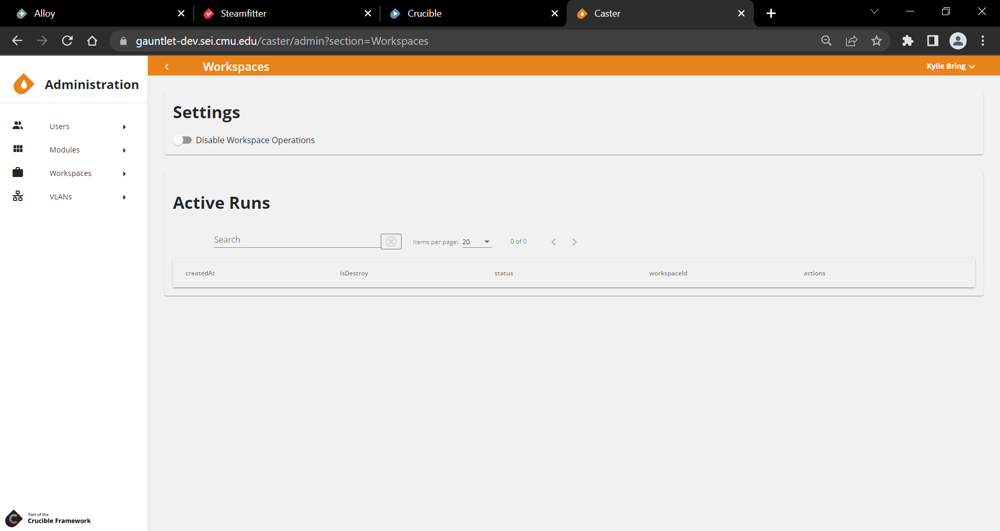

# {: style="height:75px;width:75px"} **Caster:** Coding a Topology

## Overview

**Caster** is the deployment component of the Crucible framework. It uses [Terraform](https://www.terraform.io/), an open-source Infrastructure-as-Code tool, to define and apply infrastructure configurations.

Caster provides a web interface where exercise developers create, share, and manage topology configurations.

Early versions of Caster exposed Terraform configurations and outputs directly through the UI and primarily supported advanced users. Ongoing development adds higher-level features that reduce the need to write Terraform manually while still allowing direct configuration when users need it.

## Terraform Integration

For more information on native Terraform constructs used in Caster, please refer to the [Terraform documentation](https://www.terraform.io/docs/index.html).

The [Crucible Terraform Provider](https://registry.terraform.io/providers/cmu-sei/crucible/latest/docs) enables programmatic management of Crucible resources through Terraform configurations.

## Administrator Guide

### Administration View

Across the Crucible exercise applications, the **Administration View** is where privileged users configure the platform and control access. It includes user and team management, role and permission assignment, and setup and maintenance of app-specific templates and content. It is where admins prepare and manage the environment so events run smoothly for participants.

Accessing the Administration View is the same in all Crucible exercise applications: expand the dropdown next to your username in the top-right corner and select **Administration**.


### Projects

### Users

Users appear in Caster after they authenticate through the Identity provider and open Player in a browser.

The screen shot below shows the **Users** pane in Caster's Administration View.


To assign a new role to a user:

In the user row, in the **Role** column, select a new role from the dropdown (**None**, **Observer**, **Content Developer**, or **Administrator**).

### Modules

In Caster, a *[module](https://www.terraform.io/docs/glossary.html#module)* is a Terraform construct. A module is a container for related resources used together. It lets you describe infrastructure at the architecture level instead of defining each individual object.

A module packages one or more resources into a single block and exposes required or optional variables. For example:

- A generic virtual machine module that exposes values such as `TeamId`, `Networks`, and `ExerciseId`.
      - **TeamId:** Sets `guestinfo.teamId` in `extra_config`.
      - **Networks:** Creates a Network Interface Card (NIC) for each specified network and assigns it to the specified network VLAN.
      - **ExerciseId:** Appends the `exerciseId` to the name of the VM for use with on-demand exercises that require unique naming.

- A domain controller module that requires values such as domain name, IP address, and administrator credentials.
- A module that defines an entire Cyber Flag enclave.
- A module that defines a configurable GreySpace environment.

Caster supports modules stored as GitLab projects that are visible to the API GitLab token and contain at least one version. When a project is added or refreshed, all available versions appear in Caster.

!!! note

    The module inputs and outputs files must be JSON (`variables.tf.json` and `outputs.tf.json`).

Caster can add or refresh modules in three ways:

- Each module list request checks the configured **Terraform-Modules** group--the group ID is a Caster API setting--and subgroups for updates. Refresh the browser if a new module or version does not appear.
- An administrator can force a full module update if Caster dates differ from GitLab.
- An administrator can add or refresh a module directly using its GitLab project ID.

While working on Caster Modules:

- **Search:**
- **Add/Update Modules:**
- **Add/Update All from the repository:**
- **Copy:**
- **Versions:**
- **Delete:**

Selecting a module opens a form where you choose a version and enter the required variable values. After you select **Submit**, Caster generates the Terraform module block, which you can copy into the configuration file.

### Workspaces

### VLANs


Caster manages VLAN IDs by creating pools of 4096 VLANs and dividing them into partitions. When a user requests a VLAN from a partition, Caster assigns an unused ID and marks it in use until the user releases it.

A partition is either assigned to a project or configured as the system default. Users request VLAN IDs from their project partition or from the default partition.

- VLANs can include tags for organization, and users can request a VLAN by tag
- Users can request a specific VLAN ID within a partition
- VLANs marked as reserved (including `0`, `1`, and `4095`, reserved by default) are never assigned
- Entity update events restore SignalR functionality when modified properties are fixed

### Roles and Permissions

Sets of *permissions* control access to features in Caster. Permissions can apply globally or per **Project**.

Examples of global permissions include:

- `CreateProjects`: Create new Projects
- `ViewProjects`: View all Projects and their Users and Groups
- `ManageUsers`: Make changes to Users

Users with View or Manage permissions for an administration function (for example, `ViewVLANs` or `ManageWorkspaces`) can open the **Administration** area. However, they see only the sections they have permission to access in the sidebar menu.

You can view all available permissions in the **Roles** section of the **Administration** area.

#### Roles

You apply permissions to *users* by grouping them into *roles*. Caster supports two types of roles: **System Roles** and **Project Roles**.

##### System Roles

Each user can have one *system role* that provides global permissions across all of Caster.

Default system roles:

- **Administrator:** All permissions within the system.
- **Content Developer:** Has the `CreateProjects` permission. Users with this role can create and manage their own Projects, but cannot change global settings or other users' Projects.
- **Observer:** Has all view permissions. Users with this role can view everything in the system, but cannot make changes.

Users with the `ManageRoles` permission can create custom system roles in the **Roles** section of the **Administration** area.

#### Project Roles

When you add a user to a Project, you assign a *project role* that defines what they can do within that specific Project.

Available project roles:

- **Manager:** Perform all Project actions, including managing user access. When someone creates a new Project, they automatically become the Manager for that Project.
- **Member:** View and edit all objects within the Project.
- **Observer:** View all objects within the Project, but cannot make changes.

You can't create custom project roles.

### Groups

Groups are collections of users that administrators assign roles to or add to projects as a single unit instead of managing users individually. Administrators use groups to simplify access management for teams. For example, an administrator can add a group such as **White Cell** to multiple projects, and any user placed into the matching group (**White Cell**) in the identity provider automatically gains the same project access in Caster. This allows administrators to manage group membership in one place while Caster applies the access across all of the applications.

Administrators can create new groups, search for and edit existing groups, and delete groups here. Administrators add users to groups manually or, if enabled in the environment, match them to group names from the Identity provider token.

#### Creating a New Group

1. In the Caster Administration View, select **Groups**.
2. Click the **+** sign to add a new group.
3. Type in a **Name** and click **Save**.
4. Expand the new group.
5. Under **Users**, search for a specific user and click **Add** to place that user into the **Group Members** column.

#### Renaming an Existing Group

1. In the Caster Administration View, select **Groups**.
2. Click the **pencil** icon and edit the group **Name**.
3. Click **Save**.

#### Deleting a Group

1. In the Caster Administration View, select **Groups**.
2. Click the **trash can** icon then **Delete**.

## User Guide

Administrators manage the environment, including projects, users, groups, permissions, modules, and running workspaces in the Administration area. Users access assigned projects, create and edit Terraform files, and deploy configurations to workspaces. This *User Guide* explains how you, the user, perform those tasks.

### Project

The top-level construct in Caster is a *project*. The project is a way to organize and categorize similar environments for multiple files and directories within Caster. The main screen of Caster displays a list of the projects available and allows a user to create a new one.

A project can:

- Categorize large events
- House directories, workspaces, and subdirectories

Users can add new projects, rename projects, save projects, and also import and export projects. A project's landing page in Caster has a navigation panel for easy movement within the project's files, workspaces, and directories.

#### Add Directory

Add Directory lets you create a new directory at the same level as the above projects.

#### Export Project

Export Projects allows you to export the project as a zip file.

#### Import Project

### Files

*Files* represent text files to eventually put onto a file system and use with the Terraform command line tool. You can name and edit files through Caster, but file extensions are important and have specific meaning to Terraform.

- `.tf` A configuration file that defines resources, variables, etc., in a Terraform configuration.
- `.auto.tfvars` Contains the values used for variables defined in `.tf` files.

!!! tip "Locking and Unlocking Files"

    When working with files in Caster, **CTRL+L** locks/unlocks a file to prevent others from editing that file simultaneously. When locked, the file icon appears as a dashed line. When unlocked, the file icon appears solid. Administrators can also lock files. A file is *administratively locked* to prevent anyone from changing that file. A lock icon in the top right corner of the file edit screen denotes that the file is administratively locked. **CTRL+S** saves a file.

See the official [Terraform Documentation](https://www.terraform.io/docs/index.html) for more details on supported file types and extensions. In the future, Caster may provide more guidance on allowed types and content of files.

### Workspaces



A *workspace* represents a specific instance of a deployed Terraform configuration. Use the same configuration to deploy virtual machines to multiple workspaces that differ only by the values set to certain variables. For example, define a configuration once for an enclave in a Cyber Flag exercise, and then deploy to `flag00` through `flag30` workspaces - each creating a copy of the enclave.

Workspaces can contain files, which extend the configuration of the directory for that specific workspace. This might include files specifying values for variables defined in the directory, or additional resources deployed only for that workspace.

A workspace is where users:

- Create an instance of a Terraform configuration
- Run their plans. (*[Runs](#run-plan-and-apply)* are a specific instance of a Terraform plan)
- Manage the differences and the variables in their environments

Users can access workspaces from a project's navigation pane in Caster. They can add additional files—but not directories—to a workspace.

The workspace view displays all planned and applied runs. Runs shaded in red represent destroy operations, while runs in white indicate other status classifications.

Users can `Plan`, `Destroy`, `Apply`, `Taint`, and `Reject` operations in real time in the workspace view.

`Caster.Api` utilizes the Terraform binary in order to execute workspace operations. This binary is running inside of the `Caster.Api` service. *Restarting or stopping the `Caster.Api` container while a Terraform operation is in progress can lead to a corrupted state.*

In order to avoid this, a System Administrator should follow these steps in the Caster UI before stopping the `Caster.Api` container:

- Navigate to Administration, Workspaces
- Disable Workspace Operations by clicking the toggle button
- Wait until all Active Runs complete

### Directories

The top-level construct within a project is a *directory*. A project can contain many directories. Directories contain files that make up a particular Terraform configuration, workspaces that represent a specific instance of that configuration, and subdirectories. Directories are primarily for organization and shared resources.

#### Directory Hierarchies

Directories can contain subdirectories to create a *hierarchy* of directories and the configuration files contained therein. When creating a run, the files in the workspace, the workspace's directory, ***and all parent directories*** merged and pass to Terraform as a single configuration. This eliminates redundancy when developing many environments that are similar or share a set of common variables or data across many configurations. For example, a large deployment might have a top-level directory defining global variables `vlan ids` and `team ids`, and subdirectories defining resources using those variables.

Users can add, rename, delete, or export a directory from the navigation panel on a project's main Caster page.

Peer directories (directories that fall outside a parent directory) are not included in a run.

### Designs

Designer provides a graphical user interface for creating and editing terraform deployments through the use of modules.

When you open a project, you can create a design and add modules backed by Git to that design. You can also create variables for use in the modules settings.

## Caster Tips

### Crafting Terraform Code

This topic is for anyone who manages a Crucible instance who wants to configure their Terraform provider installation for Caster. You can configure Terraform to only download certain providers from the Internet and use them from a local File store.

Refer to **HashiCorp's Terraform** documentation: **Command Line Interface (CLI) Configuration File** [Provider Installation](https://www.terraform.io/docs/cli/config/config-file.html#provider-installation).

For your reference, below is the `.terraformrc` file currently implemented in the SEI's CyberForce instance of Caster.

In the SEI's instance, we want to use any locally downloaded plugins in the `sei` or `mastercard` namespace. In addition, we can download any of the `hashicorp` namespace providers in the `direct` section directly from the Internet without any operator intervention.

These plugins are then cached in the `plugin_cache_dir` section, to save from downloading the providers during every Terraform `plan` and `apply`.

!!! example

    ```text
    plugin_cache_dir = "/terraform/plugin-cache"
    provider_installation {
        filesystem_mirror {
    	    path = "/terraform/plugins/linux_amd64"
            include = [
        	    "registry.terraform.local/sei/*",
        	    "registry.terraform.local/mastercard/*"
            ]
        }
         direct {
     	    include = [
            "hashicorp/vsphere",
            "hashicorp/aws",
            "hashicorp/azurerm",
            "hashicorp/azuread",
            "hashicorp/null",
            "hashicorp/random",
            "hashicorp/template",
            "hashicorp/cloudinit"
            ]
        }
        }
    ```

### Hosts

A *host* consists of a name, datastore, and maximum number of virtual machines that it can support. The API creates and manages hosts, then assigns them to exercises. An exercise can have many hosts.

Workspaces include an additional property, `DynamicHost`, which usually defaults to `false`. When Alloy creates a workspace, it sets `DynamicHost` to `true` and changes the behavior of a run. When `DynamicHost` equals `true`, Caster examines all of the hosts assigned to the current exercise. It chooses the host with the least usage (the number of machines to deploy/maximum machines) and assigns that host to the workspace.

In addition to the normal run files, Caster creates a `generated_host_values.auto.tfvars` containing two variable values: `vsphere_host_name` and `vsphere_datastore`, set to the name and datastore of the selected host. Upon applying the run, Caster tracks how many VMs deployed to the host, and uses this for future calculations.

After an on-demand exercise (ODX) finishes, Caster deletes the workspace and releases the host's resources. If a run attempts to deploy more virtual machines than there is capacity for in the available hosts, the run will fail.

#### On-Demand Exercise Functionality

Alloy calls Caster in order to deploy resources for lab or ODX-style functionality. Caster itself does not differ in its main functionality of deploying workspaces and lets Alloy handle most of the ODX functionality.

However, in order to support this functionality Caster dynamically selects a host to deploy to.

Normally, the configuration embeds the cluster or host to deploy to, either directly or as a variable, and Caster doesn't concern itself with this. For ODX's, Caster *does* need to concern itself with:

- ensuring that the system deploys resources evenly to the available hosts, and
- preventing the hardware from attempting to deploy more ODXs than it can support.

To address these concerns the team added the concept of a *host* to Caster.

### Run, Plan, and Apply

A *run* is a specific instance of the Terraform *plan* and *apply* process for a workspace. The run instantiates the configuration in a directory as deployed resources within a workspace. Upon opening a workspace, the interface displays a list of runs. Users start plan or destroy operations there.

*Plan* and *apply* are specific Terraform terminologies. Every run includes a plan step and an apply step.

#### Plan

Clicking *plan* creates a new Run and executes the `terraform plan` command on the given configuration. This raw Terraform output, visible to the user, describes:

- What actions Terraform will take
- What resources to create
- What resources to change
- What resources to destroy

A plan shows the user what will deploy.

This output always ends with a summary of the form `Plan: x to add, y to change, z to destroy`. The user reviews this and chooses to apply or reject the plan.

- Choosing **apply** creates an apply for the run and executes `terraform apply` on the previously generated plan. This causes Terraform to make the changes described.
- Choosing **reject** invalidates the plan. It leaves the infrastructure unchanged.

#### Apply

*Apply* takes a run, executes `terraform apply` on the previously generated plan and deploys the resources for a workspace. The `Apply` command:

- Deploys a workspace run
- Releases plan tools such as network resources and virtual machines into vCenter

Within the workspace view users can see every run they have planned and applied.

#### Destroy

Selecting destroy instead of plan is similar, but the generated plan will destroy all previously deployed resources in the workspace, rather than matching the infrastructure to the current configuration. That is, *Destroy* creates a plan that will destroy all of the previously deployed resources in a workspace.

If the configuration defines a resource, a run creates it, and you later delete that resource from the configuration, the next plan or destroy run removes it. Terraform always tries to match the infrastructure to the current configuration.

There is only one run in progress at a time per workspace. Terraform locks the state of the workspace and only performs a single operation at a time. Developers may wish to break up large deployments into multiple directories and workspaces to operate on different parts of the deployments simultaneously. For example, break out user enclaves so developers can perform actions on other parts of a network without (potentially) waiting a long time to redeploy user machines.

The workspace view shows a table with all the runs the directory has planned and applied. Caster highlights destroy operations in red.

Within the workspace view users can click `Destroy` to destroy live Terraform applications.

This Infrastructure-as-Code approach is unfamiliar to some developers. It defines a configuration and applies it in its entirety, rather than selecting individual pieces for deployment. There are some ways to target individual pieces of a configuration, but Terraform recommends this as the exception rather than the rule, and Caster does not fully implement this.

#### Taint

*Taint* is a flag on a resource that tells Terraform to destroy and recreate a new instance on the next plan-and-apply cycle.

Taint allows users to redeploy resources. For example, if a user needs to redeploy a series of virtual machines, the user can:

1. Taint these resources
2. Run another plan-and-apply cycle that will redeploy the instance as if new from a template

Some resources are not in scope for taint, however.

Users can taint resources within the workspace view. A tainted resource will display in red shading. Users can easily access the `Untaint` command while in workspace view before running another plan-and-apply cycle if they decide to keep the resource.

## Glossary

This glossary defines key terms and concepts used in the Caster application.

**Designer:** A graphical user interface for creating and editing Terraform deployments through the use of modules.

**Directory:** The outline of a project and the modules it contains.

**File:** Text files to eventually put onto a file system and use with the Terraform command line tool.

**Host:** Consists of a name, datastore, and maximum number of virtual machines that it can support.

**Module:** A container for multiple resources used together. Modules create lightweight abstractions, so you can describe your infrastructure in terms of its architecture, rather than directly in terms of physical objects.

**Project:** A way to organize and categorize similar environments for multiple workspaces and directories within Caster.

**Terraform:** An open-source Infrastructure-as-Code tool.

**Topology:** The physical and logical arrangement of nodes and connections in a network.

**Workspace:** A specific instance of a deployed Terraform configuration.
