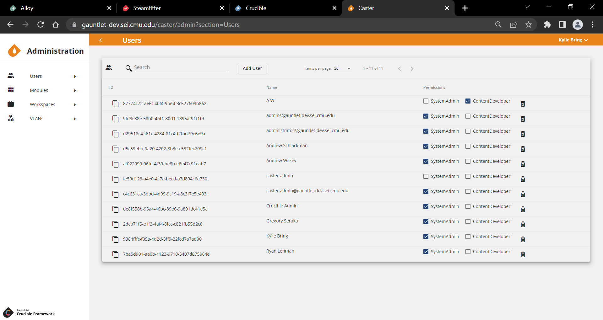
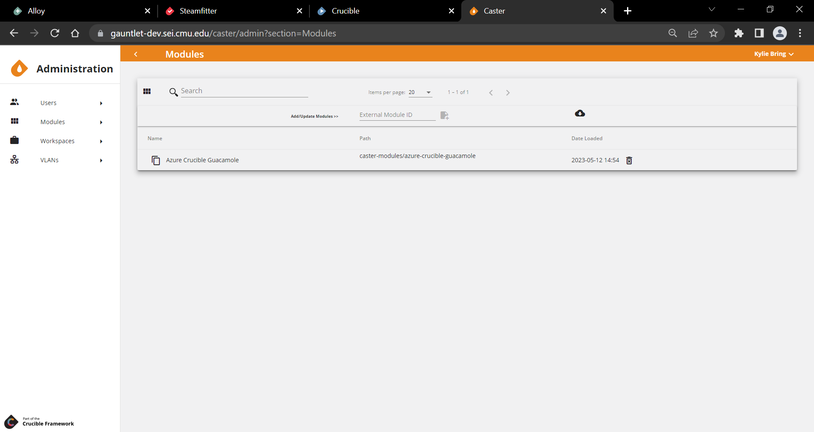
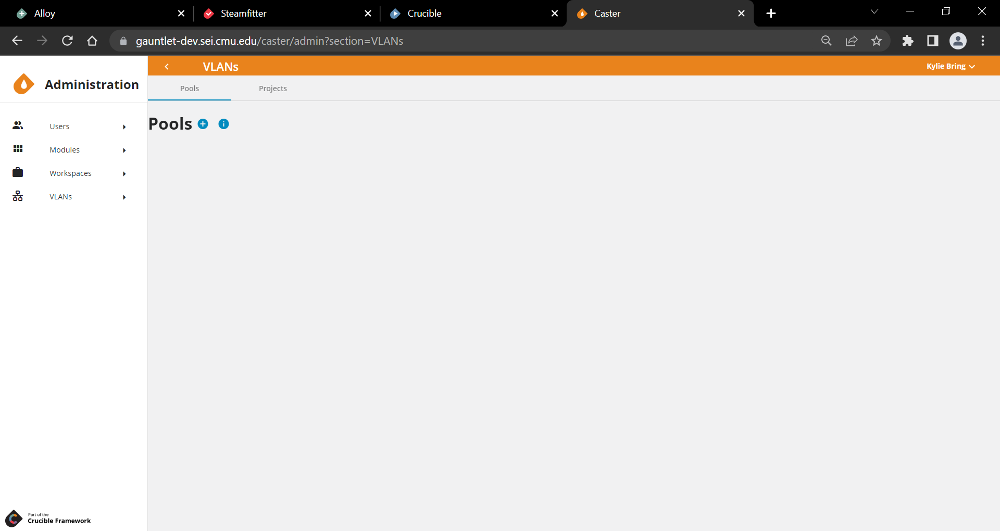
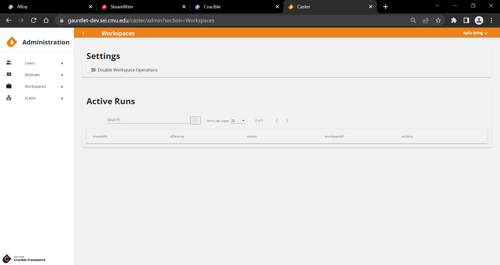

# **Caster**

*Coding a Topology*

## Overview

Caster is the primary deployment component of the Crucible simulation framework. Caster is built around [Terraform](https://www.terraform.io/), an open source "Infrastructure as Code" tool. 

Caster is meant to provide a web interface that gives exercise developers a powerful and flexible way to create, share, and manage topology configurations. 

Initial versions of Caster focus on a web front-end for raw Terraform configurations and outputs. This gives advanced developers easier access to a powerful deployment tool. Targeted improvements to the experience for these users will be made in the future. Eventually, this system will be used to underpin a more user-friendly interface that will allow configurations to be pieced together with less or no writing of Terraform code directly. 

The goal is to create a tool that gives advanced users the power and flexibility that they desire, while also allowing novice users to take advantage of complex topologies created by advanced users or create their own simple ones easily.

**Terraform Integration**

For more information on native Terraform constructs used in Caster, please refer to the [Terraform documentation](https://www.terraform.io/docs/index.html).

## Administrator User Guide

### Users



Users are only available in Player after they have successfully authenticated via the Identity server and opened Player in their browser. Users and/or teams can be assigned any set of **Permissions:** 

#### Assign Roles

Users and/or teams can be assigned to a **Role**, which is a group of permissions. More about roles as future Player development is completed. Only a SystemAdmin can create roles. 

#### Assign Permissions

- **SystemAdmin:** can edit anything in Caster; SystemAdmin permissions are given by existing SystemAdmin.
- **ContentDeveloper:** can edit anything within a Directory that they have permissions.

A SystemAdmin creates the Directory and assigns ContentDeveloper permissions to specific teams who can now edit that Directory.
> **Important!** Only users who have the SystemAdmin permission can view the Administration screen and the Administration nav bar (Users, Modules, Workspaces).

### Modules



[Modules](https://www.terraform.io/docs/glossary.html#module) are a Terraform construct:

> A module is a container for multiple resources that are used together. Modules can be used to create lightweight abstractions, so that you can describe your infrastructure in terms of its architecture, rather than directly in terms of physical objects.

Modules are very powerful and allow for complex configurations to be made simpler and more easily shared and used. A module takes any Terraform configuration consisting of any number of resources and turns it into a single block, exposing required and/or optional variables. Some examples include:

- A generic virtual machine module that abstracts away commonly used parameters into variables such as: 
    - **TeamId:** sets `guestinfo.teamId` in `extra_config`.
    - **Networks:** creates a NIC for each specified network and assigns it to the specified network vlan.
    - **ExerciseId:** appends the `exerciseId` to the name of the vm for use with ODX's where unique naming is required.
    - Other simplified variable names based on the target audience.
- A module to create a very specific type of virtual machine resource, such as a domain controller, that points to a known good VMware template/base disk and an Ansible playbook that requires variables such as:
    - Domain Name
    - IP Address
    - DomainAdminUser
    - DomainAdminPass
- A module to define an entire Cyber Flag enclave.
- A module to define a generic GreySpace that accepts variables to configure GreyBox, TopGen, etc.

Modules allow for endless flexibility for developers to wrap whatever configuration they can create into a small package and describe to consumers of the module exactly what it does and what values it requires to function. 

Caster makes it easier to search for and use modules when building a Terraform configuration. 

Caster supports modules created as GitLab projects that are visible to the GitLabToken defined in the API settings with at least one version defined.  All versions will be shown in Caster when the project is added/refreshed to Caster.  

>**Note:**  Caster requires that the inputs file and the outputs file be written in JSON (that is, `variables.tf.json` and `ouptuts.tf.json`). 

There are three ways that the a module can be added/refreshed to Caster:

- Every time that the modules list is requested, Caster API checks for updated modules in the **Terraform-Modules** group (the group ID is a Caster API setting) or any of its sub-groups.  If you add a module or version, you may have to refresh your Caster UI browser to see the change.

- Because the Caster UI uses its internal modified date to determine if there are any "new" changes, the Caster dates could get out of sync with the GitLab dates.  In this case, an administrator can force an update of all of the modules.

- An administrator can also individually add/refresh a module using its GitLab Project ID, whether or not it is underneath the Terraform-Modules group.

When editing a file in the Caster UI, a **Modules** sidebar can be opened to search through available modules.

Upon selecting a Module, a form opens that allows the user to select the Version of the Module, and then complete the version-specific variables that the Module expects.

Upon **Submit**, Caster generates the Terraform code that can be copied into a configuration file to use the selected module with the selected variable values.

### VLANs



Adds the ability to manage VLAN ids. Pools of 4096 VLANs can be created and sub-divided into Partitions. A VLAN can then be requested by a user from a Partition, and they will receive an unused VLAN id, which will then be marked as used until they release it. Projects can be assigned Partition's and a system-wide default Partition can be set for users to request VLAN Ids from their Project's Partition or the default as well.

- VLANs can have tags for organizational purposes and can be requsted by tag
- A VLAN can be requested by specific vlanId within a Partition
- VLANs can be marked as reserved (0, 1, and 4095 are reserved by default) so that they will never be used
- fixed modified properties in entity updated events to restore signalR functionality

## User Guide

### Project

The top-level construct in Caster is called a *project*. The _project_ is a way to organize and categorize similar environments for multiple workspaces and directories within Caster. The main screen of Caster displays a list of the projects available and allows a user to create a new one.

A project is meant to:

- Categorize large events
- House directories, workspaces, and sub-directories

Users can add new projects, name projects, and save projects. A project's landing page in Caster has a navigation panel for easy movement within the project's files, workspaces, and directories. Projects can also be exported.

#### Export Project

Export Projects allows you to export the project as a zip file.

#### Add Directory

Add Directory lets you create a new directory at the same level as the above projects.

### Files

*Files* represent text files that will eventually be put onto a file system and used with the Terraform command line tool. Files can be named and edited through Caster, but file extensions are important and have specific meaning to Terraform. 

- `.tf` A configuration file that defines resources, variables, etc., in a Terraform configuration.
- `.auto.tfvars` Contains the values to be used for variables defined in `.tf` files.

>**Note:** When working with Files in Caster **CTRL+L** locks/unlocks a file to prevent others from editing that file simultaneously. When locked, the file icon appears as a dashed line. When unlocked, the file icon appears solid. Files can also be locked by an administrator. A file is *administratively locked* to prevent anyone from changing that file. A lock icon in the top right corner of the file edit screen denotes that the file is administratively locked. **CTRL+S** saves a file.

See the official [Terraform Documentation](https://www.terraform.io/docs/index.html) for more details on supported file types and extensions. In the future, Caster may provide more guidance on what types of files can be created and what their contents are expected to be.

### Workspaces



A *workspace* represents a specific instance of a deployed Terraform configuration. The same configuration can be used to deploy virtual machines to multiple workspaces that differ only by the values set to certain variables. For example: a configuration for an enclave in a Cyber Flag exercise may be defined once, and then deployed to `flag00` through `flag30` workspaces - each creating a copy of the enclave. 

Workspaces can contain files, which extend the configuration of the directory for that specific workspace. This might include files specifying values for variables defined in the directory, or additional resources to be deployed only for that workspace.

A workspace is where users:

- Create an instance of a Terraform configuration
- Run their plans (_Runs_ are a specific instance of a Terraform plan; explained [here](./caster-run-plan-apply))
- Manage the differences and the variables in their environments

Users can access workspaces from a project's navigation pane in Caster. Users can add additional files, but _not_ additional directories, to a workspace. The workspace view allows users to see all the runs that have been planned and applied. Runs shaded in red are destroyed operations, while runs in white signify various other status classifications.

Users can `Plan`, `Destroy`, `Apply`, `Taint`, and `Reject` operations in real time in the workspace view.

Caster.Api utilizes the Terraform binary in order execute workspace operations. This binary is running inside of the Caster.Api service. *Restarting or stopping the Caster.Api Docker container while a Terraform operation is in progress can lead to a corrupted state.*

In order to avoid this, a System Administrator should follow these steps in the Caster UI before stopping the Caster.Api container:

- Navigate to Administration > Workspaces
- Disable Workspace Operations by clicking the toggle button
- Wait until all Active Runs are completed

### Directories

The top-level construct within a project is called a *directory*. A project can contain many directories. Directories contain files that make up a particular Terraform configuration, workspaces that represent a specific instance of that configuration, and sub-directories. Directories are meant to be used primarily for organization and shared resources.

**Directory Hierarchies**

Directories can contain sub-directories to create a _hierarchy_ of directories and the configuration files contained within them. When a run is created in a workspace, the files in the workspace, the workspace's directory, ***and all parent directories*** are merged together and passed to Terraform as a single configuration. This eliminates redundancy when developing many environments that are largely the same, or sharing a set of common variables or data across many configurations. 

> For example, a large deployment might have a top-level directory that defines global variables like `vlan ids` and `team ids` in use, and then sub-directories that define resources that use those variables.

Users can add, rename, delete, or export a directory from the navigation panel on a project's main Caster page. 

Peer directories (directories that fall outside a parent directory) are not included in a run.

### Designs

Designer provides a graphical user interface for creating and editing terraform deployments through the use of modules.

When you open a project, you can create a design and add modules backed by git to that design. You can also use create variables to be used in the modules settings.

## Caster Tips

### Crafting Terraform Code

This topic is for anyone who manages a Crucible instance who wants to configure their Terraform provider installation for Caster. Terraform can be configured to only allow certain providers to be downloaded from the Internet and used from a local Filestore. 

Documentation describing this can be found in **HashiCorp's Terraform** documentation: **CLI Configuration File** > [Provider Installation](https://www.terraform.io/docs/cli/config/config-file.html#provider-installation).

For your reference, below is the `.terraformrc` file currently implemented in the SEI's CyberForce instance of Caster.

In the SEI's instance, we want to be able to use any plugins in the `sei` or `mastercard` namespace that have been downloaded locally.  In addition, any of the `hashicorp` namespace providers in the `direct` section can be downloaded directly from the Internet without any operator intervention.  

These plugins are then all cached in the `plugin_cache_dir` section, to save from downloading the providers during every Terraform `plan` and `apply`.

**Sample Caster Terraform Configuration**

```
plugin_cache_dir = "/terraform/plugin-cache"
provider_installation {
	filesystem_mirror {        
		path = "/terraform/plugins/linux_amd64"
        include = [            
        	"registry.terraform.local/sei/*",            	
        	"registry.terraform.local/mastercard/*"        
        ]    
     }    
     direct {        
     	include = [
        "hashicorp/vsphere",
        "hashicorp/aws",            
        "hashicorp/azurerm",            
        "hashicorp/azuread",            
        "hashicorp/null",            
        "hashicorp/random",            
        "hashicorp/template",            
        "hashicorp/cloudinit"        
       ]    
      } 
     }
```

### Hosts

A *host* consists of a name, datastore, and maximum number of virtual machines that it can support. Hosts are created and managed through the API. After a host is created, it can be assigned to an exercise. An exercise can have many hosts. 

Workspaces have an additional property, `DynamicHost`, which is usually set to `false`. When Alloy creates a workspace, this is set to `true`, and changes the behavior of a run. When `DynamicHost` is `true`, Caster examines all of the hosts assigned to the current exercise and chooses the one with the least usage (the number of machines to deploy/maximum machines) to assign to the workspace. 

Along with all of the files normally added to the run, Caster will create a `generated_host_values.auto.tfvars` containing two variable values: `vsphere_host_name` and `vsphere_datastore`, which will be set to the name and datastore of the selected host. When the run is applied, Caster tracks how many virtual machines are deployed to the host and uses it for future calculations. 

When the workspace is deleted after an on-demand exercise (ODX) is finished, the host's resources will be released. If a run attempts to deploy more virtual machines than there is capacity for in the available hosts, the run will fail.

**On-Demand Exercise functionality**

Caster is called by Alloy in order to deploy resources for lab or ODX-style functionality. Caster itself does not differ in its main functionality of deploying workspaces and lets Alloy handle most of the ODX functionality. 

However, in order to support this functionality Caster dynamically selects a host to deploy to.

Normally, the cluster or host to deploy to is embedded in the configuration - either directly or as a variable - and Caster doesn't concern itself with this. For ODX's, Caster *does* need to concern itself with:

- ensuring that resources are deployed evenly to the available hosts, and 
- more ODX's than the hardware can deploy are not deployed. 

To address these concerns the concept of a *host* was added to Caster.

### Run, Plan, and Apply

A *run* is a specific instance of the Terraform *plan* and *apply* process for a workspace. The run is how the configuration in a directory is instantiated into deployed resources within a workspace. Upon opening a workspace, a list of runs is displayed. This is where plan or destroy operations are started. 

*Plan* and *apply* are specific Terraform terminologies. Every run is made up of a plan and an apply step. 

**Plan**

Clicking Plan will create a new Run and execute the "terraform plan" command on the given configuration. This raw Terraform output is shown to the user, and describes:

- What actions Terraform will take
- What resources will be created
- What resources will be changed
- What resources will be destroyed

A plan shows the user what is going to be deployed.

This output always ends with a summary of the form `Plan: x to add, y to change, z to destroy`. The user reviews this and chooses to apply or reject the plan. 

- Choosing **apply** creates an apply for the run and executes `terraform apply` on the previously generated plan. This causes Terraform to actually make the changes described. 
- Choosing **reject** invalidates the plan. No changes are made to the infrastructure. 

**Apply**

_Apply_ takes a run, executes `Terraform apply` on the previously generated plan and deploys the resources for a workspace. The `Apply` command:

- Deploys a workspace run
- Releases plan tools such as network resources and virtual machines into VCenter

Within the workspace view users can see all the runs that have been planned and applied.

**Destroy**

Selecting destroy instead of plan is largely the same, except the plan generated is one that will destroy all of the previously deployed resources in the workspace, rather than making the infrastructure match the current configuration. That is, _Destroy_ creates a plan that will destroy all of the previously deployed resources in a workspace.

>Note: If a resource is defined in the configuration and created in a run and then deleted from the configuration, it is destroyed upon the next plan or destroy run. This is because a Terraform run always tries to match the infrastructure to the current configuration. 

>Note: Only one run can be in progress at a time per workspace. Terraform locks the state of the workspace and only a single operation can be performed at a time.
>Developers may wish to break up large deployments into multiple directories and workspaces to operate on different parts of the deployments simultaneously. 
>For example: User enclaves may be broken out so developers can perform actions on other parts of a network without (potentially) waiting a long time to redeploy user machines.

The workspace view allows users to see a table with all the runs that have been planned and applied within that directory. Runs highlighted in red are destroyed operations.

Within the workspace view users can click `Destroy` to destroy live Terraform applications.

This infrastructure as code approach is different than many developers may be used to. The general approach here is to define a configuration and apply it in its entirety, rather than selecting individual pieces to be deployed. There are some ways to target individual pieces of a configuration, but they are recommended by Terraform to be the exception rather than the rule and are not yet fully implemented in Caster.

**Taint**

_Taint_ is a flag on a resource that tells Terraform to destroy and recreate a new instance on the next plan-and-apply cycle.

Taint allows users to redeploy resources. For example, if a user needs to redeploy a series of virtual machines, the user can:

1. Taint these resources
2. Run another plan-and-apply cycle that will redeploy the instance as if it was new from a template

Some resources can't be tainted, however. 

Users can taint resources within the workspace view. Once a resource is tainted it will display in red shading. Users can also easily access the `Untaint` command while in workspace view before running another plan-and-apply cycle if they change their mind and decide to keep the resource.

## Glossary