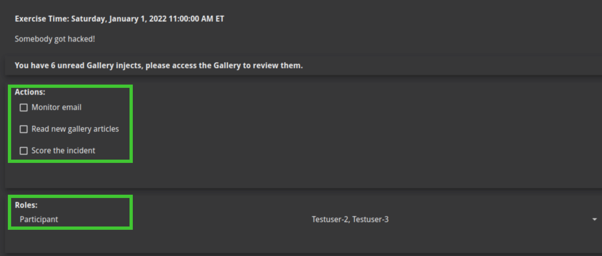
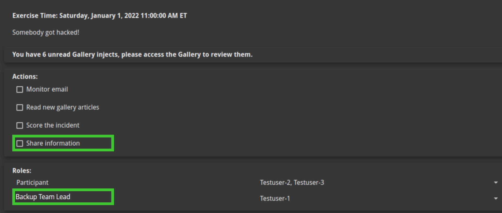

# CITE Dashboard

The dashboard shows exercise details like the date and time, incident summary, a suggested list of actions for participants to consider taking, and suggested participant roles.

##Actions to Consider and Roles

Participants who can submit scores on behalf of their team also can add suggested actions and participant roles to the CITE dashboard. The use of actions and roles will allow your team to customize their response by tracking tasks and roles during the exercise. These actions and roles remain internal to your team and will not be visible to other participants.

In figure below, notice that there is one action to consider and one role. 

Assuming that you have been granted the appropriate permissions by the exercise administrator, follow these steps to add an Action.

1. In the top-right corner, click the Administration gear icon.
2. Click Add Action and enter an Action Description.
3. Your team appears by default. You can only add a new action for your team.
4. Click Save.

When you return to the CITE Dashboard, your new action appears under Actions to consider. Actions are added per move.
Assuming that you have been granted the appropriate permissions by the exercise administrator, follow these steps to add a new Role.

1. In the top-right corner, click the Administration gear icon.
2. Select Roles, then click Add Role.
3. Enter a new Role Name. Your team appears by default. You can only add a new role to your team.
4. Click Save.

When you return to the CITE Dashboard, your new role appears under Roles, ready for a user (participant) to be assigned to it. Roles are added per incident.
The Figure highlights the newly created action and role.

