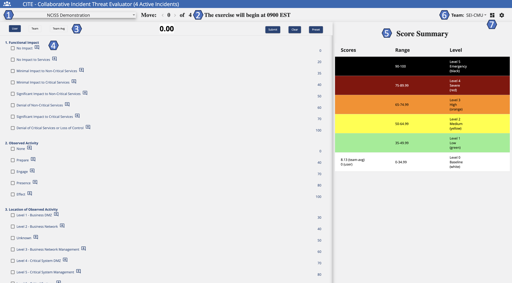
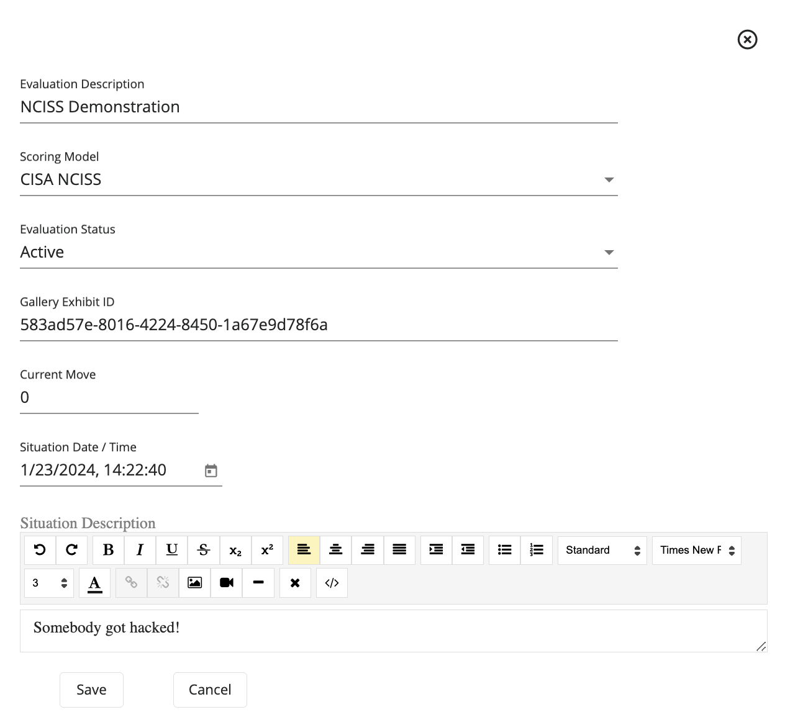
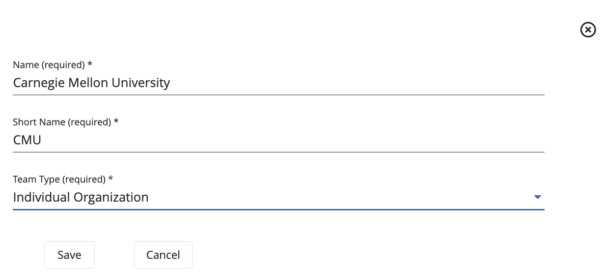
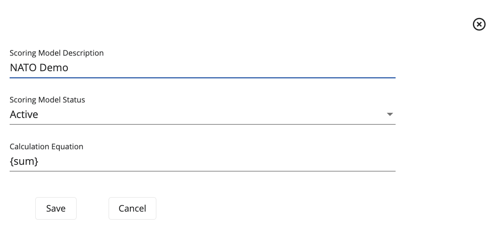
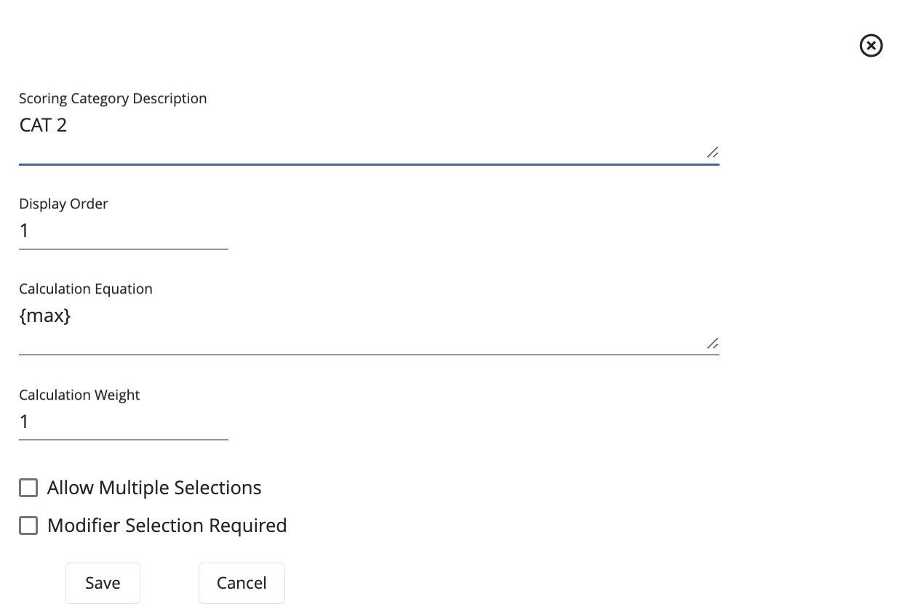

# **CITE**
*Evaluating Threats*

## Overview

### What is CITE?

[**CITE**](#glossary) is a web application created to integrate with the Crucible Framework and allows multiple participants from different organizations to evaluate, score, and comment on cyber incidents. CITE compares a user's score to their organization's score, group average scores, and the official exercise score. Scores are submitted for each [move](#glossary) as the exercise progresses and each of the historical scores can be recalled for reference at any time.

In the CITE User Interface, there are two major functional sections:

- [CITE Dashboard](#glossary): The dashboard shows exercise details like the date and time, incident summary, a suggested list of [actions](#glossary) for participants to consider taking, and suggested participant [roles](#glossary).
- [CITE Scoresheet](#glossary): The scoresheet compares participant scores to organization scores, group average scores, and the official score.

For installation, refer to these GitHub repositories.

- [CITE UI Repository](https://github.com/cmu-sei/CITE.Ui)

- [CITE API Repository](https://github.com/cmu-sei/CITE.Api)

### CITE Permissions
 
 In order to use CITE, a user must be assigned a scoring permission. 

 There are three levels of permissions in CITE that affect the way a team score is collaborated on and edited. 

 - [Basic](#glossary): Can only view the team score.
 - [Modify](#glossary): Can view and edit the team score.
 - [Submit](#glossary): Can view, edit, and submit the team score.

 Most users will have the modify-level permission; however, one or two users per team have submit-level permission, meaning that only one or two users per team can edit and/or submit on the team score.

 However, participants who can submit scores on behalf of their team can also add suggested actions and participant roles to the CITE Dashboard. 
 
 Refer to this section [Actions to Consider](#actions-to-consider) for more information.

## User Guide

### Moves

In CITE, a Move is a defined period of time during an exercise, in which a series of injects are distributed for users to discuss and assess the current incident severity.

When in Dashboard view, users will have two features to interact with moves:

- Displayed Move: Move that will be currently displayed on the screen. Here, users can see responses to previous moves and scores, but users will not be able to edit a response.

- Current Move: Move that is currently active. There are cases where the Displayed Move and the Current Move might be the same. Here, users are allowed to edit the category of the move.

### CITE Dashboard

The CITE Dashboard shows exercise details like the date and time, incident summary, a suggested list of actions for participants to consider taking, and suggested participant roles.

The following image will show some important hotspots about the CITE Dashboard. Reference the number on the hotspot to know more about this section.

#### Active Incident & Moves
*Hotspot 1:* 

The name of the active incident and the move number currently displayed.

#### Situation Date & Time
*Hotspot 2:*

The date and time of the situation displayed.

#### Situation Description
*Hotspot 3:*

Short description of the event. This section also allows for the use of HTML elements, useful when receiving MSEL information from Blueprint.

#### Unread Articles Link
*Hotspot 4:*

Direct link to Gallery Archive, which will show the user's unread articles.

#### Actions to Consider
*Hotspot 5:*

Users can see the different actions necessary to be executed during the exercise. These actions are for everyone on the team and "per move", meaning they change at each move of the exercise.

These are added to guide users on an appropriate course of action during an exercise. However, these actions are not connected to the scoresheet.

#### Roles
*Hotspot 6:* 

The roles are added so that each team member will have a clear path of their responsibilities during the exercise. For this, roles can be customized for each team and then the team members decide what role each user should be assigned to.

#### Score Summary
*Hotspot 7:*

Displays the various scores at the appropriate severity level for the disaplyed move. Here, scores are always visible.

#### Team Selection
*Hotspot 8:*

This feature enables a user who is part of a team, as well as an observer, to toggle back and forth between teams. When assigned an observer role, the user will be able to see how other teams progress during the exercise, as well as participate on their own team.

#### Dashboard & Scoresheet Toggle
*Hotspot 9:*

By using this icon, users can toggle between the CITE Dashboard and the CITE Scoresheet.

### CITE Scoresheet

The CITE Scoresheet compares participant scores to organization scores, group average scores, and the oficial score.

The following image will show some important hotspots about the CITE Scoresheet. Reference the number on the hotspot to know more about this section.

#### Event Name
*Hotspot 1:*

The name of the current event.

#### Displayed Move
*Hotspot 2:*

The move currently displayed on the screen. Clicking < displays previous moves. Clicking > displays the current move. Using Displayed Move, users can see responses to previous moves and scores but the user cannot edit a previous response.

#### Scoring Features
*Hotspot 3:*

- User: This is the participant's personal score for their reference only. The user score will also appear under the Score Summary range. 

- Team: Toggling the Team icon, displays how the team has scored this move so far. This is the score that the team collaborates on and submits for the current move. This score will be compared to the official score. The Team score appears under the Score Summary range.

- Team Avg: The average of all the users on the team. The Team Avg appears under the Score Summary Range for all moves except the current move.

- Group Avg: The average of all of the teams in the user's group. Group Avg appears under the Score Summary Range for all moves except for the current move.

- Official: The potential score; that is, how the incident should have been scored had it been a real-life scenario. Official score appears under the Score Summary Range for all moves except the current move.

- Submit: Submits the score indicating that the user is done scoring the current move. Click Yes or No. If the user clicks Yes, but changes their mind, click Reopen to edit the scoring.

- Clear: Clears any selections the user has checked but does not clear comments enterred. Selecting Clear returns to a score of 0.00.

- Preset: Sets the user's selections to the previous move score to use as a starting point for the current move.

#### Categories and Options
*Hotspot 4:*

Categories that are individually scored based upon the current move situation. For each category, select as many options as relevant. Selecting options assigns points to each category which are compiled to create the move score as defined by the [scoring model](#glossary).

**Add, Edit, and Delete a Comment**
When scoring a move, the user can attach a comment (or multiple comments) to a category.

- To add a comment, click . Enter the comment and click Save.
- To edit an existing comment, click . Make any changes, then click Save.
- To delete an existing comment, click . Click Yes to delete the comment.

When finished scoring the categories and adding comments, click Submit to submit the scores.

#### Score Summary
*Hotspot 5:*

Displays the various scores at the appropriate severity level for the displayed move so that the scores are always visible.

#### Team Selection
*Hotspot 6:*

This feature enables a user who is part of a team, as well as an observer, to toggle back and forth between teams. When assigned an observer role, the user will be able to see how other teams progress during the exercise, as well as participate on their own team.

#### Dashboard & Scoresheet Toggle
*Hotspot 7:*

By using this icon, users can toggle between the CITE Dashboard and the CITE Scoresheet.

## Administrator Guide

### Evaluations
The following image shows the Evaluations Administration Page. Here, administrators can add, edit, and delete [evaluations](#glossary).

**Add an Evaluation** 

Assuming that the user has been granted the appropriate permissions by the exercise administrator, follow these steps to add an Evaluation.

1. Under the Evaluation Administration View, click **+**. 
2. Add an **Evaluation Description** to keep track of what is going to happen in this exercise.
3. Select the **Scoring Model** to be used during the exercise.
4. To make the Evaluation available, select an **Evaluation Status** of **Active**.
5. Set the **Current Move** of the exercise.
6. Add a **Situation Date & Time** to set the time for the exercise.
7. Click **Save**.

If necessary, an Evaluation can be deleted by clicking on the **Trash Icon** next to the desired Evaluation.

In the same way, an Evaluation can be edited by clicking on the **Edit Icon** next to the desired Evaluation.

**Configure an Evaluation**

To configure an evaluation to be used for an exercise, administrators will need to add Moves and Teams to the evaluation. To do this, follow these steps.

*Moves*

1. Click on the **+** on the Moves section.
2. Add a **Move Number**.
3. Add a **Move Description**, which will explain what will be happening when the move is executed.
4. Add a **Situation Date & Time** of when the exercise is going to occur.
5. Add a **Situation Description** about the background information for the exercise.
6. Click **Save**.

If necessary, a Move can be deleted by clicking on the **Trash Icon** next to the desired Move.

In the same way, a Move can be edited by clicking on the **Edit Icon** next to the desired Move.

*Teams*

1. Click on the **+** on the Teams section.
2. Add a **Name** for the team.
3. Add a **Short Name** for the team, which could be the team's acronym.
4. Select the **Team Type**, which contains the following options: Individual Organization, Other, and Official Score Contributor. 
5. Click **Save**.

If necessary, a Team can be deleted by clicking on the **Trash Icon** next to the desired Team.

In the same way, a Team can be edited by clicking on the **Edit Icon** next to the desired Team.

*Observers*

To assign the [Observer Role](#glossary) to a user:

1. Under **Evaluation Users**, search for the desired user.
2. Once the user has been found, click on **Add**.

To remove the Observer Role from a user:

1. Under **Observers**, search for the desired user.
2. Once the user has been found, click on **Remove**.

### Scoring Models

The following image shows the [Scoring Models](#glossary) Administration Page. Here, administrators can add, edit, and delete scoring models.

**Add a Scoring Model**

Assuming that the user has been granted the appropriate permissions by the exercise administrator, follow these steps to add a Scoring Model.

1. Under the Scoring Model Administration View, click **+**.
2. Add a **Scoring Model Description** that will provide details for this model.
3. Select a **Scoring Model Status**, if desired to be used right away, select **Active**.
4. Add a **Calculation Equation** for the model.
5. Click **Save**.

When adding a Scoring Model, an administrator is required to add a defined equation to calculate the submission score from the category scores and can contain the following variables:

- **{average}:** The average value of the Scoring Categories.
- **{sum}:** The sum of the Scoring Categories.
- **{count}:** The count of the Scoring Categories.
- **{minPossible}:** The minimum possible value of the submission.
- **{maxPossible}:** The maximum possible value of the submission.

Aside from these variables, **>** can be used to set clipping values for the equation. 

- **Example:** 100 > equation > 20 will force the value of the submission to be between 100 and 20.

If necessary, a Scoring Model can be deleted by clicking on the **Trash Icon** next to the desired Scoring Model.

In the same way, a Scoring Model can be edited by clicking on the **Edit Icon** next to the desired Scoring Model.

#### Scoring Categories

To configure a Scoring Model to be used for an exercise, administrators will need to add [Scoring Categories](#glossary). 

Within a Scoring Model, an administrator can add one or more Scoring Categories.  To do this, follow these steps.

*Add Scoring Category*

1. Click on the **+** on the Scoring Categories section.
2. Add a **Scoring Category Description** to describe this category's functionality.
3. If necessary, provide a **Display Order** to organize the scoring categories.
4. Provide the **Calculation Equation** to be used. 
5. Provide the **Calculation Weight**.
6. If necessary, check the option **Allow Multiple Selections**.
7. If necessary, check the option **Modifier Selection Required**.
8. Click **Save**.

A Scoring Category may have zero or more [Modifiers](#glossary). If a Scoring Category has Modifiers, a Modifier selection can be required or optional. If no Modifier is selected when optional, a default value of 1.0 is used in the Scoring Category calculation. 

Additionally, a Scoring Category has an admin defined equation to calculate the submission score from the category scores and can contain the following variables:

- **{sum}:** The sum of the selected Scoring Option values.
- **{count}:** The count of the selected Scoring Option values.
- **{min}:** The minimum of the selected Scoring Option values.
- **{max}:** The maximum of the selected Scoring Option values.
- **{modifier}:** The selected modifier value, which defaults to 1.

Last but not least, a Scoring Category has a weight which will multiply the score obtained from the entered equation.

If necessary, a Scoring Category can be deleted by clicking on the **Trash Icon** next to the desired Scoring Category.

In the same way, a Scoring Category can be edited by clicking on the **Edit Icon** next to the desired Scoring Category.

#### Scoring Options

Within a Scoring Category, an administrator can add one or more [Scoring Options](#glossary). To do this, follow these steps.

*Add Scoring Options*

1. Click on the **+** on the Scoring Options section.
2. Add a **Scoring Option Description** to describe this option's functionality.
3. If desired, provide a **Display Order** to organize the Scoring Options.
4. Provide the **Value** for the Scoring Option.
5. If desired, check the option **Is A Modifier**.
6. Click **Save**.

If necessary, a Scoring Option can be deleted by clicking on the **Trash Icon** next to the desired Scoring Option.

In the same way, a Scoring Option can be edited by clicking on the **Edit Icon** next to the desired Scoring Option.

### Actions

The following image shows the Actions Administration Page. Here, administrators can add, edit, and delete actions.

However, users who can submit scores on behalf of their team can also add suggested actions to the CITE dashboard. The use of actions will allow the team members to customize their response by tracking tasks during the exercise. These actions remain internal to the team and will not be visible to other participants.

**Add an Action**

Assuming that the user has been granted the appropriate permissions by the exercise administrator, follow these steps to add an Action.

1. Under the Actions Administration View, click on the **Move** dropdown and select the desired move.
2. Click on the **Team** dropdown and select the desired team.
3. Click on the **+** icon to add an Action.
4. Add an **Action Description** that will provide additional information.
5. Click **Save**.

If necessary, an Action can be deleted by clicking on the **Trash Icon** next to the desired Action.

In the same way, an Action can be edited by clicking on the **Edit Icon** next to the desired Action.

### Roles

The following image shows the Roles Administration Page. Here, administrators can add, edit, and delete roles.

However, users who can submit scores on behalf of their team can also add participant roles to the CITE dashboard. The use of roles will allow the team members to customize their response by tracking their responsibilities during an exercise. These roles remain internal to the team and will not be visible to other participants.

**Add a Role**

Assuming that the user has been granted the appropriate permissions by the exercise administrator, follow these steps to add a Role.

1. Under the Roles Administration View, click on the **Team** dropdown and select the desired team.
2. Click on the **+** icon to add a Role.
3. Add a **Role Name** that will provide a description for the Role.
4. Click **Save**.

If necessary, a Role can be deleted by clicking on the **Trash Icon** next to the desired Role.

In the same way, a Role can be edited by clicking on the **Edit Icon** next to the desired Role.

### Submissions

The following image shows the Submissions Administration Page. Here, administrators can keep track of all the score [submissions](#glossary) provided by the different teams during an exercise. This will allow administrators to compare their scores with the official score, as well as keep track of which teams are on a good track and which are not.

Additional functionalities include copying the entire score, as well as deleting a score submitted by a team.

### Team Types

The following image shoes the [Team Types](#glossary) Administration Page. Here, administrators can create different types of teams to be used during an exercise. This will allow administrators to classify the different teams on the platform based on common characteristics and/or organizations.

**Add a Team Type**

Assuming that the user has been granted the appropriate permissions by the exercise administrator, follow these steps to add a Team Type.

1. Under the Team Type Administration View, click on the **+** icon. 
2. Add a **Team Type Name**.
3. If applicable, check the box for **Official Score Contributor**.
4. If applicable, check the box for **Show TeamTypeAverage**.
5. To save these selections, click on the user with a plus sign.

If necessary, a Team Type can be deleted by clicking on the **Trash Icon** next to the desired Team Type.

In the same way, a Team Type can be edited by clicking on the **Edit Icon** next to the desired Team Type.

### Users

The following image shows the Users Administration Page. Here, administrators can add and delete users. Additionally, administrators will be able to assign the necessary permissions to each user. 

The available permissions are: 

- System Admin: Permission that will grant a user all administration privileges on the CITE application.
- Content Developer: Will be provided the permission to manage other CITE Admin pages except the Users Admin page and their permissions.
- Can Submit: The user is allowed to submit a score for the different moves on an exercise.
- Can Modify: The user is allowed to modify a score for previous moves on an exercise.
- Can Increment Move: The user is given the permission to increment the current move during an exercise.

**Add a User**

Assuming that the user has been granted the appropriate permissions by the exercise administrator, follow these steps to add a User.

1. Under the Users Administration View, click **+**.
2. Add a **User ID** that will be unique for the user.
3. Add a **User Name** that will identify the user to be added.
4. Click **Save** represented by a user with a + sign.
5. After adding the user to CITE, select the desired permissions to be assigned by clicking on the checkboxes next to the user.

If necessary, a User can be deleted by clicking on the **Trash Icon** next to the desired User.

In the same way, a User can be edited by clicking on the **Edit Icon** next to the desired User.

## Glossary

The following glossary provides a brief definition of key terms and concepts as they are used in the context of the CITE application. 

1. **Actions**: Series of steps to guide users on an appropriate course of action during an exercise. 
2. **Basic-Level Permission**: Can only view the team score.
3. **CITE**: Web application that allows multiple participants from different organizations to evaluate, score, and comment on cyber incidents.
4. **CITE Dashboard**: Shows exercise details.
5. **CITE Scoresheet**: Compares participant scores to organizations scores, group average scores, and the official score.
6. **Evaluation**: Defines the scoring model used, as well as the moves and teams who will be participating in the exercise.
7. **Modifiers**: If enabled, this value is used in calculating the Scoring Category score. Depending on how the equation is written, the modifier can be used to add, subtract, multiply and/or divide within the equation.
8. **Modify-Level Permission**: Can view and edit the team score.
9. **Moves**: A defined period of time during an exercise, in which a series of injects are distributed for users to discuss and assess the current incident severity.
10. **Observer Role**: Individuals who are tasked with impartially and objectively monitoring teams during an exercise.
11. **Roles**: Provide a set of responsibilities assigned to a user during an exercise.
12. **Scoring Category**: Has a defined equation used to calculate the submission score from the categroy scores. Additionally, the category has a weight which will multiply the score obtained.
13. **Scoring Model**: Tool used to assign a comparative value, takes into account the totality of the data points, their relative weights, and the scores for each of their range values.
14. **Scoring Options**: Has a preset value which will be used to calculate the submission score for the Scoring Category it is part of.
15. **Submission**: Act of providing a score or response for an evaluation in relation to an incident presented during the current move.
16. **Submit-Level Permission**: Can view, edit, and submit the team score.
17. **Team Types**: Types of teams available to be assigned to different teams with similar characteristics during an exercise.