# **CITE**
*Collaborative Incident Threat Evaluator*

## Overview

### What is CITE?

**CITE** is a web application created to integrate with the Crucible Framework that allows multiple participants from different organizations to evaluate, score, and comment on cyber incidents within a given sector. CITE facilitates analysis and discussion among participants that will test and improve the design and execution of incident response plans. 

Two major functional sections make up CITE User Interface:

- *CITE Dashboard*:  The dashboard shows exercise details like the date and time, incident summary, a suggested list of actions for participants to consider taking, and suggested participant roles. The exercise time and scenario description will update each time an inject is delivered. The Dashboard facilitates threat analysis discussions, improves sector knowledge of the severity model and encourages and increases the level of user participation.

- *CITE Scoresheet*:  The scoresheet enables the anonymous sharing of scores across organizations, as well as the comparison of a user's score to their organization's score, group average scores, and the official exercise score. Scores are submitted for each move as the exercise progresses and each of the historical scores can be recalled for reference at any time.

For installation, refer to these GitHub repositories.

- [CITE UI Repository](https://github.com/cmu-sei/CITE.Ui)

- [CITE API Repository](https://github.com/cmu-sei/CITE.Api)

### CITE Permissions
 
 In order to use CITE, a user must be assigned a scoring permission via the *Users Administration* page. 

 There are three levels of permissions in CITE that affect the way a team score is collaborated on and edited. 

 - *Basic*: Can only view the team score.
 - *Modify*: Can view and edit the team score.
 - *Submit*: Can view, edit, and submit the team score.

 Most users will have the modify-level permission; however, one or two users per team have submit-level permission, meaning that only one or two users per team can edit and/or submit on the team score.

 However, participants who can submit scores on behalf of their team can also add suggested actions and participant roles to the CITE Dashboard. 
 
 Refer to the *Actions to Consider* and *Roles* sections for more information.

## Administrator Guide

### Evaluations
The following image shows the *Evaluations Administration* page. Here, administrators can add, edit, and delete evaluations.

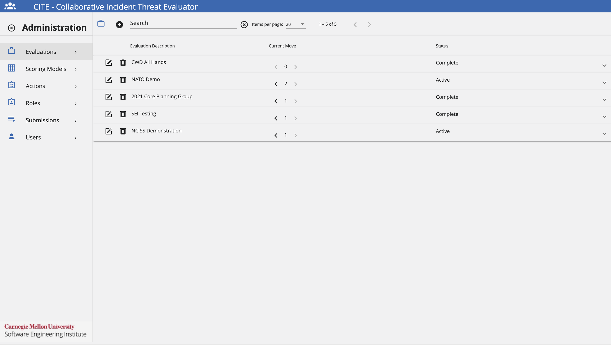

**Add an Evaluation** 

Assuming that the user has been granted the appropriate permissions by the exercise administrator, the following steps will enable a user to add an evaluation:

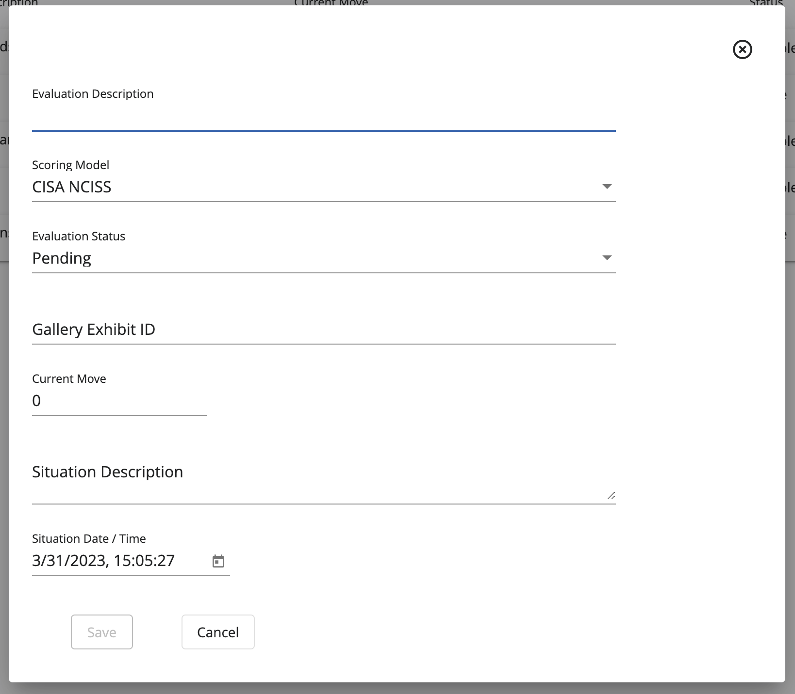

1. Under the *Evaluation Administration* view, click **+**. 
2. Add an **Evaluation Description** to keep track of what is going to happen in this exercise.
3. Select the **Scoring Model** to be used during the exercise.
4. To make the Evaluation available, select an **Evaluation Status** of **Active**.
5. Add a **Situation Date & Time** to set a start time for the exercise.
6. Click **Save**.

If necessary, an Evaluation can be deleted by clicking on the **Trash Icon** next to the desired Evaluation.

In the same way, an Evaluation can be edited by clicking on the **Edit Icon** next to the desired Evaluation.

**Configue an Evaluation**

To configure an evaluation to be used for an exercise, administrators will need to add **Moves** and **Teams** to the evaluation via the following steps.

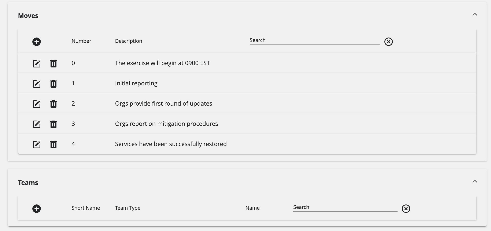

*Moves*

1. Click on the **+** on the *Moves* section.
2. Add a **Move Number**.
3. Add a **Move Description**, which will explain what will be happening when the move is executed.
4. Add a **Situation Description** about the background information for the exercise.
5. Add a **Situation Date & Time** of when the exercise is going to occur.
6. Click **Save**.

If necessary, a Move can be deleted by clicking on the **Trash Icon** next to the desired Move.

In the same way, a Move can be edited by clicking on the **Edit Icon** next to the desired Move.

*Teams*

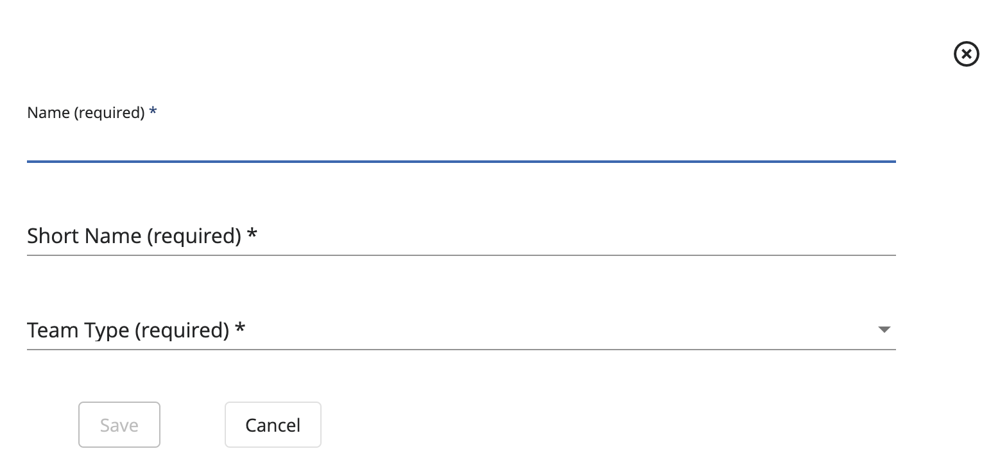

1. Click on the **+** on the *Teams* section.
2. Add a **Name** for the team.
3. Add a **Short Name** for the team, which could be the team's acronym.
4. Select the **Team Type**, which contains the following options: *Individual Organization*, *Other*, and *Official Score Contributor*. 
5. Click **Save**.

If necessary, a Team can be deleted by clicking on the **Trash Icon** next to the desired Team.

In the same way, a Team can be edited by clicking on the **Edit Icon** next to the desired Team.

### Scoring Models

The following image shows the *Scoring Models Administration* page. Here, administrators can add, edit, and delete scoring models.

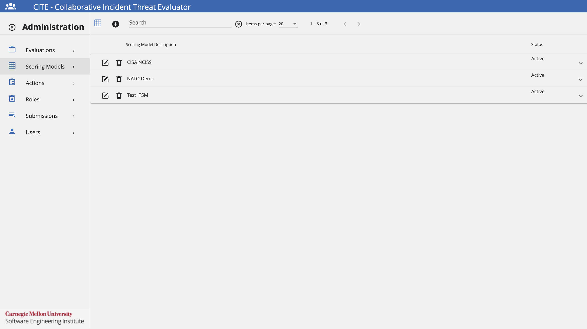

**Add a Scoring Model**

Assuming that the user has been granted the appropriate permissions by the exercise administrator, follow these steps to add a Scoring Model.

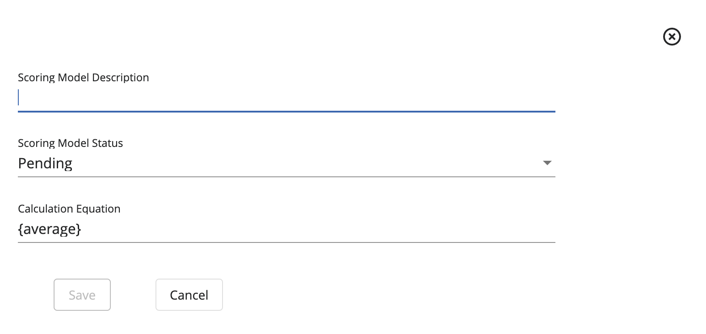

1. Under the *Scoring Model Administration* view, click **+**.
2. Add a **Scoring Model Description** that will provide details for this model.
3. Select a **Scoring Model Status**, if desired to be used right away, select **Active**.
4. Add a **Calculation Equation** for the model.
5. Click **Save**.

If necessary, a Scoring Model can be deleted by clicking on the **Trash Icon** next to the desired Scoring Model.

In the same way, a Scoring Model can be edited by clicking on the **Edit Icon** next to the desired Scoring Model.

**Configure a Scoring Model**

To configure a scoring model to be used for an exercise, administrators will need to add Scoring Categories to the scoring model. To do this, follow these steps.

*Scoring Categories*

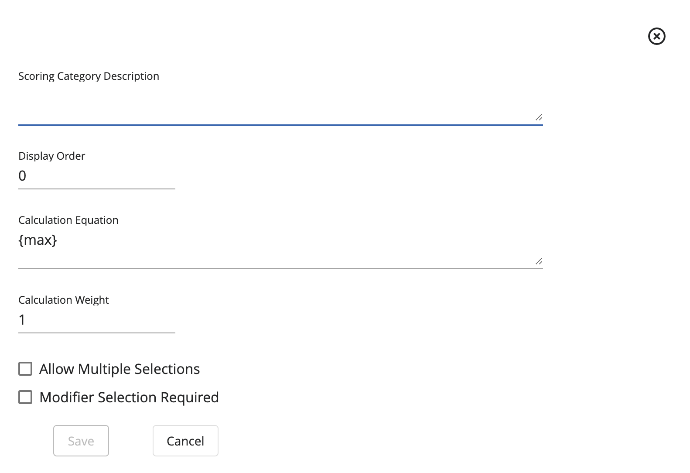

1. Click on the **+** on the *Scoring Categories* section.
2. Add a **Scoring Category Description** to describe this category's functionality.
3. If necessary, provide a **Display Order** to organize the scoring categories.
4. Provide the **Calculation Equation** to be used. 
5. Provide the **Calculation Weight**.
6. If necessary, check the option **Allow Multiple Selections**.
7. If necessary, check the option **Modifier Selection Required**.
8. Click **Save**.

If necessary, a Scoring Category can be deleted by clicking on the **Trash Icon** next to the desired Scoring Category.

In the same way, a Scoring Category can be edited by clicking on the **Edit Icon** next to the desired Scoring Category.

### Actions

The following image shows the *Actions Administration* page. Here,administrators can add, edit, and delete actions.

However, users who can submit scores on behalf of their team can also add suggested actions to the CITE dashboard. The use of actions will allow the team members to customize their response by tracking tasks during the exercise. These actions remain internal to the team and will not be visible to other participants.

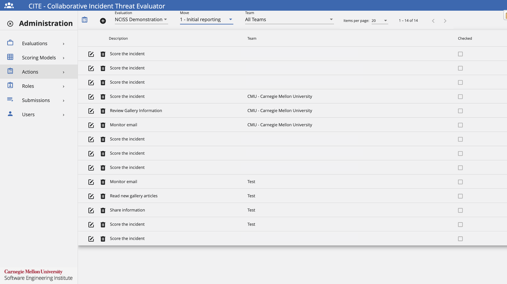

**Add an Action**

Assuming that the user has been granted the appropriate permissions by the exercise administrator, follow these steps to add an Action.

1. Under the *Actions Administration* view, click **+**.
2. Add an **Action Description** that will provide information for the action.
3. Select the desired **Team** where the action will be added.
4. Click **Save**.

If necessary, an Action can be deleted by clicking on the **Trash Icon** next to the desired Action.

In the same way, an Action can be edited by clicking on the **Edit Icon** next to the desired Action.

### Roles

The following image shows the *Roles Administration* page. Here, administrators can add, edit, and delete roles.

However, users who can submit scores on behalf of their team can also add participant roles to the CITE dashboard. The use of roles will allow the team members to customize their response by tracking their responsibility during the exercise. These roles remain internal to the team and will not be visible to other participants.

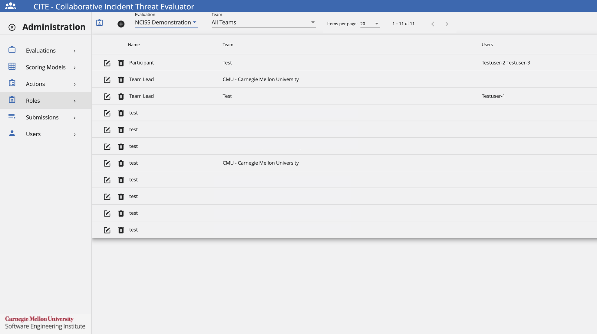

**Add a Role**

Assuming that the user has been granted the appropriate permissions by the exercise administrator, follow these steps to add a Role.

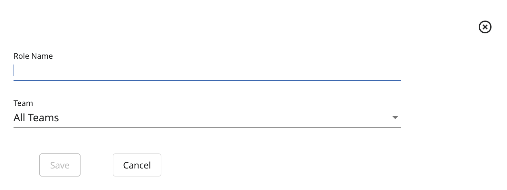

1. Under the *Roles Administration* view, click **+**.
2. Add an **Role Name** that will provide a description for the role..
3. Select the desired **Team** where the role will be added.
4. Click **Save**.

If necessary, a Role can be deleted by clicking on the **Trash Icon** next to the desired Role.

In the same way, a Role can be edited by clicking on the **Edit Icon** next to the desired Role.

### Submissions

The following image shows the *Roles Administration* page. Here, administrators can keep track of all the score submissions provided by the different teams during an exercise. This will allow administrators to compare their scores with the official score, as well as keep track of which teams are on a good track and which are not.

Additional functionalities include copying the entire score, as well as deleting a score submitted by a team.

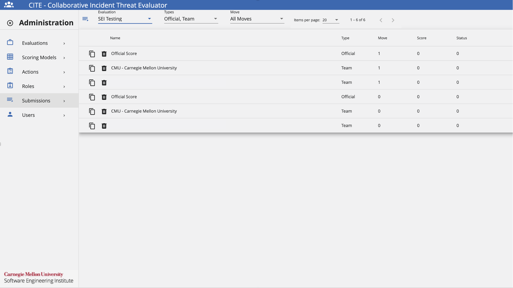

### Users

The following image shows the *Users Administration* page. Here, administrators can add and delete users. Additionally, administrators will be able to assign the necessary permissions to each user. 

The available permissions are: 

- *System Admin*: Permission that will grant a user all administration privileges on the CITE application.
- *Content Developer*: Will be provided the permission to manage other CITE Admin pages except the Users Admin page and their permissions.
- *Can Submit*: The user is allowed to submit a score for the different moves on an exercise.
- *Can Modify*: The user is allowed to modify a score for previous moves on an exercise.
- *Can Increment Move*: The user is given the permission to increment the current move during an exercise.

**Add a User**

Assuming that the user has been granted the appropriate permissions by the exercise administrator, follow these steps to add a User.

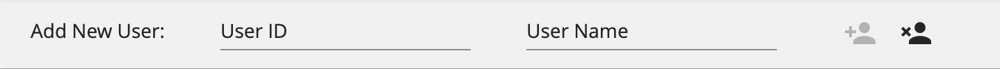

1. Under the *Users Administration* view, click **+**.
2. Add a **User ID** that will be unique for the user.
3. Add a **User Name** that will identify the user to be added.
4. Click **Save** represented by a user with a + sign.
5. After adding the user to CITE, select the desired permissions to be assigned by clicking on the checkboxes next to the user.

If necessary, a User can be deleted by clicking on the **Trash Icon** next to the desired User.

In the same way, a User can be edited by clicking on the **Edit Icon** next to the desired User.

## User Guide

### Moves

In CITE, a *Move* is a defined period of time during an exercise, in which a series of injects are distributed for users to discuss and assess the current incident severity.

When in *Dashboard* view, users will have two features to interact with moves:

- *Displayed Move*: Move that will be currently dispalyed on the screen. Here, users can see responses to previous moves and scores, but users will not be able to edit a response.

- *Current Move*: Move that is currently active. There are cases where the Displayed Move and the Current Move might be the same. Here, users are allowed to edit the category of the move.

### CITE Dashboard

The *CITE Dashboard* shows exercise details like the scenario date and time, along with a brief summary of the incident, a suggested list of actions, and a list of participant roles which map to assigned responsibilities.

The following image will show some important hotspots about the CITE Dashboard. Reference the number on the hotspot to know more about this section.

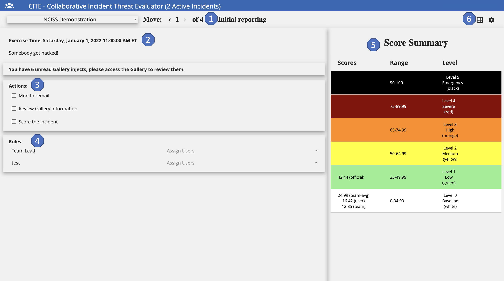

#### Active Incident & Moves
*Hotspot 1:* 

The name of the active incident and the move number currently displayed.

#### Situation Description, Date & Time
*Hotspot 2:*

The date and time of the situation displayed and a short description of the event. This section updates each time an inject is delivered.

#### Actions to Consider
*Hotspot 3:*

Users can see the different actions necessary to be executed during the exercise. These action are for everyone on the team and "per move", meaning they change at each move of the exercise.

These are added to guide users on an appropriate course of action during an exercise. However, these actions are not connected to the scoresheet.

#### Roles
*Hotspot 4:* 

The roles are added so that each team member will have a clear path of their responsibilities during the exercise. For this, roles can be customized for each team and then the team members are going to decide what role each user is assigned.

#### Score Summary
*Hotspot 5:*

Displays the various scores at the appropriate severity level for the displayed move. Here, scores are always visible.

#### Dashboard & Scoresheet Toggle
*Hotspot 6:*

By using this icon, users can toggle between the CITE Dashboard and the CITE Scoresheet.

### CITE Scoresheet

The *CITE Scoresheet* compares participant scores to organization scores, group average scores, and the official score. Various scoring systems such as the National Cyber Incident Scoring System (NCISS), the Common Vulnerability Scoring System (CVSS) or any other sector-specific scoring system can be configured. Users with submit or modify permissions can enter Personal, Team, and Group scores. Team scores are entered collaboratively in real-time and averages are displayed for teams and groups. 

The following image will show some important hotspots about the CITE Scoresheet. Reference the number on the hotspot to know more about this section.

#### Event Name
*Hotspot 1:*

The Event Name is the name of the current event.

#### Displayed Move
*Hotspot 2:*

The move currently displayed on the screen. Clicking < displays previous moves. Clicking > displays the current move. Using Displayed Moves, users can see responses to previous moves and scores but the user cannot edit a previous response.

#### Scoring Features
*Hotspot 3:*

- *User*: This is the participant's personal score for their reference only. The user score will also appear under the Score Summary range. 

- *Team*: Toggling the Team icon, displays how the team has scored this move so far. This is the score that the team collaborates on and submits for the current move. This score will be compared to the official score. The Team score appears under the Score Summary range.

- *Team Avg*: The average of all the users on the team. The Team Avg appears under the Score Summary Range for all moves except the current move.

- *Group Avg*: The average of all of the teams in the user's group. Group Avg appears under the Score Summary Range for all moves except for the current move.

- *Official*: The potential score; that is, how the incident should have been scored had it been a real-life scenario. Official score appears under the Score Summary Range for all moves except the current move.

- *Submit*: Submits the score indicating that the user is done scoring the current move. Click Yes or No. If the user clicks Yes, but changes their mind, click Reopen to edit the scoring.

- *Clear*: Clears any selections the user has checked but does not clear comments entered. Selecting Clear returns to a score of 0.00.

- *Preset*: Sets the user's selections to the previous move score to use as a starting point for the current move.

#### Score Summary
*Hotspot 4:*

Displays the various scores at the appropriate severity level for the displayed move so that the scores are always visible.

#### Categories and Options
*Hotspot 5:*

Categories that are individually scored based upon the current move situation. For each category, select as many options as relevant. Selecting options assigns points to each category which are compiled to create the move score as defined by the scoring model.

**Add, Edit, and Delete a Comment**
When scoring a move, the user can attach a comment (or multiple comments) to a category.

- To add a comment, click . Enter the comment and click Save.
- To edit an existing comment, click . Make any changes, then click Save.
- To delete an existing comment, click . Click Yes to delete the comment.

When finished scoring the categories and adding comments, click *Submit* to submit the scores.
