#  **CITE:** Evaluating Threats

## Overview

[**CITE**](#glossary) integrates with the Crucible Framework and allows multiple participants from different organizations to evaluate, score, and comment on cyber incidents. CITE compares a user's score to their organization's score, group average scores, and the official exercise score. Participants submit a score for each [move](#glossary) as the exercise progresses, and they can recall each historical score for reference at any time.

In the CITE User Interface, there are four functional sections:

- [CITE Dashboard](#glossary): The dashboard shows exercise details like date and time, incident summary, a suggested list of [actions](#glossary) for participants to consider taking, and suggested [duties](#glossary).
- [CITE Scoresheet](#glossary): The scoresheet compares participant scores to organization scores, group average scores, and the official score.
- [Submission Review](#submission-review): A printable collection of one user's or one team's responses.
- [Aggregate Report](#aggregate-report): A printable collection of every team's submissions.

For installation, refer to these GitHub repositories.

- [CITE UI Repository](https://github.com/cmu-sei/CITE.Ui)
- [CITE API Repository](https://github.com/cmu-sei/CITE.Api)

## Configuration

Configure and deploy CITE using the [CITE Helm Chart](https://github.com/cmu-sei/helm-charts/tree/main/charts/cite). The Helm Chart README provides detailed instructions for all deployment settings.

### Classification Banner

CITE UI supports an optional, customizable classification banner that displays persistently at the top of the application. The banner can show classification labels (such as "UNCLASSIFIED" or "SECRET"), maintenance messages, or any other persistent notification. Configure the banner through `HeaderBarSettings` in the Helm chart. See the [Classification Banner](https://github.com/cmu-sei/helm-charts/tree/main/charts/cite#classification-banner) section of the CITE Helm Chart README for configuration details.

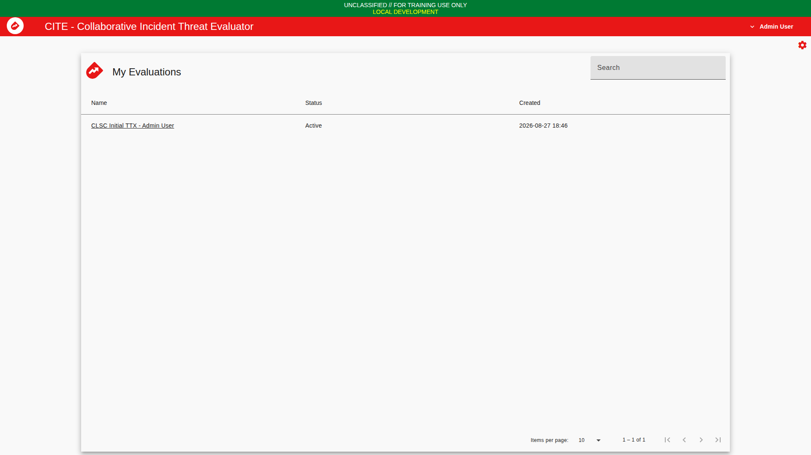

## Permissions and Roles

CITE controls access through roles. Each role bundles a set of permissions, and an administrator assigns roles at four scopes: system, evaluation, scoring model, and team.

### Team Roles

A user's team role shapes how they collaborate on and edit a score.

| Role                     | Permissions                                          | Description                             |
| ------------------------ | ---------------------------------------------------- | --------------------------------------- |
| [Member](#glossary)      | ViewTeam                                             | View the team score.                    |
| [Contributor](#glossary) | ViewTeam, EditTeamScore                              | View and edit the team score.           |
| [Submitter](#glossary)   | ViewTeam, EditTeamScore, SubmitTeamScore             | View, edit, and submit the team score.  |
| [Owner](#glossary)       | ViewTeam, EditTeamScore, SubmitTeamScore, ManageTeam | All of the above, plus manage the team. |

Three further team permissions govern access to the official score: `ViewPastOfficialScore`, `ViewCurrentOfficialScore`, and `EditOfficialScore`.

Most users hold the Contributor role; however, one or two users per team hold the Submitter role, enabling them to edit and submit the team score.

Additionally, participants who can submit scores on behalf of their team can also add suggested actions and [duties](#glossary) to the CITE Dashboard.

Refer to the [Actions to Consider](#actions-to-consider) section for more information.

### System Roles

System roles grant application-wide privileges. CITE ships three, and an administrator can add more.

| Role              | Description                                                                                                            |
| ----------------- | ---------------------------------------------------------------------------------------------------------------------- |
| Administrator     | Grants all permissions. This role is immutable.                                                                        |
| Content Developer | Create, view, edit, and manage scoring models and evaluations; execute and observe evaluations; view roles and groups. |
| Observer          | View-only access to scoring models, evaluations, users, roles, groups, and team types.                                 |

The full set of system permissions is `CreateScoringModels`, `ViewScoringModels`, `EditScoringModels`, `ManageScoringModels`, `CreateEvaluations`, `ViewEvaluations`, `EditEvaluations`, `ManageEvaluations`, `ExecuteEvaluations`, `ObserveEvaluations`, `ViewUsers`, `ManageUsers`, `ViewRoles`, `ManageRoles`, `ViewGroups`, `ManageGroups`, `ViewTeamTypes`, and `ManageTeamTypes`.

### Evaluation Roles

Evaluation roles scope a user to a single evaluation.

| Role        | Permissions                          |
| ----------- | ------------------------------------ |
| Owner       | All evaluation permissions           |
| Editor      | ViewEvaluation, EditEvaluation       |
| Facilitator | ObserveEvaluation, ExecuteEvaluation |
| Advancer    | ExecuteEvaluation                    |
| Observer    | ObserveEvaluation                    |
| Viewer      | ViewEvaluation                       |
| Member      | ParticipateInEvaluation              |

### Scoring Model Roles

Scoring model roles scope a user to a single scoring model and carry `ViewScoringModel`, `EditScoringModel`, and `ManageScoringModel`.

## Administrator Guide

CITE administrators use the Administration View to manage users, roles, and groups, and to configure evaluations, scoring models, scoring categories, actions, duties, and team types.

### Administration View

Across the Crucible exercise applications, the **Administration View** is where privileged users configure the platform and control access. It includes user and team management, role and permission assignment, and setup and maintenance of app-specific templates and content. The Administration View is where admins prepare and manage the environment so events run smoothly for participants.

Accessing the Administration View is the same in all Crucible exercise applications: expand the dropdown next to your username in the top-right corner and select **Administration**.

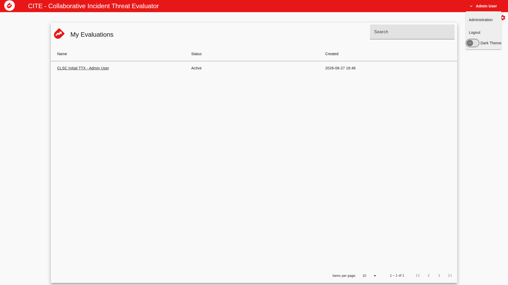

The Administration View sidebar contains seven sections: **Evaluations**, **Scoring Models**, **Submissions**, **Team Types**, **Users**, **Roles**, and **Groups**.

Moves, teams, memberships, actions, and duties belong to one evaluation rather than to the whole application, so they have no sidebar entry. Reach them by selecting **Evaluations**, clicking the evaluation's **Description** to expand the row, then expanding the section you want. Scoring categories and scoring options work the same way inside **Scoring Models**.

#### Evaluations

The following image shows the Evaluations Administration Page. Here, administrators can add, edit, upload, download, copy, and delete [evaluations](#glossary).

The list shows Description, Current Move, Status, Created By, and Created. Filter it with the **Search** box and the **Statuses** dropdown. The dropdown offers `Pending`, `Active`, `Cancelled`, `Complete`, and `Archived`, and pre-selects `Pending`, `Active`, and `Complete`. The **Current Move** cell carries **Decrement Move** and **Increment Move** controls, so an administrator can move an evaluation forward or back without opening it.

Row action button names vary by list. Evaluations use **Edit Evaluation**, **Copy \<name\>**, **Download \<name\>**, and **Delete Evaluation**. Scoring models name every action after the row, such as **Edit \<name\>**. Upload lives at the list level, as **Upload Evaluation** and **Upload Scoring Model**.

##### Add an Evaluation

If the exercise administrator grants the appropriate permissions, follow these steps to add an Evaluation.

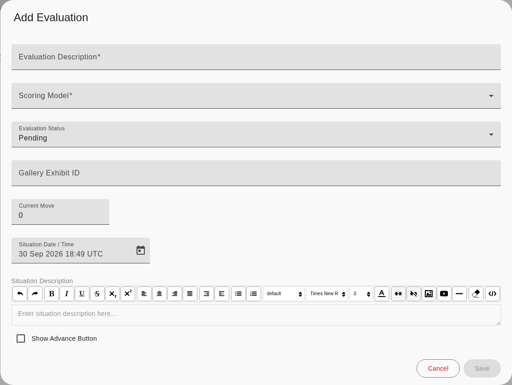

1. Under the Evaluation Administration View, click **Add Evaluation**.
2. Fill the fields as necessary following the Data Format Table specifications.

##### Data Format Table

| Field                      | Data Type     | Description                                                           | Example                                                    |
| -------------------------- | ------------- | --------------------------------------------------------------------- | ---------------------------------------------------------- |
| **Evaluation Description** | String        | Details, characteristics and information of the evaluation            | `Project Lagoon TTX`                                       |
| **Scoring Model**          | Dropdown Text | Scoring model to use in the evaluation                                | `CISA NCISS`                                               |
| **Evaluation Status**      | Dropdown Text | Status of the evaluation after configuration                          | `Active`                                                   |
| **Gallery Exhibit ID**     | GUID          | ID of the Gallery exhibit, if using Gallery during an exercise        | `4bbe40ca-5d29-40a4-a05c-6e16587c38d2`                     |
| **Current Move**           | Integer       | Current move of the evaluation                                        | `0`                                                        |
| **Situation Date / Time**  | Date          | Evaluation situation date                                             | `11/12/2025`                                               |
| **Situation Description**  | Rich Text     | Additional details, characteristics and information of the evaluation | `Regional partners are tracking a coordinated campaign...` |
| **Show Advance Button**    | Boolean       | Show the Advance Move button on the CITE Dashboard                    | `False`                                                    |

To save these settings, click **Save**.

##### Edit an Evaluation

To edit an evaluation, follow these steps:

1. In the Administration View, select **Evaluations**.
2. Find the evaluation and click **Edit Evaluation** next to it. The system opens the same edit component used when creating a new evaluation.
3. After making all necessary edits, click **Save**.

##### Delete an Evaluation

To delete an evaluation, follow these steps:

1. In the Administration View, select **Evaluations**.
2. Find the evaluation and click **Delete Evaluation** next to it.

##### Upload an Evaluation

To upload an evaluation, follow these steps:

1. In the Administration View, select **Evaluations**.
2. Click **Upload Evaluation**.
3. Select the evaluation JSON file to upload.

##### Download an Evaluation

To download an evaluation, follow these steps:

1. In the Administration View, select **Evaluations**.
2. Find the evaluation and click **Download \<name\>** next to it.
3. Look for the JSON file in your Downloads folder.

##### Copy an Evaluation

To copy an evaluation, follow these steps:

1. In the Administration View, select **Evaluations**.
2. Find the evaluation and click **Copy \<name\>** next to it.
3. Look for the evaluation name with the user's name.

##### Configure an Evaluation

To configure an evaluation for an exercise, click the evaluation's **Description** in the Evaluations list. The evaluation expands in place to reveal five sections:

- **Moves:** the exercise periods and their situation descriptions.
- **Teams:** the teams that participate, and the team type of each.
- **Actions:** suggested tasks, scoped to a move and a team.
- **Duties:** named responsibilities assigned to team members.
- **Memberships:** the users attached to the evaluation and the role each one holds.

Click a section heading to expand it.

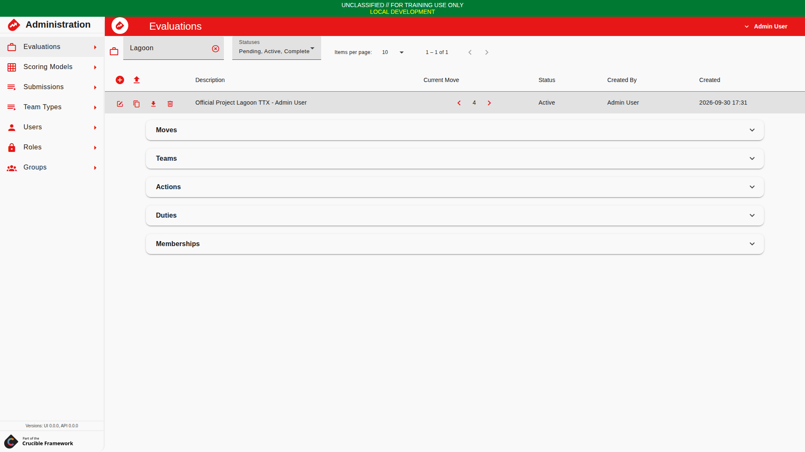

#### Moves

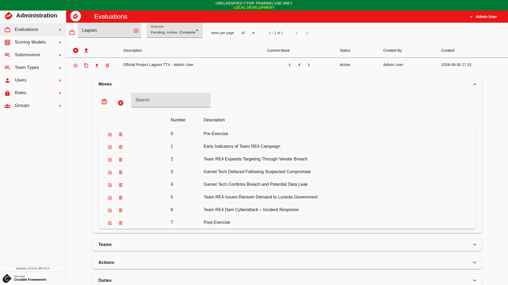

1. Expand the **Moves** section and click **Add Move**.
2. Fill the fields as necessary following the Data Format Table specifications.

##### Data Format Table

| Field                     | Data Type | Description                                                     | Example                                   |
| ------------------------- | --------- | --------------------------------------------------------------- | ----------------------------------------- |
| **Move Number**           | Integer   | Move number to add                                              | `1`                                       |
| **Move Description**      | String    | Details, characteristics and information of the move            | `Early Indicators of a Regional Campaign` |
| **Situation Date / Time** | Date      | Situation date for the move                                     | `11/12/2025`                              |
| **Situation Description** | Rich Text | Additional details, characteristics and information of the move | `The objectives of the exercise are...`   |

To save these settings, click **Save**.

##### Edit a Move

To edit a move, follow these steps:

1. In the Administration View, select **Evaluations**.
2. Click the evaluation's **Description**, then expand **Moves**.
3. Find the move and click **Edit Move** next to it. The system opens the same edit component used when creating a new move.
4. After making all necessary edits, click **Save**.

##### Delete a Move

To delete a move, follow these steps:

1. In the Administration View, select **Evaluations**.
2. Click the evaluation's **Description**, then expand **Moves**.
3. Find the move and click **Delete Move** next to it.

#### Teams

Teams are the groups that score the evaluation. The list shows Short Name, Name, and Team Type, and each team expands to reveal its own memberships.

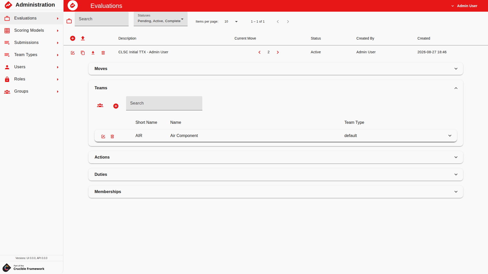

1. Expand the **Teams** section and click **Add Team**.
2. Fill the fields as necessary following the Data Format Table specifications.

##### Data Format Table

| Field               | Data Type     | Description                                                    | Example         |
| ------------------- | ------------- | -------------------------------------------------------------- | --------------- |
| **Name**            | String        | Name for the team                                              | `Singapore`     |
| **Short Name**      | String        | Short name for the team, such as an acronym                    | `SGP`           |
| **Team Type**       | Dropdown Text | Select the type that applies to the team                       | `National CERT` |
| **Hide Scoresheet** | Boolean       | Select whether to hide CITE Scoresheet from that specific team | `False`         |

To save these settings, click **Save**.

##### Edit a Team

To edit a team, follow these steps:

1. In the Administration View, select **Evaluations**.
2. Click the evaluation's **Description**, then expand **Teams**.
3. Find the team and click **Edit \<name\>** next to it. The system opens the same edit component used when creating a new team.
4. After making all necessary edits, click **Save**.

##### Delete a Team

To delete a team, follow these steps:

1. In the Administration View, select **Evaluations**.
2. Click the evaluation's **Description**, then expand **Teams**.
3. Find the team and click **Delete \<name\>** next to it.

#### Memberships

The **Memberships** section controls who can reach an evaluation and what they can do in it. Each membership pairs a user or group with an evaluation role, and the list shows Name, Users, Type, and Role.

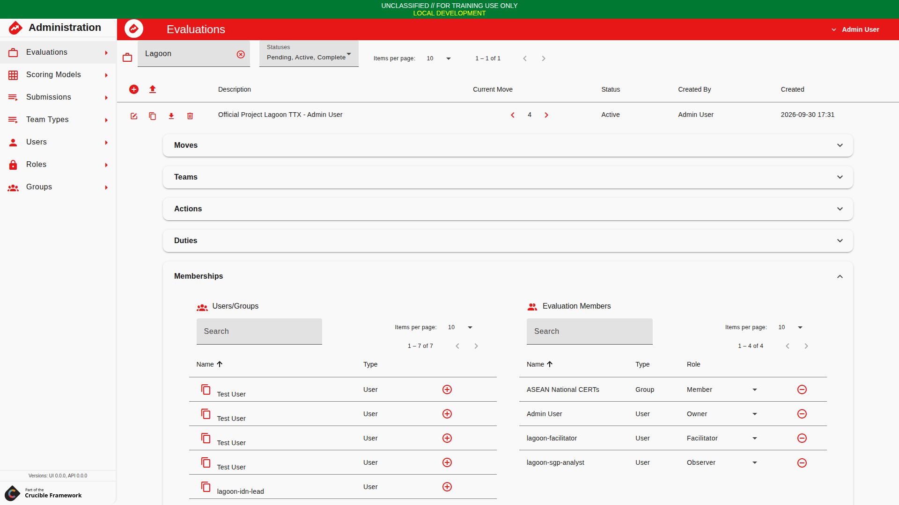

To grant a user access to an evaluation:

1. In the Administration View, select **Evaluations**.
2. Click the evaluation's **Description**, then expand **Memberships**.
3. Search for the desired user and add them.
4. Choose the evaluation role to assign. To make a user an [observer](#glossary), assign the **Observer** role, which carries `ObserveEvaluation`.

Refer to the [Evaluation Roles](#evaluation-roles) section for what each role grants.

#### Scoring Models

The following image shows the [Scoring Models](#glossary) Administration Page. Here, administrators can add, edit, copy, download, upload, and delete scoring models.

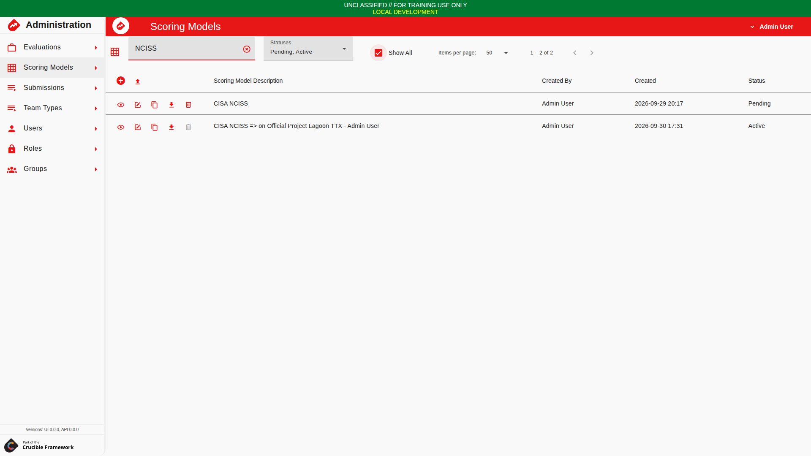

The list shows Scoring Model Description, Created By, Created, and Status. Filter it with the **Search** box and the **Statuses** dropdown. Each row also carries a **Preview \<name\>** button, which opens the scoring model as a participant would see it.

!!! note "Show All reveals the scoring models attached to an evaluation"

    By default the list shows only reusable scoring models. Creating an evaluation copies the scoring model you chose and attaches the copy to that evaluation, naming it `<model> => on <evaluation>`. Those copies stay hidden until you select the **Show All** checkbox. The screenshot above has **Show All** selected, which is why both `CISA NCISS` and its Project Lagoon copy appear.

##### Add a Scoring Model

If the exercise administrator grants the appropriate permissions, follow these steps to add a Scoring Model.

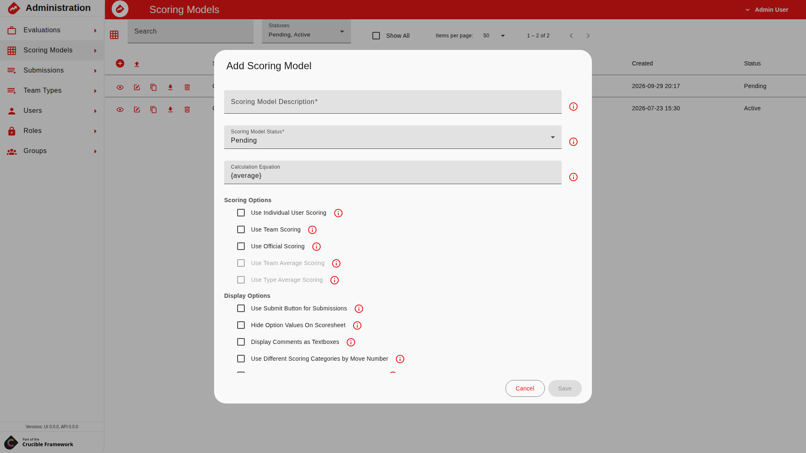

1. Under the Scoring Model Administration View, click **Add Scoring Model**.
2. Fill the fields as necessary following the Data Format Table specifications.

##### Data Format Table

| Field                                               | Data Type     | Description                                                                                 | Example                         |
| --------------------------------------------------- | ------------- | ------------------------------------------------------------------------------------------- | ------------------------------- |
| **Scoring Model Description**                       | String        | Details, characteristics and information of the scoring model                               | `NCISS Scoring Model`           |
| **Scoring Model Status**                            | Dropdown Text | Status of the scoring model after configuration                                             | `Active`                        |
| **Calculation Equation**                            | Varchar       | Equation used to evaluate participant scores                                                | `{average}`                     |
| **Use Individual User Scoring**                     | Boolean       | Select this option to display the User score                                                | `False`                         |
| **Use Team Scoring**                                | Boolean       | Select this option to display the Team score                                                | `True`                          |
| **Use Official Scoring**                            | Boolean       | Select this option to display the Official score                                            | `False`                         |
| **Use Team Average Scoring**                        | Boolean       | Average the individual user scores to produce the team's score                              | `False`                         |
| **Use Type Average Scoring**                        | Boolean       | Average across every team of the same team type                                             | `False`                         |
| **Use Submit Button for Submissions**               | Boolean       | Setting to add Submit button to CITE Scoresheet                                             | `False`                         |
| **Hide Option Values On Scoresheet**                | Boolean       | Hide the point value of each scoring option on the CITE Scoresheet                          | `True`                          |
| **Display Comments as Textboxes**                   | Boolean       | Provide a larger textbox on Scoresheet for lengthy responses                                | `True`                          |
| **Use Different Scoring Categories by Move Number** | Boolean       | Display different sets of scoring categories per move, instead of all at once               | `True`                          |
| **Show Past Situation Descriptions on Dashboard**   | Boolean       | Display situation descriptions from past moves in a list format                             | `True`                          |
| **Right Side Display**                              | Dropdown Text | What to show in the right-hand pane of the Dashboard                                        | `ScoreSummary`                  |
| **Right Side HTML Block**                           | Rich Text     | Content for the right-hand pane; appears only when Right Side Display is `HtmlBlock`        | `<h2>Reporting thresholds</h2>` |
| **Right Side URL**                                  | String        | Page to frame in the right-hand pane; appears only when Right Side Display is `EmbeddedUrl` | `https://example.org/playbook`  |

To save these settings, click **Save**.

Two of the scoring options depend on another one. **Use Team Average Scoring** stays disabled until **Use Individual User Scoring** is selected, because it averages the individual scores. **Use Type Average Scoring** stays disabled until **Use Team Scoring** is selected, because it averages across the teams of a type.

###### Right Side Display Options

The **Right Side Display** dropdown lists the values below. The dropdown shows them without spaces, exactly as written here.

| Value            | What a participant sees                                                                                    |
| ---------------- | ---------------------------------------------------------------------------------------------------------- |
| **ScoreSummary** | The Score Summary table, listing every score the model enables next to the range and level it falls in     |
| **HtmlBlock**    | The formatted content entered in **Right Side HTML Block**, for reference material such as a scoring guide |
| **EmbeddedUrl**  | The page named in **Right Side URL**, framed in place. The page must allow being framed                    |
| **Scoresheet**   | A second copy of the Scoresheet, so participants can score without leaving the Dashboard                   |
| **None**         | No right-hand pane. The Dashboard fills the width of the window                                            |

The right-hand pane appears on the Dashboard only. The Submission Review and Aggregate Report views always use the full width.

When adding a Scoring Model, an administrator adds a defined equation to calculate the submission score from the category scores, which can contain the following variables:

- **{average}:** The average value of the Scoring Categories.
- **{sum}:** The sum of the Scoring Categories.
- **{count}:** The count of the Scoring Categories.
- **{minPossible}:** The minimum possible value of the submission.
- **{maxPossible}:** The maximum possible value of the submission.

Aside from these variables, use **>** to set clipping values for the equation.

- **Example:** 100 > equation > 20 will constrain the value of the submission between 100 and 20.

##### Edit a Scoring Model

To edit a scoring model, follow these steps:

1. In the Administration View, select **Scoring Models**.
2. Find the scoring model and click **Edit \<name\>** next to it. The system opens the same edit component used when creating a new scoring model.
3. After making all necessary edits, click **Save**.

!!! important "A scoring model attached to an evaluation cannot be edited here"

    Select **Show All** and the list also includes the `<model> => on <evaluation>` copies. Opening one of those shows every field greyed out and **Save** disabled. Settle the model's settings on the reusable model before creating the evaluation, because creating the evaluation is what makes the copy. The copy's scoring categories and scoring options stay editable; only the model's own settings are locked.

##### Upload a Scoring Model

To upload a scoring model, follow these steps:

1. In the Administration View, select **Scoring Models**.
2. Click **Upload Scoring Model**.
3. Select the scoring model JSON file to upload.

##### Download a Scoring Model

To download a scoring model, follow these steps:

1. In the Administration View, select **Scoring Models**.
2. Find the scoring model and click **Download \<name\>** next to it.
3. Look for the JSON file in your Downloads folder.

##### Copy a Scoring Model

To copy a scoring model, follow these steps:

1. In the Administration View, select **Scoring Models**.
2. Find the scoring model and click **Copy \<name\>** next to it.
3. Look for the scoring model name with the user's name.

##### Delete a Scoring Model

To delete a scoring model, follow these steps:

1. In the Administration View, select **Scoring Models**.
2. Find the scoring model and click **Delete \<name\>** next to it.

#### Scoring Categories

To configure a Scoring Model to use for an exercise, administrators will need to add [Scoring Categories](#glossary).

To reach the Scoring Categories of a scoring model, click the model's **Scoring Model Description** in the Scoring Models list. The model expands in place to reveal **Scoring Categories** and **Memberships**. Memberships works the same way as it does for an evaluation, pairing a user or group with a [scoring model role](#scoring-model-roles).

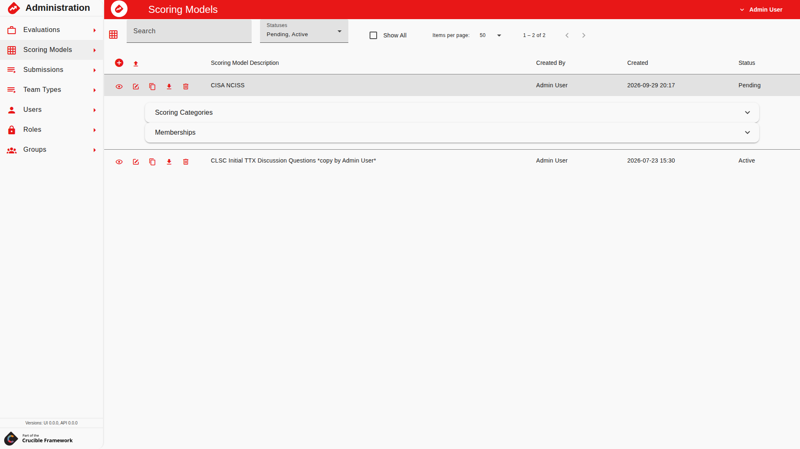

##### Add Scoring Category

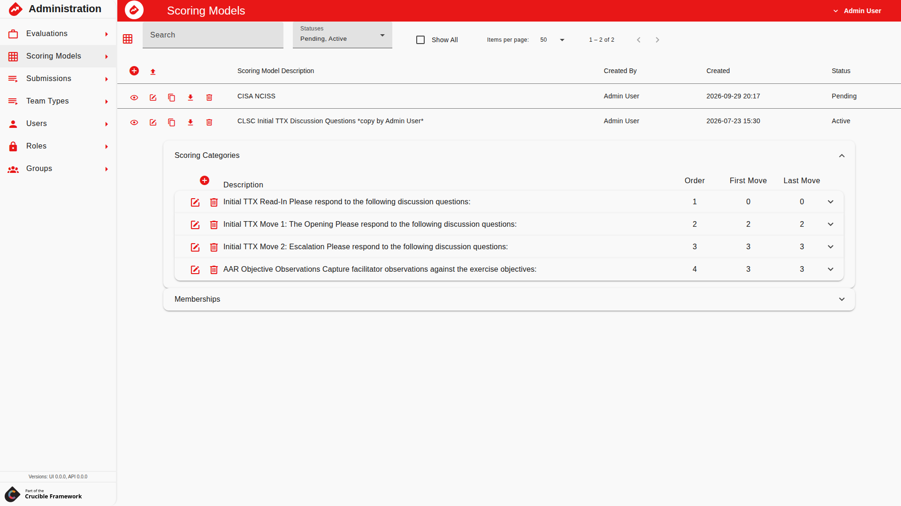

1. Expand the **Scoring Categories** section and click **Add Scoring Category**.
2. Fill the fields as necessary following the Data Format Table specifications.

##### Data Format Table

| Field                             | Data Type     | Description                                                          | Example            |
| --------------------------------- | ------------- | -------------------------------------------------------------------- | ------------------ |
| **Scoring Category Description**  | String        | Details, characteristics and information of the scoring category     | Information Impact |
| **Display Order**                 | Integer       | Scoring category display order on CITE Scoresheet                    | 1                  |
| **First Move to Display**         | Integer       | Move number where the scoring category first appears                 | 1                  |
| **Last Move to Display**          | Integer       | Move number where the scoring category appears for the final time    | 1                  |
| **Calculation Equation**          | Varchar       | Equation used to evaluate participant's scores                       | {sum}              |
| **Calculation Weight**            | Integer       | Weight of the score compared to other categories                     | 1                  |
| **Scoring Option Selection Type** | Dropdown Text | How many of the category's scoring options a participant may select  | Single             |
| **Modifier Selection Required**   | Boolean       | Select this option to require modifiers that supply alternate values | True               |

**First Move to Display** and **Last Move to Display** appear only when the parent scoring model has **Use Different Scoring Categories by Move Number** enabled.

To save these settings, click **Save**.

###### Scoring Option Selection Type

| Value        | Behavior                                                                                                        |
| ------------ | --------------------------------------------------------------------------------------------------------------- |
| **Single**   | One option at a time. Selecting a second option clears the first                                                |
| **Multiple** | Any number of options, so the category can be a checklist of actions the team completed                         |
| **None**     | No checkboxes. Each scoring option renders as text, which turns the category into a set of discussion questions |

CITE enforces **Single** on the server, so the previous selection clears even if two participants on the same team score at once. Modifiers are always single-select, whatever this setting is: selecting a modifier clears any other modifier in the same category but leaves the non-modifier options alone.

!!! important "Discussion questions need Display Comments as Textboxes"

    A category set to **None** has nothing for a participant to click, so the only way to answer is the comment box. Enable **Display Comments as Textboxes** on the parent scoring model, which replaces the per-option comment buttons with a textbox under each option. Without it, a **None** category is read-only text.

A Scoring Category may have zero or more required or optional [Modifiers](#glossary). If there is no optional Modifier, the Scoring Category calculation uses a default value of 1.0.

Additionally, a Scoring Category has an admin defined equation to calculate the submission score from the category scores and can contain the following variables:

- **{sum}:** The sum of the selected Scoring Option values.
- **{count}:** The count of the selected Scoring Option values.
- **{min}:** The minimum of the selected Scoring Option values.
- **{max}:** The maximum of the selected Scoring Option values.
- **{modifier}:** The selected modifier value, which defaults to 1.

Last but not least, a Scoring Category has a weight by which to multiply the score obtained from the entered equation.

##### Edit a Scoring Category

To edit a scoring category, follow these steps:

1. In the Administration View, select **Scoring Models**.
2. Click the model's **Scoring Model Description**, then expand **Scoring Categories**.
3. Find the scoring category and click **Edit Scoring Category** next to it. The system opens the same edit component used when creating a new scoring category.
4. After making all necessary edits, click **Save**.

##### Delete a Scoring Category

To delete a scoring category, follow these steps:

1. In the Administration View, select **Scoring Models**.
2. Click the model's **Scoring Model Description**, then expand **Scoring Categories**.
3. Find the scoring category and click **Delete Scoring Category** next to it.

#### Scoring Options

Within a Scoring Category, an administrator can add one or more [Scoring Options](#glossary). To do this, follow these steps:

##### Add Scoring Options

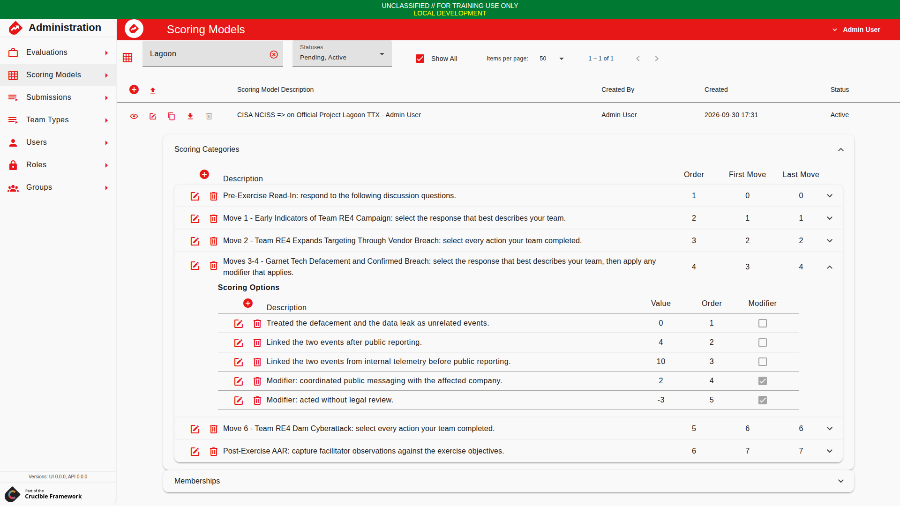

1. Expand a scoring category and click **Add Scoring Option**.
2. Fill the fields as necessary following the Data Format Table specifications.

##### Data Format Table

| Field                          | Data Type | Description                                                    | Example   |
| ------------------------------ | --------- | -------------------------------------------------------------- | --------- |
| **Scoring Option Description** | String    | Details, characteristics and information of the scoring option | No Impact |
| **Display Order**              | Integer   | Scoring option display order on CITE Scoresheet                | 1         |
| **Value**                      | Number    | The scoring option's value for participant score               | 0         |
| **Is a Modifier**              | Boolean   | Select this option to treat the scoring option as a modifier   | True      |

To save these settings, click **Save**.

**Value** accepts decimals, which matters for modifiers. A modifier's value reaches the category equation as `{modifier}`, so a modifier is usually a multiplier such as `1.2` or `0.7` rather than a whole number of points. A category equation that never mentions `{modifier}` ignores its modifiers entirely, however many a participant selects.

In a category whose **Scoring Option Selection Type** is **None**, the scoring options are the discussion questions. Give each question its own scoring option, leave **Value** at `0`, and the participant types the answer into the textbox underneath.

##### Edit a Scoring Option

To edit a scoring option, follow these steps:

1. In the Administration View, select **Scoring Models**.
2. Click the model's **Scoring Model Description**, then expand **Scoring Categories**.
3. Expand the scoring category that holds the option.
4. Find the scoring option and click **Edit Scoring Option** next to it. The system opens the same edit component used when creating a new scoring option.
5. After making all necessary edits, click **Save**.

##### Delete a Scoring Option

To delete a scoring option, follow these steps:

1. In the Administration View, select **Scoring Models**.
2. Click the model's **Scoring Model Description**, then expand **Scoring Categories**.
3. Expand the scoring category that holds the option.
4. Find the scoring option and click **Delete Scoring Option** next to it.

#### Actions

Actions are configured inside an evaluation. Here, administrators can add, edit, and delete actions. The list shows Description, Move, Team, and Checked, and it holds one row per team per move. Narrow it with the **Move** and **Team** dropdowns, both of which default to showing everything, and with the **Search** box.

However, users who can submit scores on behalf of their team can also add suggested actions to the CITE Dashboard. The use of actions allows team members to customize their response by tracking tasks during the exercise. The system keeps these actions internal to the team and hides them from other participants.

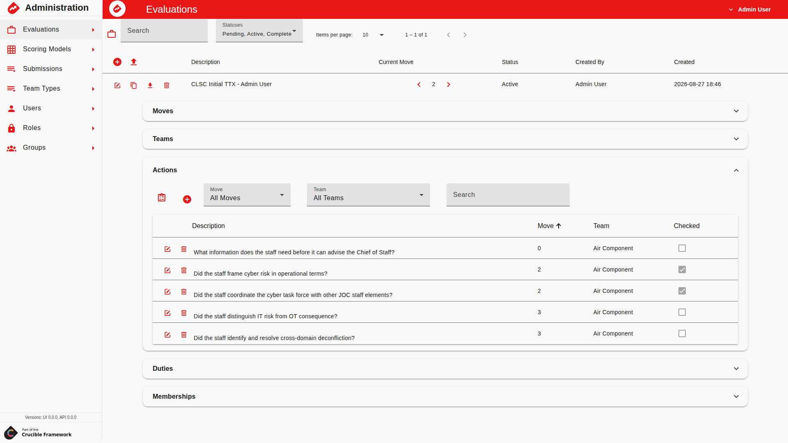

##### Add an Action

If the exercise administrator grants the appropriate permissions, follow these steps to add an Action.

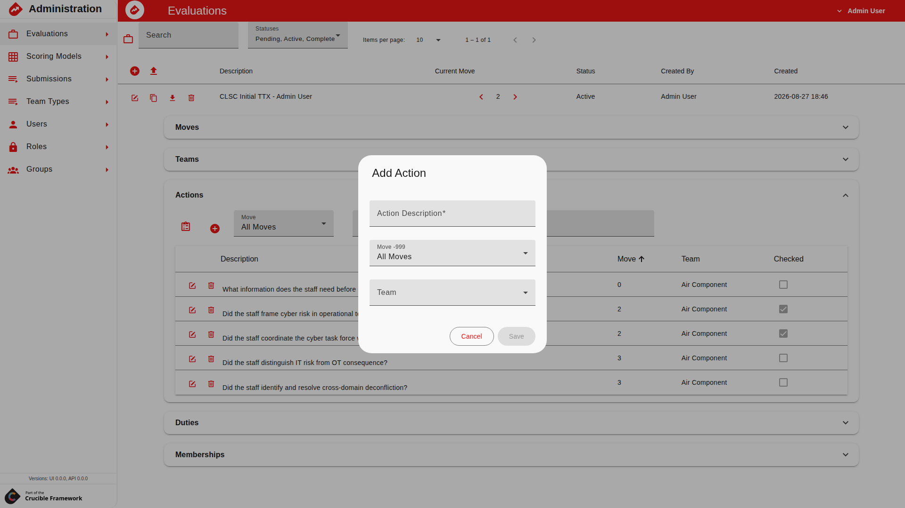

1. In the Administration View, select **Evaluations**, click the evaluation's **Description**, then expand **Actions**.
2. Click the **Move** dropdown and select the desired move.
3. Click the **Team** dropdown and select the desired team.
4. Click **Add Action**.
5. Fill the fields as necessary following the Data Format Table specifications.

##### Data Format Table

| Field                  | Data Type | Description                                            | Example       |
| ---------------------- | --------- | ------------------------------------------------------ | ------------- |
| **Action Description** | String    | Details, characteristics and information of the action | Time to Score |

To save these settings, click **Save**.

##### Edit an Action

To edit an action, follow these steps:

1. In the Administration View, select **Evaluations**, click the evaluation's **Description**, then expand **Actions**.
2. Find the action and click **Edit Action** next to it. The system opens the same edit component used when creating a new action.
3. After making all necessary edits, click **Save**.

##### Delete an Action

To delete an action, follow these steps:

1. In the Administration View, select **Evaluations**, click the evaluation's **Description**, then expand **Actions**.
2. Find the action and click **Delete Action** next to it.

#### Duties

Duties are configured inside an evaluation. Here, administrators can add, edit, and delete duties. The list shows Name, Team, and Users, and narrows with the **Team** dropdown and the **Search** box. Unlike actions, a duty is not tied to a move, so it holds for the whole exercise. A duty with nobody assigned leaves its Users cell blank. Earlier CITE releases called these participant roles.

However, users who can submit scores on behalf of their team can also add duties to the CITE Dashboard. The use of duties allows team members to customize their response by tracking their responsibilities during an exercise. These duties remain internal to the team and stay hidden from other participants.

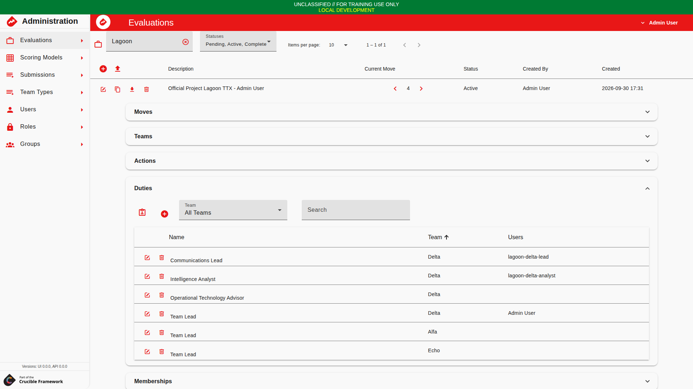

##### Add a Duty

If the exercise administrator grants the appropriate permissions, follow these steps to add a Duty:

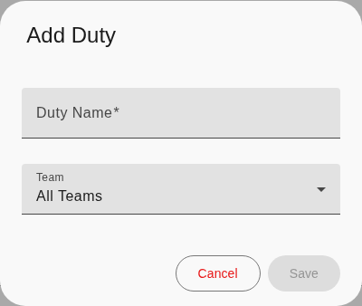

1. In the Administration View, select **Evaluations**, click the evaluation's **Description**, then expand **Duties**.
2. Click the **Team** dropdown and select the desired team.
3. Click **Add Duty**.
4. Fill the fields as necessary following the Data Format Table specifications.

##### Data Format Table

| Field         | Data Type | Description      | Example   |
| ------------- | --------- | ---------------- | --------- |
| **Duty Name** | String    | Name of the duty | Team Lead |

To save these settings, click **Save**.

##### Edit a Duty

To edit a duty, follow these steps:

1. In the Administration View, select **Evaluations**, click the evaluation's **Description**, then expand **Duties**.
2. Find the duty and click **Edit Duty** next to it. The system opens the same edit component used when creating a new duty.
3. After making all necessary edits, click **Save**.

##### Delete a Duty

To delete a duty, follow these steps:

1. In the Administration View, select **Evaluations**, click the evaluation's **Description**, then expand **Duties**.
2. Find the duty and click **Delete Duty** next to it.

#### Submissions

The following image shows the Submissions Administration Page. Here, administrators can keep track of all score [submissions](#glossary) provided by the different teams during an exercise. This allows administrators to compare their scores with the official score, as well as keep track of which teams are on a good track and which are not.

Filter the list by **Evaluation**, by **Types**, which defaults to Official and Team, and by **Move**. The list shows Name, Type, Move, Score, and Status. Each row carries **Copy Submission ID to clipboard**, which copies the submission's ID, and **Delete Submission**.

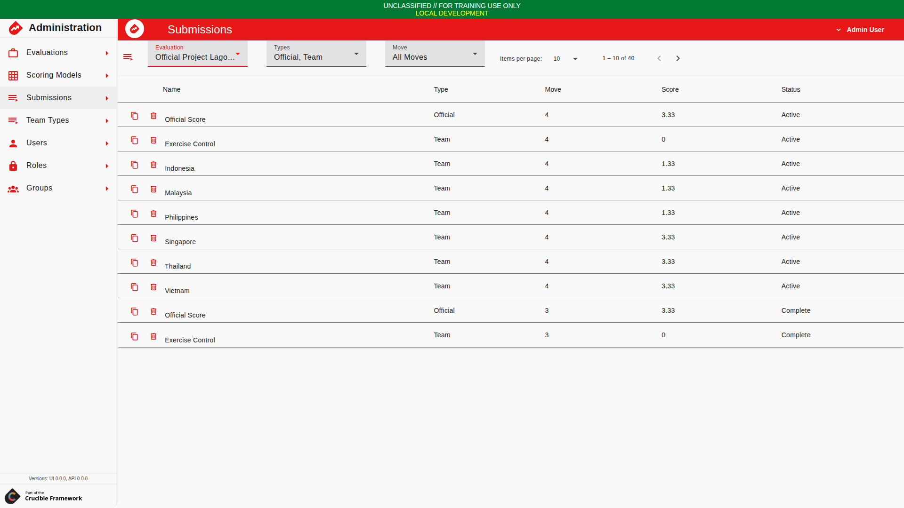

#### Roles

The following image shows the Roles Administration Page. Here, administrators define the roles that grant permissions across CITE.

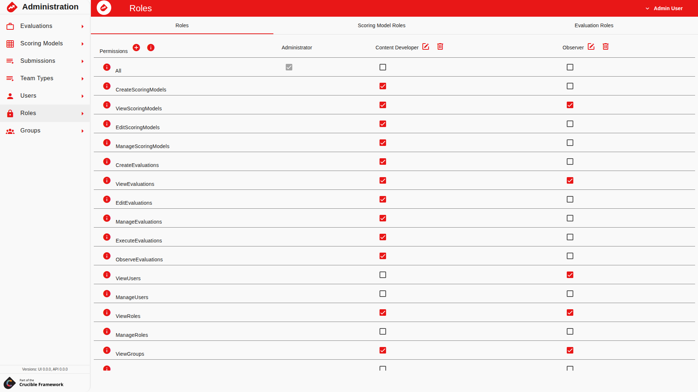

The page has three tabs.

- **Roles:** system roles, shown as a permission matrix with one column per role. Select a permission's checkbox to grant it to that role.
- **Scoring Model Roles:** roles scoped to a single scoring model.
- **Evaluation Roles:** roles scoped to a single evaluation.

Use **Rename Role** and **Delete Role** to maintain a role. The Administrator role is immutable and an administrator cannot change it.

Team roles have no tab here. CITE ships four of them, `Owner`, `Submitter`, `Contributor`, and `Member`, and a team assigns them to its own members from the **Roles:** panel on the Dashboard.

Refer to the [Permissions and Roles](#permissions-and-roles) section for what each shipped role grants.

#### Groups

The following image shows the Groups Administration Page. Here, administrators create groups of users. An administrator can then grant a group membership in an evaluation or a scoring model as a unit, rather than one user at a time.

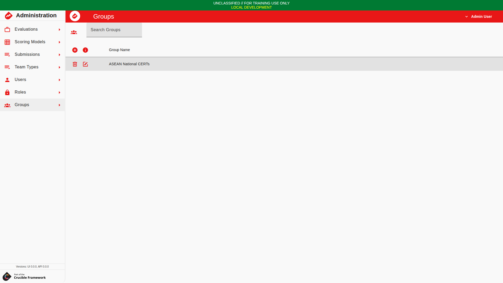

The list shows Group Name and an administrator filters it with the **Search Groups** box.

#### Team Types

The following image shows the [Team Types](#glossary) Administration Page. Here, administrators can create different types of teams to use during an exercise. This allows administrators to classify the different teams on the platform based on common characteristics and/or organizations.

The list shows TeamType, Is Official Score Contributor, and Show TeamType Average.

##### Add a Team Type

If the exercise administrator grants the appropriate permissions, follow these steps to add a Team Type:

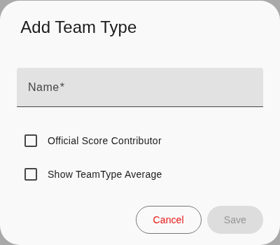

1. Under the Team Type Administration View, click **Add TeamType**.
2. Fill the fields as necessary following the Data Format Table specifications.

##### Data Format Table

| Field                          | Data Type | Description                                                           | Example                 |
| ------------------------------ | --------- | --------------------------------------------------------------------- | ----------------------- |
| **Name**                       | String    | Name of the team type                                                 | Individual Organization |
| **Official Score Contributor** | Boolean   | Select this option for teams that contribute to CITE's official score | True                    |
| **Show TeamType Average**      | Boolean   | Select this option to make the score average available to the team    | True                    |

To save these settings, click **Save**.

##### Edit a Team Type

To edit a team type, follow these steps:

1. In the Administration View, select **Team Types**.
2. Find the team type and click **Edit** next to it. The system opens the same edit component used when creating a new team type.
3. After making all necessary edits, click **Save**.

##### Delete a Team Type

To delete a team type, follow these steps:

1. In the Administration View, select **Team Types**.
2. Find the team type and click **Delete** next to it.

#### Users

The following image shows the Users Administration page. Here, administrators can add and delete users, and assign each user a system role.

The list shows ID, Name, and Role. Filter it with the **Search** box, and use the role dropdown to show users by assigned role. Each row also carries a **Copy** button that copies the user's ID to the clipboard.

Refer to the [System Roles](#system-roles) section for what each role grants.

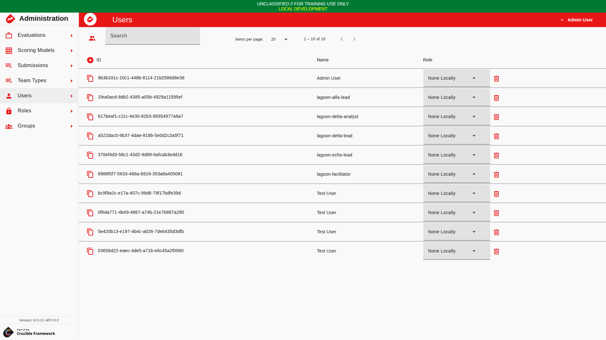

##### Add a User

If the exercise administrator grants the appropriate permissions, follow these steps to add a user:

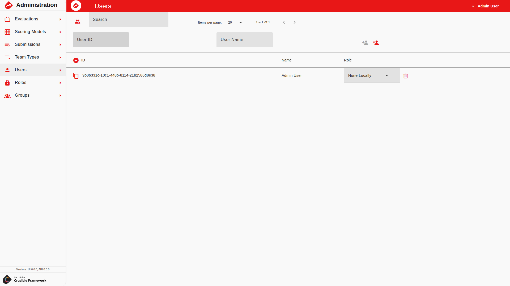

1. Under the Users Administration View, click **Add User**. A new row opens at the top of the list.
2. Fill the fields as necessary following the Data Format Table specifications.

##### Data Format Table

| Field         | Data Type | Description                        | Example                              |
| ------------- | --------- | ---------------------------------- | ------------------------------------ |
| **User ID**   | GUID      | User ID that identifies the user   | 81a623e3-faeb-4a56-8b4d-0d42f90b6829 |
| **User Name** | string    | User name that identifies the user | user-1                               |

To save these settings, click **Save**, then assign the user a system role.

##### Delete a User

To delete a user, follow these steps:

1. In the Administration View, select **Users**.
2. Find the user and click **Delete** next to it.

## User Guide

Participants use the CITE Dashboard and Scoresheet to evaluate and score incidents during an exercise.

### Moves

In CITE, a move is a defined exercise period. During that period the system distributes events for users to discuss and assess the current incident severity.

When in Dashboard view, users have two options for interacting with moves:

- **Displayed Move:** Move currently shown on the screen. Here, users can see responses to previous moves and scores, but they cannot edit a response.
- **Current Move:** Move that is currently active. In some cases the Displayed Move and the Current Move match. Here, users can edit the category of the move.

### CITE Landing Page

The CITE landing page provides a central approach to recompiling all evaluations that the user is a participant on into a single display.

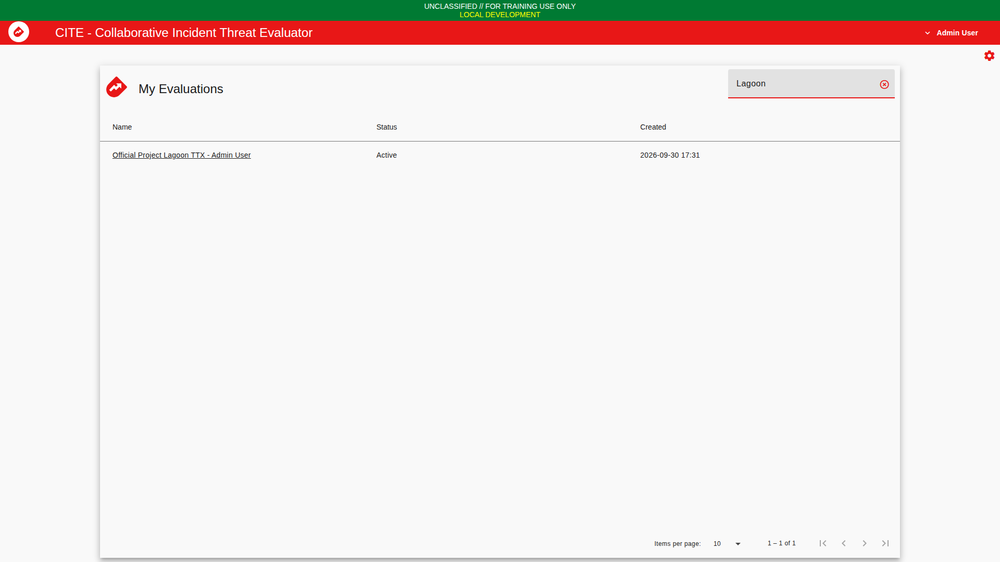

The page is titled **My Evaluations** and lists Name, Status, and Created for each evaluation the user participates in. Click a row to open that evaluation.

#### Search for an Evaluation

To search for an evaluation, follow these steps:

1. Navigate to CITE's landing page.
2. Click the Search Bar and add the name of the evaluation.

### CITE Dashboard

The CITE Dashboard shows exercise details like date and time, incident summary, a suggested list of actions for participants to consider taking, and suggested duties.

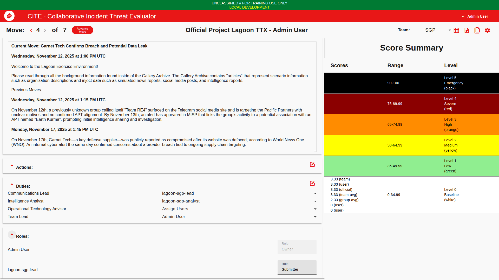

#### Active Events & Moves

The name of the active event and the move number currently displayed, shown as **Move: \<n\> of \<total\>**. The arrows either side move between moves.

The **Advance Move** button appears only when the evaluation has **Show Advance Button** enabled and the user holds a role carrying `ExecuteEvaluation`. The button also hides when the displayed move is not the current move, or when the current move is the last one. Clicking it advances the current move for all participants.

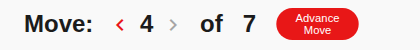

#### Situation Date & Time

The date and time of the situation displayed, rendered in full and in Coordinated Universal Time (UTC), for example `Wednesday, November 12, 2025 at 1:00 PM UTC`.

#### Situation Description

Short description of the event. This section allows for the use of HTML elements, useful when receiving MSEL information from Blueprint.

When the scoring model has **Show Past Situation Descriptions** enabled, the earlier moves follow under a **Previous Moves** divider, each under its own situation date and time. This gives participants the whole story so far on one panel. With the setting off, only the displayed move appears.

When an evaluation is linked to a Gallery exhibit, the dashboard shows an unread-item count with a link into Gallery.

#### Actions to Consider

The **Actions:** panel lists the actions the team should consider for the displayed move. These actions are for everyone on the team and are "per move", changing at each move of the exercise.

These actions guide users on an appropriate course of action during an exercise. However, these actions are not connected to the scoresheet. Selecting an action's checkbox records that the team did it, and hovering the checkbox shows who last changed it.

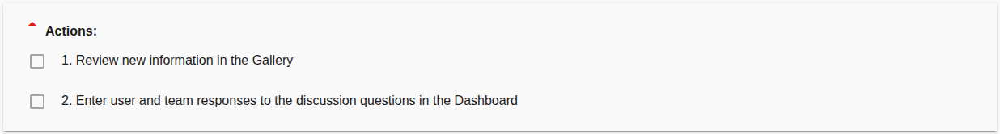

A user who can submit the team score also gets an **Edit Actions** button here, which swaps the checkboxes for **Add Action**, **Edit Action**, and **Delete Action** so the team can keep its own list. Click **Close Action Editing** to return to the checkboxes. The edit controls only appear for a user's own team, so a user observing another team sees that team's actions without any way to change them.

#### Duties

The **Duties:** panel gives each team member a clear understanding of their responsibilities during the exercise. Duties are customizable per team, and the team members decide which duty to assign to each user. Earlier CITE releases called these roles.

Each duty carries a dropdown listing the team's members, and one duty can hold several users. A duty with nobody assigned reads **Assign Users**. As with actions, a user who can submit the team score gets an **Edit Duties** button for adding, editing, and deleting duties.

#### Roles

The **Roles:** panel lists every member of the active team beside the team role they hold: `Owner`, `Submitter`, `Contributor`, or `Member`. These are team permissions rather than duties, and they decide who can edit and submit the team's score. Refer to [Team Roles](#team-roles) for what each one grants.

This is where a team assigns its own roles, so only a user holding **Owner** may change them. Nobody can change their own, so a team cannot lock itself out of its own score.

#### Score Summary

Displays the various scores at the appropriate severity level for the displayed move. Here, scores are always visible.

#### Team Selection

This feature enables a user who is part of a team, as well as an observer, to toggle back and forth between teams. When assigned an observer role, the user can see other teams' progress during the exercise, as well as participate on their own team.

#### Submission Review Toggle

This feature redirects users to a printable review of their own responses throughout the exercise.

Refer to the [Submission Review](#submission-review) section for more information.

#### Aggregate Report Toggle

This feature redirects users to a printable report of the team's submissions across all moves.

Refer to the [Aggregate Report](#aggregate-report) section for more information.

#### Dashboard & Scoresheet Toggle

By using this icon, users can toggle between the CITE Dashboard and the CITE Scoresheet.

### CITE Scoresheet

The CITE Scoresheet compares participant scores to organization scores, group average scores, and the official score.

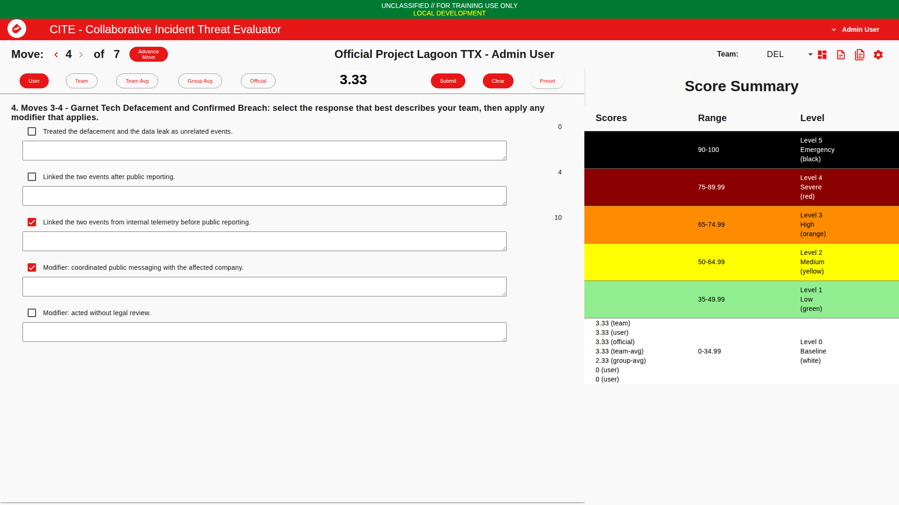

#### Event Name

The name of the current event.

#### Displayed Move

The move currently displayed on the screen. Clicking < displays previous moves. Clicking > displays the current move. Using Displayed Move, users can see responses to previous moves and scores, but the user cannot edit a previous response.

#### Scoring Features

Which of these appear depends on the scoring model. The User, Team, Team Avg, Group Avg, and Official buttons are each controlled by a corresponding "Use ... Scoring" setting, and **Submit** appears only when **Use Submit Button for Submissions** is enabled.

- **User:** This is the participant's personal score for their reference only. The user score will also appear under the Score Summary range.
- **Team:** Toggling the Team icon displays how the team scored this move so far. This is the score that the team collaborates on and submits for the current move. This score compares to the official score. The Team score appears under the Score Summary range.
- **Team Avg:** The average for all of the users on the team. The Team Avg appears under the Score Summary range for all moves except the current move.
- **Group Avg:** The average across all teams sharing the user's team type, controlled by **Use Type Average Scoring**. Group Avg appears under the Score Summary range for all moves except the current move.
- **Official:** The potential score; that is, how the incident would score in a real-life scenario. Official score appears under the Score Summary range for all moves except the current move.
- **Submit:** Submits the score, indicating that the user scored the current move. Click Yes or No. If the user clicks Yes but changes their mind, click Reopen to edit the scoring.
- **Clear:** Clears any selections the user has checked but does not clear comments entered. Selecting Clear returns to a score of 0.00.
- **Preset:** Sets the user's selections to the previous move score to use as a starting point for the current move.

#### Categories and Options

Categories are individually scored based upon the current move situation. For each category, select one or more relevant options. Selecting options assigns points to each category, which compile to create the move score as defined by the [scoring model](#glossary).

#### Add, Edit, and Delete a Comment

When scoring a move, the user can attach a comment (or multiple comments) to a category.

How comments are entered depends on the scoring model. When **Display Comments as Textboxes** is enabled, each category shows a text box that saves as the user types, and the comment buttons below do not appear. Otherwise, the user adds comments through these controls.

- To add a comment, click **Add Comment** beneath the option. Enter the comment and click Save.
- To edit an existing comment, click **Edit Comment** next to it. Make any changes, then click Save.
- To delete an existing comment, click **Delete Comment** next to it. Click Yes to delete the comment.

Each of these is a small icon button, so hover over it to confirm the name.

When finished scoring the categories and adding comments, click Submit to submit the scores.

#### Score Summary

The Score Summary panel displays the various scores at the appropriate severity level for the displayed move, keeping the data visible at all times.

#### Team Selection

This feature enables a user who is part of a team, as well as an observer, to toggle back and forth between teams. When the administrator assigns an observer role, the user can see other teams' progress during the exercise as well as participate on their own team.

#### Submission Review Toggle

This feature redirects users to a printable review of their own responses throughout the exercise.

Refer to the [Submission Review](#submission-review) section for more information.

#### Aggregate Report Toggle

This feature redirects users to a printable report of the team's submissions across all moves.

Refer to the [Aggregate Report](#aggregate-report) section for more information.

#### Dashboard & Scoresheet Toggle

By using this icon, users can toggle between the CITE Dashboard and the CITE Scoresheet.

### Submission Review

The [Submission Review](#glossary) collects a user's own responses into a single printable page. Users can reference this for their records, and exercise administrators can obtain valuable exercise insights from it.

Reach it with the **SubmissionReview** button in the top bar. The page is headed **\<user\>'s Responses for \<evaluation\>** and groups responses by move. Use **Toggle between user and team scores** to switch whose responses appear, and **Print Submission Review** to print.

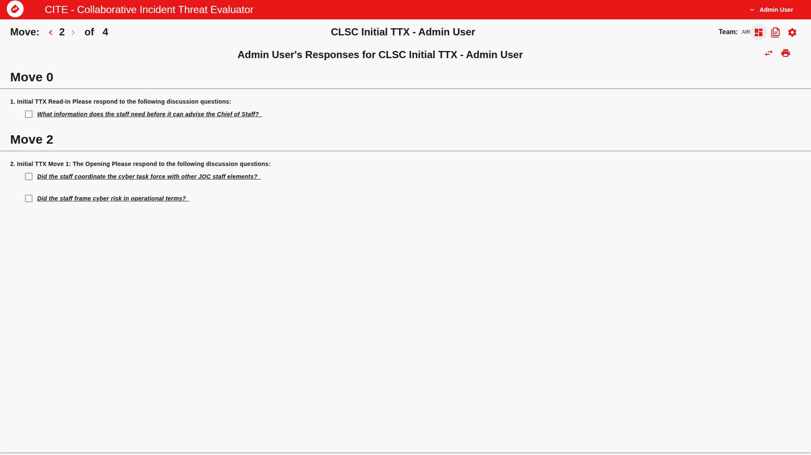

### Aggregate Report

The [Aggregate Report](#glossary) collects the submissions of every team in the evaluation into one printable page, grouped by move and labeled by team short name.

Reach it with the **Aggregate Report** button in the top bar. The page is headed **Team Submissions Report for \<evaluation\>**.

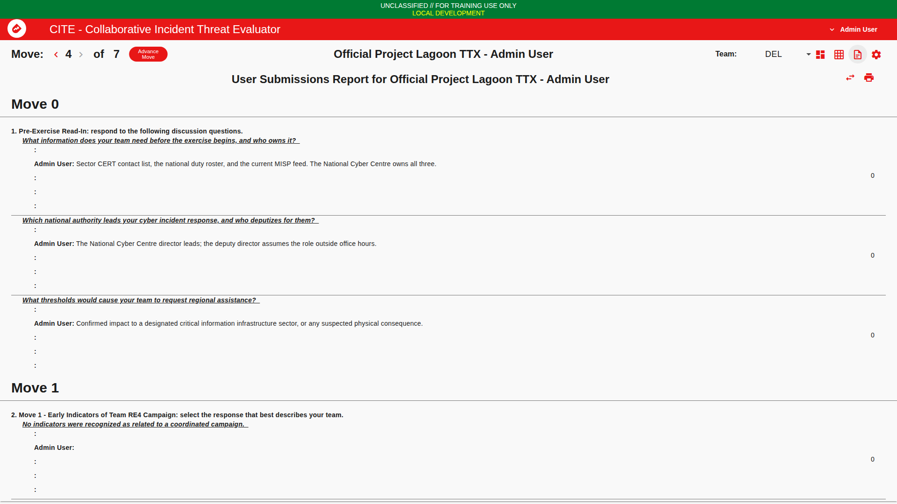

## Glossary

This glossary defines key terms and concepts used in the CITE application.

**Actions**: Series of steps to guide users on an appropriate course of action during an exercise.

**Aggregate Report**: Collects the submissions of every team in the evaluation into one printable page, grouped by move.

**CITE**: Web application that allows multiple participants from different organizations to evaluate, score, and comment on cyber incidents.

**CITE Dashboard**: Shows exercise details.

**CITE Scoresheet**: Compares participant scores to organizations scores, group average scores, and the official score.

**Contributor**: Team role that can view and edit the team score.

**Duties**: Named responsibilities assigned to team members during an exercise. Earlier CITE releases called these roles.

**Evaluation**: Defines the scoring model used, as well as the moves and teams who will participate in the exercise.

**Groups**: A named set of users that an administrator can grant membership in an evaluation or scoring model as a unit.

**Member**: Team role that can only view the team score.

**Memberships**: The pairing of a user or group with a role on an evaluation or scoring model.

**Modifiers**: If enabled, the Scoring Category score will use this value in calculations, either to add, subtract, multiply and/or divide within the equation.

**Moves**: A defined period of time during an exercise in which a series of events occur for users to discuss and assess the current incident severity.

**Observer**: Individuals who impartially and objectively monitor teams during an exercise. An administrator grants this by assigning the Observer evaluation role.

**Owner**: Team role that can view, edit, and submit the team score, and manage the team.

**Roles**: A named bundle of permissions. CITE defines roles at four scopes: system, evaluation, scoring model, and team.

**Scoring Category**: Has a defined equation used to calculate the submission score from the category scores. Additionally, the category has a weight by which to multiply the score obtained.

**Scoring Model**: Tool used to assign a comparative value, takes into account the totality of the data points, their relative weights, and the scores for each of their range values.

**Scoring Options**: Has a preset value for calculating the submission score for a given Scoring Category.

**Submission**: Act of providing a score or response for an evaluation in relation to an incident presented during the current move.

**Submission Review**: Collects one user's or one team's responses into a single printable page for users to reference or keep for their records.

**Submitter**: Team role that can view, edit, and submit the team score.

**Team Types**: Types of teams available to assign to different teams with similar characteristics during an exercise.
