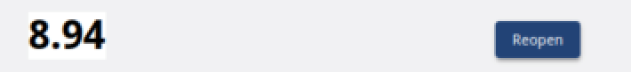

# CITE Scoresheet

The scoresheet compares participant scores to organization scores, group average scores, and the official score. Scores are submitted for each move as the exercise progresses and each of the historical scores can be recalled for reference at any time.

1. Event Name
    The name of the event is in the top left corner. In the figure above, the event name is Circuit.
2. Displayed Move
    This is the move currently displayed on the screen. In figure above, it happens that the Displayed Move is the same as the Current Move. Clicking < displays previous moves. Clicking > displays the current move (see below). Using Displayed Moves, you can see responses to previous moves and scores, but you cannot edit a response.
  
3. Scoring Features 
    User: This is the participant’s personal score for their reference only. In the figure above, this participant has scored this move as 7.34 so far. Your user score will also appear under the Score Summary range.
    Team: Toggling the Team icon displays how the team has scored this move so far. This is the score that the team collaborates on and submits for the current move and will be compared to the official score. The team score appears under the Score Summary range.
    Team Avg: This is the average of all of the users on the team. Team-avg appears under the Score Summary Range for all moves except for the current move.
    Group Avg: The is the average of all of the teams in your group. For example, a group might comprise all credit unions or all FBIIC organizations. Group-avg appears under the Score Summary Range for all moves except for the current move.
    Official: This is the potential score; that is, how the incident should have been scored had it been a real-life scenario. Official score appears under the Score Summary Range for all moves except for the current move.
    Submit: Submits the score indicating that you are done scoring the current move. Click Yes or No. If you click Yes, but change your mind, click Reopen to edit scoring.
    
    Clear: This clears any selections you have checked but does not clear comments you entered. Selecting Clear returns your score to 0.00.
    Preset: This sets your selections to the previous move score to use as a starting point for the current move.
4. Score Summary
    The Score Summary displays the various scores at the appropriate severity level for the displayed move so that scores are always visible.
    
5. Categories and Options
These are the categories that are individually scored based upon the current move situation. For each category, select as many options as are relevant. Selecting options assigns points to each category which are compiled to create the move score as defined by the Scoring Model.
