#  **Gallery:** Keeping You in the Know

## Overview

[**Gallery**](#glossary) is a web application where participants receive incident information.

In the Gallery user interface, there are two major functional sections:

- [Gallery Wall](#glossary): The dashboard that displays [cards](#glossary) to help participants visualize the incident.
- [Gallery Archive](#glossary): A collection of information that contains relevant reporting, intelligence, news, and social media.

For installation, refer to these GitHub repositories.

- [Gallery UI Repository](https://github.com/cmu-sei/Gallery.Ui)
- [Gallery API Repository](https://github.com/cmu-sei/Gallery.Api)

## Administrator Guide

Gallery administrators use the Administration View to manage collections, exhibits, users, roles, and groups.

### Administration View

Across the Crucible exercise applications, the **Administration View** is where privileged users configure the platform and control access. It includes user and team management, role and permission assignment, and setup and maintenance of app-specific templates and content. The Administration View is where admins prepare and manage the environment so events run smoothly for participants.

Accessing the Administration View is the same in all Crucible exercise applications: expand the dropdown next to your username in the top-right corner and select **Administration**.

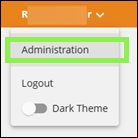

### Collections

Collections are the top-level containers that group cards and articles for an exercise. The Collections page lists all available collections and provides access to their cards, articles, and memberships.

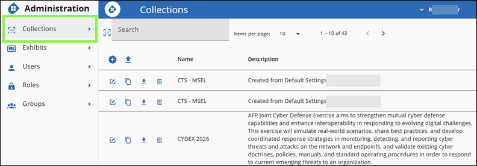

#### Add a Collection

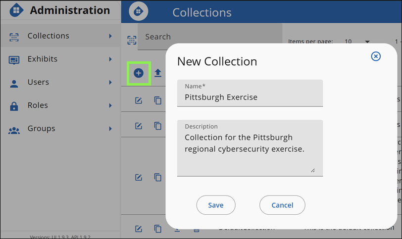

1. Under the Collections Administration View, click **+** (**Add Collection**).
2. In **Name**, enter the collection name (for example, `Demonstration`).
3. In **Description**, enter a brief description (for example, `This is a collection created for demo purposes.`).
4. Click **Save**.

#### Upload a Collection

1. Click the **Upload** icon next to **+**.
2. Select the collection JSON file to upload.

#### Edit, Copy, Download, and Delete a Collection

- **Edit:** Click **Edit** (pencil icon) next to the collection, make the desired changes, and click **Save**.
- **Copy:** Click the **Copy** icon next to the collection.
- **Download:** Click the **Download** icon next to the collection.
- **Delete:** Click the **Trash Can** next to the collection.

#### Cards

Cards group articles into categories and appear on the Gallery Wall. Configure cards within a collection.

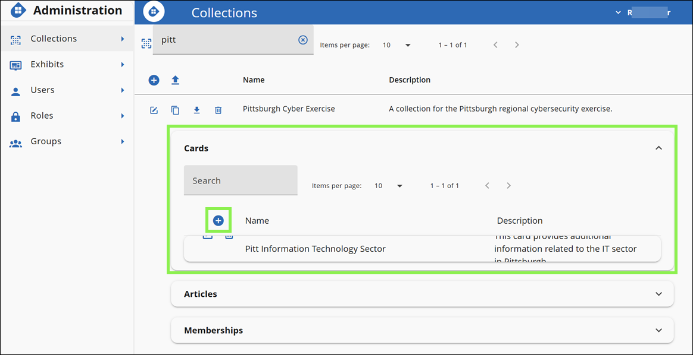

##### Add a Card

1. Locate and select a collection.
2. Expand the **Cards** section, click **+** (**Add a Card**).
3. In **Name**, enter the card name (for example, `Pitt Information Technology Sector`).
4. In **Description**, enter a brief description (for example, `This card provides additional information related to the IT sector in Pittsburgh.`).
5. Click **Save**.

##### Edit and Delete a Card

- **Edit:** Click **Edit** (pencil icon) next to the card, make the desired changes, and click **Save**.
- **Delete:** Click the **Trash Can** next to the card.

#### Articles

Articles provide supplemental information from different sources. Configure articles within a collection and assign them to cards.

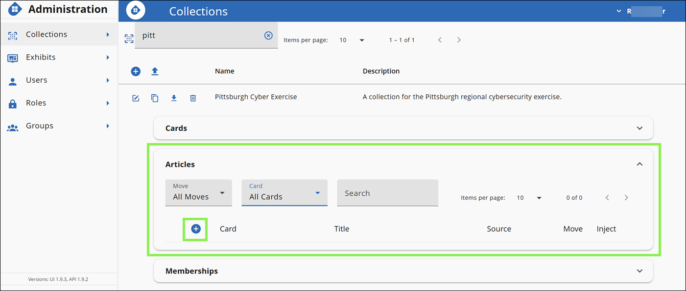

##### Add an Article

1. Expand the **Articles** section, click **+** (**Add an Article**).
2. In **Name**, enter the article name (for example, `Power outage reported in downtown Pittsburgh`).
3. In **Summary**, enter a short summary (for example, `Major power outage affecting Pittsburgh's central business district`).
4. In **Description**, enter the full article content.
5. In **Card**, select the card to categorize this article (for example, `Pitt Information Technology Sector`).
6. In **Status**, select the article's status (for example, `Critical`).
7. In **Source Type**, select the source type (for example, `News`).
8. In **Source Name**, enter the source name (for example, `Pittsburgh Post-Gazette`).
9. In **URL**, enter a URL for additional information if needed.
10. Select **Open URL in new tab** to open the URL in a new tab.
11. In **Move**, enter the move number (for example, `1`).
12. In **Inject**, enter the inject number (for example, `1`).
13. In **Posted Date / Time**, enter the article's date and time (for example, `04/23/2026, 13:01:00`).
14. Click **Save**.

##### Edit and Delete an Article

- **Edit:** Click **Edit** (pencil icon) next to the article, make the desired changes, and click **Save**.
- **Delete:** Click the **Trash Can** next to the article.

#### Memberships

Memberships control which users and groups have access to a collection and their assigned roles within it.

To add a member:

1. Under **Users/Groups**, find the user or group and click **+** (**Add [User Name]**).
2. In the **Role** dropdown next to the member under **Members**, select the desired role.

To remove a member, under **Members**, find the user or group and click **-**.

### Exhibits

An exhibit is a scheduled instance of a collection. The Exhibits page lists exhibits within a selected collection and provides access to exhibit teams, card teams, article teams, observers, and memberships.

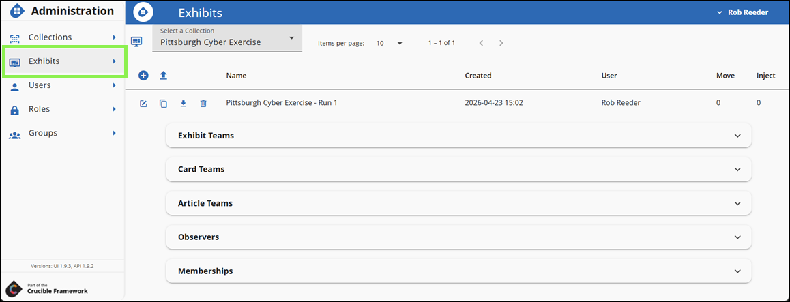

#### Add an Exhibit

1. Under the Exhibit Administration View, click **+** (**Add Exhibit**).
2. In **Name**, enter the exhibit name (for example, `Pittsburgh Cyber Exercise - Run 1`).
3. In **Description**, enter a brief description (for example, `First run of the Pittsburgh Cyber Exercise.`).
4. In **Current Move**, enter the starting move number (for example, `0`).
5. In **Current Inject**, enter the starting inject number (for example, `0`).
6. Optionally, in **Scenario ID**, enter the Steamfitter Scenario ID to link this exhibit to a Steamfitter scenario (for example, `7b3f9e2a-1c4d-4e8f-a5b6-d2c1e3f4a7b8`).
7. Click **Save**.

!!! note

    The system automatically generates the ID. If you leave **Scenario ID** blank, the system generates one automatically.

#### Upload an Exhibit

1. Click the **Upload** icon next to **+** (**Add Exhibit**).
2. Select the exhibit JSON file to upload.

!!! note

    When you add a new exhibit, the system creates a new collection with the uploaded exhibit. To view the uploaded exhibit, navigate to the collection using the dropdown and select the collection with the same name as the file you uploaded.

#### Edit, Copy, Download, and Delete an Exhibit

- **Edit:** Click **Edit** (pencil icon) next to the exhibit, make the desired changes, and click **Save**.
- **Copy:** Click the **Copy** icon next to the exhibit.
- **Download:** Click the **Download** icon next to the exhibit.
- **Delete:** Click the **Trash Can** next to the exhibit.

#### Exhibit Teams

Exhibit Teams are the teams that participate in an exhibit.

To add a team to an exhibit:

1. Under the **Exhibit Teams** section, click **+** (**Add Team**).
2. In **Name**, enter the full team name (for example, `Pittsburgh Cyber Team`).
3. In **Short Name**, enter a short name or acronym (for example, `PCT`).
4. In **Email**, enter the team's email address (for example, `pct@pittsburgh.gov`).
5. Click **Save**.

To configure a team:

1. Click the team row to expand its configuration.
2. Under **All Users**, click **+** next to a user to add them to the team.
3. Under **Team Users**, check the **Observer** box to assign the Observer role to a user.
4. Under **Team Users**, click **-** next to a user to remove them from the team.

#### Card Teams

Card Teams assign Gallery cards to exhibit teams.

To add a card team:

1. Under the **Card Teams** section, click **+** (**Add Team**).
2. In **Team**, select the team (for example, `Pittsburgh Cyber Team`).
3. In **Card**, select the card to assign (for example, `Pitt Information Technology Sector`).
4. In **Move**, enter the move number (for example, `1`).
5. In **Inject**, enter the inject number (for example, `0`).
6. To show the card on the Gallery Wall for the team, select **Is Shown On Wall**.
7. Select **Can Post New Articles** to allow the team to add new articles to this card.
8. Click **Save**.

#### Article Teams

Article Teams assign articles to exhibit teams.

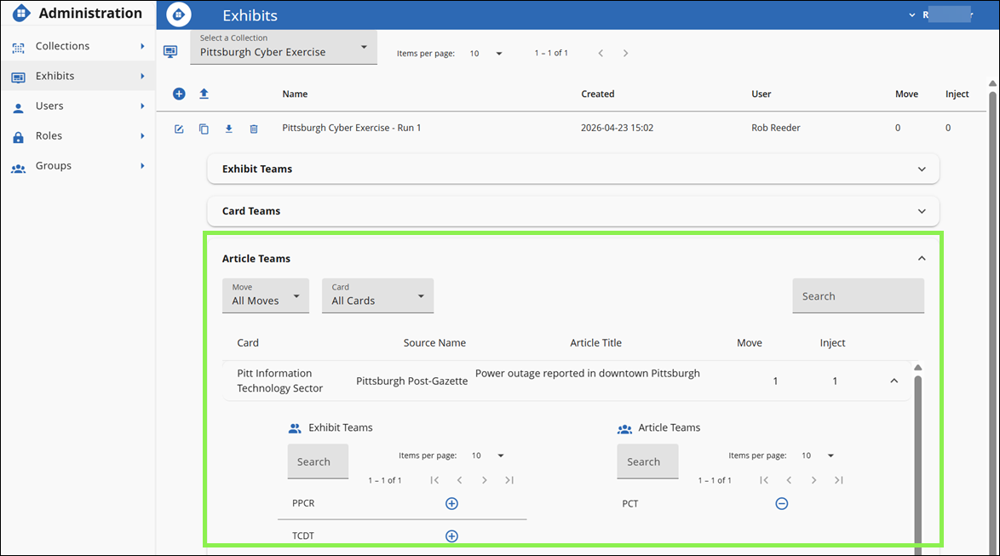

To add a team to an article:

1. Click the article row to expand its team assignment.
2. Under **Exhibit Teams**, click **+** (**Add team**) next to a team to assign them to the article.
3. Under **Article Teams**, click **-** (**Remove team**) next to a team to remove the assignment.

#### Observers

Observers can monitor all teams during an exercise.

To assign the Observer role to a user, under **Exhibit Users**, find the user and click **+**.

To remove the Observer role, under **Observers**, find the user and click **-**.

!!! note

    You can also assign the Observer role from the **Exhibit Teams** section by checking the **Observer** box next to a user in the **Team Users** panel.

#### Memberships

Memberships control which users and groups have access to an exhibit and their assigned roles within it.

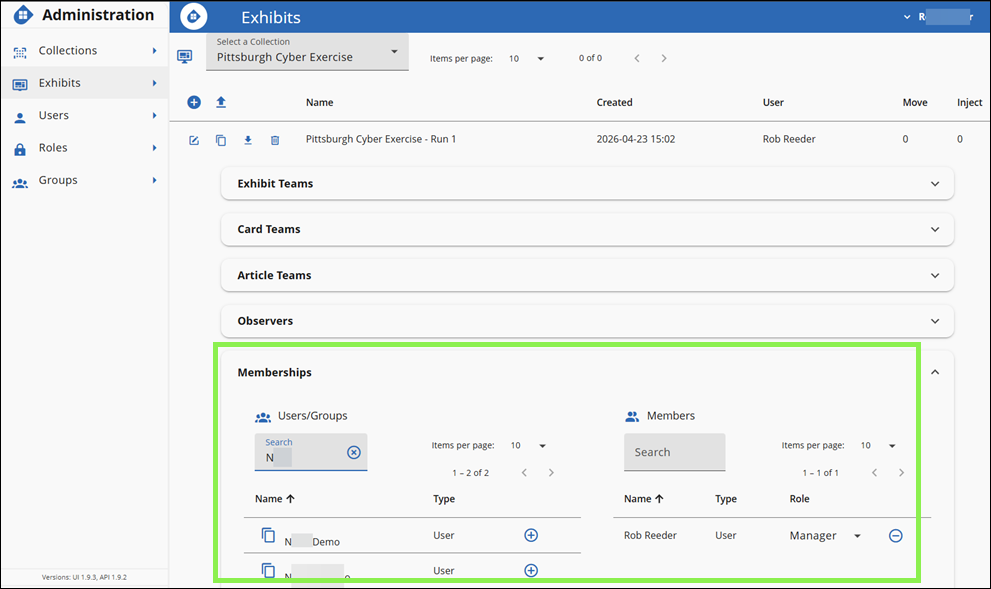

To add a member:

1. Under **Users/Groups**, find the user or group and click **+** (**Add [User Name]**).
2. In the **Role** dropdown next to the member under **Members**, select the desired role.

To remove a member, under **Members**, find the user or group and click **-**.

### Users

The Users page lists all Gallery users and their assigned roles.

The available roles are:

- **None Locally**: No Gallery-specific permissions assigned.
- **Administrator**: Full administration privileges across all Gallery pages.
- **Content Developer**: Can create collections and exhibits, and view roles and groups.
- **Observer**: Can view collections, exhibits, users, roles, and groups.

Most users won't have any role assigned in this application.

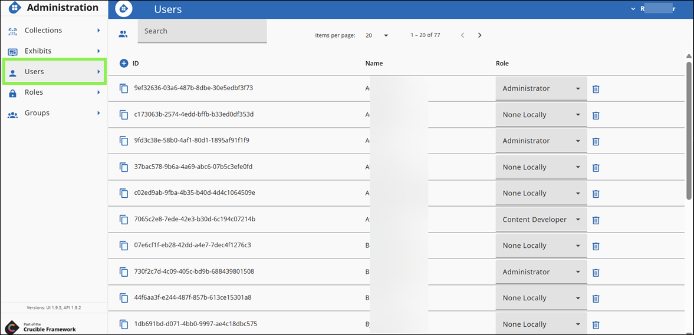

#### Add a User

Users with the **Manage Users** permission can add users. To add a user, follow these steps:

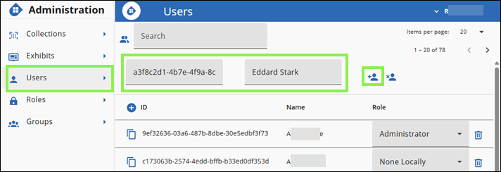

1. Under the Users Administration View, click **+** (**Add User**).
2. In **User ID**, enter the user's GUID (for example, `a3f8c2d1-4b7e-4f9a-8c33-2e1f6b5a9d0c`).
3. In **User Name**, enter the user's name (for example, `Eddard Stark`).
4. Click **Add this user**.
5. In the **Role** dropdown next to the user, select the appropriate role.

#### Change a User's Role

In the **Role** dropdown next to the user, select the desired role.

#### Delete a User

To delete a user, click the **Trash Can** next to the user.

### Roles

The Roles page defines the permissions for application-level roles and collection and exhibit-specific roles. Gallery has three role scopes: **Roles** (application-wide), **Collection Roles**, and **Exhibit Roles**.

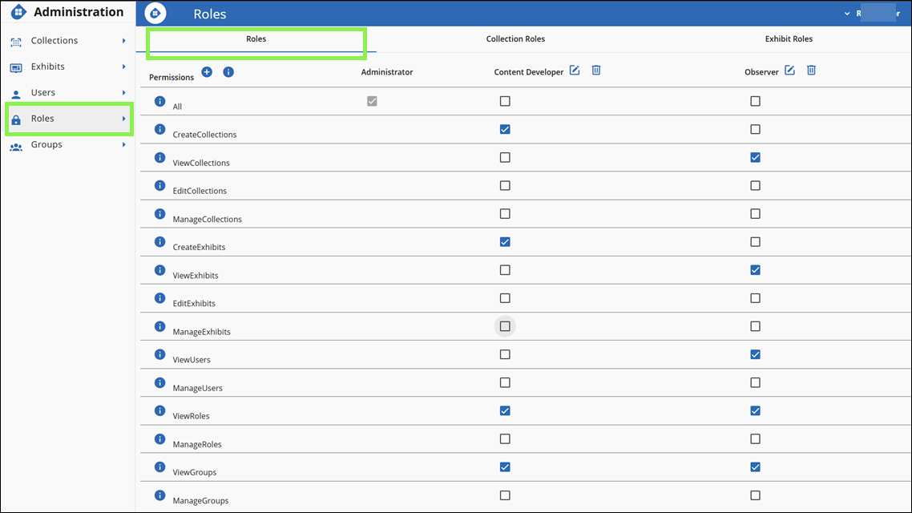

#### Roles

The **Roles** tab defines application-wide roles and their permissions. Gallery has three application-wide roles:

- **Administrator**: Has all permissions.
- **Content Developer**: Can create collections and exhibits, and view roles and groups.
- **Observer**: Can view collections, exhibits, users, roles, and groups.

Administrators can add custom roles using **+** and edit or delete existing roles using the pencil and trash can icons.

#### Collection Roles

Collection Roles control what users can do within a specific collection. The available collection roles are:

- **Manager**: Full access to the collection.
- **Member**: Can view and edit the collection.
- **Observer**: Can view the collection.

#### Exhibit Roles

Exhibit Roles control what users can do within a specific exhibit. The available exhibit roles are:

- **Manager**: Full access to the exhibit.
- **Member**: Can view and edit the exhibit.
- **Observer**: Can view the exhibit.

### Groups

Groups allow administrators to organize users for easier management.

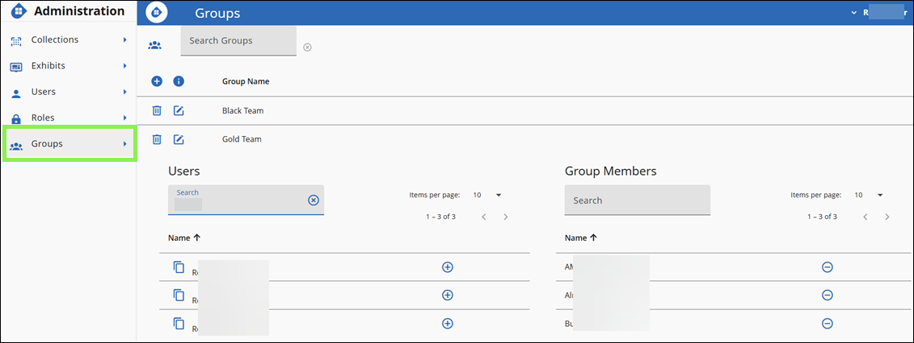

#### Add a Group

1. Click **+** (**Add New Group**).
2. In **Name**, enter the group name.
3. Click **Save**.

#### Edit and Delete a Group

- **Edit:** Click **Edit** (pencil icon) next to the group, make the desired changes, and click **Save**.
- **Delete:** Click the **Trash Can** next to the group.

#### Add and Remove Users in a Group

To add a user to a group:

1. Click the group row to expand its configuration.
2. Under **Users**, find the user and click **+**.

To remove a user from a group, under **Group Members**, find the user and click **-**.

## User Guide

Participants use the Gallery Wall and Archive to track and respond to exercise events.

### Gallery Landing Page

The Gallery landing page displays the exhibits the user is a participant in.

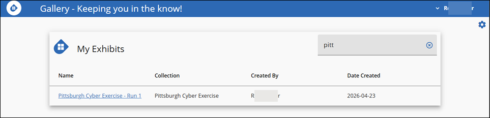

#### Search for an Exhibit

To search for an exhibit, follow these steps:

1. Navigate to Gallery's landing page.
2. In the **Search** field, enter the name of the exhibit.

### Gallery Wall

The Gallery Wall displays cards with color-coded status indicators:

- **Red:** Indicates a closed status.
- **Orange:** Indicates a critical status.
- **Yellow:** Indicates an affected status.
- **Green:** Indicates an open status.

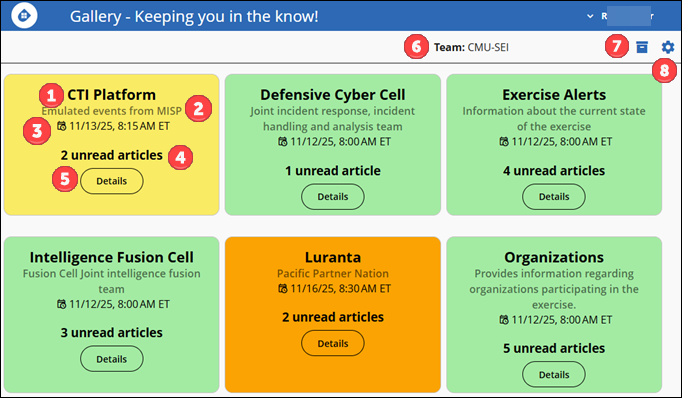

1. **Title:** The title of the card.
2. **Description:** A brief description of the event.
3. **Date Posted:** The date and time the card was last updated.
4. **Unread Articles:** The number of unread articles on the card.
5. **Details:** Opens additional details and filtered articles for the card.
6. **Team:** Displays the currently selected team. Users who are also observers can use this to switch between teams and view other teams' progress during the exercise.
7. **Wall and Archive Toggle:** Toggles between the Gallery Wall and Gallery Archive.
8. **Gear:** Opens the Administration View. See [Administration View](#administration-view).

### Gallery Archive

The Gallery Archive is a collection of articles from reporting, intelligence, news, and social media sources. Articles accumulate throughout the exercise as moves progress. Each article displays its title, source type, source name, and date posted.

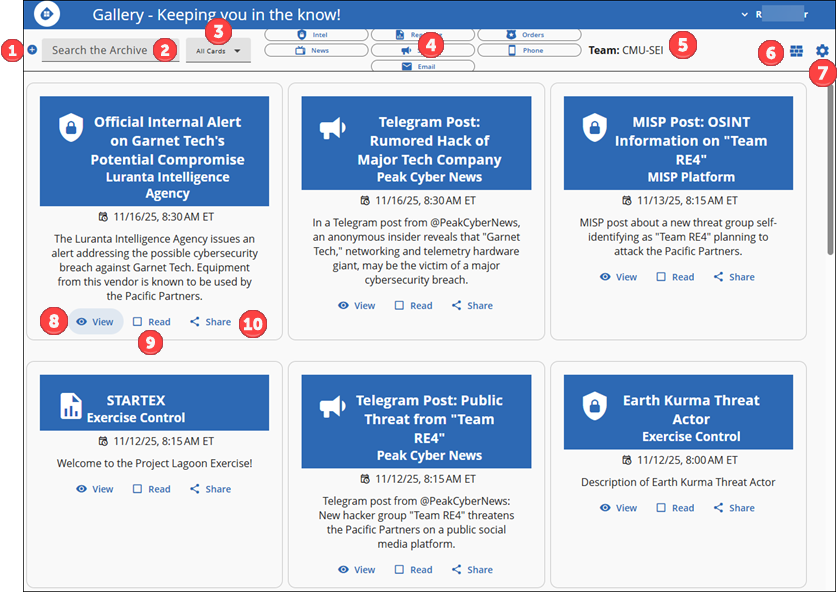

1. **Add an Article:** Click **+** to add a new article to the Archive. See [Add Articles During an Exercise](#add-articles-during-an-exercise).
2. **Search the Archive:** Enter terms to filter articles by keyword.
3. **Cards Filter:** Filter articles by card category.
4. **Source Filters:** Filter articles by source type (Intel, Reporting, Orders, News, Phone, or Email).
5. **Team:** Displays the currently selected team. Users who are also observers can use this to switch between teams and view other teams' progress.
6. **Wall and Archive Toggle:** Toggles between the Gallery Wall and Gallery Archive.
7. **Gear:** Opens the Administration View. See [Administration View](#administration-view).
8. **View:** Opens the full article in a pop-up or new tab.
9. **Read:** Marks the article as read to track new content.
10. **Share:** Shares the article with another team.

<!-- TODO: Clarify where Share sends the article — email? in-app notification? -->

### Add Articles During an Exercise

Users with the appropriate Content Developer permissions can add articles to the Gallery Archive throughout the course of an exercise event. To add an article:

1. On the Gallery Archive, in the top left corner, click **+** (**Add an Article** icon) to add an article.
2. In **Name**, enter the article name (for example, `No cell phone connectivity`).
3. In **Summary**, enter a short summary (for example, `No cell phone connectivity after pass of Hurricane Delta`).
4. In **Description**, enter the full article content (for example, `Hurricane Delta made landfall as a Category 4 storm, destroying cell towers and disabling backup generators. An estimated 340,000 residents are without mobile service.`).
5. In **URL**, enter a URL to provide a link to additional information (for example, `https://www.coastnews.com/hurricane-delta-cell-outages`).
6. Select **Open URL in new tab** to open the URL in a new browser tab.
7. In **Card**, select the card to categorize this article (for example, `Communications Sector`).
8. In **Status**, select the article's status (for example, `Affected`).
9. Click **Save**.

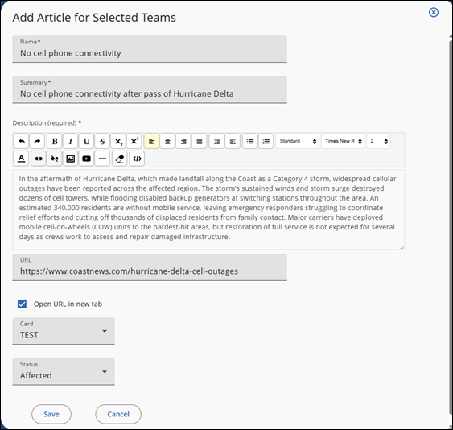

After you create your article, the Gallery Archive displays it like this.

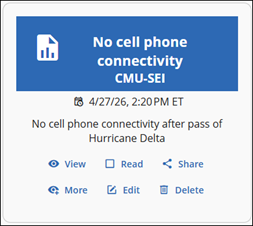

#### Edit an Article

To edit an article, follow these steps:

1. On the Gallery Archive, select the article to edit and click **Edit** on the article's card. The article opens in the same form used when creating an article.
2. After making all necessary edits, click **Save**.

#### Delete an Article

To delete an article, follow this step:

1. On the Gallery Archive, select the article to delete and click **Delete** (the trash can icon) on the article's card.

## Glossary

This glossary defines key terms and concepts used in the Gallery application.

**Article**: A piece of writing that typically relates to a particular topic.

**Card**: Groups articles into their respective categories. Define categories in the administration panel.

**Collection**: A set of articles.

**Content Developer Permission**: Grants a user the ability to create collections and exhibits, and view roles and groups.

**Email Filter**: Information gathered from messages distributed by electronic means.

**Exhibit**: The scheduled instance of a collection.

**Gallery**: Web application where participants receive incident information.

**Gallery Archive**: A collection of relevant information from reporting, intelligence, news, and social media sources.

**Gallery Wall**: The dashboard that displays "cards" to help participants visualize the incident.

**Intel Filter**: Information acquired by an intelligence agency.

**News Filter**: Information acquired by a broadcast or published report of news.

**Observer Role**: Individuals tasked with impartially and objectively monitoring teams during an exercise.

**Orders Filter**: Information gathered based on a decision issued by an authoritative order.

**Phone Filter**: Information gathered from SMS messages and phone calls.

**Reporting Filter**: Information gathered from a document in an organized and objective way, without analysis or recommendations.

**Social Media Filter**: Information acquired from multiple users on a social media platform.
