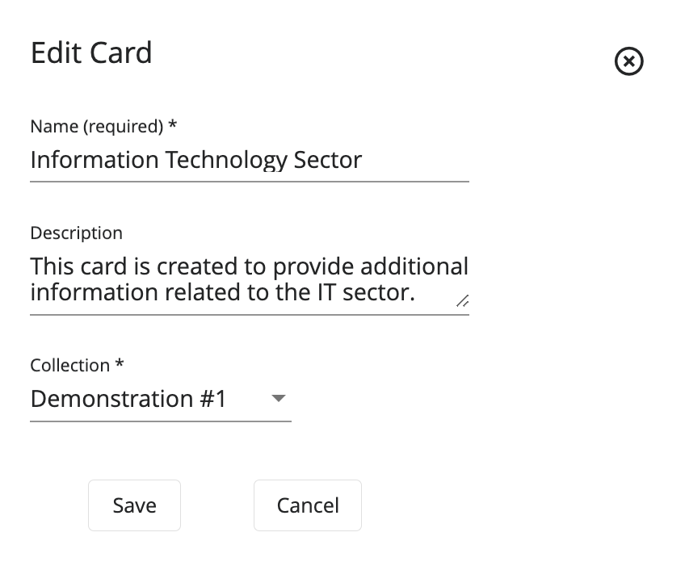

#  **Gallery:** Keeping You in the Know

## Overview

[**Gallery**](#glossary) is a web application where participants receive incident information.

In the Gallery user interface, there are two major functional sections:

- [Gallery Wall](#glossary): The dashboard that displays ["cards"](#glossary) to help participants visualize the incident.
- [Gallery Archive](#glossary): A collection of information that contains relevant reporting, intelligence, news, and social media.

For installation, refer to these GitHub repositories.

- [Gallery UI Repository](https://github.com/cmu-sei/Gallery.Ui)
- [Gallery API Repository](https://github.com/cmu-sei/Gallery.Api)

## User Guide

### Gallery Landing Page

The landing page of Gallery provides a central approach to recompiling all collections and exhibits that the user is a participant of into just one display.

First, users select a collection from the dropdown; then, they choose an exhibit from the displayed list.

#### Search for an Exhibit

To search for an exhibit, follow these steps:

1. Navigate to Gallery's landing page.
2. Select a collection from the dropdown.
3. Click the **Search Bar** and add the name of the creator of the exhibit.

### Gallery Wall

The Gallery Wall is a dashboard with red, orange, yellow, and green status indicators. Each of these cards have a specific set of actions, which will help users throughout the in-game exercise.

- **Red:** Indicates a closed status.
- **Orange:** Indicates a critical status.
- **Yellow:** Indicates an affected status.
- **Green:** Indicates an open status.

The following image will show some important hotspots about the Gallery Wall. Reference the number on the hotspot to know more about each section.

#### Title

##### Hotspot 1

The title of the card.

#### Description

##### Hotspot 2

A brief description of the event.

#### Date Posted

##### Hotspot 3

The date and time the card was last updated.

#### Unread Articles

##### Hotspot 4

The number of [articles](#glossary) left to read from the event.

#### Details

##### Hotspot 5

Provides additional details than those provided in the Gallery Wall. All articles related to the event will be filtered and shown to provide more information.

#### Team Selection

##### Hotspot 6

This feature enables a user who is part of a team, as well as an observer, to toggle back and forth between teams. When assigned an observer role, the user will be able to see how other teams progress during the exercise, as well as participate on their own team.

#### Wall & Archive Toggle

##### Hotspot 7

By using this icon, users can toggle between the Gallery Wall and Gallery Archive.

### Gallery Archive

The Gallery Archive is a collection of information that contains relevant reporting, intelligence, news, and social media data sources.

The following image will show some important hotspots about the Gallery Archive. Reference the number on the hotspot to know more about each section.

#### Add an Article

##### Hotspot 1

Users assigned the appropriate permissions can add articles to the Archive related to the exercise current events.

To add an article, refer to this section, [Add Articles During an Exercise](#add-articles-during-an-exercise).

#### Search

##### Hotspot 2

The archive contains all "move" data that has been shared up to this point in the exercise. Users can search, sort, and filter information in the archive.

To search the archive, enter the terms in the **Search the Archive** field. The search feature automatically narrows down the results.

#### Cards Filter

##### Hotspot 3

Users can use this dropdown to further filter intelligence information. Users can sort the Gallery articles based on their card categories. This will be useful for users that are searching for information from a specific category.

#### Source Filters

##### Hotspot 4

These articles come from different categories of sources: [reporting](#glossary), [news](#glossary), [orders](#glossary), [phone](#glossary), [email](#glossary), [intel](#glossary), and [social media](#glossary). Users can select one or multiple filters to display only the cards that belong to those filter categorizations.

#### Article Information

##### Hotspot 5

The information in the Gallery Archive is displayed in articles. Each article contains the Title, Source Type, Source Name, and Date Posted.

For the information included on the article:

- **Title:** The title of the intelligence report.
- **Source Type:** The source of the intelligence report (News, Intel, Reporting, or Social Media).
- **Source Name:** The specific person or agency who supplied the intelligence.
- **Date Posted:** The date and timestamp of when the intelligence report was posted.

#### View

##### Hotspot 6

View the full article in a pop up page or open the article in a new tab for better visualization.

#### Read

##### Hotspot 7

After reading an article, mark it as read to keep track of new articles.

#### Share

##### Hotspot 8

With this feature, users can share an article with other users using a mail service.

To share an article with another team, click **Share**. In the **Share Article** screen:

1. Under **Share with...**, select a team.
2. Under **Email Contents...**, make any edits to the Subject and Message of the article.
3. Click **Share**.

#### More

##### Hotspot 9

When enabled, attached documents with additional information will be provided for users to access and read.

#### Team Selection

##### Hotspot 10

This feature enables a user who is part of a team, as well as an observer, to toggle back and forth between teams. When assigned an observer role, the user will be able to see how other teams progress during the exercise, as well as participate on their own team.

#### Wall & Archive Toggle

##### Hotspot 11

By using this icon, users can toggle between the Gallery Wall and Gallery Archive.

### Add Articles During an Exercise

Users with the appropriate Content Developer permissions, can add articles to the Gallery Archive throughout the course of exercise events.

Assuming that the user has been granted the appropriate permissions by the exercise administrator, follow these steps to add an article during an exercise.

1. On the Gallery Archive section, click **+** to add an article.
2. Fill the fields as necessary following the Data Format Table specifications.

#### Data Format Table

| Field      | Data Type  | Description | Example    |
| ---------- | ---------- | ----------- | ---------- |
| **Name**         | String        | Name of the article | No cell phone connectivity |
| **Summary** | String | Short summary of the article | No cell phone connectivity after pass of Hurricane Delta |
| **Description** | Rich Text | Description with characteristics and details of the article | In a world driven by constant connectivity, the sudden absence of cell phone signals... |
| **Url for more info** | String | If additional details are necessary, provide the URL | `www.bbcnews.com/hurricane-delta` |
| **Open URL in new tab** | Boolean | Select if URL provided should be opened in a new tab | True |
| **Card** | Dropdown Text | Article's classification amongst Gallery cards | Communications Sector |
| **Status** | Dropdown Text | Status of how the article affects the exercise situation | Affected |

To save these settings, click **Save**.

After creating your article, it will be displayed in the Gallery Archive in the following way.

#### Edit an Article

To edit an article, follow these steps:

1. On the Gallery Archive section, select the article you wish to edit and click the **Edit Icon** on the article's card.
2. The system opens the same edit component used when creating a new article.
3. After doing all the necessary edits, click **Save**.

#### Delete an Article

To delete an article, follow these steps:

1. On the Gallery Archive section, select the article to be deleted and click the **Trash Can Icon** on the article's card.

## Administrator Guide

### Users

The following image shows the Users Administration Page. Here, administrators can add and delete users. Additionally, administrators will be able to assign the necessary permissions to each user.

The available permissions are:

- [System Admin](#glossary): Permission that will grant a user all administration privileges on the Gallery application.
- [Content Developer](#glossary): Permission to manage other Gallery admin pages except the Users admin page and their permissions.

Most users won't have any permissions assigned in this application.

#### Add a User

Assuming that the user has been granted the appropriate permissions by the exercise administrator, follow these steps to add a user.

1. Under the Users Administration View, click **Add User**.
2. Fill the fields as necessary following the Data Format Table specifications.

#### Data Format Table

| Field      | Data Type  | Description | Example    |
| ---------- | ---------- | ----------- | ---------- |
| **Name**         | String        | Name or username that identifies the user | user-1 |
| **ID** | GUID | Unique ID for the user | 9dd4e3d8-5098-4b0a-9216-697cda5553f8 |
| **Email** | String | User's email contact | `user@this.ws` |

To save these settings, click **Save** and select the desired permissions to be assigned by clicking on the checkbox next to the user.

#### Edit User's Information

To edit a user, follow these steps:

1. Click the **Settings Cog**.
2. Navigate to the **Users** tab.
3. Select the user you wish to edit and click the **Edit Icon** next to the user.
4. The system opens the same edit component used when creating a new user.
5. After doing all the necessary edits, click **Save**.

#### Delete a User

To delete a user, follow these steps:

1. Click the **Settings Cog**.
2. Navigate to the **Users** tab.
3. Select the user to be deleted and click the **Trash Can Icon** next to the user.

### Collections

The following image shows the Collections Administration Page. Here, administrators can add, upload, download, copy, and delete [collections](#glossary). These are where the articles will be assigned to, in the case there are multiple exercises running at the same time.

#### Add a Collection

Assuming that the user has been granted the appropriate permissions by the exercise administrator, follow these steps to add a collection.

1. Under the Collections Administration View, click **+ Icon**.
2. Fill the fields as necessary following the Data Format Table specifications.

#### Data Format Table

| Field      | Data Type  | Description | Example    |
| ---------- | ---------- | ----------- | ---------- |
| **Name**         | String        | Name of the collection | NCIS Demonstration |
| **Description** | String | Details, characteristics and information of the collection | This is a collection created for demo purposes. |

To save these settings, click **Save**.

#### Edit a Collection

To edit a collection, follow these steps:

1. Click the **Settings Cog**.
2. Navigate to the **Collections** tab.
3. Select the collection you wish to edit and click the **Edit Icon** next to the collection.
4. The system opens the same edit component used when creating a new collection.
5. After doing all the necessary edits, click **Save**.

#### Delete a Collection

To delete a collection, follow these steps:

1. Click the **Settings Cog**.
2. Navigate to the **Collections** tab.
3. Select the collection to be deleted and click the **Trash Can Icon** next to the collection.

#### Upload a Collection

Assuming that the user has been granted the appropriate permissions by the exercise administrator, follow these steps to upload a collection.

1. Click the **Settings Cog**.
2. Navigate to the **Collections** tab.
3. Click the **Up Arrow** next to the + Icon.
4. Select the collection JSON file to be uploaded.

#### Download a Collection

Assuming that the user has been granted the appropriate permissions by the exercise administrator, follow these steps to download a collection.

1. Click the **Settings Cog**.
2. Navigate to the **Collections** tab.
3. Click the **Down Arrow** next to the collection to be downloaded.
4. Look for the JSON file in your Downloads folder.

#### Copy a Collection

Assuming that the user has been granted the appropriate permissions by the exercise administrator, follow these steps to copy a collection.

1. Click the **Settings Cog**.
2. Navigate to the **Collections** tab.
3. Click the **Copy Icon** next to the collection to be copied.
4. Look for the collection name with the user's name.

### Cards

The following image shows the Cards Administration Page. Here, administrators can add and delete cards. These are the different cards presented in the Gallery Wall and where different articles related to that card can be found.

#### Add a Card

Assuming that the user has been granted the appropriate permissions by the exercise administrator, follow these steps to add a card.

1. Under the Cards Administration View, click **Add Card**.
2. Fill the fields as necessary following the Data Format Table specifications.

#### Data Format Table

| Field      | Data Type  | Description | Example    |
| ---------- | ---------- | ----------- | ---------- |
| **Name**   | String     | Name of the card | Information Technology Sector |
| **Description** | String | Details, characteristics and information of the card | This card is created to provide additional information related to the IT sector. |
| **Collection** | Dropdown Text | Select the collection this card should be part of | Demonstration #1 |

To save these settings, click **Save**.

#### Edit a Card

To edit a card, follow these steps:

1. Click the **Settings Cog**.
2. Navigate to the **Cards** tab.
3. Select the card you wish to edit and click the **Edit Icon** next to the card.
4. The system opens the same edit component used when creating a new card.
5. After doing all the necessary edits, click **Save**.

#### Delete a Card

To delete a card, follow these steps:

1. Click the **Settings Cog**.
2. Navigate to the **Cards** tab.
3. Select the card to be deleted and click the **Trash Can Icon** next to the card.

### Articles

The following image shows the Articles Administration Page. Here, administrators can add and delete articles. These are different articles providing supplemental information from different sources to keep the exercise going.

#### Add an Article

Assuming that the user has been granted the appropriate permissions by the exercise administrator, follow these steps to add an article.

1. Under the Article Administration View, click **Add Article**.
2. Fill the fields as necessary following the Data Format Table specifications.

#### Data Format Table

| Field      | Data Type  | Description | Example    |
| ---------- | ---------- | ----------- | ---------- |
| **Name**   | String     | Name of the article | Hurricane Delta has landed in Fort Myers |
| **Summary** | String | Short summary and details of the article | Hurricane Delta has caused major damages |
| **Description** | Rich Text | Details, characteristics and information of the article | Hurricane Delta, Category 5 hurricane, has caused major damages in Fort Myers... |
| **Card** | Dropdown Text | Select the card this article should be categorized with | Energy Sector |
| **Status** | Dropdown Text | Select the article's status on how it affects the exercise | Critical |
| **Source Type** | Dropdown Text | Select the source or author type of the article | Intel |
| **Source Name** | String | Name or author of the article | BBC News |
| **URL for more info** | String | URL if additional information is provided to participants | `www.bbcnews.com/hurricane-delta` |
| **Open URL in new tab** | Boolean | If URL is provided, select if it should be opened in a new tab | True |
| **Move** | Integer | Move number this article should be part of | 1 |
| **Inject** | Integer | Inject number this article should be part of | 1 |
| **Posted Date/Time** | Datetime | Date/Time when this article was posted | 08/02/2021, 15:12:49 |

To save these settings, click **Save**.

#### Edit an Article

To edit an article, follow these steps:

1. Click the **Settings Cog**.
2. Navigate to the **Articles** tab.
3. Select the article you wish to edit and click the **Edit Icon** next to the article.
4. The system opens the same edit component used when creating a new article.
5. After doing all the necessary edits, click **Save**.

#### Delete an Article

To delete an article, follow these steps:

1. Click the **Settings Cog**.
2. Navigate to the **Articles** tab.
3. Select the article to be deleted and click the **Trash Can Icon** next to the article.

### Exhibits

The following image shows the Exhibits Administration Page. Here, administrators configure the actual exercise to be run based on the teams, collections and articles previously configured.

#### Add an Exhibit

Assuming that the user has been granted the appropriate permissions by the exercise administrator, follow these steps to add an [exhibit](#glossary).

1. Under the Exhibit Administration View, click **+ Icon**.
2. Fill the fields as necessary following the Data Format Table specifications.

#### Data Format Table

| Field      | Data Type  | Description | Example    |
| ---------- | ---------- | ----------- | ---------- |
| **Current Move** | Integer | Number of the current move | 1 |
| **Current Inject** | Integer | Number of the inject within the move | 2 |
| **Scenario ID** | GUID | ID value for the scenario | Automatically generated by the system |

To save these settings, click **Save**.

#### Edit an Exhibit

To edit an exhibit, follow these steps:

1. Click the **Settings Cog**.
2. Navigate to the **Exhibits** tab.
3. Select the exhibit you wish to edit and click the **Edit Icon** next to the exhibit.
4. The system opens the same edit component used when creating a new exhibit.
5. After doing all the necessary edits, click **Save**.

#### Delete an Exhibit

To delete an exhibit, follow these steps:

1. Click the **Settings Cog**.
2. Navigate to the **Exhibits** tab.
3. Select the exhibit to be deleted and click the **Trash Can Icon** next to the exhibit.

#### Upload an Exhibit

To upload an exhibit, follow these steps:

1. Click the **Settings Cog**.
2. Navigate to the **Exhibits** tab.
3. Click the **Up Arrow** next to the + Icon.
4. Select the exhibit JSON file to be uploaded.

!!! note

​    When adding a new exhibit, a new collection with the uploaded exhibit will be created. To view the uploaded exhibit, navigate to the collection using the dropdown and select the collection with the same name as the file uploaded.

#### Download an Exhibit

To download an exhibit, follow these steps:

1. Click the **Settings Cog**.
2. Navigate to the **Exhibits** tab.
3. Click the **Down Arrow** next to the exhibit to be downloaded.
4. Look for the JSON file in your Downloads folder.

#### Copy an Exhibit

To copy an exhibit, follow these steps:

1. Click the **Settings Cog**.
2. Navigate to the **Exhibits** tab.
3. Click the **Copy Icon** next to the exhibit to be copied.
4. Look for the exhibit name with the user's name.

#### Configure an Exhibit

To configure an exhibit to be used for an exercise, administrators will need to add Exhibit Teams, Card Teams, Article Teams, as well as assign the respective Observers (if desired). To do this, follow these steps.

#### Add a Team to an Exhibit

To add a team to the Exhibit, follow these steps.

1. Click the **+** icon.
2. Fill the fields as necessary following the Data Format Table specifications.

#### Data Format Table

| Field      | Data Type  | Description | Example    |
| ---------- | ---------- | ----------- | ---------- |
| **Name** | String | Full name of the team | Carnegie Mellon University |
| **Short Name** | String | Short name of the team, such as an acronym | CMU |
| **Email** | String | Team's email contact | `sei@cmu.edu` |

To save these settings, click **Save**.

To configure a team, follow these steps.

1. Select the team to be configured and click it to expand its configuration details.
2. Under the **All Users** tab, users that have not been assigned to the team will be shown. To add them to the team, click **Add User**.
3. Under the **Team Users** tab, users that have already been assigned to the team will be shown. To remove a user from the team, click **Remove**.
4. If desired, check the **Observer** checkbox to assign that role to the user during the exercise.

#### Add a Team Card to an Exhibit

To add a Team Card to the Exhibit, follow these steps.

1. Click the **+** on the Card Teams section.
2. Fill the fields as necessary following the Data Format Table specifications.

#### Data Format Table

| Field      | Data Type  | Description | Example    |
| ---------- | ---------- | ----------- | ---------- |
| **Team** | Dropdown Text | Team the card should be part of | CMU - Carnegie Mellon University |
| **Card** | Dropdown Text | Gallery card to be assigned | Communications Sector |
| **Move** | Integer | Move number the card is part of | 1 |
| **Inject** | Integer | Inject number the card is part of | 2 |
| **Is Shown On Wall** | Boolean | Select whether the card should be shown on the Gallery Wall for the team | True |
| **Can Post New Articles** | Boolean | Select whether the team can add new articles to this card | True |

To save these settings, click **Save**.

#### Add an Article to a Team

To add an article to a team, follow these steps.

1. Select the **Card** to be configured.
2. Under the **Exhibit Teams** tab, teams that haven't been assigned to an article will be shown. To add them to the Article Teams, click **Add**.
3. Under the **Article Teams** tab, teams that have already been assigned will be shown. To remove a team, click **Remove**.

#### The Observer Role

To assign the [Observer Role](#glossary) to a user:

1. Under **Evaluation Users**, search for the desired user.
2. Once the user has been found, click **Add**.

To remove the Observer Role from a user:

1. Under **Observers**, search for the desired user.
2. Once the user has been found, click **Remove**.

## Glossary

The following glossary provides a brief definition of key terms and concepts as they are used in the context of the Gallery application.

1. **Articles**: A piece of writing that typically relates to a particular topic.
2. **Cards**: Groups articles into their respective categories, the categories can be defined in the administration panel.
3. **Collection**: A set of articles.
4. **Content Developer Permission**: Will grant a user the ability to manage other Gallery administration pages, except the users administration page and their permissions.
5. **Email Filter**: Information that was gathered from messages distributed by electronic means.
6. **Exhibit**: The scheduled instance of a collection.
7. **Gallery**: Web application where participants receive incident information.
8. **Gallery Archive**: A collection of information that contains relevant information from reporting, intelligence, news, and social media sources.
9. **Gallery Wall**: The dashboard that displays "cards" to help participants visualize the incident.
10. **Intel Filter**: Information that was acquired by an intelligence agency.
11. **News Filter**: Information that was acquired by a broadcast or published report of news.
12. **Observer Role**: Individuals who are tasked with impartially and objectively monitoring teams during an exercise.
13. **Orders Filter**: Information that was gathered based on a decision issued by an authoritative order.
14. **Phone Filter**: Information that was gathered from SMS messages and phone calls.
15. **Reporting Filter**: Information that was gathered from a document that provides information in an organized and objective way, without analysis or recommendations.
16. **Social Media Filter**: Information that was acquired from multiple users on a social media platform.
17. **System Admin Permission**: Will grant a user all administration privileges on the Gallery application.
