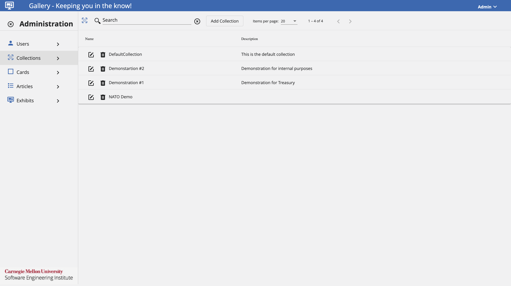

# **Gallery**
*Keeping You in the Know!*

## Overview

### What is Gallery?

[**Gallery**](#glossary) is a web application where participants receive incident information.

In the Gallery User Interface, there are two major functional sections:

- [Gallery Wall](#glossary): The dashboard that displays ["cards"](#glossary) to help participants visualize the incident.
- [Gallery Archive](#glossary): A collection of information that contains relevant reporting, intelligence, news, and social media.

For installation, refer to these GitHub repositories.

- [Gallery UI Repository](https://github.com/cmu-sei/Gallery.Ui)

- [Gallery API Repository](https://github.com/cmu-sei/Gallery.Api)

## User Guide

### Gallery Wall

The Gallery Wall is a dashboard with red, orange, yellow, and green status indicators. Each of these cards have a specifc set of actions, which will help users throughout the in-game exercise. 

- Red: indicates a closed status.
- Orange: indicates a critical status.
- Yellow: indicates an affected status.
- Green: indicates an open status.

The following image will show some important hotspots about the Gallery Wall. Reference the number on the hotspot to know more about this section.

#### Title
*Hotspot 1:*

The title of the card.

#### Description
*Hotspot 2:*

A brief description of the event.

#### Date Posted
*Hotspot 3:*

The date and time the card was last updated.

#### Unread Articles
*Hotspot 4:*

The number of [articles](#glossary) left to read from the event.

#### Details
*Hotspot 5:*

Provides additional details than those provided in the Gallery Wall Dashboard. All articles related to the event will be filtered and shown to provide more information.

#### Wall & Archive Toggle
*Hotspot 6:*

By using this icon, users can toggle between the Gallery Wall & Gallery Archive.

### Gallery Archive

The Gallery Archive is a collection of information that contains relevant reporting, intelligence, news, and social media data sources.

The following image will show some important hotspots about the Gallery Archive. Reference the number on the hotspot to know more about this section.

image.png

#### Search & Sources
*Hotspot 1:*

These articles come from different categories of sources: [reporting](#glossary), [news](#glossary), [orders](#glossary), [phone](#glossary), [email](#glossary), [intel](#glossary), and [social media](#glossary). The archive contains all "move" data that has been shared up to this point in the exercise. Users can search, sort, and filter information in the archive.

To search the archive, enter the terms in the **Search the Archive** field. The search feature automatically narrows down the results.

#### Archive Information
*Hotspot 2:*

The information in the Gallery Archive is displayed in articles. Each article contains the **Title, Source Type, Source Name, and Date Posted**.

For the information included on the article:

- Title: The title of the intelligence report.
- Source Type: The source of the intelligence report (News, Intel, Reporting, or Social Media).
- Source Name: The specific person or agency who supplied the intelligence.
- Date Posted: The Date and time stamp of when the intelligence report was posted.

#### Read
*Hotspot 3:*

This feature will indicate if the user has read the intelligence or not.

#### Share
*Hotspot 4:*

With this feature, users can share an article with other users using a mail service.

To share an article with another team, click **Share**. In the **Share Article** screen:

1. Under **Share with...**, select a team.
2. Under **Email Contents...**, make any edits to the Subject and Message of the article.
3. Click **Share**.

#### More
*Hotspot 5:*

When enabled, attached documents with additional information will be provided for users to access and read.

#### Filter
*Hotspot 6:*

Users can use the dropdown to further filter intelligence information. Users can sort the Gallery articles based on their categories. This will be useful for users that are searching for information from a specific category or article.

#### Wall & Archive Toggle
*Hotspot 7:*

By using this icon, users can toggle between the Gallery Wall & Gallery Archive.

## Administrator Guide

### Users

The following image shows the Users Administration Page. Here, administrators can add and delete users. Additionally, administrators will be able to assign the necessary permissions to each user.

The available permissions are:

- [System Admin](#glossary): Permission that will grant a user all administration privileges on the Gallery application.
- [Content Developer](#glossary): Will be provided the permission to manage other Gallery Admin pages except the Users Admin page and their permissions.

Most users won't have any permissions assigned in this application.

**Add a User**

Assuming that the user has been granted the appropriate permissions by the exercise admnistrator, follow these steps to add a user.

1. Under the Users Administration View, click **Add User**.
2. Add a **Name** for the user.
3. Add a **User ID** that should be a GUID value.
4. Add an **Email** for the user.
5. Click **Save**
6. After adding the user to Gallery, select the desired permissions to be assigned by cliking on the checkboxed next to the user.

If necessary, a user can be deleted by clicking on the **Trash Icon** next to the desired user.

In the same way, a user can be edited by cliking on the **Edit Icon** next to the desired user.

### Collections

The following image shows the Collections Administration Page. Here, administrators can add and delete [collections](#glossary). These are where the articles will be assigned to, in the case there are multiple exercises running at the same time.

**Add a Collection**

Assuming that the user has been granted the appropriate permissions by the exercise administrator, follow these steps to add a collection.

1. Under the Collections Administration View, click **Add Collection**.
2. Add a **Name** for the collection.
3. Add a **Description** about the collection.
4. Click **Save**.

If necessary, a collection can be deleted by cliking on the **Trash Icon** next to the desired collection.

In the same way, a collection can be edited by cliking on the **Edit Icon** next to the desired collection.

### Cards

The following image shows the Cards Administration Page. Here, administrators can add and delete cards. These are the different cards presented in the Gallery Wall and where different articles related to that card can be found. 

**Add a Card**

Assuming that the user has been granted the appropriate permissions by the exercise administrator, follow these steps to add a card.

1. Under the Cards Administration View, click **Add Card**.
2. Add a **Name** for the card.
3. Add a **Description** about the card.
4. From the options, select the desired **Collection**.
5. Click **Save**.

If necessary, a card can be deleted by cliking on the **Trash Icon** next to the desired card.

In the same way, a card can be edited by cliking on the **Edit Icon** next to the desired card.

### Articles

The following image shows the Articles Administraton Page. Here, administrators can add and delete articles. These are different articles providing information from different sources to keep the exercise going.

**Add an Article**

Assuming that the user has been granted the appropriate permissions by the exercise administrator, follow these steps to add an article.

1. Under the Article Administration View, click **Add Article**.
2. Add a **Name** for the article.
3. Provide a **Description** about the article.
4. From the options, select the corresponding **Card**.
5. From the options, select the desired **Status**.
6. From the options, select the appropriate **Source Type**.
7. Add the **Source Name** for the article.
8. If necessary, provide a **URL** to redirect users to a PDF or link.
9. If desired, check the **Open URL in new tab** box.
10. Add the appropriate **Move Number** for the article to indicate its order.
11. Add the appropriate **Inject Number** for the article to indicate its order within the Move.
12. Specify the appropriate **Date/Time** for the article.
13. Click **Save**.

If necessary, an article can be deleted by clicking on the **Trash Icon** next to the desired article.

In the same way, an article can be edited by clicking on the **Edit Icon** next to the desired article.

### Exhibits

The following images shows the Exhibits Administration Page. Here, administrators configure the actual exercise to be run based on the teams, collections and articles previously configured.

**Add an Exhibit**

Assuming that the user has been granted the appropriate permissions by the exercise administrator, follow these steps to add an [exhibit](#glossary).

1. Under the Exhibit Administration View, click **Add Exhibit**.
2. Provide the **Current Move Number** to indicate its order.
3. Provide the **Current Inject Number** to indicate its order within the Move.
4. Provide the **Scenario ID**.
5. Click **Save**.

If necessary, an exhibit can be deleted by clicking on the **Trash Icon** next to the desired exhibit.

In the same way, an exhibit can be edited by clicking on the **Edit Icon** next to the desired exhibit.

**Configure an Exhibit**

To configure an exhibit to be used for an exercise, administrators will need to add Exhibit Teams, Card Teams, and Article Teams. To do this, follow these steps.

*Exhibit Teams*

1. Add a Team to the Exhibit.
2. Select the team to be configured and click on it to expand its configuration details.
3. Under the **All Users** tab, users that have not been assigned to the team will be shown. To add them to the team, click on **Add User**.
4. Under the **Team Users** tab, users that have already been assigned to the team will be shown. To remove a user from the team, click on **Remove**.

*Card Teams*

1. Click on the **+** on the Card Teams section. 
2. From the options, select the desired **Team**.
3. From the options, select the appropriate **Card**.
4. Add the **Move Number** to indicate its order.
5. Add the **Inject Number** to indicate its order within the Move.
6. If desired, check the **Is Shown On Wall** box.
7. Click **Save**.

*Article Teams*

1. Select the **Card** to be configured.
2. Under the **Exhibit Teams** tab, teams that haven't been assigned to an article will be shown. To add them to the Article Teams, click on **Add**.
3. Under the **Article Teams** tab, teams that have already been assigned will be shown. To remove a team, click on **Remove**.

## Glossary

The following glossary provides a brief definition of key terms and concepts as they are used in the context of the Gallery application. 

1. **Articles**: A piece of writing that typically relates to a particular topic.
2. **Cards**: Groups articles into their respective categories, the categories can be defined in the administration panel.
3. **Collection**: a set of articles.
4. **Content Developer Permission**: Will grant a user the ability to manage other Gallery administration pages, except the users administration page and their permissions.
5. **Email Filter**: Information that was gathered from messages distributed by electronic means.
6. **Exhibit**: the scheduled instance of a collection.
7. **Gallery**: Web application where participants receive incident information.
8. **Gallery Archive**: A collection of information that contains relevant information from reporting, intelligence, news, and social media sources.
9. **Gallery Wall**: The dashboard that displays "cards" to help participants visualize the incident.
10. **Intel Filter**: Information that was acquired by an intelligence agency.
11. **News Filter**: Information that was acquired by a broadcast or published report of news.
12. **Orders Filter**: Information that was gathered based on a decision issued by an authoritative order.
13. **Phone Filter**: Information that was gathered from SMS messages and phone calls.
14. **Reporting Filter**: Information that was gathered from a document that provides information in an organized and objective way, without analysis or recommendations.
15. **Social Media Filter**: Information that was acquired from multiple users on a social media platform.
16. **System Admin Permission**: Will grant a user all administration privileges on the Gallery application.