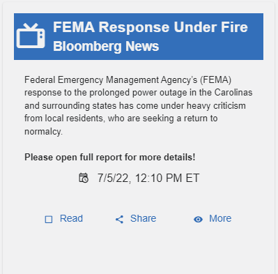

# Gallery Wall

the Gallery Wall is a dashboard with red, yellow, and green indicator cards that help participants visualize and summarize different incident components. 

Clicking Details on a card will toggle to the Gallery Archive where the filtered card(s) will be displayed.  

- Cards can be marked as read.

Read - Blue Text No Background

Unread - White Text Blue Background

- Articles can be shared with another team, click **Share**. In the **Share Article** screen:

1. Under **Share with...** , select a team. 
2. Under **Email Contents...** , make any edits to the Subject and Message of the article.
3. Click **Share**.

- View More Information

Sometimes, exercise facilitators add more content to supplement the article. This could be attached as a PDF document, video, or image – anything at all to enhance the article card. When more information is available, More appears blue. If no supplemental information is available, More appears grayed out. Click More to view supplemental information.
