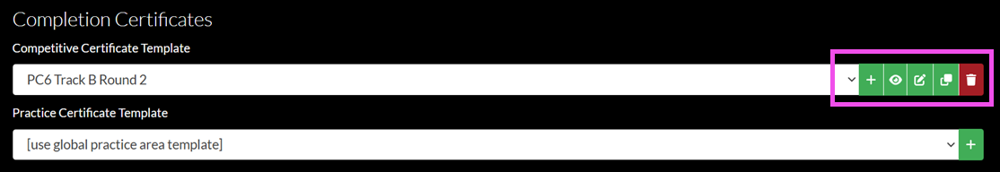

# Configuring certificate templates

testGame participants can view, share, and print certificates of completion as proof of participation in a game. To do so, certificate templates must be configured in a game's Metadata settings. Game organizers (i.e., users who have been granted a role with the appropriate permissions) configure certificate templates to customize the appearance of these completion certificates.

This topic assumes you have been granted a role with the appropriate permissions in Gameboard, you are logged in, and you have a game created.

1. In the top navigation, select **Admin**.
2. Select an existing game, then Select the **Settings cog**. Under Metadata, see the Completion Certificates section. Here you can select an existing certificate template and *add*, *preview*, *edit*, *copy*, and *delete* completion certificate templates.

Certificates are "templatized", allowing a single certificate template to be used across multiple games. Competitive certificate templates and practice certificate templates share a unified set of fields that can be incorporated to display relevant information on the completion certificate generated by the participant.

The keywords, which should be enclosed in `{{double braces}}`, are as follows: `date`, - `division`, `challengeDescription`, `challengeName`, `gameName`, `playerName`, `rank`, `score`, `season`, `series`, `teamName`, `totalPlayerCount`, `totalTeamCount`, `time`, `track`, and `userName`.

## Selecting a certificate template

Players can view a list of past certificates from their Gameboard Profile page too. In Gameboard, click **Profile**. Then click **Certificates**.  A table view of all game certificates is displayed. You can view and print the certificate as a .PDF from the table view.
1. In the game's Metadata settings, under Completion Certificates, choose an existing certificate template from the dropdowns.

## Adding a certificate template

1. In the game's Metadata settings, under Completion Certificates, select the **+** icon.
2. In the **Create Certificate Template** window, enter a **Name** for your certificate template.
3. In the **Template** box, specify the certificate template in HTML. You should not include the entire HTML document (i.e., don't add `<!DOCTYPE html>`, `<html>`, `<head>`, or `<body>` tags). Just provide the essential HTML content, such as `
` and `
` elements.
  - Gameboard automatically inserts your content into a pre-existing, correctly formatted HTML document for display.
  - You can use the **Copy from:** feature to paste an example certificate HTML configuration into the **Template** field. In the **Copy from:** dropdown, select a template to copy from and then click **Copy**.
  - You can include `<style>` blocks to define CSS styles and apply them to your custom HTML elements.
  - You can set a background image for your certificate by using the `.gameboard-print-html` CSS class. Gameboard generates this element when rendering the certificate, and any styles you apply to it (like `background-image`) are used automatically.
4. Click **OK**.

## Previewing a certificate template

This section assumes that you have been granted the Administrator role in Gameboard, you are logged in, and you have a game created.
1. In the game's Metadata settings, under Completion Certificates, select the **eye** icon. The certificate preview launches in a new browser tab.

## Editing a certificate template

1. In the game's Metadata settings, under Completion Certificates, select the **Edit** icon. The **Edit Certificate Template** window is launched.
2. Make any updates in the **Name** and **Template** fields, then click **OK**.

## Copying a certificate template

1. In the game's Metadata settings, under Completion Certificates, select the **Copy** icon. The template's HTML configuration is copied to your clipboard.
2. Paste the HTML into the location of your choice.

## Deleting a certificate template

1. In the game's Metadata settings, under Completion Certificates, select the **Delete** icon. The certificate template is deleted.

!!! warning

    There is no additional confirmation when deleting a certificate template. Clicking **Delete** does indeed delete your certificate template!