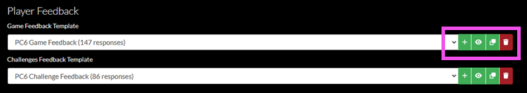

# Feedback Templates

In the Gameboard application, it is possible to use feedback forms to capture participant feedback on a game and challenges. Collecting and analyzing participant feedback can help you refine and improve your user experiences. Feedback *forms* are generated from feedback *templates*.

- Feedback templates are created by users who are granted a role with elevated permissions (`Admin`, `Director`).
- Feedback forms are completed by participants or players in the game.
- Feedback reports are reviewed by users who are granted a role with the appropriate permission (`Admin`, `Director`, and `Support`).

Creating a feedback template is not required to build a game or challenge. It's up to you whether or not you choose to implement feedback. If a feedback template is not configured in the Gameboard administration menu, then the feedback form does not appear for the participant.

You can create questions for *just* a game, *just* challenges, or *both* game and challenges. When you create a feedback template for a game or one of its challenges, you can use that template in other games and challenges too.

It is not possible to change a feedback template after responses have been submitted.

This section assumes you have been granted a role with the appropriate permissions in Gameboard, you are logged in, and you have a game created.

1. In the top navigation, select **Admin**.
2. Select an existing game, then select the **Settings cog**. Under Metadata, see the Player Feedback section. Here you can select an existing feedback template and *add*, *preview*, *edit*, *copy*, and *delete* feedback templates.



## Selecting a Feedback Template

1. In the game's Metadata settings, under Player Feedback, choose an existing certificate template from the dropdowns.

## Adding a Feedback Template

1. In the game's Metadata settings, under Player Feedback, select the **+** icon next to **Game Feedback Template** and/or **Challenges Feedback Template**.
2. In the **Create Template** window, enter a **Name** for your certificate template.
3. In the **Help Text** field, enter a brief explanatory message that guides users on how to complete the feedback form.
4. In the **Template** box, specify the feedback questions in YAML. For guidance, see the [Configuration YAML](#configuration-yaml) section below.
5. You can use the **Copy from:** feature to paste an example configuration into the **Template** field. In the **Copy from:** dropdown, select a template to copy from and then click **Paste Example Configuration**.
6. Click **OK**.

## Previewing a Feedback Template

1. In the game's Metadata settings, under Player Feedback, select the **eye** icon next to **Game Feedback Template** and/or **Challenges Feedback Template**. The feedback template preview launches.
2. Click **OK** to dismiss it.

## Editing a Feedback Template

1. In the game's Metadata settings, under Player Feedback, select the **Edit** icon next to **Game Feedback Template** and/or **Challenges Feedback Template**. The **Edit Template** window is launched.
2. Make any updates in the **Name**, **Help Text**, and **Template** fields, then click **OK**.

## Copying a Feedback Template

1. In the game's Metadata settings, under Player Feedback, select the **Copy** icon next to **Game Feedback Template** and/or **Challenges Feedback Template**. The template's YAML configuration is copied to your clipboard.
2. Paste the YAML into the location of your choice.

## Deleting a Feedback Template

1. In the game's Metadata settings, under Player Feedback, select the **Delete** icon next to **Game Feedback Template** and/or **Challenges Feedback Template**. The feedback template is deleted.

!!! warning

    There is no additional confirmation when deleting a certificate template. Clicking **Delete** does indeed delete your certificate template!

## Configuration YAML

Review the following sample YAML feedback form to understand the keys and their values.

```yaml
questions:
- id: q1
  prompt: Please rate the difficulty of this game.
  shortName: Difficulty
  type: likert
  max: 10
  minLabel: Very Easy
  maxLabel: Very Difficult
  required: true
- id: q2
  prompt: What did you like about this game?
  type: text
```

- `id`: *ids* must be unique within the template. If ids in a single list are not unique, you are presented with a warning.
- `prompt`: this is the question you want the participant to answer or the property you want them to rate.
- `shortName`: an abbreviated version of the prompt. `shortName` is optional, but is helpful for use in tables as the column header. Good examples are "Difficult" or "Quality".
- `type`: `likert` or `text`; if the type is `Likert`, then defining the scale (`max`, `minLabel`, `maxLabel`) of how much a participant can agree or disagree with your prompt is required. If the type is `text`, a participant is free to answer your prompt however they like. Text type questions have a 2,000 character limit.
- `max`: this is the upper extreme of your `Likert` scale; 10 is the recommended upper limit. Any integer greater than 1 will work, but a scale that goes past 10 may become unwieldy or awkward.
- `minLabel`: specify the labels for the extremes of your `Likert` scale; examples of the negative extreme might be "very easy", "strongly disagree", or "very dissatisfied".
- `maxLabel`: specify the labels for the extremes of your `Likert` scale; examples of the positive extreme might be " very difficult", "strongly agree", or "very satisfied".
- `required`: this key is optional; set `required` to `true` if you want to make your question required.

## Reporting on Feedback

Viewing and exporting responses to feedback is also a function of roles with some elevated permissions. Assuming that you are logged into Gameboard as a user with the `Admin`, `Director`, or `Support` role, in the top navigation select **Reports**. Then select **Feedback Report**.

Feedback Reports are documented in the [Using Reports](reports.md) section of the docs.
