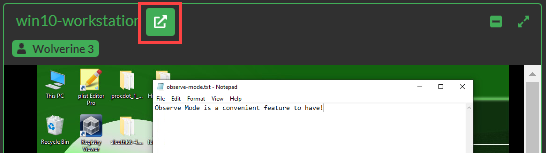
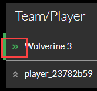

# Observe Mode

Observe mode allows a game administrator with the correct role to see participant VMs during a particular game. Observers do not have the ability to interact with, or interfere with, the VM they are observing.

You must have either Observer Role or Admin Role to use Observe mode. Assuming you have been granted the appropriate role in the Gameboard, select **Admin**. Hover your mouse over an active board, then click **Observe**.

**Search:** The Search feature is relative to the screen you are viewing when performing the search. Searching on the Observe Challenges screen means you're searching that list of challenges for some criteria (name, challenge, tag, id). Searching on the Observe Players screen means you're searching that list of teams/players for some criteria (team name/player name, team id).

Gameboard talks to TopoMojo to launch challenges and to provide the Observe interface. 

## Observe Challenges

**Observe Challenges** is a list of all challenges for all players in one table for that game. The console grid for this contains all VMs for a challenge --- whether active or not.

Under **Consoles**, select the grid icon to view active VMs in a grid view side-by-side according to player or team. Minimize and maximize the consoles within the grid as you observe. When the grid containing the consoles is open, the observe mode updates in real-time.

Selecting the four-square icon allows you to view the consoles of another player or team. Multiple observers can be on the same VM.

VM name (*win10-workstation*) and player display name (*Wolverine 3*)  help observers identify the console they are viewing, especially if there are many players with many challenges. Click the **pop-out** icon to open the console in a new browser tab.

**Name:** Sort the consoles alphabetically by the Team/Player and then by challenge name.

**Rank:** Sort the consoles by scoreboard rank.

You can move a row to the top and "pin" it there to keep it in place. You can pin multiple rows at the top as well. This is useful when you are interested in following a certain few teams, players, or challenges. This is also useful after you have searched--you can pin results at the top where you can reference them frequently.

## Observe Players

**Observe Players** is a list of all players/teams for the game. The list of players/teams matches the entries on the scoreboard and contains "live" sessions; that is, sessions that are started. The console grid is one rectangle per user on a team. Users may not be on a VM at all yet or two users could be looking at the same VM.

In Observer mode, click the **Observe Players** link to follow a team or individual player. 

Other than the differences described above Observe Players functions the same as Observe Challenges.