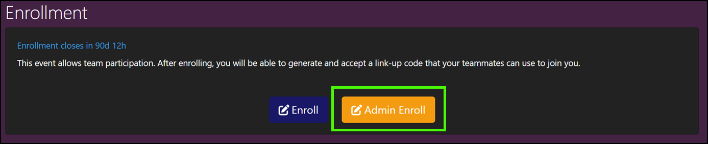

# Gameboard Roles

The following is a list of roles in the gameboard. Note that these roles aren't additive -- they are independent. Therefore, each role has to be added individually and a single user can have multiple roles. Each assigned role only grants the privileges for that role. Roles do not inherit permissions from other roles.

## Gameboard privileges by role

The **Observer** role can:

- Observe consoles

The **Support** role can:

- Use the integrated support feature

The **Tester** role can:

- Enroll in games outside of the execution period
- Play games outside of the execution period
- View hidden games

The **Designer** role can:

- Create, edit, and delete games

The **Registrar** role can:

- Manage enrollment and registration

The **Director** role can:

- Observe consoles
- Use the integrated support feature
- Enroll in games outside of the execution period
- Play games outside of the execution period
- View hidden games
- Create, edit, and delete games
- Manage enrollment and registration
- *Cannot* assign or remove roles

The **Admin** role can:

- Observe consoles
- Use the integrated support feature
- Enroll in games outside of the execution period (see *Enroll vs. Admin Enroll* below)
- Play games outside of the execution period
- View hidden games
- Create, edit, and delete games
- Manage enrollment and registration
- Assign and remove roles
- Awards points manually to a player and team

## Enroll vs. Admin Enroll

After logging into Gameboard, but before playing a game or completing a lab users have to *enroll* in the game lobby. Users log into Gameboard, select a game on the **Home** page, and **Enroll** and **confirm** to start the session. The Enroll button appears when the user has set a display name and a sponsoring organization in their Profile and registration for that game is "open" (open and close dates and times are defined in the Admin Game Settings).

If a user is a *Registrar*, *Tester*, or *Admin*, then the **Admin Enroll** button appears next to the **Enroll** button. See the screen print below.

**Admin Enroll** allows a user with elevated roles to bypass the restrictions of time for registration, but it does *not* allow the user to bypass display name and sponsoring organization requirements. Those still need to be set prior to game play. **Admin Enroll** is useful for testing, troubleshooting, and customer support purposes.

!!! note

     If you do have access to the **Admin Enroll** button, it behaves *identically* to the standard **Enroll** button for you. If you can see both **Enroll** and **Admin Enroll**, it does not matter which button you select.

*Enroll and Admin Enroll*

