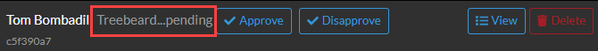

# Gameboard Administration

The Admin function of Gameboard helps those with the admin role:

- Create, clone, manage, and delete games and challenges
- Manage users
- Observe participants
- Enter sponsor information
- Run and export user, gameboard, challenge, and feedback reports
- Broadcast messages to all game participants

After logging into the gameboard app with the appropriate role, click **Admin**. By default, you land on the **Games** tab.

## Search

This **Search** feature allows game administrators to search on name, season, track, etc., of the game tiles that appear here.

## Toggle Cards and Table

Toggle between the view of games displayed as game *cards* or rows in a *table*.

## New Game

Click **+ New Game** to create a new game, or import from YAML, or upload or drop a YAML file.

## Game Card hover

When games are toggled to display as *Cards*,  you can hover over the game to see options.

- **Players:** Refer to the help documentation on [Players](admin-players.md). Players on the game card are only players who have enrolled in that game.
- **Observe:** Refer to the help documentation on [Observe Mode](admin-observe.md).
- **Settings:** Refer to the help documentation on [Admin Game Settings](admin-settings.md).
- **Clone, yaml, and json:** Refer to the help documentation on [Clone, yaml, and json options](admin-clone-yaml-json.md).
- **Delete:** Deletes the game.

## Administration tabs

### Overview

#### Live Stats

The **Admin Overview** tab allows game administrators to click **Live Stats** (e.g., the number of *Active Competitive Challenges* deployed, the number of *Active Practice Challenges* deployed, etc.). *Registered Users* is not clickable at this time.

#### Send Announcement

The **Announcement** feature allows game administrators to broadcast important messages to all participants within a game. Among other uses, these could be messages regarding gameboard issues, challenge issues, and changes to logistics. 

In the Announcement field, enter the content of the announcement and click **Announce**.

### Games (landing page)

The **Games** tab is where you land when you click **Admin** in the menu. See the topics above: *Search*, *Toggle Cards and Table*, *New Game*, and *Game Card Hover*.

### Practice Area

See the help documentation on [Administering the Practice Area](admin-practice-area.md).

### Users

This is where users are assigned roles and participant names are approved or disapproved. In Gameboard, a *user* is a person. A user has a *Name*.

To search for a user across the whole of Gameboard, enter a term into the **Search** field or filter by:

- **Has Roles:** contains only those participants who have been granted additional roles (Observer, Tester, Designer, etc.)
- **Has Pending Name:** contains only those participants whose display names are pending approval or disapproval from an admin.
- **Has Disallowed Name:** contains only those participants whose display names have been disapproved by an admin.

### Approving and disapproving requested display names

After registering for a new account, participants must choose a default name for public display. Participants are expected to refrain from any names that are controversial in nature. Admins approve participant names before the names can appear on the scoreboard here. 

To approve a requested display name, click **Has Pending Name**. That gives you a list of participants waiting for display name approval. Find the user in the list, select **Approve** or **Disapprove**.

In the screen capture below, Tom Bombadil is requesting a name change to "Treebeard."

If *approved*, the name moves from the **Has Pending Name** list. From the user's point of view, the *requested* display name becomes the display name.

If *disapproved*, you can provide a reason (`disallowed`, `disallowed_pii`, `disallowed_unit`, etc.). The disallowed requested name moves from **Has Pending Name** to **Has Disallowed Name**. From the player's point of view in this instance the *requested* name remains Treebeard, the *approved* name remains Tom Bombadil, and the *display name status* is disallowed.

### Players

A *Player* is a person enrolled in a game. Like a user, a player also has a name. These names can be the same, or they can be different. For example, Tom Bombadil's user name can be `Treebeard`, but when Tom enrolls in a game, he wants his name to display on the scoreboard as `Bombadillo`, so he changes his **Game Display Name** in the game's lobby.

Searching the "global" **Players** tab lists the first 200 players who match the search, or 200 arbitrary players until you refine the search terms. Players on this tab are *all* players across *all* games. 

Filter by player names pending approval or player names disallowed by a game admin.

### Sponsors

This is where admins define who the sponsors are and what logo to associate with each. To create a new sponsor:

1. Click the **plus** sign, then upload a logo file.
2. Enter a sponsor **Name**. 
3. Select a **Parent Sponsor** if appropriate.
4. Click **Save**.

Sponsor logo files may be in any of the following formats: *.png, .jpeg, .jpg, .gif, .webp,* and *.svg*. Your new sponsor appears in the list of sponsors. You can **edit** and **delete** sponsors from the list.

### Challenges

The Challenges tab is largely for game admins to troubleshoot problems with challenges.

**Search:** Search for specific teams, players,  challenge ids, and tags.

**Current:** *Active* challenges have a green dot next them. Active indicates a challenge has *not* yet been solved correctly, maximum submissions have *not* been attempted, or a session has *not* expired. A challenge is active until one of those three criteria are met; then, the challenge is over and *inactive*. When a challenge is inactive, it still counts towards total score, rank, cumulative time.

A challenge is *current* and not *archived* because it has not been reset when the Reset Session button is clicked. 

**Archived:** When a participant clicks **Reset Session**, before the session is deleted, historical information from participant and challenge event is archived. This archived session information is available here for the game admin to access.

**Submissions:** Displays a date and time stamp and the answers submitted by the player and stored in Gameboard.

**Game Engine Audit:** Clicking **Audit from game engine?** queries the game engine (if you're using the Foundry stack, this is TopoMojo) to provide its list of submitted answers. The purpose of game engine audit is to compare Gameboard's record of submissions to the game engine's record of submissions.

**Regrade:** Clicking **Regrade** has the gameboard check all submissions by a player against expected answers again. Regrade is used when a challenge has two possible answers or players submit in a format that is correct, but that was unexpected by game or challenge developers. When this happens, the TopoMojo workspace is updated manually to include the new correct answers. Then, the challenge is regraded and the player's score updated if a previously entered incorrect answer is now correct.

### Support Settings

**Greeting:** Text entered here appears as a banner on the Support page to provide any pertinent information related to competition customer support. Enter your customized message. The greeting supports Markdown formatting. 

### Notifications

Use **Notifications** to post alerts to players. Upon login, players will see a banner for each notification created. Once a player dismisses a notification, they won't see it again. To create a new notification:

1. Click **Create Notification**.
2. Enter a **Title**.
3. Enter the **Content** of the notification. The content supports Markdown formatting.
4. Optionally, set the **Availability dates**. Availability dates aren't required. When set, the notification is shown to players *after* the start date and *until* the end date.
5. Select a **Type**: General Info (blue), Warning (yellow), or Emergency (red).
6. Click **Save**.

You can **edit** and **delete** notifications from the list.

###  Reports

Use the Reports feature. See the [Reports](reports-beta.md) documentation for additional help.