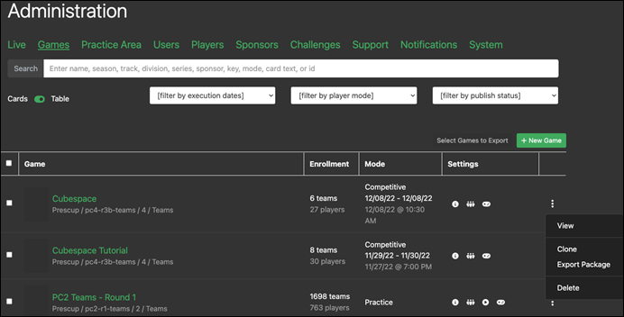
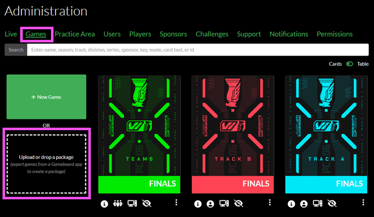

# Gameboard Administration

The Admin function of Gameboard helps those with the `Admin` role:

- Create, clone, manage, and delete games and challenges
- Manage users
- Observe participants
- Enter sponsor information
- Run and export user, Gameboard, challenge, and feedback reports
- Broadcast messages to all game participants

After logging into the Gameboard app with the appropriate role, click **Admin**. By default, you land on the **Games** tab.

## The Live Tab

The **Live** tab allows game administrators to select **Live Stats** (e.g., the number of *Active Competitive Challenges* deployed, the number of *Active Practice Challenges* deployed, etc.) and take certain actions, such as copy player or team IDs, view challenge states, view sessions, observe, and view games.

### Send Announcement

The **Announcement** feature lets Admins and Directors send important messages to users who are currently logged into Gameboard. Messages can go to everyone online or just a specific team. They are useful for updates about Gameboard issues, challenge problems, or schedule changes.

In the Announcement field, enter the content of the announcement and click **Announce**.

## The Games Tab (Landing Page)

The **Games** tab is the landing page when you select **Admin** from the top navigation menu. By default, the games are displayed as cards.

### The Game Center

Select a game card to access that game in the **Game Center**. The Game Center is the one-stop-shop where games are configured, managed, and observed. See the [Game Center documentation](game-center.md) for a full explanation of the Game Center.

Note the **game info icons** at the bottom of the game cards. When hovered over, these icons provide information about the game.

- **Live now:** the game is live in competition mode.
- **Info:** the game's season, division, track, and number of registered teams/players.
- **Team/individual:** whether the game is a team or individual game.
- **Engine mode:** whether the game uses standard VMs or external hosts.
- **Published/unpublished:** if the game is not published the "Eye Slash" icon appears here.
- **Practice mode:** the "Play" icon appears indicating the game is in Practice mode; absence of the "Play" icon indicates the game is in or competition mode (subject to the execution open and close dates).
- **3 dot context menu:** export a game package, clone, and delete a game.

### Search

This **Search** feature allows game administrators to search on name, season, track, etc., of the game tiles that appear here.

### Toggle Cards and Table

Toggle between the view of games displayed as game *cards* or rows in a *table*. The **Table view** shows the same game information—like enrollment, mode, and settings—in a table with rows and columns. Each row has a **3-dot context menu** that lets those users with elevated permissions open the game in the Game Center, clone it, export it, or delete it. The icons and options are the same as in **Card view**, but Table view makes it easier to scan and work with a lot of game data at once.

### New Game

Click **+ New Game** to create a new game, or upload or drop a package. Packages are created by exporting them from a current game.

After creating a new game, the screen changes to that of the Game Center where games are configured, managed, and observed. See the [Game Center documentation](game-center.md) to finish configuring your newly added game.

### Upload a Game Package

Another way to create a new game is to *export* a game package from an existing game and *import* its package as a new game.

To export a game package:

1. On the game card, select the **3 dot context** menu, then **Export Package**. The export process packages the game configuration and assets (such as the card image and map image) into a ZIP file.
2. *Exported packages are not readily accessible from the Gameboard web client.* To locate the newly exported package, browse to `wwwroot/export/packages` on the API app server.

To import (upload) a game package:

1. Upload or drop an exported game package into the **drop zone** on the Games tab. The drop zone is high-lighted in the screen print below.

### Cloning a Game

Cloning creates a copy of the game that replicates most of the original game.

1. On the game card, select the **3 dot context** menu, then **Clone**.

### Deleting a Game

Deleting a game deletes it from the Gameboard app.

1. On the game card, select the **3 dot context** menu, then **Delete**.

!!! warning

    Games that contain registered players *can* be deleted by users who have the appropriate role permission (i.e., Admin and Director).
