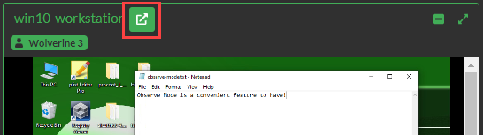
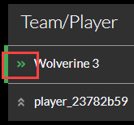

# Game Center

The **Game Center** is the game administrator's one stop shop when administering a live game. The Game Center unifies various Gameboard administrative and support elements such as game and challenge settings, player information, live sessions, support tickets, observe mode, and more.

To access the Game Center for a given game, click **Admin**, hover over a game card, and click **Game Center**. Users must have the `Admin` role to access a game center.

The Game Center header displays game metadata and settings, including the name, modes, series, season, track, and execution dates.

## Gear Tab

### Metadata

**Name:** The title of your game. Displayed in the game lobby and on the scoreboard.

**Publish:** Toggle *Hidden* or *Visible* to make the game visible to players on the Home screen.

!!! info

    When a game is hidden, a user with permissions that can view both hidden and visible games--such as Designer or Tester--will see the game card on the Home screen; however, the game card appears with an "eye-slash" icon to denote that it is hidden.

**Feature:** Toggle *Normal* or *Featured*. When *Featured*, the game appears under Featured Games at the top of the Gameboard home page.

**Key:** A short, unique key distinguishing *this* event.

**Series:** The name of the series; perhaps the same event is run annually making it a *series*.

**Track:** A course of action in your event. An event may have different categories for teams and individuals to compete in or an event may have an offensive skills track and defensive skills track.

**Season:**  A fixed time period for when a series occurred. The *series* describes the event--for example, a fictitious "Cyber Cup". The *season* is the iteration of that event--Cyber Cup: Season 1, Cyber Cup: Season 2, and Cyber Cup: Season 3.

**Division:** The tier or level of the audience participating in the event. Is this for working professionals or just students?

**Card Image:** Upload an image to become game tile or card to identify your game in the lobby.

**Card Text Top:** Enter text that will appear superimposed on your card at the top.

**Card Text Middle:** Enter text that will appear superimposed on your card in the middle.

**Card Text Bottom:** Enter text that will appear superimposed on your card along the bottom.

**Lobby Markdown:** Using Markdown enter any information you would like players to see when they enter the game lobby. For help with Markdown syntax, see this [Markdown Guide](https://www.markdownguide.org/).

#### Player Feedback

It's possible (but not required) to create questions to capture participant feedback on games and challenges. Create your feedback form template here.

For a full treatment of Gameboard's feedback feature, please see the [Configuring feedback templates](admin-feedback-form.md) section of the docs.

#### Completion Certificates

It's possible (again, not required) to design certificate of completion templates so participants can view, share, and print certificates as proof of their participation in a game.

For a full treatment of how to design completion certificates, please see the [Configuring certificate templates](admin-completion-certificates.md) section of the docs.

### Modes

**Player Mode:** Toggle to set the game to **Competition** or **Practice**. When at least *one* game is set to Practice in your environment, a link to Practice is visible in the top-right corner of Gameboard for authenticated players. Players can click the Practice link and select a challenge start their practice session.

**Require Synchronized Start:** Toggle on to require the game to have a synchronized start. When enabled, no player can start a session until *all* players have indicated that they are "ready to play" in the game lobby. Use this feature for games when you want all players to start at the same time and end at the same time. Synchronized start adheres to other Gameboard settings: for example, team size minimum and maximum.

!!! note

    The Admin Start feature bypasses the "ready to play" feature; that is, users assigned the `Admin` role can Admin Start regardless of whether all players have "readied up" or not.

**Show On Homepage When In Practice Mode:**  Toggle *Yes* to make the game's game card visible on the home page even when the game is in Practice mode.

**Engine Mode:** Choose between *Standard* and *External Host*. The vast majority of games use the Standard mode, where Gameboard submits answers to the game engine (usually TopoMojo) for grading. Choose External Host for specialized scenarios where players use an external client (e.g., a Unity game) to interact with the challenges.

### Settings

These settings pertain to registration, execution, and general game and challenge limitations.

#### Execution

**Opens:** The date and the time that your game begins.

**Closes:** The date and the time that your game ends.

**Session Duration:** The duration of game session in minutes. Games are created with a default session time of 60 minutes.

**Session Limit:** The maximum number of sessions--a session is when a game is started and challenges can be deployed and solved--per game.

**Gamespace Limit:** The maximum number of concurrent "gamespaces" allowed. A *gamespace* is the virtual environment that participants use to compete in a challenge. The default value is 0; the value that you enter here is inherited by a newly created board. For example, if you set this value to 5 in the game, any board created will inherit the 5 concurrent gamespace setting.

**Max Submissions:** The maximum number of solutions a participant can send to the grading server per challenge--whether that submission is correct, incorrect, or blank. Once the submission amount is reached, the competitor is locked out of further submissions for that challenge.

**Allow Preview:** Toggle *Hidden* or *Visible* to allow participants to view a challenge and documentation prior to starting. You may want to prevent too much information from being given away before a challenge start.

**Allow Reset:** Toggle *Forbidden* or *Allowed* to permit participants to restart their game and attempt challenges again. This option is generally allowed on a "practice" game since that game is meant to help users get their bearings on how a competition works; however, you may decide players will be forbidden to reset an "official" game.

**Allow Late Starts:** Toggle *Forbidden* or *Allowed* to permit players to start within a session length of the execution period end. When toggled to allow, players whose session would end prematurely due to the execution window closing will be allowed to play; however, their session will be shortened to match the end of the game.

**Allow Public Scoreboard Access:** Toggle *Forbidden* or *Allowed* to permit players to view the complete scoreboard after the game ends. Not that the scoreboard itself is public, but if toggled to forbid, players can't view detailed score information for competing players.

#### Registration

Offering a different execution period from registration period is an option. This gives participants the opportunity to register for a period of time prior to round one of the competition getting underway. No need for a registration period for later rounds where a competitor would have had to qualify for the next round to even continue.

**Access:** *None* means players can't register themselves for a game. An administrator must add players to the game or advance players from another game. *Open* means players can register themselves within the specified registration period.

**Opens:** The date and the time that your registration period begins.

**Closes:** The date and the time that your registration period ends.

**Team Size:** This is self-explanatory. A matching *minimum* and *maximum* of one means that the challenge is a single player challenge. That is, a "team" of one. In a true team tournament, two or more would probably be the minimum.

**Team Sponsorship:** Toggle *Open* or *Required*. When required, members on a team must have the same sponsor. Team sponsors are chosen during enrollment. For more information on sponsors, see [Gameboard Administration](admin.md).

**Registration Markdown:** Using Markdown enter any information you would like players to see when they register for the game. For help with Markdown syntax, see this [Markdown Guide](https://www.markdownguide.org/).

## Challenges Tab

### Search

Search for challenges on TopoMojo to place in the game. *Search* here is limited by *Audience* on the workspace Settings in TopoMojo.

### Edit

Selecting a challenge from the search results adds it to the Edit icon.

### Challenge Specs

**Sync with Source:** Synchronizes the Gameboard challenge markdown guide with the TopoMojo challenge markdown guide so that the content is the same in both apps.

**Support Key:** Assign a unique "key" here that gets appended to a TopoMojo gamespace id to help troubleshoot problems during competition. For example: `b28c7911 a03`--**b28c7911** is the uniquely generated gamespace ID from TopoMojo; **a03** is the support key *manually* assigned here to a challenge. For more information on support keys, see [Gameboard Administration](admin.md).

**Points:** Assign a point value to your challenge here.

**Solution Guide URL:** Add links to challenge solution guides here for *practice mode* challenges. When added here, the link to the solution guide is available to players in the challenge instructions. Enabling **Show Solution Guide in Competitive Mode** permits the link to a solution guide to be available to players in a *competitive* game.

**Disabled:** Check to disable this challenge in the game without removing it. Disabled challenges are unavailable to players, don't count toward scores, and are not deployed when an admin initiates deployment on a player's behalf. Essentially, disabling a challenge removes the spec from the game without deleting any underlying data.

**Hidden:** Hidden challenges can't be manually deployed by players and don't count toward scores. However, they are deployed when an admin initiates deployment on a player's behalf or if the game configured in External mode. The need for a hidden challenge is typically related to the implementation details of an externally hosted game and is not useful for the vast majority of games.

**Remove This Challenge:** Removes the challenge from the game.

#### Prerequisites

Prerequisites are for challenges that unlock other challenges. For example: Your game has two challenges tagged **c01** and **c02**. You want to force participants to score 500 points on c01 before c02 is unlocked for them to attempt. Challenge c02 will not be available to deploy until the prerequisite condition is met. Complete the fields so that `c02 requires 500 on c01`.

#### Automatic Bonuses

Gameboard can automatically award bonus points to teams and players based on the order in which they solve a challenge. For instance, the first team to solve a challenge can earn an extra 100 points, the second team 50 points, and so on. To configure this, use the YAML format provided in the Gameboard app.

**Paste this example configuration:** Click to paste the "hint" text contained in the text box. This is a useful starting point for creating your own bonus structure YAML configuration.

**Import this configuration:** When you have finished editing your YAML, click to commit it to Gameboard.

### Map

Here is where the visual representation of the game is arranged. Challenges are placed on the game map here. The challenges you selected appear as hotspots on the map. Drag them into position on the map.

**Show Gridlines:** Each map has a grid. By selecting Show Gridlines, you can toggle displaying the grid. When enabled, the grid overlays the map image and makes it easier for you place your challenge hotspots.

**Upload New Map Image:** Search for an image that will serve as a backdrop to your map.

**Reset to Default Map Image:** Removes the image from your map. Reset does not remove challenge hotspots.

## Teams/Players Tab

The **Teams/Players** tab contains the list of game teams/players. If the game is a **team** game, then you will see the *Teams* tab. If the game is an **individual** game then you will see the *Players* tab.

Here you can search, see who advanced to the next game and who did not, who started, who is currently playing, who finished, and sort by rank, name, and time remaining.

If any registered players have requested a name change, you'll see a warning message here to let you know.

- **Select All team/players:** Allows you to choose all of the team/players in the game.

- **Rerank:** Forces a manual recalculation of the scores in the game.

- **Advance selected teams/players:** Advances the team/player to a different game, probably a successive round. Optionally, teams/players can be advanced with their score intact by checking **Include scores during advancement**. The advance function is useful when your competition is set up like a tournament where teams/players advance in progressive rounds. Teams/players may only be advanced to games which have an execution window equal to the current time or later.

- **Deploy game resources for selected:** Pre-generates challenge VMs for selected teams/players. This strategy is useful for an event where pre-generating challenges averts the risk of many participants launching challenges simultaneously and encountering problems. By building the gamespace resources in advance, the environment can be verified in advance, issues can be resolved early, and players can start without delay.

- **Extend Sessions:** Extends the team/player's session by a specified number of minutes.

- **Copy all team/players to CSV:** Copies all selected team/player data to your clipboard in .CSV format.

- **Copy all team/players to mail format:** Copies metadata about the selected players in JSON format for use with a mail app.

- **Add team/player:** Adds a new team (i.e., multiple players) or new player to the game. When adding, these players are not created from scratch in the Game Center. They must exist as a Gameboard user and must *not* be enrolled in the game.

- **Search team/players:** Enter keywords or phrases to find specific teams/players within the Gameboard.

- **Filters:** Helps refine search results based on `advancement`, `status`, and `pending name`.

- **Sort by:** Sort search results based on`rank`, `name`, `start time`, `time remaining`.

### The Team/Player Window

In the search results, select a team or a player. Information about that team/player is found in the team/player window. The screen print below shows the **Player** window.

#### Team Management

**Override Name:** Enter a name here to *override* the existing team or player name.

**Status:** *Approve* the override name here or apply a *disallowed reason* (`disallowed`, `disallowed_pii`, `disallowed_unit`, etc.).

#### Session

**Extend:** To add more time to a team or player's session, enter the extension duration in minutes and click **Extend**.

#### Timeline

The **Player Timeline** is a visual representation of the sequence of session events distributed chronologically along a line. It shows the order and timing of game occurrences where events have dates and times. Events on the timeline are clickable and copy information about the event to your clipboard in Markdown format. The **Gamespace On** event is not clickable.

Events seen on the player timeline are:

- **Challenge Started:** Shows when (date and time) a challenge has been launched.
- **Gamespace On:** Shows when a gamespace was activated. This event is not clickable.
- **Challenge Completed:** Shows when a challenge has been completed and includes the number of attempts used and final score.
- **Submission:** Shows when a token or answer has been submitted and includes the number of attempts used, points awarded after the attempt, and any submitted answers.
- **Active Ticket:** Shows when the team or player opened a support ticket.

!!! tip

    Selecting one of the buttons removes that type of event from the player timeline. If you only wanted to see **Submissions**, for example, you could remove the other event types.

#### Announce

The **Announcement** feature allows you to broadcast messages to just a player or team within the game. Among other uses, these could be messages regarding Gameboard issues, challenge issues, and changes to scores or time. In the **Announcement** field, enter the content of the announcement and click **Announce**.

### "3-Dot" Context Menu

Each player or team has a "3-dot"context menu on their card, offering different options based on their status—whether they haven't started, are actively playing, or have finished.

- **View:** Opens the Team/Player modal discussed above.
- **View Team IDs:** Opens a modal that provides convenient copy access to **player ID** and **user ID** for support purposes.
- **Copy Player ID / Team ID / User ID:** Again, convenient copy access for support purposes.
- **View Certificate:** View a player's certificate if published and the game is over.
- **Manual Bonuses:** Manually award bonus points to a player or team score. This is useful if bonus points were earned during a challenge and need to be added. A challenge must be at least started prior to awarding bonus points.
- **Manage Challenges:** Launch, start/stop challenge resources, or completely purge a challenge attempt on behalf of the player. Purging a challenge erases all progress a player has made on it.
- **Reset Session(Preserve Challenges):** If a player has registered, and has started playing the game (i.e., they have a game session), you can reset their session *and not* archive any challenges, started or completed. Use of this option should be limited to very specific situations like testing and QA.
- **Reset Session:** If a player has registered and has started playing the game (i.e. they have a game session), you can reset their session. This deletes any challenge data they generated while playing but leaves enrollment and team membership intact. If they wish to play again, they'll need to start a new session.
- **Reset Session & Unenroll:** If a player has registered, and has started a session, you can *reset* their session and *unenroll* them from the game. Players will need to re-enroll to play again. Teams are essentially dissolved and will need to reform and re-enroll to play. This is the same functionality as when a player unenrolls from the game lobby or resets their session (when enabled by an admin).

## Practice Tab

The Practice tab appears only in games where Player Mode is set to **Practice** (this setting is found on the Gear tab under **Modes**). It lists all users who have played any challenge in practice mode, with exactly one row per user. Clicking a row opens an attempt summary window  for that user. If the user is actively playing, the **3-Dot** context menu provides an option to quick-jump to observe their session.

## Observe Tab

The **Observe tab** allows a user with elevated permissions to see participant VMs during a particular game. Observers do not have the ability to interact with, or interfere with, the VM they are observing.

**Search:** The Search feature is relative to the screen you are viewing when performing the search. Searching on the Observe Challenges screen means you're searching that list of challenges for some criteria (name, challenge, tag, id). Searching on the Observe Teams screen means you're searching that list of teams/players for some criteria (team name/player name, team id).

### Observe Challenges

When **Challenges** is selected, the list of all challenges for all players in one table for that game is shown. The console grid for this contains all VMs for a challenge - whether active or not.

Select the grid icon to view active VMs in a grid view side-by-side according to player or team. Minimize and maximize the consoles within the grid as you observe. When the grid containing the consoles is open, the observe mode updates in real-time.

Selecting the **four-square** icon allows you to view the consoles of another player or team. Multiple observers can be on the same VM.

VM name (*win10-workstation*) and player display name (*Wolverine 3*)  help observers identify the console they are viewing, especially if there are many players with many challenges. Click the **pop-out** icon to open the console in a new browser tab.

**Name:** Sort the consoles alphabetically by the Team/Player and then by challenge name.

**Rank:** Sort the consoles by scoreboard rank.

You can move a row to the top and "pin" it there to keep it in place. You can pin multiple rows at the top as well. This is useful when you are interested in following a certain few teams, players, or challenges. This is also useful after you have searched--you can pin results at the top where you can reference them frequently.

### Observe Teams

**Observe Teams** is a list of all players/teams for the game. The list of players/teams matches the entries on the scoreboard and contains "live" sessions; that is, sessions that are started. The console grid is one rectangle per user on a team. Users may not be on a VM at all yet or two users could be looking at the same VM.

Other than the difference described above, Observe Teams functions the same as Observe Challenges.

## Scoreboard Tab

The scoreboard found here is the same publicly accessible scoreboard you would find if you clicked the Scoreboard link in a game lobby. Users who have elevated permissions can see breakdowns for any team even if the game isn't over yet.

## Tickets Tab

The support ticketing functionality found here is the same as the interface documented here: [Using the Integrated Support feature](support.md). However, the Gameboard only allows you to interact with support tickets for the game you're viewing. You can perform all of the usual support ticket actions here (filter, search, export tickets) except for creating a new ticket.
