# Overview

Carnegie Mellon University's [Software Engineering Institute](https://github.com/cmu-sei){ target=\_blank } (SEI) developed Gameboard as a flexible web platform with game design capabilities and a competition-ready user interface. Use the *Gameboard Administrator Guide* to configure Gameboard when you want to run your own cybersecurity game.

## Gameboard Concepts

*User* vs. *player* vs. *competitor*: A user is the real person who holds an account on Gameboard and logs in with their Identity account. Players, participants, and competitors are users who enroll in a game. "Competitor" does not appear in the Gameboard UI.

*Enrolled*: Users who plan to play, compete, or otherwise participate in a competition must "join" or *enroll* in a game. Once a user enrolls, Gameboard treats them as a *player* of that game.

*Participated* vs. *played*: We use these terms interchangeably—after a user enrolls in a game and launches a challenge, that user has participated or played.

*Sponsor*: The sponsor identifies the organization that supports a player. In a government-sponsored competition like the President's Cup, a sponsor may be a department (e.g., Department of Homeland Security, Department of Defense). In a school-sponsored competition, you might represent different universities as sponsors (e.g., Carnegie Mellon University, University of Pittsburgh).

## Administrator Guide

The Admin function of Gameboard helps those with the `Admin` role:

- Create, clone, manage, and delete games and challenges
- Manage users
- Observe participants
- Enter sponsor information
- Run and export user, Gameboard, challenge, and feedback reports
- Broadcast messages to all game participants

After logging into the Gameboard app with the appropriate role, click **Admin**. By default, you land on the **Games** tab.

### The Live Tab

The **Live** tab lets game administrators review **Live Stats** such as the number of Active Competitive Challenges or Active Practice Challenges. Administrators can also copy player or team IDs, view challenge states, inspect sessions, observe, and open games.

#### Send Announcement

The **Announcement** feature lets Admins and Directors send important messages to users who are currently logged into Gameboard. Messages can go to everyone online or just a specific team. They are useful for updates about Gameboard issues, challenge problems, or schedule changes.

In the Announcement field, enter the content of the announcement and click **Announce**.

### The Games Tab (Landing Page)

The **Games** tab is the landing page when you select **Admin** from the top navigation menu. By default, Gameboard displays the games as cards.

#### The Game Center

Select a game card to access that game in the **Game Center**. Use the Game Center to configure, manage, and observe games. See the [Game Center documentation](#game-center) for a full explanation of the Game Center.

Note the **game info icons** at the bottom of the game cards. When hovered over, these icons provide information about the game.


- **Live now:** the game is live in competition mode.
- **Info:** the game's season, division, track, and number of registered teams/players.
- **Team/individual:** whether the game is a team or individual game.
- **Engine mode:** whether the game uses standard VMs or external hosts.
- **Published/unpublished:** if the game is not published the "Eye Slash" icon appears here.
- **Practice mode:** the "Play" icon appears indicating the game is in Practice mode; absence of the "Play" icon indicates the game is in or competition mode (subject to the execution open and close dates).
- **3 dot context menu:** export a game package, clone, and delete a game.

#### Search

Use the **Search** feature to locate game tiles by name, season, track, and other fields.

#### Toggle Cards and Table

Toggle between games shown as *cards* or rows in a *table*. The **Table view** presents the same game information—such as enrollment, mode, and settings—in rows and columns. Each row has a **3-dot context menu** that lets users with elevated permissions open the game in the Game Center, clone it, export it, or delete it. The icons and options match the **Card view**, but Table view makes it easier to scan and manage large sets of game data.

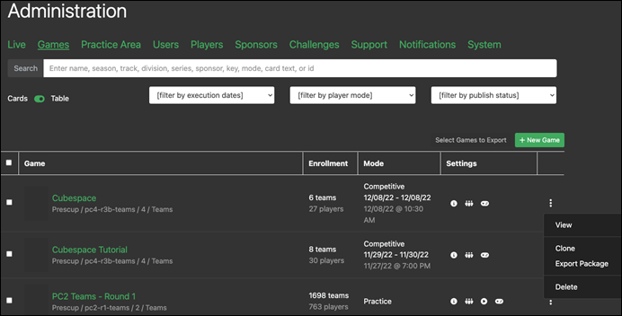

#### New Game

Click **+ New Game** to create a new game, or upload or drop a package. Export a current game to create a package.

After you create a new game, Gameboard opens the Game Center so you can configure, manage, and observe it. See the [Game Center documentation](#game-center) to finish configuring your newly added game.

#### Upload a Game Package

Another way to create a new game is to *export* a game package from an existing game and *import* its package as a new game.

To export a game package:

1. On the game card, select the **3 dot context** menu, then **Export Package**. The export process packages the game configuration and assets (such as the card image and map image) into a ZIP file.
2. *Exported packages are not readily accessible from the Gameboard web client.* To locate the newly exported package, browse to `wwwroot/export/packages` on the API app server.

To import (upload) a game package:

1. Upload or drop an exported game package into the **drop zone** on the Games tab. The drop zone is high-lighted in the screen print below.

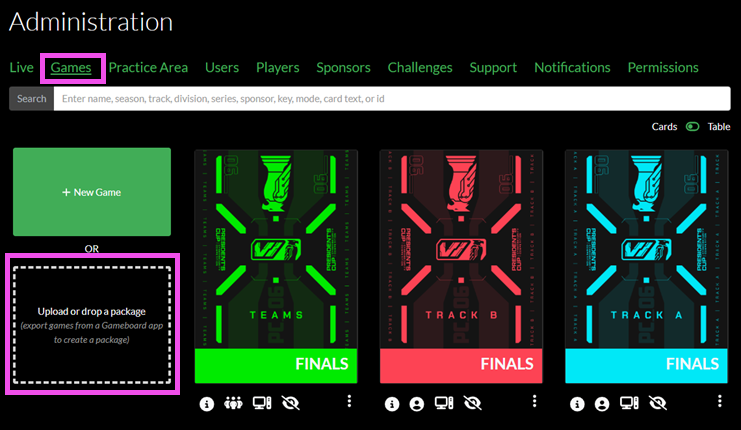

#### Cloning a Game

Cloning creates a copy of the game that replicates most of the original game.

1. On the game card, select the **3 dot context** menu, then **Clone**.

#### Deleting a Game

Deleting a game deletes it from the Gameboard app.

1. On the game card, select the **3 dot context** menu, then **Delete**.

!!! warning

    Games that contain registered players *can* be deleted by users who have the appropriate role permission (i.e., Admin and Director).

### Game Center

The **Game Center** is the game administrator's one stop shop when administering a live game. The Game Center unifies various Gameboard administrative and support elements such as game and challenge settings, player information, live sessions, support tickets, observe mode, and more.

To access the Game Center for a given game, click **Admin**, hover over a game card, and click **Game Center**. Users must have the `Admin` role to access a game center.

The Game Center header displays game metadata and settings, including the name, modes, series, season, track, and execution dates.

### Gear Tab

#### Metadata

**Name:** The title of your game. Displayed in the game lobby and on the scoreboard.

**Publish:** Toggle *Hidden* or *Visible* to make the game visible to players on the Home screen.

!!! info

    When a game is hidden, a user with permissions that can view both hidden and visible games--such as Designer or Tester--will see the game card on the Home screen; however, the game card appears with an "eye-slash" icon to denote that it is hidden.

**Feature:** Toggle *Normal* or *Featured*. When *Featured*, the game appears under Featured Games at the top of the Gameboard home page.

**Key:** A short, unique key distinguishing *this* event.

**Series:** The name of the series; perhaps you run the same event annually, which makes it a *series*.

**Track:** A course of action in your event. An event may have different categories for teams and individuals to compete in or an event may have an offensive skills track and defensive skills track.

**Season:** A fixed time period for when a series occurred. The *series* describes the event--for example, a fictitious "Cyber Cup". The *season* is the iteration of that event--Cyber Cup: Season 1, Cyber Cup: Season 2, and Cyber Cup: Season 3.

**Division:** The tier or level of the audience participating in the event. Is this for working professionals or just students?

**Card Image:** Upload an image to become game tile or card to identify your game in the lobby.

**Card Text Top:** Enter text that will appear superimposed on your card at the top.

**Card Text Middle:** Enter text that will appear superimposed on your card in the middle.

**Card Text Bottom:** Enter text that will appear superimposed on your card along the bottom.

**Lobby Markdown:** Using Markdown enter any information you would like players to see when they enter the game lobby. For help with Markdown syntax, see this [Markdown Guide](https://www.markdownguide.org/).

##### Player Feedback

It's possible (but not required) to create questions to capture participant feedback on games and challenges. Create your feedback form template here.

For a full treatment of Gameboard's feedback feature, please see the [Feedback Templates](#feedback-templates) section of the docs.

##### Completion Certificates

It's possible (again, not required) to design certificate of completion templates so participants can view, share, and print certificates as proof of their participation in a game.

For a full treatment of how to design completion certificates, please see the [Configuring Certificate Templates](#configuring-certificate-templates) section of the docs.

#### Modes

**Player Mode:** Toggle to set the game to **Competition** or **Practice**. When you set at least one game to Practice in your environment, Gameboard shows a Practice link in the top-right corner for authenticated players. Players can click the Practice link and select a challenge to start their practice session.

**Require Synchronized Start:** Toggle on to require the game to have a synchronized start. When enabled, no player can start a session until *all* players have indicated that they are "ready to play" in the game lobby. Use this feature for games when you want all players to start at the same time and end at the same time. Synchronized start adheres to other Gameboard settings: for example, team size minimum and maximum.

!!! note

    The Admin Start feature bypasses the "ready to play" feature; that is, users assigned the `Admin` role can Admin Start regardless of whether all players have "readied up" or not.

**Show On Homepage When In Practice Mode:** Toggle *Yes* to make the game's game card visible on the home page even when the game is in Practice mode.

**Engine Mode:** Choose between *Standard* and *External Host*. The vast majority of games use the Standard mode, where Gameboard submits answers to the game engine (usually TopoMojo) for grading. Choose External Host for specialized scenarios where players use an external client (e.g., a Unity game) to interact with the challenges.

#### Settings

These settings pertain to registration, execution, and general game and challenge limitations.

##### Execution

**Opens:** The date and the time that your game begins.

**Closes:** The date and the time that your game ends.

**Session Duration:** The duration of a game session in minutes. Gameboard sets a default session time of 60 minutes.

**Session Limit:** The maximum number of sessions per game. A session begins when a player starts the game and deploys challenges to solve.

**Gamespace Limit:** The maximum number of concurrent "gamespaces" allowed. A *gamespace* is the virtual environment that participants use to compete in a challenge. The default value is 0; Gameboard applies the value that you enter here to any newly created board. For example, if you set this value to 5 in the game, Gameboard assigns the 5 concurrent gamespace setting to every new board.

**Max Submissions:** The maximum number of solutions a participant can send to the grading server per challenge—whether the submission is correct, incorrect, or blank. After a participant reaches this number, Gameboard locks them out of further submissions for that challenge.

**Allow Preview:** Toggle *Hidden* or *Visible* to control whether participants can view a challenge and its documentation before starting. You may want to prevent the system from revealing too much information before a challenge starts.

**Allow Reset:** Toggle *Forbidden* or *Allowed* to decide whether participants can restart their game and attempt challenges again. Most "practice" games allow resets so users can learn how the competition works, but you can still forbid resets in an "official" game.

**Allow Late Starts:** Toggle *Forbidden* or *Allowed* to decide whether players can start within a session length of the execution period end. When you allow late starts, players whose sessions would otherwise end prematurely can still play, but Gameboard shortens their remaining time to match the end of the game.

**Allow Public Scoreboard Access:** Toggle *Forbidden* or *Allowed* to decide whether players can view the complete scoreboard after the game ends. If you forbid access, players cannot view detailed score information for competing players even though the scoreboard exists.

##### Registration

Offering a different execution period from registration period is an option. This gives participants the opportunity to register for a period of time prior to round one of the competition getting underway. No need for a registration period for later rounds where a competitor would have had to qualify for the next round to even continue.

**Access:** *None* means players can't register themselves for a game. An administrator must add players to the game or advance players from another game. *Open* means players can register themselves within the specified registration period.

**Opens:** The date and the time that your registration period begins.

**Closes:** The date and the time that your registration period ends.

**Team Size:** This is self-explanatory. A matching *minimum* and *maximum* of one means that the challenge is a single player challenge. That is, a "team" of one. In a true team tournament, two or more would probably be the minimum.

**Team Sponsorship:** Toggle *Open* or *Required*. When required, members on a team must have the same sponsor. Players choose team sponsors during enrollment. For more information on sponsors, see [Sponsors](#sponsors).

**Registration Markdown:** Using Markdown enter any information you would like players to see when they register for the game. For help with Markdown syntax, see this [Markdown Guide](https://www.markdownguide.org/).

### Challenges Tab

#### Search

Search for challenges on TopoMojo to place in the game. The *Audience* setting on the workspace in TopoMojo limits the results you see here.

#### Edit

Selecting a challenge from the search results adds it to the Edit icon.

#### Challenge Specs

**Sync with Source:** Synchronizes the Gameboard challenge markdown guide with the TopoMojo challenge markdown guide so that the content is the same in both apps.

**Support Key:** Assign a unique "key" here that gets appended to a TopoMojo gamespace id to help troubleshoot problems during competition. For example: `b28c7911 a03`--**b28c7911** is the uniquely generated gamespace ID from TopoMojo; **a03** is the support key *manually* assigned here to a challenge.

**Points:** Assign a point value to your challenge here.

**Solution Guide URL:** Add links to challenge solution guides here for *practice mode* challenges. When you populate this field, Gameboard shows the solution guide link in the challenge instructions. Enable **Show Solution Guide in Competitive Mode** if you want players in a *competitive* game to see the link as well.

**Disabled:** Check to disable this challenge in the game without removing it. Disabled challenges stay unavailable to players, do not count toward scores, and never deploy when an admin initiates deployment on a player's behalf. Disabling a challenge removes the spec from active play without deleting any underlying data.

**Hidden:** Hidden challenges can't be manually deployed by players and don't count toward scores. However, Gameboard deploys them when an admin initiates deployment on a player's behalf or if the game runs in External mode. Hidden challenges usually support externally hosted games and rarely help in standard scenarios.

**Remove This Challenge:** Removes the challenge from the game.

##### Prerequisites

Prerequisites unlock other challenges. For example, suppose your game includes challenges **c01** and **c02**. You want participants to score 500 points on c01 before they can attempt c02. In that case, Gameboard keeps c02 unavailable until participants satisfy the prerequisite. Complete the fields so that `c02 requires 500 on c01`.

##### Automatic Bonuses

Gameboard can automatically award bonus points to teams and players based on the order in which they solve a challenge. For instance, the first team to solve a challenge can earn an extra 100 points, the second team 50 points, and so on. To configure this, use the YAML format provided in the Gameboard app.

**Paste this example configuration:** Click to paste the "hint" text contained in the text box. This is a useful starting point for creating your own bonus structure YAML configuration.

**Import this configuration:** When you have finished editing your YAML, click to commit it to Gameboard.

#### Map

Use this area to arrange the visual representation of the game. Place challenges on the game map here. The challenges you select appear as hotspots on the map, and you can drag them into position.

**Show Gridlines:** Each map has a grid. By selecting Show Gridlines, you can toggle displaying the grid. When enabled, the grid overlays the map image and makes it easier for you place your challenge hotspots.

**Upload New Map Image:** Search for an image that will serve as a backdrop to your map.

**Reset to Default Map Image:** Removes the image from your map. Reset does not remove challenge hotspots.

### Teams/Players Tab

The **Teams/Players** tab contains the list of game teams/players. If the game is a **team** game, then you will see the *Teams* tab. If the game is an **individual** game then you will see the *Players* tab.

Use this tab to search for teams or players, see who advanced, check who started or is still playing, review who finished, and sort by rank, name, or time remaining.

If any registered players have requested a name change, you'll see a warning message here to let you know.

- **Select All team/players:** Allows you to choose all of the team/players in the game.

- **Rerank:** Forces a manual recalculation of the scores in the game.

- **Advance selected teams/players:** Use this action to move the team or player to a different game, usually the next round. Optionally, check **Include scores during advancement** to carry their score forward. The advance function works well when you set up your competition like a tournament with progressive rounds. Advance teams only into games whose execution window matches the current time or occurs later.

- **Deploy game resources for selected:** Pre-generates challenge VMs for selected teams or players. This strategy is useful for events where pre-generating challenges averts the risk of many participants launching challenges simultaneously and encountering problems. By building the gamespace resources in advance, you can verify the environment early, resolve issues ahead of time, and let players start without delay.

- **Extend Sessions:** Extends the team/player's session by a specified number of minutes.

- **Copy all team/players to CSV:** Copies all selected team/player data to your clipboard in .CSV format.

- **Copy all team/players to mail format:** Copies metadata about the selected players in JSON format for use with a mail app.

- **Add team/player:** Adds a new team (i.e., multiple players) or new player to the game. When you add teams or players here, Gameboard does not create new accounts in the Game Center. The users must already exist in Gameboard and must remain unenrolled in the game.

- **Search team/players:** Enter keywords or phrases to find specific teams/players within the Gameboard.

- **Filters:** Helps refine search results based on `advancement`, `status`, and `pending name`.

- **Sort by:** Sort search results based on`rank`, `name`, `start time`, `time remaining`.

#### The Team/Player Window

In the search results, select a team or a player. The team/player window displays information about that selection. The screen print below shows the **Player** window.

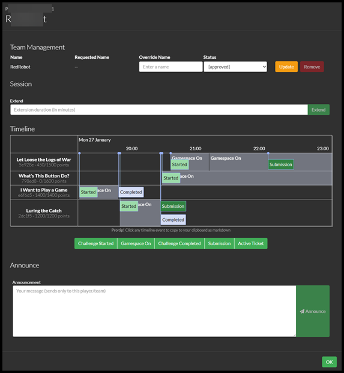

##### Team Management

**Override Name:** Enter a name here to *override* the existing team or player name.

**Status:** *Approve* the override name here or apply a *disallowed reason* (`disallowed`, `disallowed_pii`, `disallowed_unit`, etc.).

##### Session

**Extend:** To add more time to a team or player's session, enter the extension duration in minutes and click **Extend**.

##### Timeline

The **Player Timeline** is a visual representation of the sequence of session events distributed chronologically along a line. It shows the order and timing of game occurrences where events have dates and times. Events on the timeline are clickable and copy information about the event to your clipboard in Markdown format. The **Gamespace On** event is not clickable.

Events seen on the player timeline are:

- **Challenge Started:** Shows the date and time when the player launched a challenge.
- **Gamespace On:** Shows the moment when Gameboard activated a gamespace. This event is not clickable.
- **Challenge Completed:** Shows the date and time when the player finished a challenge and includes the number of attempts used and final score.
- **Submission:** Shows when the player submitted a token or answer and includes the number of attempts used, points awarded after the attempt, and any submitted answers.
- **Active Ticket:** Shows when the team or player opened a support ticket.

!!! tip

    Selecting one of the buttons removes that type of event from the player timeline. If you only wanted to see **Submissions**, for example, you could remove the other event types.

##### Announce

The **Announcement** feature allows you to broadcast messages to just a player or team within the game. Among other uses, these could be messages regarding Gameboard issues, challenge issues, and changes to scores or time. In the **Announcement** field, enter the content of the announcement and click **Announce**.

#### "3-Dot" Context Menu

Each player or team has a "3-dot"context menu on their card. The available options change based on whether they haven't started, are actively playing, or have finished.

- **View:** Opens the Team/Player modal discussed above.
- **View Team IDs:** Opens a modal that provides convenient copy access to **player ID** and **user ID** for support purposes.
- **Copy Player ID / Team ID / User ID:** Again, convenient copy access for support purposes.
- **View Certificate:** View a player's certificate if published and the game is over.
- **Manual Bonuses:** Manually award bonus points to a player or team score. This option helps when a challenge produced bonus points that you need to record. Make sure the player has started the challenge before you award manual bonuses.
- **Manage Challenges:** Launch, start/stop challenge resources, or completely purge a challenge attempt on behalf of the player. Purging a challenge erases all progress a player has made on it.
- **Reset Session(Preserve Challenges):** If a player has registered and started playing the game (i.e., they have a game session), you can reset their session *without* archiving started or completed challenges. Use this option only in specific situations like testing and QA.
- **Reset Session:** If a player has registered and has started playing the game (i.e. they have a game session), you can reset their session. This deletes any challenge data they generated while playing but leaves enrollment and team membership intact. If they wish to play again, they'll need to start a new session.
- **Reset Session & Unenroll:** If a player has registered and started a session, you can *reset* their session and *unenroll* them from the game. Players must re-enroll to play again. This action effectively dissolves teams, so they need to reform and re-enroll to continue. This option matches the functionality a player sees when they unenroll from the game lobby or reset their own session (when enabled by an admin).

### Practice Tab

The Practice tab appears only in games where you set Player Mode to **Practice** (find this setting on the Gear tab under **Modes**). It lists all users who have played any challenge in practice mode, with exactly one row per user. Clicking a row opens an attempt summary window for that user. If the user is actively playing, the **3-Dot** context menu provides an option to quick-jump to observe their session.

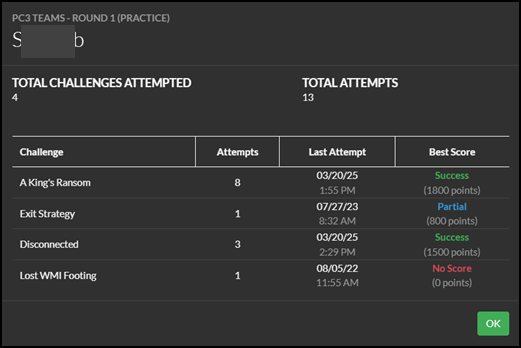

### Observe Tab

The **Observe tab** allows a user with elevated permissions to see participant VMs during a particular game. Observers do not have the ability to interact with, or interfere with, the VM they are observing.

**Search:** The Search feature is relative to the screen you are viewing when performing the search. Searching on the Observe Challenges screen means you're searching that list of challenges for some criteria (name, challenge, tag, id). Searching on the Observe Teams screen means you're searching that list of teams/players for some criteria (team name/player name, team id).

#### Observe Challenges

When you select **Challenges**, Gameboard shows a table containing every challenge for every player in that game. The console grid lists all VMs for a challenge—whether active or not.

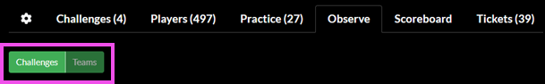

Select the grid icon to view active VMs in a grid view side-by-side according to player or team. Minimize and maximize the consoles within the grid as you observe. When the grid containing the consoles is open, the observe mode updates in real-time.

Selecting the **four-square** icon allows you to view the consoles of another player or team. Multiple observers can be on the same VM.

VM name (*win10-workstation*) and player display name (*Wolverine 3*) help observers identify the console they are viewing, especially if there are many players with many challenges. Click the **pop-out** icon to open the console in a new browser tab.


**Name:** Sort the consoles alphabetically by the Team/Player and then by challenge name.

**Rank:** Sort the consoles by scoreboard rank.

You can move a row to the top and "pin" it there to keep it in place. Pin multiple rows if you want to follow a specific group of teams, players, or challenges. Pinning also helps after you run a search because you can keep the results at the top for quick reference.


#### Observe Teams

**Observe Teams** is a list of all players/teams for the game. The list of players/teams matches the entries on the scoreboard and contains "live" sessions; that is, sessions that players have already started. The console grid is one rectangle per user on a team. Users may not be on a VM at all yet or two users could be looking at the same VM.

Other than the difference described above, Observe Teams functions the same as Observe Challenges.

### Scoreboard Tab

The scoreboard found here is the same publicly accessible scoreboard you would find if you clicked the Scoreboard link in a game lobby. Users who have elevated permissions can see breakdowns for any team even if the game isn't over yet.

### Tickets Tab

The support ticketing functionality found here is the same as the interface documented here: [Getting In-Game Support](#getting-in-game-support). However, the Gameboard only allows you to interact with support tickets for the game you're viewing. You can perform all of the usual support ticket actions here (filter, search, export tickets) except for creating a new ticket.

### Admin Practice Area

Gameboard administrators configure the global Practice Area content here. In the main navigation bar, click **Admin**, then **Practice Area**.

#### Practice Page Greeting

The text here appears on the Practice Area page and introduces players to the Practice Area. Author the greeting in Markdown to create a nicely formatted message. Customize the greeting to meet your needs.

For more information about Markdown and its syntax, visit [www.markdownguide.org](https://www.markdownguide.org){ target=\_blank }.

#### Suggested Searches

Suggested searches appear on the Practice Area homepage just below the greeting and direct players to useful or interesting subsets of available practice challenges. These searches act as filters for tags attached to a challenge. (When developers create a challenge, they can optionally add tags that describe the skills needed to solve the challenge.)

Gameboard displays only the tags that match the suggested searches when players browse the Practice Area. This approach keeps the list relevant so players can find the challenges that interest them.

To enter suggested searches, list one search term per line.

#### Certificate Template

Admins configure the certificate template here by entering HTML into the **Certificate Template** field. Players save certificates in PDF format for each practice challenge they fully complete. For more information on certificates, see the [Profile screen](#the-profile-screen) documentation.

For your convenience, here are several variables you can include in your template to display information about the player's performance on a practice challenge.

- `{{playerName}}`: The player's approved username
- `{{score}}`: The player's score on the challenge
- `{{date}}`: The date the player completed the challenge
- `{{challengeName}}`: The name of the challenge
- `{{season}}`: The season the challenge was originally played in competitive mode
- `{{track}}`: The track the challenge was originally placed in competitive mode
- `{{time}}`: The amount of time the player spent solving the challenge

For additional guidance on creating certificate templates, see the [Configuring Certificate Templates](#configuring-certificate-templates) topic.

#### Session Limits

Admins use these controls to set limits on practice sessions, including:

- **Maximum Concurrent Users:** How many players can be active at once
- **Default Session Length:** How long in minutes practice sessions are by default
- **Maximum Session Length:** How long in minutes the maximum length a single practice session lasts

### Users

To access the **Administration**, **Users** screen click **Admin** in the top navigation menu, then click **Users**. Use this screen to create, update, delete, and assign roles to users, as well as issue API keys. Approve or disapprove participant names here too. In Gameboard, a *user* is a person and a user has a *Name*.

#### Searching, Filtering, and Sorting

To search for a user across the whole of Gameboard enter a term into the **Search** field.

To filter your results, select **Has Elevated Role**, **Has Pending Name**, or **Has Disallowed Name**.

- **Has Elevated Role:** contains only participants who received roles with additional permissions (Admin, Director, Support, Tester).
- **Has Pending Name:** contains only participants whose display names await approval or disapproval from an admin.
- **Has Disallowed Name:** contains only participants whose display names an admin disapproved.

To sort your results, select **Name**, **Last Login**, or **Created On**. Click to sort in **ascending** order (A → Z, oldest to newest). Click again to sort in **descending** order (Z → A, newest to oldest). The arrow (▲ or ▼), appears in the sort button to show the current sorting direction.

#### Viewing a User Card

Select **View** in a user's record to show the user's card. Here you can delete a user from Gameboard, change their approved name, add a disapproved reason, and even change their role.

Here you can also generate an API Key for the user.

1. Under API Keys, enter a name for your new API key.
2. Enter an expiration date or leave the date field blank for permanent access.
3. Click **Add**.
4. Click **Copy** to copy the new key and record it in safe place. You can only view it for a short period of time in the Gameboard.

#### Adding Users

Administrators can create Gameboard user accounts in advance. Typically, users register through an identity provider and Gameboard creates their account at first login. Users select a sponsor and display name.

However, administrators can create Gameboard accounts proactively for users who already have an identity account. This is useful for events where pre-registered participants need to complete a specific set challenges or play in the Practice Area.

To add a new user in the Gameboard:

1. On the Users screen, click **Add Users**.
2. In the **Create Users** window, in the field, enter space- or line-delimited user GUIDs (globally unique identifiers) to create Gameboard user accounts. This approach lets you create multiple accounts at the same time. Example settings that configure initial user options appear below the field.
3. Under **Settings**, enable **Show an error if one of these IDs already exists** and/or **Don't force users to select their sponsor before playing** depending upon your needs.
4. Select a role to assign to the users.
5. Select a sponsor to assign to the users.
6. Select a game to enroll the users in.
7. Click **OK**. Gameboard creates the new users. If you sort the users in descending order by **Created On** date you'll see them at the top.

### Players

To access the **Administration**, **Players** screen click **Admin** in the top navigation menu, then click **Players**. You will find the same actions in the Game Center under the **Players/Teams** tab, which serves as an alternative option.

The **Players** screen shows one *player* record for each time a *user* plays in a game. Remember, *players* are users who play in, or participate in, a game. A *user* is the real person in Gameboard.

Let's say you have a user named `Ned-Stark` in the Gameboard whose user id is `4b427a66`. If Ned has registered for three games in Gameboard, Ned appears on this screen three times: once for each of the three games. Ned will have a unique *player id* for each time he appears, but his *user id* is always `4b427a66`.

!!! note

    Ned can optionally choose a different player name (for example, `EddardS`) for each game before beginning play. Therefore, you will see entries on this screen with the same user id (`4b427a66`), but different player names (`Ned-Stark` and `EddardS`).

#### Search

To search for a player across the whole of Gameboard enter a term into the **Search** field.

**names-pending:** filters by those participants whose display names are pending approval or disapproval.

**names-disallowed:** filters by participants whose display names an admin disapproved.

In the player search results, select the game link to go to that game's Game Center. Select `user id`, `player id`, `team id`, and `game id` to copy it to the clipboard.

#### Player Session Status

Information about the player's session appears here.

- A yellow light indicates a player who has registered to play but hasn't started a session.
- A green light indicates a player is active (i.e., has started a session).
- A red light indicates that player's session has ended.

This player is active:

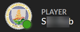

### Sponsors

This is where those users with the Admin and Director roles define who the sponsors are and what logo to associate with each. To access the **Sponsors** screen, click **Admin** in the top navigation menu, then click **Sponsors**.

#### Create a New Sponsor

To create a new sponsor:

1. Click the **plus** sign, then upload a logo file.
2. Enter a sponsor **Name**.
3. Select a **Parent Sponsor** if appropriate.
4. Click **Save**.

Sponsor logo files may be in any of the following formats: *.png, .jpeg, .jpg, .gif, .webp,* and *.svg*. Your new sponsor appears in the list of sponsors. You can **edit** and **delete** sponsors from the list.

#### Existing Sponsors

To edit an existing sponsor:

1. Click the **Edit** button next to an existing sponsor.
2. Make any changes to the sponsor **Name** and **Parent Sponsor** and click **Save**.

To delete an existing sponsor:

1. Click the **Delete** button next to an existing sponsor.
2. Click **Confirm**.

### Challenges

The **Challenges** tab helps users with elevated permissions in Gameboard (e.g., Admin, Director, Support) troubleshoot challenge-related issues.

After logging into the Gameboard app with the appropriate role, click **Admin**, then **Challenges**.

**Search:** Search for specific teams, players, challenge IDs, and tags.

**Current:** A green dot indicates an active challenge. A challenge remains active until one of three conditions occurs: the player submits a correct solution, the player reaches the maximum number of submissions, or the session expires. Once any of these conditions occur, the challenge becomes inactive. Inactive challenges still contribute to total score, rank, and cumulative time.

A challenge remains current and not archived until the **Reset Session** button resets it.

**Archived:** When a participant clicks **Reset Session**, Gameboard archives the participant and challenge event data before deleting the session. Admins can access this archived information here.

**Submissions:** Displays timestamps and the player's submitted answers stored in Gameboard.

**Game Engine Audit:** Click **Audit from game engine?** to query the game engine (for Crucible, this is TopoMojo) and retrieve its record of submitted answers. Use this audit to compare Gameboard's submission records with the game engine's.

**Regrade:** Click **Regrade** to have Gameboard recheck all player submissions against the current list of correct answers. Use regrade when a challenge gains new acceptable answers or when players submit correct answers in an unexpected format. After manually updating the TopoMojo workspace with the new correct answers, regrade the challenge to update player scores accordingly.

### Support Settings

#### Greeting

In the **Greeting** field, enter a message. Your message appears as a banner on the Support page to welcome players. Customize it to fit your needs. The field supports the use of Markdown formatting.

#### Ticket Auto-Labeling

This feature automatically assigns labels to tickets based on specific criteria, such as the play mode, game, challenge, or sponsor associated with the player who generated the ticket. Auto-labeling streamlines ticket management because Gameboard categorizes incoming tickets by those factors, making them easier to track.

### Notifications

The **Notifications** feature allows those users who have elevated permissions such as Admin and Director roles to post alerts and notices for users in the Gameboard system. When users log in, they will see a banner for each active notification. Once a user dismisses a notification, it does not appear again.

This topic assumes you hold a role with the appropriate permissions in Gameboard, already created a game, and have logged in.

#### Creating a Notification

To create a new notification:

1. In the top navigation, select **Admin**, then **Notifications**.
2. Click **Create Notification**.
3. Enter a **Title**.
4. Enter the **Content** of the notification. The content supports Markdown formatting.
5. Optionally, set the **Availability dates**. These dates determine when the notification is visible. If set, the notification will appear to players only *after* the start date and *until* the end date.
6. Optionally, check the **Dismissible?** box. When unchecked, players can't manually remove or dismiss the notification from their screen. The notification continues to appear every time they log in until the admin deletes it or the notification reaches its end date (if you configure an end date).
7. Select a **Type**:
   - **General Info** (blue)
   - **Warning** (yellow)
   - **Emergency** (red)
8. Click **Save**.

#### Managing Notifications

- You can **edit** or **delete** existing notifications from the list.
- If you leave the availability dates blank, the notification remains visible until a player dismisses it.

!!! note "Announcements vs. Notifications: When to Use Each"

    In Gameboard, Announcements and Notifications both share important messages, but they work differently. Announcements go to users who are currently logged in and can be sent to everyone or just a specific team. These are best for real-time updates, like system issues or challenge changes.

    Notifications, however, appear as banners when users log in and stay until dismissed. They ensure everyone sees the message, even if they weren't online logged into Gameboard when it was posted. Use Announcements for immediate alerts and Notifications for updates that need to reach all users over time.

### Permissions

Gameboard uses a role-based permissions system to define what functions each role can access.

There are five roles: **Admin**, **Director**, **Support**, **Tester**, and "participant" (i.e., no role). The four elevated roles have cumulative permissions: Testers have the least access; Support has more access than Testers; Directors have more than Support; and Admins have full access.

- **Admin**: Full permissions to access all parts of the application and change user permissions.
- **Director**: Tester and Support permissions, plus the ability to create/edit/delete games, manage game settings, deploy resources, manage team sessions and scores, and edit some site-wide settings (e.g., announcements, practice area).
- **Support**: Tester permissions, plus the ability to view additional information about teams/games, manage enrolled players, view reports, and manage support tickets.
- **Tester**: Can play games outside of the execution window and view hidden games for testing game functionality.

If you're Support, Director, or Admin, you can go to **Admin**, **Permissions** in the top navigation to check your role and see what each role can do.

Only Admins can change the permissions of other users, and you must keep at least one Admin active. To assign roles, go to **Admin**, **Permissions** in the top navigation.

The table below outlines the permissions associated with different roles in the Gameboard across various functions.

| Permission / Role                                                                                                                          | Admin   | Director | Support | Tester  |
| ------------------------------------------------------------------------------------------------------------------------------------------ | ------- | -------- | ------- | ------- |
| ADMIN                                                                                                                                      |         |          |         |         |
| Admin Area: Access the Admin area                                                                                                          | **Yes** | **Yes**  | **Yes** | No      |
| Create/edit sponsors: Create and edit sponsor organizations                                                                                | **Yes** | **Yes**  | No      | No      |
| Manage API Keys: Can generate API keys for any user and revoke their access                                                                | **Yes** | No       | No      | No      |
| Manage system notifications: Create, edit, and delete notifications which appear at the top of the app                                     | **Yes** | **Yes**  | No      | No      |
| GAMES                                                                                                                                      |         |          |         |         |
| Create/edit/delete games: Create, edit, and delete games. Add and remove challenges, set their scoring properties, and add manual bonuses. | **Yes** | **Yes**  | No      | No      |
| Set players to ready: Change player status to ready/not ready in sync-start games                                                          | **Yes** | **Yes**  | No      | No      |
| View hidden games and practice challenges: View games and practice challenges that their creator hid from players                          | **Yes** | **Yes**  | **Yes** | **Yes** |
| PLAY                                                                                                                                       |         |          |         |         |
| Ignore registration/execution windows: Ignore registration and execution window settings when enrolling in and starting games              | **Yes** | **Yes**  | **Yes** | **Yes** |
| Ignore session reset settings: Reset their session, even in games that prohibit session reset                                              | **Yes** | **Yes**  | **Yes** | **Yes** |
| Select challenge variants: Choose any variant of a challenge when deploying (rather than random assignment)                                | **Yes** | **Yes**  | **Yes** | **Yes** |
| PRACTICE                                                                                                                                   |         |          |         |         |
| Practice Area: Edit settings for the Practice Area                                                                                         | **Yes** | **Yes**  | No      | No      |
| REPORTS                                                                                                                                    |         |          |         |         |
| Reports: Run, view, and share reports                                                                                                      | **Yes** | **Yes**  | **Yes** | No      |
| SCORING                                                                                                                                    |         |          |         |         |
| Award manual bonuses: Award manual bonuses to individual players or teams                                                                  | **Yes** | **Yes**  | No      | No      |
| Revise scores: Manually initiate re-ranking of games and regrading of challenges                                                           | **Yes** | **Yes**  | No      | No      |
| View scores live: View scores for all players and teams (even before the game has ended)                                                   | **Yes** | **Yes**  | **Yes** | No      |
| SUPPORT                                                                                                                                    |         |          |         |         |
| Edit Support settings: Edit support settings (e.g. support page greeting)                                                                  | **Yes** | **Yes**  | **Yes** | No      |
| Manage tickets: Manage, edit, assign, and respond to tickets                                                                               | **Yes** | **Yes**  | **Yes** | No      |
| View tickets: View all tickets in the app                                                                                                  | **Yes** | **Yes**  | **Yes** | No      |
| TEAMS                                                                                                                                      |         |          |         |         |
| Administer sessions: Manually end and extend team play sessions                                                                            | **Yes** | **Yes**  | No      | No      |
| Approve name changes: Approve name change requests for users and players                                                                   | **Yes** | **Yes**  | **Yes** | No      |
| Create/delete challenge instances: Start and purge an instance of a challenge on behalf of any team                                        | **Yes** | No       | No      | No      |
| Deploy game resources: Deploy virtual on behalf of players through the Admin section                                                       | **Yes** | **Yes**  | No      | No      |
| Enroll Players: Enroll players in games on their behalf                                                                                    | **Yes** | **Yes**  | **Yes** | No      |
| Observe: See information about all active challenges and teams                                                                             | **Yes** | **Yes**  | **Yes** | No      |
| Send announcements: Send announcements to all players (or individual players and teams)                                                    | **Yes** | **Yes**  | No      | No      |
| USERS                                                                                                                                      |         |          |         |         |
| Assign roles: Assign roles to other users                                                                                                  | **Yes** | No       | No      | No      |
| Create users manually: Create and edit users manually (currently available only as an API call)                                            | **Yes** | No       | No      | No      |

Before players start a game or lab, they must *enroll* in the game lobby. After logging in, they select a game on the **Home** page, click **Enroll**, and confirm to start the session. The **Enroll** button appears only after they set a display name and sponsoring organization in their profile. The game's registration window must also be open, as defined in the Admin Game Settings.

If a user has an elevated role, then the **Admin Enroll** button appears next to the **Enroll** button. See the screen print below.

**Admin Enroll** allows a user with an elevated role to bypass registration timing restrictions. It does *not* bypass display-name and sponsoring-organization requirements, so set those before gameplay. Use **Admin Enroll** for testing, troubleshooting, and customer support.

!!! note

     If you do have access to the **Admin Enroll** button, it behaves *identically* to the standard **Enroll** button for you. If you can see both **Enroll** and **Admin Enroll**, it does not matter which button you select.

*Enroll and Admin Enroll:*


### Feedback Templates

In the Gameboard application, you can use feedback forms to capture participant feedback on a game and challenges. Collecting and analyzing participant feedback can help you refine and improve your user experiences. Gameboard generates feedback *forms* from feedback *templates*.

- Users with elevated permissions (`Admin`, `Director`) create feedback templates.
- Participants or players in the game complete feedback forms.
- Users who hold the appropriate permission (`Admin`, `Director`, `Support`) review feedback reports.

Creating a feedback template is not required to build a game or challenge. It's up to you whether or not you choose to implement feedback. If a feedback template is not configured in the Gameboard administration menu, then the feedback form does not appear for the participant.

You can create questions for *just* a game, *just* challenges, or *both* game and challenges. When you create a feedback template for a game or one of its challenges, you can use that template in other games and challenges too.

After participants submit responses, you can no longer change the feedback template.

This section assumes you hold a role with the appropriate permissions in Gameboard, already created a game, and have logged in.

1. In the top navigation, select **Admin**.
2. Select an existing game, then select the **Settings cog**. Under Metadata, see the Player Feedback section. Here you can select an existing feedback template and *add*, *preview*, *edit*, *copy*, and *delete* feedback templates.

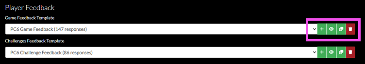

#### Selecting a Feedback Template

1. In the game's Metadata settings, under Player Feedback, choose an existing certificate template from the dropdowns.

#### Adding a Feedback Template

1. In the game's Metadata settings, under Player Feedback, select the **+** icon next to **Game Feedback Template** and/or **Challenges Feedback Template**.
2. In the **Create Template** window, enter a **Name** for your certificate template.
3. In the **Help Text** field, enter a brief explanatory message that guides users on how to complete the feedback form.
4. In the **Template** box, specify the feedback questions in YAML. For guidance, see the [Configuration YAML](#configuration-yaml) section below.
5. You can use the **Copy from:** feature to paste an example configuration into the **Template** field. In the **Copy from:** dropdown, select a template to copy from and then click **Paste Example Configuration**.
6. Click **OK**.

#### Previewing a Feedback Template

1. In the game's Metadata settings, under Player Feedback, select the **eye** icon next to **Game Feedback Template** and/or **Challenges Feedback Template**. Gameboard opens the feedback template preview.
2. Click **OK** to dismiss it.

#### Editing a Feedback Template

1. In the game's Metadata settings, under Player Feedback, select the **Edit** icon next to **Game Feedback Template** and/or **Challenges Feedback Template**. Gameboard opens the **Edit Template** window.
2. Make any updates in the **Name**, **Help Text**, and **Template** fields, then click **OK**.

#### Copying a Feedback Template

1. In the game's Metadata settings, under Player Feedback, select the **Copy** icon next to **Game Feedback Template** and/or **Challenges Feedback Template**. Gameboard copies the template's YAML configuration to your clipboard.
2. Paste the YAML into the location of your choice.

#### Deleting a Feedback Template

1. In the game's Metadata settings, under Player Feedback, select the **Delete** icon next to **Game Feedback Template** and/or **Challenges Feedback Template**. Gameboard deletes the feedback template.

!!! warning

    There is no additional confirmation when deleting a certificate template. Clicking **Delete** does indeed delete your certificate template!

#### Configuration YAML

Review the following sample YAML feedback form to understand the keys and their values.

```yaml
questions:
  - id: q1
    prompt: Please rate the difficulty of this game.
    shortName: Difficulty
    type: likert
    max: 10
    minLabel: Very Easy
    maxLabel: Very Difficult
    required: true
  - id: q2
    prompt: What did you like about this game?
    type: text
```

- `id`: *ids* must be unique within the template. If ids in a single list are not unique, Gameboard presents a warning.
- `prompt`: this is the question you want the participant to answer or the property you want them to rate.
- `shortName`: an abbreviated version of the prompt. `shortName` is optional, but is helpful for use in tables as the column header. Good examples are "Difficult" or "Quality".
- `type`: `likert` or `text`; if you choose `Likert`, define the scale (`max`, `minLabel`, `maxLabel`) that measures how much a participant can agree or disagree with your prompt. If you choose `text`, a participant is free to answer your prompt however they like. Text type questions have a 2,000 character limit.
- `max`: this is the upper extreme of your `Likert` scale; 10 is the recommended upper limit. Any integer greater than 1 will work, but a scale that goes past 10 may become unwieldy or awkward.
- `minLabel`: specify the labels for the extremes of your `Likert` scale; examples of the negative extreme might be "very easy", "strongly disagree", or "very dissatisfied".
- `maxLabel`: specify the labels for the extremes of your `Likert` scale; examples of the positive extreme might be " very difficult", "strongly agree", or "very satisfied".
- `required`: this key is optional; set `required` to `true` if you want to make your question required.

#### Reporting on Feedback

Viewing and exporting responses to feedback requires elevated permissions. If you have the `Admin`, `Director`, or `Support` role and have logged into Gameboard, select **Reports** in the top navigation. Then select **Feedback Report**.

The [Reports](#reports) section of the docs documents the Feedback Reports feature.

### Configuring Certificate Templates

Game participants can view, share, and print certificates of completion as proof of participation in a game. To enable that capability, configure certificate templates in a game's Metadata settings. Game organizers (i.e., users who hold a role with the appropriate permissions) customize those templates to control the appearance of completion certificates.

This topic assumes you hold a role with the appropriate permissions in Gameboard, already created a game, and have logged in.

1. In the top navigation, select **Admin**.
2. Select an existing game, then Select the **Settings cog**. Under Metadata, see the Completion Certificates section. Here you can select an existing certificate template and *add*, *preview*, *edit*, *copy*, and *delete* completion certificate templates.

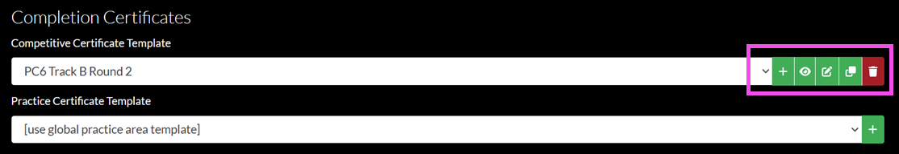

Certificates are "templatized", allowing you to reuse a single certificate template across multiple games. Competitive certificate templates and practice certificate templates share a unified set of fields that you can incorporate to display relevant information on the completion certificate generated by the participant.

Enclose the following keywords in `{{double braces}}`: `date`, `division`, `challengeDescription`, `challengeName`, `gameName`, `playerName`, `rank`, `score`, `season`, `series`, `teamName`, `totalPlayerCount`, `totalTeamCount`, `time`, `track`, and `userName`.

#### Selecting a Certificate Template

Players can view a list of past certificates from their Gameboard Profile page too. In Gameboard, click **Profile**. Then click **Certificates**. Gameboard displays a table view of all game certificates. You can view and print the certificate as a .PDF from the table view.

1. In the game's Metadata settings, under Completion Certificates, choose an existing certificate template from the dropdowns.

#### Adding a Certificate Template

1. In the game's Metadata settings, under Completion Certificates, select the **+** icon.
2. In the **Create Certificate Template** window, enter a **Name** for your certificate template.
3. In the **Template** box, specify the certificate template in HTML. You should not include the entire HTML document (i.e., don't add `<!DOCTYPE html>`, `<html>`, `<head>`, or `<body>` tags). Just provide the essential HTML content, such as `<div>` and `<p>` elements.

   - Gameboard automatically inserts your content into a pre-existing, correctly formatted HTML document for display.
   - You can use the **Copy from:** feature to paste an example certificate HTML configuration into the **Template** field. In the **Copy from:** dropdown, select a template to copy from and then click **Copy**.
   - You can include `<style>` blocks to define CSS styles and apply them to your custom HTML elements.
   - You can set a background image for your certificate by using the `.gameboard-print-html` CSS class. Gameboard generates this element when rendering the certificate and automatically applies any styles you add to it (like `background-image`).

4. Click **OK**.

#### Previewing a Certificate Template

This section assumes that you already hold the Administrator role in Gameboard, already created a game, and have logged in.

1. In the game's Metadata settings, under Completion Certificates, select the **eye** icon. Gameboard opens the certificate preview in a new browser tab.

#### Editing a Certificate Template

1. In the game's Metadata settings, under Completion Certificates, select the **Edit** icon. Gameboard opens the **Edit Certificate Template** window.
2. Make any updates in the **Name** and **Template** fields, then click **OK**.

#### Copying a Certificate Template

1. In the game's Metadata settings, under Completion Certificates, select the **Copy** icon. Gameboard copies the template's HTML configuration to your clipboard.
2. Paste the HTML into the location of your choice.

#### Deleting a Certificate Template

1. In the game's Metadata settings, under Completion Certificates, select the **Delete** icon. Gameboard deletes the certificate template.

!!! warning

    There is no additional confirmation when deleting a certificate template. Clicking **Delete** does indeed delete your certificate template!

## User Guide

### The Profile Screen

Participants access their *Profile* by browsing to the Gameboard's designated URL and logging in. By default, authenticated participants land in the Profile screen if they haven't registered for a game yet. Otherwise, click **Profile** in the top navigation.

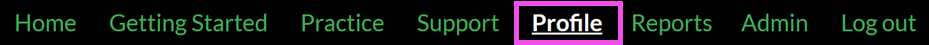

#### Profile Tab

##### Display Name

Set a default name for public display that is suitable for all audiences. This name will apply to all new games; however, you can customize it during registration.

##### Sponsoring Organization

Select *your* organization. Gameboard admins define who the sponsors are, and what image to associate with each.

#### Certificates Tab

View and print a certificate as proof of participation in a game. This feature allows players to provide a record of achievements to friends, colleagues, and organizations to validate professional development time.

Select **Competitive** to find and print certificates which validate player performance in a *game*. Competitive certificates become available when the game's execution period ends.

Select **Practice** to find and print certificates which validate player performance in a *practice challenge*. You can also save them as PDFs. Practice certificates are available immediately upon full completion of a practice challenge.

**Publish/Unpublish:** Optionally, players can *publish* a certificate on a per-certificate basis. Publishing a certificate means it will become public. Players can send the certificate link (click **Copy**) to anyone including non-Gameboard users. Players can *unpublish* a certificate at any time removing access to the certificate. Unpublishing a certificate means it will become private once again.

**Open:** Launches the certificate in a new tab in the browser. Here players can print their certificate and change the username on the certificate.

##### Printing the Certificate

There are several ways to print the certificate. Players can:

1. Click the **Print This Certificate** button. In the **Print** window, click **Print** to send the certificate to a printer or select **Save as PDF** to download the certificate in PDF format.
2. Press **Ctrl+P** or use the browser's **Print** function. In the **Print** window, click **Print** to send the certificate to a printer or select **Save as PDF** to download the certificate in PDF format.

!!! info

    Players can always save their certificate as an image file. In the certificate screen, right-click the certificate and select **Save image as...**, change the file type to `.png`, and click **Save**.

##### Providing a Different Name

To regenerate your certificate with a different name (e.g., your real name instead of your Gameboard display name):

1. Click the **Provide Another Name** button.
2. In the **Name** field, enter the name you want to appear on your certificate.
3. Click **OK**.

The new name you enter on the certificate is temporary and applies *only to printing*. If you close and reopen the certificate, Gameboard restores the original display name. If you publish the certificate, viewers see your Gameboard display name, not the temporary name.

##### Creating Certificate Templates

Game organizers with the appropriate role/permissions create completion certificate templates in the game Metadata settings. See [Configuring Certificate Templates](#configuring-certificate-templates) in the *Administrator Guide* section of the Gameboard docs.

#### History Tab

View game history, including where you finished on the scoreboard and whether it was in practice or competition.

#### Settings Tab

Users who have the appropriate role can view the **Settings tab**. Here, they may opt to receive browser notifications when support tickets open, close, or update. Users can choose to play an audio alert when Gameboard sends a browser notification.

!!! note

    OS-level settings and browser site settings for pop-ups and redirects control whether Gameboard can show browser notifications. Update those settings if notifications do not appear.

### The Home Screen

The Home screen is where you start a "live" game, preview upcoming games, and view completed games. Hover over a game card and select **Open Game**. Click **Enroll** to proceed to the game lobby.

#### The Game Lobby

This is the staging area where players join team members (if playing on a team) and get organized before starting a game session. Information about the session and enrollment appears here: e.g., "Enrollment closes in 2101d 17h."

- A yellow light indicates a player who has registered to play but hasn't started a session.
- A green light indicates a player is active (i.e., has started a session).
- A red light indicates that player's session has ended.

This player is active:


**Start Session:** A *session* begins when you start a game and deploy challenges to solve. To start your session, select **Start Session** and click through the confirmation messages. You can't pause or stop sessions after they start.

!!! warning

    For team players, make sure your teammates are ready to start. You can't add or remove team members after your session has started. Also note that *any* team member can start a session -- the continuous session timer starts when the final **Confirm** button is clicked.

**Reset Session:** Players can reset a session if their Gameboard administrator permits it. Resetting a session deletes any challenge data generated while playing, but leaves enrollment and team membership intact. When a participant wants to play again, they have to start a new session.

!!! note "A note about session time and game execution time"

    When a session extends beyond the game's availability period, administrators can choose to prevent players from starting. If you apply this restriction (called **Allow Late Starts** in the game administration settings), the session can't begin. If you leave it disabled, Gameboard displays a warning that the session time will be shorter because of the late start.

**Unenroll:** A registered player who has not started a session can unenroll from the game. To play again, the player must re-enroll.

**Set Game Display Name/Set Team Display Name:** Use this option to choose the display name that represents an a player/team on the public scoreboard. The game display name matches your profile display name by default. You can request a customized display name per game. Gameboard requires approval for game display name change requests.

Setting a new team display name also renames the captain player's display name. Make sure this is what you intend before changing the team display name.

##### Organizing a Team

If the game uses teams, organize the team in the game lobby. Under **Set Team Display Name**, enter a team name for the scoreboard. If you're the team captain, generate an invitation code for your teammates, copy it, and share it with them. Team members redeem the invitation code in this area.

!!! warning

    Team captains: generating a new invitation code invalidates previous invitation codes.

##### Starting a Challenge

After you start your session, select **Continue to Gameboard**. To start a challenge, select a hot spot on the Gameboard. Select **Start Challenge** and click through the confirmation messages.

Administrators may set a limit on the number of challenges a player can have deployed at once, known as the **Gamespace Limit**. When a player reaches the gamespace limit and tries to launch another challenge, Gameboard displays the following message:

*Unable to deploy resources for this challenge because you've reached the gamespace limit for the game. Complete or destroy the resources of other challenges to work on this one.*

**Destroy/Deploy:** To destroy a challenge so you can open another, select the **Destroy** button under Gamespace Resources in the challenge instructions. If you want to return to the challenge later, select the **Deploy** button under Gamespace Resources. Destroying the challenge resets it to its original state. Any partial credit earned remains, but the system reverses your VM changes. The challenge timer continues to accumulate after you destroy the challenge.

*Location of the Destroy button in context:*

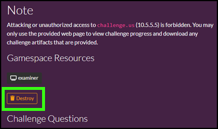

##### Creating a Support Ticket

Players can get to the in-game support feature from the launched challenge screen below the challenge questions and the Support link in the top navigation.

From either of these locations, select **Create Ticket**. When you create a ticket from the challenge screen, Gameboard automatically populates the Support Code, challenge information, Game ID, Player ID, and Team ID. If you create a ticket from the Support link, you can add this information later.

For a full treatment of Gameboard's Support feature, please see the [Getting In-Game Support](#getting-in-game-support) section of the docs.

### Giving Feedback as a Player

When a Gameboard administrator enables the *feedback* feature, each player may submit **one** feedback response per game and/or per challenge. Every team member may provide individual feedback. Gameboard keeps the feedback form available at any time after a session starts so participants who quit early still have the opportunity to respond.

The screen print below shows an example of a **challenge** feedback form as a player would see it.


You do not have to complete a challenge to submit challenge feedback. Participants can begin a challenge, explore it without submitting answers, and still respond. Perhaps the challenge felt too difficult or they chose the wrong approach; either way, their feedback remains valuable.

Reports show both unsubmitted and submitted feedback. Once a participant submits feedback, they cannot return to edit it.

This documentation assumes the player has logged into a game and successfully enrolled. To view the *game* feedback as a participant:

1. From the game lobby, select **Start Session**, then click through the confirmations to start the session.
2. Scroll down to the Feedback form and complete the survey.
3. Click **Submit**, then **Confirm** when finished. You can't edit responses after clicking **Submit**. Game feedback responses auto-save.

To view the *challenge* feedback as a participant:

1. From the game lobby, select **Start Session**, then click through the confirmations to start the session.
2. Select **Continue to Gameboard** and start a challenge.
3. Scroll down to the Feedback form and complete the survey.
4. Click **Submit**, then **Confirm** when finished. You can't edit responses after clicking **Submit**. Challenge feedback responses auto-save.

### Practice Area

The **Practice Area** is where Gameboard players can go to rehearse challenges and labs to become proficient in certain skills. Practice Area is a lightweight version of a formal competition.

After logging into Gameboard, click **Practice** in the main navigation.

A Gameboard admin configures the Practice Area greeting for your organization or environment, and the page lists the challenges designated for practice.

You can **search** for a challenge to practice on.


You can copy a link to your search by selecting the **copy icon** next to the search field. In the example above, you may want to share the list of challenges/labs that have "ransomware" content with another Gameboard user.

Under *Need a place to start?* the Gameboard admin may have configured suggested searches for participants. Players can select one of these tags to jump directly to a set of available practice challenges. Gameboard admins should refer to "Suggested searches" in the [Admin Practice Area](#admin-practice-area).

#### Starting a Practice Session

To start a practice session:

1. Select a challenge, then click **Start Practice Session**, and **Confirm**. You can only launch *one* practice challenge at a time.
2. Read the challenge guide. The challenge guide provides details and instructions for completing the practice challenge.
3. Read the solution guide (optional). Gameboard administrators must configure solution guide URLs, and not every challenge or lab includes one.
4. Launch the challenge consoles. Clicking a challenge console opens it in a new web browser tab. Challenge consoles allow players to directly interact with the virtual machines as they complete the practice challenge.
5. Answer the challenge questions. Enter your answers for each question and click **Submit My Answers**, and **Confirm** to submit your answer.

#### Using Copy/Paste in the Consoles

Follow the steps below to transfer text between your local machine (*out of game*) and a virtual machine (*in game*).

##### Local to VM

1. Copy text from your local machine.
2. In the VM console, open **Tools** (cog icon) and paste into the **Clipboard**.
3. In the VM, select a destination and click **Paste**.

##### VM to Local

1. Copy text inside the VM.
2. In **Tools**, place your cursor in the **Clipboard**, then click **Copy**.
3. Paste into a local application.

#### Extending Time or Ending the Session

To add more time to your session, click **Extend Session**, and **Confirm** to extend the amount of time remaining.

To close this practice challenge and try a different one, click **End Session**, and **Confirm** to end the practice challenge session.

#### Using the Sticky Challenge Panel

Challenge consoles and challenge questions appear at the bottom of the **Active Practice Challenge** screen by default. Players using devices with large screens can take advantage of the Sticky Challenge Panel.

Click **Turn on the Sticky Challenge Panel** at the top of the screen. You can also click **Use Sticky Challenge Panel** at the bottom of the screen. Gameboard then attaches a panel with the challenge consoles and challenge questions to the side of the challenge guide.

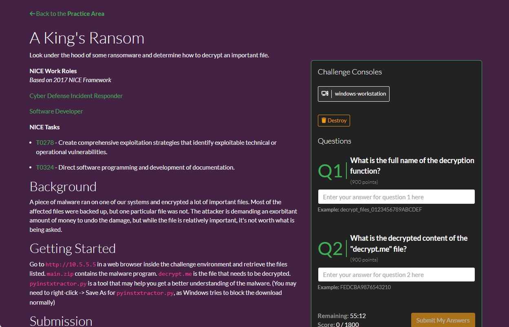

Use the Sticky Challenge Panel to reduce scrolling when you enter answers for practice challenges with lengthy guides.

Select **Click here to deactivate the sticky challenge panel** to turn off the Sticky Challenge Panel.

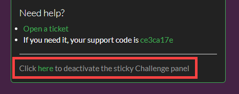

#### Creating a Practice Challenge Support Ticket

Click **Create Ticket** to create a support ticket if you are experiencing a technical difficulty.

For a full treatment of Gameboard's Support feature, please see the [Getting In-Game Support](#getting-in-game-support) section of the docs.

#### Obtaining a Completion Certificate

You can view and print any certificate you earned in competition or in practice at any time from your Profile screen. In the main navigation, click **Profile**. Then, select the **Certificates** link.

If you run out of time or use all allotted submissions, the attempt counts as *unsuccessful*. Try the challenge again or return to the Practice Area to find another option. Gameboard does not award certificates for partially completing a practice challenge.

#### Administering the Practice Area

Gameboard administrators configure global Practice Area settings including: a practice page greeting, certificate template, and session limits in the Gameboard Administration settings. For help on configuring these settings, see the [Admin Practice Area](#admin-practice-area) documentation.

### Getting In-Game Support

The Gameboard platform comes with a built-in customer support interface so that competition hosts and administrators can assist players and teams. Gameboard is a "one-stop shop" and you don't need outside apps or systems to track and measure issues reported by participants. Users who hold a role with the appropriate permissions can use the support feature to manage tickets.

#### Support from the Participant Point-of-View

##### Creating New Support Ticket

You can create tickets from two places: the Support screen and the challenge screen. When you open the form from a challenge, Gameboard automatically fills in the Support Code, player ID, and challenge ID. If you launch the form from the Support screen, you can add that information manually.

From the Support screen:

1. In the top navigation, click **Support**.
2. Click **Create Ticket**.
3. In the **Summary**, enter a brief statement of the problem.
4. In the **Description**, enter a more detailed statement of your problem. Include error messages and other pertinent details.
5. Under **Attachments**, attach files (especially screen shots) here.
6. Click **Submit**.

After submitting the ticket, you can always **add a comment** and attach another file. Gameboard tracks updates to a ticket under Activity, where you can view status changes and assignment changes.

From a challenge screen:

These instructions assume you have enrolled in a game, started a session, and started a challenge.

1. In the *started* challenge, scroll to the bottom of the challenge instructions.
2. Click **Create Ticket**. Notice that the challenge is automatically populated in the **Challenge** field.
3. In the **Summary**, enter a brief statement of the problem.
4. In the **Description**, enter a more detailed statement of your problem. Include error messages and other pertinent details.
5. Under **Attachments**, attach files (especially screen shots) here.
6. Click **Submit**. Because you opened the form from a challenge, Gameboard generates a link to the game lobby and provides the Support Code automatically.

##### Finding an Existing Ticket

From the Support page, use the dropdowns and the **Search** field to locate specific tickets from *all* of the tickets you have submitted.

Filter tickets by status:

- Any Status
- Open
- In Progress
- Not Closed (*Open* plus *In Progress*)
- Closed

Search by entering terms. Search covers ticket description, label, user, challenge title, and player.

#### Support from the Support Role Point-of-View

This section focuses on "support staff"—the people who resolve customer service and technical support issues during a game. In this documentation, "support staff" refers to users who hold the `Support` role or another role (such as `Admin` or `Director`) that permits them to edit support settings, manage tickets, and view tickets.

##### Creating New support Ticket (Support Staff)

Support staff create tickets by following almost the same steps that participants use (see above). After support staff create a ticket, they have additional options to manage it.

##### Managing Support Tickets

From the Ticket management side-bar:

**Assigned to:** Assign the ticket to another support person. The dropdown lists users who hold the support role.

**Status:** Move the ticket through the support workflow. Tickets are `Open`, `In progress`, or `Closed`.

- **Open:** Indicates that support staff have received the ticket but have not acted on it yet. The ticket is "waiting" on an action.
- **In progress:** Indicates that support staff are actively working on the ticket.
- **Closed:** Indicates that support staff have resolved the ticket and no longer need to take action.

**Labels:** Labels are tags or keywords used to categorize the ticket. A label is like a hashtag (#) used on Twitter, Facebook, and other social apps. Labels help when searching for an issue; labels also help when reporting on metrics from your competition.

**Challenge:** If you create a ticket from within a challenge, Gameboard associates it with that challenge and shows the challenge support code here. If the challenge field is blank, open the Challenge dropdown to view the player's challenge list and attach the correct challenge.

**Player:** When a ticket ties to a challenge, Gameboard also links it to a team or player. In a team challenge, every team member can view the ticket.

Add a **comment** to communicate with the participant.

##### Copy to Markdown

The **Copy to markdown** icon allows you to copy support ticket content to Markdown. You can paste it anywhere, including into a messaging app or email, with nicely formatted text, avoiding the need for links or logins to the Gameboard.

#### Support-Related Reporting

Support-related reporting provides you with a way to manage workloads and track trends during your competition. In the main menu, select **Reports**. Then click **Support** in the Reports screen.

See [Reports](#reports) for help understanding the Support reports.

### Reports

The **Reports** module is available to users who have the `Reports` permission. To access the Reports area, in the main navigation bar select **Reports**. Eight report "cards" display available reports:

- **Challenges Report:** View information about the challenges configured in the Gameboard app. This report is good for site utilization metrics related to challenges, challenge deploys, and challenge solves.
- **Enrollment Report:** View a summary of player enrollment data; who enrolled when, which sponsors do they represent, and how many played challenges.
- **Feedback Report:** View all feedback for a specific feedback template across every game or challenge that uses the template.
- **Feedback(Legacy) Report:** View all player feedback for games played *before* Gameboard included the feedback template feature. This option requires configuration of feedback in the Game Center.
- **Players Report:** View data on player activity. A "player" is a person with an account on the Gameboard site (i.e., a "user").
- **Practice Area Report:** View metrics on players who are spending free time honing their skills in Gameboard. See which challenges get practiced most, have the best success rates, and which players are accessing the Gameboard to complete challenges in practice.
- **Site Usage Report:** View a high-level overview of user activity in the Gameboard. This report, optionally filtered by date range and sponsor, offers a digestible view of data related to players, sponsors, and challenges. Each statistic within the report contains a modal view for more detailed information. You can't export the Site Usage Report.
- **Support Report:** View a summary of support tickets created in Gameboard; including ticket creation and assignment details, ticket categories, and tickets attached to games/challenges.

#### Legacy Reports

The legacy reporting functionality is available at the bottom of the Reports screen. Legacy reports won't get future fixes or enhancements. Eventually, we will remove them from the Gameboard application.

#### Common Report Characteristics

Each report shares common characteristics.

- **Filter controls:** Dedicated filter controls allow users to narrow down or restrict the data displayed on a report. For example, if you're interested in seeing enrollments from a given sponsor in the Enrollment Report, use the **Sponsors** filter to select the sponsor(s) you're interested in. If you don't select any values in a filter, the results include all data from that filter.
- **Copy link to report:** When you run a report, the browser generates a link that reflects your current filter selections. Select the **clipboard icon** to copy the current report and share it with another Gameboard user. The user you are sharing with must log into Gameboard and have the appropriate Gameboard role. You can also copy the link in your browser's address bar and share.

!!! tip

     Bookmark useful filters via the browser so you can return to them quickly.

- **Export to CSV:** To export report results CSV, click **Export to CSV**.
- **Reset Filters:** Deselecting filter values on multiple filters can be inconvenient. Click **Reset Filters** to deselect all filter values at once.
- **Summary:** Each report contains a summary that presents key data points. For example: the Enrollment Report shows the Leading Sponsor based upon filter selections.
- **Context menu:** Some reports include context menus, indicated by a **three-dot vertical icon** on the right side of the row. These menus provide access to row-specific functions, such as viewing details for a practice challenge in the Practice Area Report.

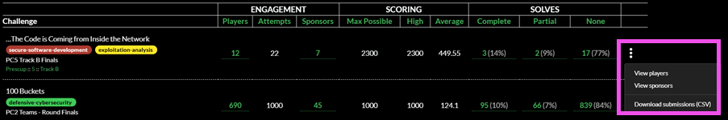

#### Drilling down in Results

In some places in the report results, you can "drill down" by clicking a link in the metrics. A modal window displays a more granular view within the same data. For example: in the Enrollment Report, in the Performance category, some data points are links. See *screen print 1* below. Clicking that link goes deeper into that element. See *screen print 2* below.

*Screen print 1: Summary Table:*


Click **300** to view the detailed information that comprises score in the summary.

*Screen print 2: Data breakdown:*


In this view, you can see the challenges the player completed and the scores they achieved. Now, you can see the details that make up the score.

#### Challenges Report

The **Challenges** report answers questions like these:

1. How many different challenges does the game include?
2. How many competitive challenges did players deploy?
3. How many practice area challenges did players deploy?
4. What are the most popular competitive/practice mode challenges?

#### Enrollment Report

The **Enrollment** report shows information about players enrolled in competitive-mode games on the Gameboard. You can filter this report to show enrollment numbers for each game. You can filter this report to only show information about challenges from specific games and seasons. You can also filter this report by Sponsor.

The screen print below shows a summary of a typical game. The summary shows:

1. 1390 different players (people, "users", with an account in Gameboard) enrolled in our example game. The Department of Defense, the Leading Sponsor, leads enrollment with 1069 players enrolled.
2. Those 1390 players created 1422 teams.

   - The number of teams is higher than the number of players here because some people played in more than one "track" of the competition. Therefore, they have more than one "team" attached to one player/person/user.
   - This number can also be higher than the number of players if the competition contains several rounds. So, if your filters are looking at a Round 1 and a Round 2, there are some teams in both and counted twice.

3. 25 different sponsors participated in this example game.

*Screen print 3: Sample Enrollment report:*


#### Feedback Report

The **Feedback Report** answers questions like these:

1. How are our games and challenges received by players and participants?
2. What could "we" (meaning the game and challenge/lab content developers) improve upon?
3. What insights can we gain from players' experiences and perspectives?

#### Players Report

The **Players** report is good for viewing site utilization metrics. This report answers questions like these:

1. How many users does the site have?
2. How many users have deployed competitive and practice area challenges?
3. How many users have achieved a full solve on at least one competitive and/or practice area challenge?

You can also filter the Players report by *Account Creation Date* to understand when players create accounts. For example, it may be useful for you to know many users created an account since January 1, 2024 (or any date you prefer).

#### Practice Area Report

The **Practice Area** report answers questions like these:

1. How many practice challenges deployed?
2. How many practice challenges achieved a full solve?
3. How many different challenges deployed via the practice area?
4. How many users have deployed a practice challenge?
5. How many different sponsors have deployed a practice challenge?

#### Site Usage Report

The **Site Usage** report answers questions like these:

1. How many players are active in the Gameboard in a given period of time?
2. How many sponsors had active players and how many players represented each?
3. How many players are competitive players versus how many players are practice-only players?
4. How many unique challenges versus how many total attempted challenges in a given period of time?
5. How many hours did players spend playing games?

#### Support Report

The **Support** report displays information about support tickets. Filter tickets by label, creation date and time, challenge, etc. The Support report answers questions like these:

1. How many support tickets did we receive regarding the challenge titled "The Best Challenge"?
2. How many tickets with a specific label did we receive?
3. How many tickets did we receive on Tuesday?
4. How many tickets did we receive during PC5 Teams Round 1?
