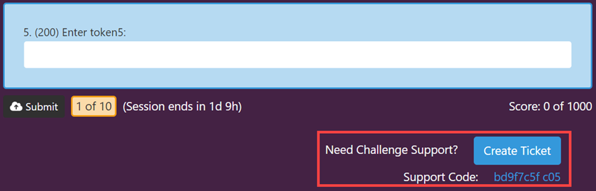

# Participating in a Game

This topic describes the Gameboard from a participant's point-of-view. A *participant* is a player in a game or a competitor in a competition who has no special role(s) attached them. These instructions assume that a fully configured game environment is available to the reader and they have an account on the Identity server.

1. Browse to the gameboard's designated URL. Some gamecards are visible prior to logging in.
2. Click **Profile**, then **Login**. You're on the Identity server now. Here you can login with an existing account or register for a new one.

!!! danger

    This topic requires significant revisions. It's here as a placeholder *only*. Thank you for your patience.

## The Profile screen

**Display Name:** Set a default name for public display that is suitable for all audiences. This name will apply to all new games, however, you can customize it during registration.

**Sponsoring organization:** Select *your* organization. Gameboard admins define who the sponsors are and what image to associate with each.

**Certificates:** View and print a certificate as proof of participation. This feature allows players to provide a record of achievements to friends, colleagues, and organizations to validate professional development time. Select **Competitive** to find and print certificates which validate player performance in a *game*. Select **Practice** to find and print certificates which validate player performance in a *practice challenge*. You can also save them as PDFs. 

- **Publish/Unpublish:** Optionally "publish" a certificate on a per-certificate basis. Players can send the link to the certificate to anyone including non-Gameboard users. Players can "unpublish" a certificate at any time removing access to the certificate.
- **Open:** Launches the certificate in a new tab in the browser.

**History:** View game history, including where you finished on the scoreboard and whether it was in practice or competition.

**Settings:** 

Users with the appropriate permissions (`Support` and `Admin`) may opt to receive browser notifications when support tickets are opened, closed, and updated. Users can choose to play an audio alert when a browser notification is received. 

Browser notifications are subject to OS-level settings which may need to be changed and browser site settings for pop-ups and redirects which need to be allowed.

## The Home screen

The Home screen is where you start a "live" game, preview upcoming games, and view completed games. Hover over a gamecard and select **Open Game**. Click **Enroll** to proceed to the game lobby.  

## The Game lobby

This is the staging area where players join team members (if playing on a team) and get organized before starting a game session. Information about the session and enrollment appears here in blue: e.g., "Game window closes in
270d 1h." A yellow light indicates a player is registered to play but hasn't started a session. A green light indicates a player is active (i.e., has started a session). A red light indicates that player's session has ended.

**Unenroll** and **Reset Session:** Players can unenroll here or reset a session if their gameboard administrator permits it.

**Set Game Display Name/Set Team Display Name:** The game display name chosen here is used to represent an individual player or a team (based on the competition type) on the public scoreboard for a particular game. This display name is the same as your profile display name by default, but you can change the name of your player/team for a specific game if you choose. Like your *profile* display name, your *game* or *team* display name is subject to approval.

### Organizing a team

If the game is a team game, you organize your team in the game lobby. Under **Set Team Display Name**, enter a team name for the scoreboard. If you're the team manager, generate an invitation for your teammates. Copy the invitation code and distribute it to your teammates. Team members redeem your invitation code here too.

!!! warning
    Team managers: generating a new invitation code invalidates previous invitation codes.

## Starting a session

To start your session, click **Start Session** and click through the confirmation messages.

!!! warning
    For team players, make sure your teammates are ready to start. You can't add or remove team members after your session has started. Also note that *any* team member can start a session -- the continuous session timer starts when the final **Confirm** button is clicked.  

## Starting a challenge

After your session is started, click **Continue to Gameboard**. To start a challenge, click a hot spot on the gameboard. Click **Start Challenge** and click through the confirmation messages.

## Getting support in-game

Players can get to the in-game support feature from the launched challenge screen below the challenge questions and the Support link in the top navigation.

From either of these locations, click **Create Ticket**. If you create a ticket from the challenge screen, then the Support Code, challenge information, Game Id,  Player Id, Team Id are automatically generated. If you create a ticket from the Support link, then this information can be added later.

*Getting support from a launched challenge*

In the **Summary**, enter a brief statement of the problem.

In the **Description**, enter a more detailed statement of your problem. Include error messages and other pertinent details.

Under **Attachments**, attach files -- especially screen shots -- here.

Click **Submit**.

After submitting the ticket, you can always **add a comment** and attach another file. Updates to a ticket are tracked under Activity. View a status change or an assignment change here.

**Copy to markdown:** Allows you to copy the support ticket information in Markdown format. This is convenient if you need to distribute the ticket's content quickly and easily.

!!! question "What is the Support Code?"
    The support code is a unique identifier that will help game support staff locate each challenge. The support code for a challenge is automatically added to support tickets linked to challenges. The support code for a challenge can be found below the challenge questions, near the button to create a support ticket. See the screen capture above.

### Finding an existing ticket

From the Support page, use the dropdowns and the **Search** field to locate existing tickets.

Filter tickets by status: Any, Open, In progress, Not closed (*open* plus *in progress*), and Closed.

Search by entering terms. Search covers ticket summary, labels, challenge titles, and player name.

## Giving feedback as a player

Provided that a Gameboard administrator has enabled and configured the *feedback* feature, players are permitted **one** feedback submission per game and per challenge. Every member of a team is permitted to provide individual feedback. The feedback form is available at any time after session is started. This way, if participants quit the game before time expires they still have the opportunity to submit feedback.

*The screen print below shows an example of a challenge feedback form as a player would see it.*

Completing a challenge is not a requirement for submitting challenge feedback. Participants are able to begin a challenge, go through it, not make any submissions and still provide feedback. Perhaps the challenge was either too difficult for them or they just went down the wrong path. Either way, their feedback is valuable.

Only feedback that has been submitted can be viewed in the reports. Once feedback has been submitted, a participant cannot go back and edit their feedback.

??? note "Note on submitted vs in progress"

    "In progress" feedback is feedback a participant has begun in some capacity that triggered the autosave feature at least once but they have not clicked the **Submit** button yet. "In progress" feedback (i.e., *autosaved* feedback) and "submitted" feedback are both stored in the database; however, only submitted feedback is queried for the reports. 

This documentation assumes that you you are logged into a game and successfully enrolled. To view the *game* feedback as a participant:

Select a game tile then click **Start**, then **Confirm** to start the session.

Expand the **Game Feedback** form and complete the survey. Click **Submit**, then **Confirm** when finished. Responses can't be edited after clicking **Submit**. Game feedback responses do autosave. 

To view the *challenge* feedback as a participant:

Select a game tile then click **Start**, then **Confirm** to start the session. Continue to Gameboard and start a challenge.

Expand the **Challenge Feedback** form and complete the survey. Click **Submit**, then **Confirm** when finished. Responses can't be edited after clicking **Submit**. Challenge feedback responses do autosave. 

Whether or not the feedback form is expanded or collapsed depends upon the status of the game or the challenge. If a game is active, then participants will manually expand the feedback form. If a game is complete, the feedback form is automatically expanded.

The same is true of challenge feedback. If participants are actively working a challenge, they will manually expand the feedback form. When participants complete a challenge, the challenge feedback form expands automatically (and collapses when submitted). The feedback form section can be expanded or collapsed at any time once the session has started.