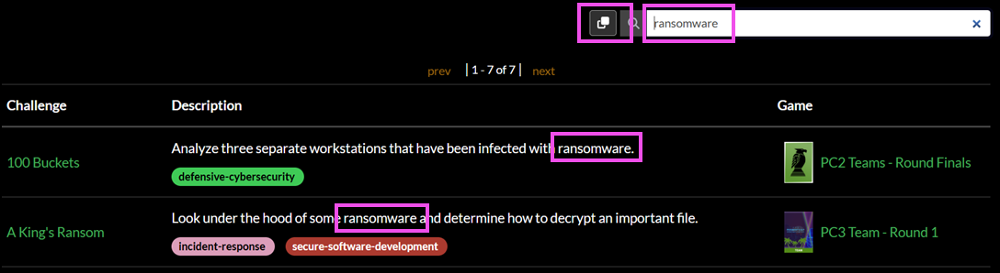

# Practice Area

The **Practice Area** is where Gameboard players can go to rehearse challenges (labs) to become proficient in certain skills. Practice Area is a lightweight version of a formal competition. After logging into Gameboard, click **Practice** in the main navigation.

The Practice Area contains a greeting configured by a Gameboard admin for your organization or environment and a list of challenges designated for practice.

You can **search** for a challenge to practice on.

You can copy a link to your search by selecting the **clipboard icon** next to the search field. In the example above, you may want to share the list of challenges/labs that have "firewall" content with another Gameboard user.

Under *Need a place to start?* the Gameboard admin may have configured some suggested searches for participants. Players can select one of these tags to be directed to a set of available practice challenges. Gameboard admins should refer to "Suggested searches" in the [Admin Practice Area](admin-practice-area.md). 

To start a practice session, select a challenge, then click **Start Practice Session**, and **Confirm**. You can only launch *one* practice challenge at a time. In the **Active Practice Challenge** screen, you can:

- Extend your challenge session
- End your session
- Read the challenge guide
- Launch any gamespace resource
- Answer challenge questions
- Create a support ticket
- Provide feedback on the challenge

In short, you get nearly the full competition challenge experience in the active practice session!

Upon successfully solving the practice challenge, you can view a printable certificate commemorating your achievement...and you are returned to the Practice Area where you can select a new practice challenge.

!!! tip

    You can view and print any certificate you earned in competition or in practice at any time from your profile screen. In the main navigation, click **Profile**. Then, select the **Certificates** link.

If your attempt to solve the practice challenge is *unsuccessful* (you've run out of time or used your allotted submissions), you can try the challenge again or return to the Practice Area to find another challenge. No certificates are awarded for partially completing a practice challenge.

## Administering the Practice Area

Gameboard administrators configure global Practice Area settings including: a practice page greeting, certificate template, and session limits in the Gameboard Administration settings. For help on configuring these settings, see the [Admin Practice Area](./admin-practice-area.md) documentation.