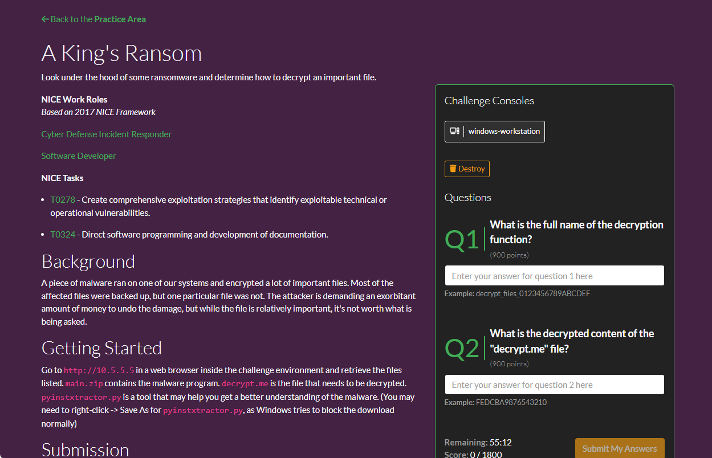
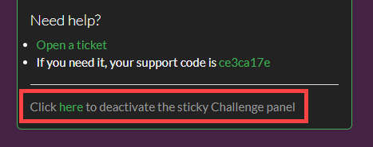

# Practice Area

The **Practice Area** is where Gameboard players can go to rehearse challenges (labs) to become proficient in certain skills. Practice Area is a lightweight version of a formal competition. After logging into Gameboard, click **Practice** in the main navigation.

The Practice Area contains a greeting configured by a Gameboard admin for your organization or environment and a list of challenges designated for practice.

You can **search** for a challenge to practice on.

You can copy a link to your search by selecting the **clipboard icon** next to the search field. In the example above, you may want to share the list of challenges/labs that have "firewall" content with another Gameboard user.

Under *Need a place to start?* the Gameboard admin may have configured some suggested searches for participants. Players can select one of these tags to be directed to a set of available practice challenges. Gameboard admins should refer to "Suggested searches" in the [Admin Practice Area](admin-practice-area.md). 

## Starting a practice session

To start a practice session, select a challenge, then click **Start Practice Session**, and **Confirm**. You can only launch *one* practice challenge at a time. 

In your **Active Practice Challenge** you can:

### Extend or end your practice challenge 

Need more time on a practice challenge? Click on **Extend Session**, and **Confirm** to extend the amount of time remaining. Want to close this practice challenge and try a different one? Click on **End Session**, and **Confirm** to end the practice challenge. 

### Turn the sticky challenge panel on or off 

Challenge consoles and challenge questions are located at the bottom of the **Active Practice Challenge** screen by default. Clicking **Turn on the Sticky Challenge Panel** at the top of the screen or **Use Sticky Challenge Panel** at the bottom of the screen will create a panel to the side of the challenge guide. This panel contains the challenge consoles and challenge questions. 

The sticky challenge panel is useful to reduce scrolling to enter answers when a practice challenge has a long challenge guide. The sticky challenge panel can be turned off by clicking on **Click here to deactivate the sticky challenge panel**. 

### Read the challenge guide 

The challenge guide provides details and instructions for completing the practice challenge. It may also include links to solution guides which can be helpful if you get stuck. 

### Launch the challenge consoles 

Clicking on a challenge console will open it in a new web browser tab. Challenge consoles allow you to directly interact with the virtual machines as you complete the practice challenge. [Click here for instructions on using copy and paste with the challenge consoles.](../topomojo/copy-paste.md) 

### Answer the challenge questions 

Enter your answers for each question and click on **Submit My Answers**, and **Confirm** to submit your answer. 

### Create a support ticket 

If you are experiencing a technical difficulty, the **Create Ticket** button can be used to create a support ticket. 

## Certificates of completion

Upon successfully solving the practice challenge, you can view a printable certificate commemorating your achievement...and you are returned to the Practice Area where you can select a new practice challenge.

!!! tip

    You can view and print any certificate you earned in competition or in practice at any time from your profile screen. In the main navigation, click **Profile**. Then, select the **Certificates** link.

If your attempt to solve the practice challenge is *unsuccessful* (you've run out of time or used your allotted submissions), you can try the challenge again or return to the Practice Area to find another challenge. No certificates are awarded for partially completing a practice challenge.

## Administering the Practice Area

Gameboard administrators configure global Practice Area settings including: a practice page greeting, certificate template, and session limits in the Gameboard Administration settings. For help on configuring these settings, see the [Admin Practice Area](./admin-practice-area.md) documentation.