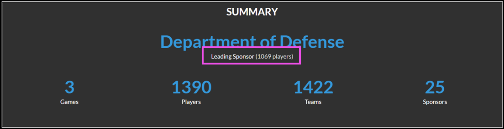

# Reports

The **Reports** module is available to users who have `Admin`, `Registrar`, or `Support` roles in the main navigation bar. Six report "cards" display available reports:

- **Challenges Report:** View information about the challenges configured in the Gameboard app. This report is good for site utilization metrics related to challenges, challenge deploys, and challenge solves.
- **Enrollment Report:** View a summary of player enrollment data; who enrolled when, which sponsors do they represent, and how many played challenges.
- **Players Report:** View data on player activity. A “player” is a person with an account on the Gameboard site (i.e., a "user").
- **Practice Area Report:** View metrics on players who are spending free time honing their skills in Gameboard. See which challenges are practiced most, have the best success rates, and which players are accessing the Gameboard to complete challenges in practice.
- **Site Usage Report:** View a high-level overview of user activity in the Gameboard. This report, optionally filtered by date range and sponsor, offers a digestible view of data related to players, sponsors, and challenges. Each statistic within the report contains a modal view for more detailed information. Note that the Site Usage Report can't be exported. 
- **Support Report:** View a summary of support tickets created in Gameboard; including ticket creation and assignment details, ticket categories, and tickets attached to games/challenges.

## Legacy Reports

The legacy reporting functionality has not yet been deprecated; these reports are still available at the bottom of the Reports screen. Legacy reports won’t get future fixes or enhancements. Eventually, they will be removed from the Gameboard application.

## Common report characteristics

Each report shares common characteristics. 

- **Filter controls:** Dedicated filter controls allow users to narrow down or restrict the data displayed on a report. For example, if you're interested in seeing enrollments from a given sponsor in the Enrollment Report, use the **Sponsors** filter to select the sponsor(s) you're interested in. If you don't select any values in a filter, all data from that filter is included in the results.
- **Copy link to report:** When a report is run, the browser generates a link that represents filter selections for the current report. Select the **clipboard icon** to copy the current report and share it with another Gameboard user. The user whom you are sharing with must have the appropriate Gameboard role and must be logged into Gameboard. You can also copy the link in your browser's address bar and share.

!!! tip
    Bookmark useful filters via the browser so you can return to them quickly.

- **Export to CSV:** To export report results CSV, click **Export to CSV**. 
- **Reset Filters:** Deselecting filter values on multiple filters can be inconvenient. Click **Reset Filters** to deselect all filter values at once.
- **Summary:** Each report contains a summary that presents key data points. For example: the Enrollment Report shows the Leading Sponsor based upon filter selections.

## Drilling down in results

In some places in the report results, you can "drill down" by clicking a link in the metrics. A modal window displays a more granular view within the same data. For example: in the Enrollment Report, in the Performance category, some data points are links. See *screen print 1* below. Clicking that link goes deeper into that element. See *screen print 2* below.

*Screen print 1: Summary Table*

Click **300** to view the detailed information that comprises score in the summary.

*Screen print 2: Data breakdown*

In this view, the challenges and scores this player achieved are displayed. Now, you can see the details that make up the score.

## Challenges Report

The **Challenges** report answers questions like these:

1. How many different challenges are configured?
2. How many competitive challenges have been deployed?
3. How many practice area challenges have been deployed?
4. What are the most popular competitive/practice mode challenges?

## Enrollment Report

The **Enrollment** report shows information about players who are enrolled in competitive-mode games on the Gameboard. You can filter this report to show enrollment numbers for each game. You can filter this report to only show information about challenges from specific games and seasons. You can also filter this report by Sponsor. 

The screen print below shows a summary of a typical game. The summary shows:

1. 1390 different players (people, “users”, with an account in Gameboard) enrolled in our example game. The Department of Defense, the Leading Sponsor, leads enrollment with 1069 players enrolled.
2. Those 1390 players created 1422 teams.

   - The number of teams is higher than the number of players here because some people played in more than one “track” of the competition. Therefore, they have more than one “team” attached to one player/person/user.
   - This number can also be higher than the number of players if the competition contains several rounds. So, if your filters are looking at a Round 1 and a Round 2, there are some teams in both and counted twice.

3. 25 different sponsors participated in this example game.

*Screen print 3: Sample Enrollment report*

## Players Report

The **Players** report is good for viewing site utilization metrics. This report answers questions like these:

1. How many users does the site have?
2. How many users have deployed competitive and practice area challenges?
3. How many users have achieved a full solve on at least one competitive and/or practice area challenge?

You can also filter the Players report by *Account Creation Date* to understand when players create accounts. For example, it may be useful for you to know many users created an account since January 1, 2024 (or any date you prefer).

## Practice Area Report

The **Practice Area** report answers questions like these:

1. How many practice challenges have been deployed?
2. How many practice challenges achieved a full solve?
3. How many different challenges have been deployed via the practice area?
4. How many users have deployed a practice challenge?
5. How many different sponsors have deployed a practice challenge?

## Site Usage Report

The **Site Usage** report answers questions like these:

1. How many players are active in the Gameboard in a given period of time?
2. How many sponsors had active players and how many players represented each?
3. How many players are competitive players versus how many players are practice-only players?
4. How many unique challenges versus how many total challenges were attempted in a given period of time?
5. How many hours were spent playing games?

## Support Report

The **Support** report displays information about support tickets. Filter tickets by label, creation date and time, challenge, etc. The Support report answers questions like these:

1. How many support tickets did we receive regarding the challenge titled "The Best Challenge"?
2. How many tickets with a specific label did we receive?
3. How many tickets did we receive on Tuesday?
4. How many tickets did we receive during PC5 Teams Round 1?