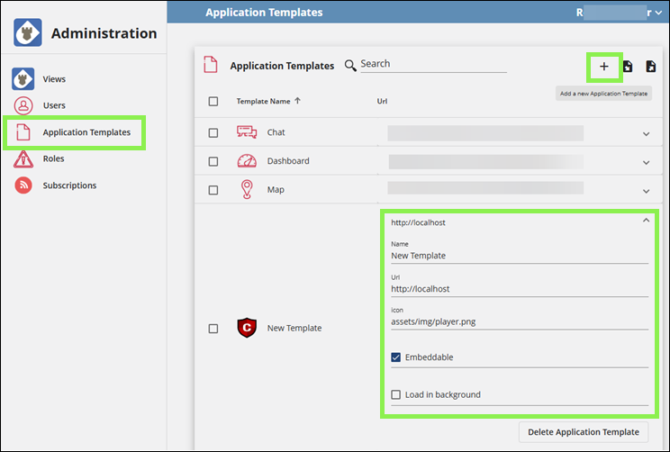

# Third-Party Applications

The Crucible Framework provides users with the necessary tools and resources for integrating open-source third-party applications with the platform's features and data. By leveraging open-source resources, users can save time and resources, and benefit from the expertise of the open-source community.

Administrators can customize the Crucible platform by adding applications that integrate with the features needed for specific exercises. This flexibility allows them to tailor the platform to their organization's needs and use tools built for their training goals. As a result, the platform stays useful and relevant as user needs change over time.

## Third-Party Integration Guide

These instructions assume you have the **Administrator** system role in Player. Follow the steps below to integrate a third-party application into the Crucible Framework.

In Player, in the dropdown next to your username, select **Administration**.

1. Under the Administration nav panel, select **Application Templates**.
2. Click **Add a new Application Template**.

      - Enter a **Name** for the app template.
      - Enter a **URL** for the app template.
      - Enter the path for the icon.

3. Enable **Embeddable** if desired. **Embeddable** tells Player whether iFrames supports the app. For example, Mattermost doesn't support embedding, so users must open it in a separate browser tab.
4. Enable **Load in background** if desired. **Load in background** tells Player to load the app in a hidden iFrame when Player loads. This is important for some apps that require initialization.

After completing these steps, refer to the *Crucible Administrator Guides* in the [Core Application Guides](../landing/index.md) to add the application to the desired set of users and/or teams.

## Third-Party Applications

We already tested and used the following third-party applications within the Crucible Framework.

### Mattermost

Mattermost is an open-source, self-hostable online chat service with file sharing, search, and integrations. It serves as an internal chat for organizations and companies.

🔗 [Mattermost Documentation](https://docs.mattermost.com) and [installation instructions](https://github.com/cmu-sei/helm-charts/tree/main/charts/mattermost-team-edition)

### Moodle

Moodle is a free and open-source learning management system. Schools, universities, workplaces, and other sectors use Moodle for blended learning, distance education, flipped classrooms, and other online learning projects.

🔗 [Moodle Documentation](https://docs.moodle.org/501/en/Main_page) and [installation instructions](https://docs.moodle.org/501/en/Installation_quick_guide)

### Moodle Crucible Plugins

These Moodle plugins connect Moodle to the Crucible apps like TopoMojo. The plugins allow users to find Crucible apps, launch labs, collaborate on quizzes linked to live lab environments, and manage learning plans without leaving Moodle. Each plugin has its own GitHub repository with installation and usage details.

#### AI Placement Competency Plugin

The **AI Placement Competency Plugin** helps instructors and course designers classify activity descriptions against a selected competency framework. It adds a **Classify Text** button to activity editing pages that sends the activity description to a configured AI provider, returns suggested competencies, and lets users apply them to the course or activity with one click. Requires a configured AI provider that supports text generation, such as Ollama or AWS Bedrock, and pre-existing competency frameworks in Moodle.

🔗 [GitHub Repository](https://github.com/cmu-sei/moodle-aiplacement_competency)

#### Crucible Applications Landing Page Block

The **Crucible Applications Landing Page Block** plugin adds a dashboard block that lists the Crucible apps (for example, Gameboard, TopoMojo, Player, and Steamfitter) available in Moodle. It shows only the applications the user can access. Each entry includes a clear icon and link, so users can open everything from one place without memorizing multiple web addresses.

🔗 [GitHub Repository](https://github.com/cmu-sei/moodle-block_crucible)

#### Crucible Plugin

The **Crucible Plugin** connects Moodle courses to Crucible, allowing students to launch and work through interactive cybersecurity exercises directly from Moodle. Instructors can add Crucible labs as activities, and students can open the full Crucible lab player either inside Moodle or in a new browser tab.

🔗 [GitHub Repository](https://github.com/cmu-sei/moodle-mod_crucible)

#### Group Quiz Plugin

The **Group Quiz Plugin** lets students work together on the same quiz in real time. Each group shares a single quiz attempt, so everyone can see answers as teammates enter them and receive the same final grade. Instructors can set time limits, open and close dates, and review options similar to Moodle's standard quiz activity.

🔗 [GitHub Repository](https://github.com/cmu-sei/moodle-mod_groupquiz)

#### Learning Plan Template Manager

The **Learning Plan Template Manager** is a plugin for Moodle that allows for the import, export, and automatic creation of learning plan templates from a competency framework. This plugin was specifically developed for work roles in the NIST NICE Cybersecurity Framework.

🔗 [GitHub Repository](https://github.com/cmu-sei/moodle-tool_lptmanager)

#### Tag Manager Plugin

The **Tag Manager Plugin** adds bulk tag management to Moodle. Administrators can import tags with optional descriptions from a CSV file and export tags from any collection to CSV for backup or migration. Existing tags are not overwritten, and duplicate tag names are skipped on import.

🔗 [GitHub Repository](https://github.com/cmu-sei/moodle-local_tagmanager)

#### TopoMojo Plugin

The **TopoMojo Plugin** is an activity plugin that integrates TopoMojo labs and exercises into Moodle. It enables users to access virtual labs, view Markdown content, and complete challenge questions directly from within Moodle.

🔗 [GitHub Repository](https://github.com/cmu-sei/moodle-mod_topomojo)

#### TopoMojo Question Behavior Plugin

The **TopoMojo Question Behavior** plugin lets Moodle retrieve correct answers from TopoMojo during a live quiz attempt. It works with the TopoMojo Question Type Plugin (`qtype_mojomatch`) and pairs with the TopoMojo Activity Plugin (`mod_topomojo`) for lab-based activities.

🔗 [GitHub Repository](https://github.com/cmu-sei/moodle-qbehaviour_mojomatch)

#### TopoMojo Question Type Plugin

The **TopoMojo Question Type** plugin adds a custom short-answer question type with extra matching options. It can connect to TopoMojo to pull answers from a live gamespace during an activity. This plugin works together with the TopoMojo Activity Plugin (`mod_topomojo`) and the TopoMojo Question Behavior Plugin (`qbehaviour_mojomatch`).

🔗 [GitHub Repository](https://github.com/cmu-sei/moodle-qtype_mojomatch)

### osTicket

osTicket is a widely-used open source support ticket system. It seamlessly integrates inquiries created via email, phone and web-based forms into a simple easy-to-use multi-user web interface. Manage, organize and archive all your support requests and responses in one place while providing your customers with accountability and responsiveness they deserve.

🔗 [osTicket Documentation](https://docs.osticket.com/en/latest/) and [installation instructions](https://docs.osticket.com/en/latest/Getting%20Started/Installation.html)

#### Crucible Plugin for osTicket

The **Crucible Plugin for osTicket** provides authentication against an OAuth2 Identity Server and posts ticket event notifications to the Crucible API.

🔗 [GitHub Repository](https://github.com/cmu-sei/osticket-crucible)

### Rocket.Chat

Rocket.Chat is a customizable open-source communications platform for organizations with high data protection standards. It enables real-time conversations between colleagues, other companies, or your customers across web, desktop, or mobile devices.

🔗 [Rocket.Chat Documentation](https://docs.rocket.chat) and [installation instructions](https://github.com/RocketChat/helm-charts)

### Roundcube

Roundcube is a web-based IMAP email client. It provides full functionality you expect from an email client, including MIME support, address book, folder manipulation, message searching and spell checking.

🔗 [Roundcube Documentation](https://docs.roundcube.net/doc/help/1.1/en_US/) and [installation instructions](https://github.com/sei-npacheco/webmail)
