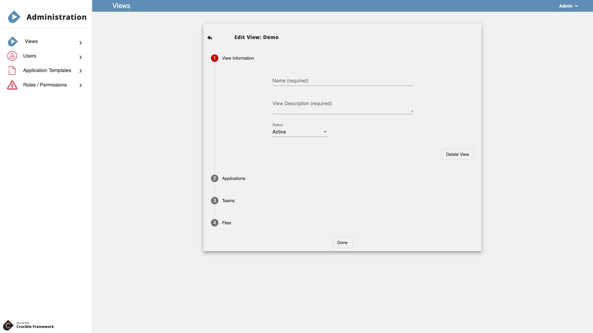
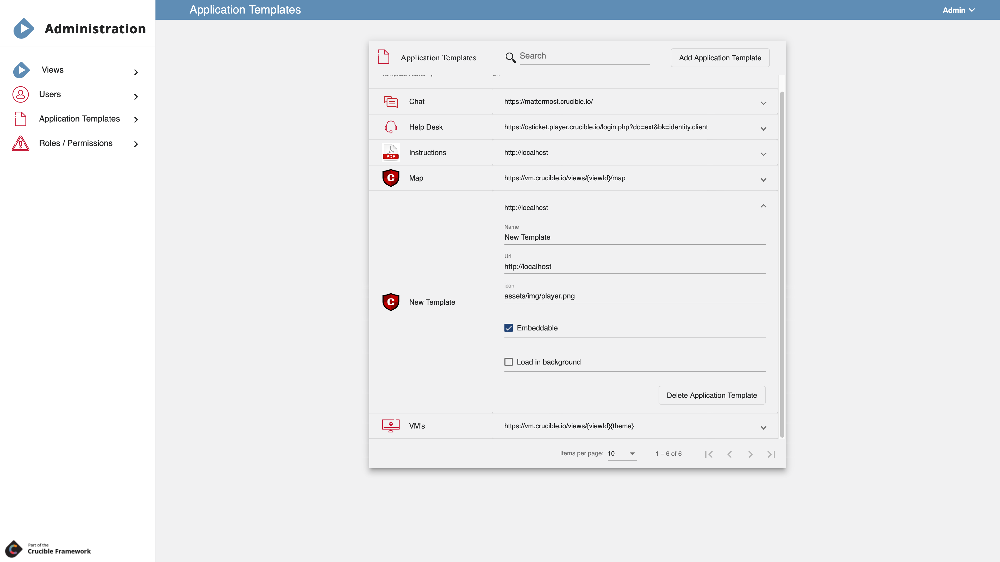

# **Player**

## Overview 

### What is Player?

**Player** is the centralized interface where participants, teams, and administrators go to engage in a cyber event. In Player, participants view teams, applications, virtual environments, and third-party applications. The event experience is highly customizable by content developers.

Think of Player as the front door to an event running on Crucible. Player is meant to: 

- Provide a platform for individual participants on a team to view content in an exercise.
- Allow for quick navigation between various applications in the Crucible framework.
- Allow administrators to set what teams can see what applications.

Applications can use Player roles and permissions as needed. Notifications can be sent to individual users, teams, or the entire exercise by an administrator or an application with proper permissions.

Player is ***not*** meant to:

- Control any authentication or content within any application that it displays in a content panel.
- Provide any mechanisms for individual applications to communicate with each other.
- Provide any default applications.  However, some common applications can be consumed within an exercise.

Descriptions of the common applications used in Player can be found in the [Player Applications](https://cmu-sei.github.io/crucible/player-applications) document.

### Key Concepts

Some key Player concepts are described below.

**Apps** 
A website a participant in a view can open within Player or in a separate browser tab. A common example of an app used in Player is the Mattermost messaging platform.

**App template**
 The settings associated with an app that is added to a team's *view*.  An app template can be created for common apps that are added to a view with default settings that an administrator can override if needed.

**Authentication** 
Player uses `IdentityServer 4` for authenticating users. Authentication gets a user into Player, but setting permissions within the Player Administration view (under **Users**) determines what a user can open and/or edit within Player.

**Focused Application Panel** 
The focused app panel displays the selected application in an iFrame. The iFrame points to the URL specified by the application template. The application within the focused app panel is responsible for authentication and content. Player displays content but has no control of the application running within the focused app panel.

**Notification** 
A message sent to a specific user, team, or view from an Administrator or an app that has been given permission.

**Permission** 
A key/value pair that can be created and used by any application given permission within the system. A permission can be assigned to a user or a team. Some permissions such as `SystemAdmin` are read-only. `ExerciseAdmin` and `SystemAdmin` are permanent permissions that cannot be edited or deleted.

**Role** 
A set of permissions that can be grouped together and assigned to a user or team.

**Team** 
A group of logged in users who are associated with a view. Each team can be configured to view a particular set of applications and be granted team-level roles/permissions.

**User** 
A user who is identified in an Identity Server configured for the Player system is automatically added into Player upon the first login. In addition, users can be pre-loaded into Player using the Player API.
  > Note: IdentityServer4 is an OAuth 2.0 framework that is used by the Software Engineering Institute to authenticate users. Some Identity servers are configured to authenticate using CAC cards while others are user/password based - depending upon the location of the system.

**View** 
These are the settings associated with building a *view*. A view can be edited, cloned, and deleted.

**Views** 
The collection of content a participant can interact with during a cyber simulation. Depending upon your role (*end-user* view  versus *administrator* view) a view will look different.

## Administrator User Guide

### Manage Views

Views is where a Player view administrator adds a new view and browses existing views. For step-by-step instructions on how to create a new view, see [Player How to: Create a new View](./player-create-new-view.md).

Follow the procedures below to create a new *view* in Player. These instructions assume that you have been given the appropriate permissions in Player to create a view.

If you have not already done so, in the dropdown next to your username, select **Administration**.

#### Enter View Information

Step 1: Complete View Information

1. Under Views, click **Add New View**.
2. Add a **Name** and **View Description**.
3. In the Status dropdown, select **Active** or **Inactive**.
   - `Active` means that the new view is available for use immediately.
   - `Inactive` means that the new view will be cloned in Alloy.
4. Select **Applications**.

#### Assign Application Templates

Step 2: Add new applications

1. Under Applications, click **Add New Application**. Here, you can add a blank application or an application based upon an existing app template. 
   - **Blank Application:** Adding a blank application requires you to enter the configuration settings manually. These settings can't be applied in another view; they are one-time use only.
   - **Template:** You should have several application templates available to choose from. These are templates that you or another administrator have created to use over and over. The configuration settings are set in the template; the template can be used many times. Application template settings can be overridden for a particular view. For help understanding application templates, see the [Player Guide](https://cmu-sei.github.io/crucible/player-guide) and the Player How to: Create a new App Template.
2. Click **Teams**.

##### Dashboard

##### Tasks

##### Virtual Machines

##### Map

#### Define Teams

Step 3: Add new teams

1. Click **Add New Team**. Multiple teams can be added to a view.

2. Enter a **Team Name**.

3. Assign a **Role** to the team.

4. Assign **Permissions** to the team. Each team can be assigned special permissions. You may want to have a team of "admins" who can troubleshoot views in addition to teams comprised of regular users who are participating in the simulation.

5. Click the **User** icon to select users to add to the new team.

   - **Search** for the user whom you want to add. 
   - Click **Add User** to move the user from All Users to Team Users.
   - Under Team Users, you can assign a **Role** to the user at this time.
   - Click **Done** when you are finished adding users to the team.

6. Assign applications to the new team.

   - Next to the new team, click **Add Application**. Select an application from the list. These are the applications you added above. Each team you create gets a list of applications displayed in the Player application bar in the order defined here.

#### Upload Files

Step 4: Upload Files

In this step, View Administrators upload a single file or multiple files simultaneously to a View which can be added as an application and attached to a team. 

1. Under Files, click **Choose File** and select the file you want to upload. The file appears under Staged Files - it has not been uploaded yet. 
2. Select the **Team(s)** that you want to access the file and click **Upload Staged File(s)**.
3. The file appears under **Uploaded Files**. From here, you can: **Download** the file, **Delete** the file, **Copy Link** to the file, **Edit** the name and team of the file, and **Add File as Application**.

After adding the file as an application you have to return to **Step 3 Teams** and add that application - the _newly_ uploaded file - to a team just as you would add any new application.

Click **Done** when you are finished adding or updating the view.

### Configure Users

#### Assign Roles

#### Assign Permissions

**SystemAdmin:** can edit anything in Player; SystemAdmin permissions are given by existing SystemAdmin.

**ViewAdmin:** can edit anything within a View that they have permissions.

A SystemAdmin creates the View and assigns ViewAdmin permissions to specific teams who can now edit that View.

### Define Application Templates

An *app template*  contains the settings associated with an app that is added to a team's view.  An app template can be created for common apps that are then added to a view. Default settings that are part of the app template can be overridden by a view admin if needed. An app template can be used by any view admin when adding apps to a particular view.  Think of app templates as helpers for configuring common Crucible apps.

Follow the procedures below to create a new app template in Player. These instructions assume that you have been given the appropriate permissions in Player to create a view.

If you have not already done so, in the dropdown next to your username, select **View Administration**.

1. Under the Administration nav panel, select **Application Templates**.
2. Click **Add Application Template**. 
   - Enter a **Name** for the app template.
   - Enter a **URL** for the app template.
   - Enter the path for the icon.

3. Enable **Embeddable** if desired. Ebeddable is a true/false attribute that tells Player whether or not the app is supported by iFrames.  The Mattermost chat, for example, is not embeddable and must be opened in a separate browser tab.
4. Enable **Load in background** if desired. Load in background is a true/false attribute that tells Player to load the app in a hidden iFrame when Player loads.  This is important for some apps that may require some initialization.

### Define Roles and Permissions

### Define Subscriptions

## User Guide

### User Interface

#### Top Bar

The top bar displays the current *view name*, *team*, and the *menu select* dropdown (your username in the top right).

Player fully supports users who are on multiple teams.  Any such user, when logged in, can switch their team by using the *team* drop-down. 

#### Application Navigation Bar

In the view, the navigation bar on the left contains applications.

##### Documentation

**General document links**

Any documents or files  - PDF, PNG, etc. - that can be served on the web can be easily set up as an application for viewing.  This is particularly helpful for displaying instructions, intel, maps, and other information.

##### Map

##### Virtual Machine Consoles

**Virtual Machines (VM-UI and VM-Console)**

The **VM List** is set up to provide links to any virtual machines that the user has permission to view. The tabular system allows the VM to be opened similar to an Application, within a tab on the same screen or popped out into a new browser tab using the icon. Users can also run commands on one or more virtual machines by dragging a box and shift clicking.

**Player VM Console application**

- Load VMware consoles
- [Power On/Off VMs](https://cmu-sei.github.io/crucible/player-power-a-vm-on-or-off)
- [Copy/Paste](https://cmu-sei.github.io/crucible/player-copy-and-paste-text)
- [Send files/Mount ISOs](https://cmu-sei.github.io/crucible/player-how-to-upload-files)

##### Services Support Tickets

**Help desk using osTicket** 

osTicket (https://osticket.com/), a widely-used open source support ticket system, can be configured and deployed for an exercise. Using this "built-in" help desk, participants can submit help requests to event administrators.

##### Chat

**Messaging with Mattermost** 

Mattermost (https://mattermost.com/), an open source messaging platform can be configured and deployed to provide an "off the shelf" chat system for users. 

##### Email

#### Notifications

Receive and read notifications here.

> Tip! If your browser is set up to allow notifications you can receive Player notifications that way too.

### Player Tips

#### Pop-Out to Multiple Tabs/Windows

#### Use Multiple Monitors

#### Copy and Paste Text

The procedures below show you how to:

- Copy text from a local machine (that is, an _out-of-game_ computer) and paste it into a Player virtual machine, and
- Copy text from a Player virtual machine and paste it into a local machine

Procedures assume you are in the Player VM Console app. For help on Player applications, see the [Player Applications](https://cmu-sei.github.io/crucible/player-applications) guide.

**From local to Player VM**

> Note: There is a 64K size limitation to the text block users can copy into and out of the player.

1. On your local machine, open a text file or Word file.
2. Select and copy the text you want to place into a Player virtual machine.
3. In the Player VM Console app, select the virtual machine you want.
4. Select where in the virtual machine you want the copied text to go (this can be a new file or an open application).
5. At the top of the Player window, click __Paste__. This inserts the copied text into the virtual machine.

**From Player VM to local**

1. In the Player VM Console app, select the virtual machine you want.
2. On the virtual machine, select the text you would like to copy. Copy your text first to the virtual machine’s clipboard (how you do this depends upon the application you’re using).
3. Once you’ve copied your text to the virtual machine clipboard, click __Copy__ at the top of the Player window. You should then see a `Copied Virtual Machine Clipboard` confirmation message.
4. On your local machine, paste the copied text into a Notepad file or Word file.

#### Power a Virtual Machine On or Off

The procedures below show you how to remotely power a VM on or off from within the Player VM Console app. These procedures assume you are in the Player VM Console app. 

For help on Player applications, see the [Player Applications](https://cmu-sei.github.io/crucible/player-applications) guide.

1. In the Player VM Console app, select the virtual machine you want.
2. On the VM tab, click the **gear icon**, then **Power**. You have the menu options to Power On, Power Off, and Reboot.

#### Upload Files

**Upload from local to VM**

These procedures describe how to upload files from a local machine (an _out-of-game_ computer) to a virtual machine in the Player VM Console app. Please note the **Send File to VM** option should only be used for uploading small files.

These procedures assume you are in the Player VM Console app. For help on Player applications, see the [Player Applications](https://cmu-sei.github.io/crucible/player-applications) guide.

1. In the Player VM Console app, in the VM List, launch the virtual machine you want.
2. On the VM tab, click the **gear icon**, and then select __Files__, **Send File to VM**.

> If the **Send File to VM** option is grayed out you will have to enter the credentials used to log into the virtual machine.
> Select __Enter VM Credentials__. In the VM Send File Settings window, enter the **Destination File Path**, **Username**, and **Password**. Click **Done**.
> Any user registered for the exercise will have the virtual machine credentials.

3. After entering your credentials, select the __Send File to VM__ option (this should no longer be grayed out). 
4. Select the file from your local machine that you want to upload.
5. Click __Open__. This will copy the file to the destination folder specified in the VM Send File Settings window.

**Upload files and mount ISO**

These procedures describe how to upload files from a local machine to be mounted as a DVD (files are not uploaded directly to a virtual machine – it’s a two-step process). This is useful for installers and uploading larger files (such as ISO files).

1. In the VM List screen, click __Upload File__.
2. On your local machine, select the file you want to upload (the upload may take some time depending upon the file size, so you will see a progress bar highlighting the upload progress).
3. Click __Open__.
4. On the VM tab, click the **gear icon**, and then select __Files__, __Mount File to DVD__.
5. In the Search box that opens look for and select the uploaded file that you now want to mount.

   > Note that there are two file areas: Team Files and Public Files. Files can be mounted for only your team (under __Team Files__) or any team (under __Public Files__).

6. Click __Mount__. This process automatically mounts the file as a DVD Drive ISO.
7. After the ISO has been mounted/used for file copy, right-click the DVD Drive ISO and and select __Eject__ to eject the ISO.

#### Follow Another Player

The **user follow** feature in Player allows you to virtually look over a participant’s shoulder during a scenario. This is a useful feature when helping someone troubleshoot and for team members who are geographically separated. This can also be used by observers when evaluating or watching teams perform during an event.

To follow another participant:

1. In Player, in the left sidebar, select the **Virtual Machines** application.
2. In the main Player window, select **User List**.
>If you are a View Administrator (_ViewAdmin_), then you will see *all* the teams and *all* the participants. Otherwise, you will just see the team you are on and your teammates. 
3. Locate the participant in the scenario.
   - Use the **Search** feature to search on a participant's username if you know it.
   - Click **Expand All** to expand the teams to see all of the participants.
   - Click **Collapse All** to collapse the teams.
   - Select a team to expand it and see its participants.
   - Check **Hide Inactive** to display _only_ those participants who are working in a virtual machine at the moment.
4. Click the participant’s name. Now, you can see the console display for the virtual machine that the person is on in the main Player window. 
5. Click the icon next to the participant's name to follow that participant in a new browser tab. 

If the person switches virtual machines then your display automatically follows them. You can’t interact with them while following; and, if their virtual machine goes out of focus then following stops. 

Clicking the **gear icon** in the upper left of the display you are following gives you the options to **Open In New Tab** and **Reconnect**. If you are already in a new browser tab, then you will see the **Fullscreen** option.
