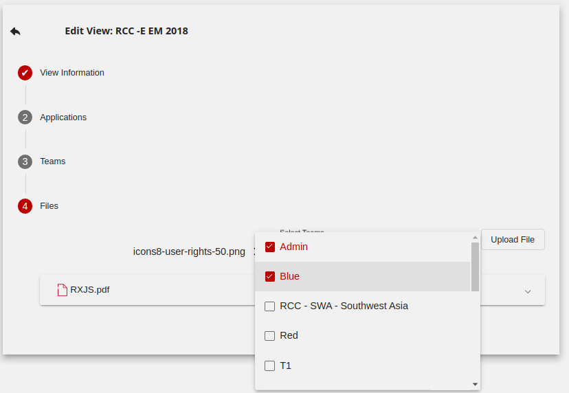
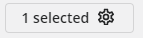
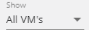

# {: style="height:75px;width:75px"} **Player:** Designing User Interfaces

## Overview

**Player** is the centralized interface where participants, teams, and administrators go to engage in a cyber event. In Player, participants view teams, applications, virtual environments, and third-party applications. The event experience is highly customizable by content developers.

Think of Player as the front door to an event running on Crucible. Player:

- Provides a platform for individual participants on a team to view content in an exercise.
- Allows for quick navigation between various applications in the Crucible framework.
- Lets administrators set what teams can see what applications.

Applications can use Player roles and permissions as needed. An administrator or an application with proper permissions can send notifications to individual users, teams, or the entire exercise.

Player is ***not*** meant to:

- Control any authentication or content within any application that it displays in a content panel.
- Provide any mechanisms for individual applications to communicate with each other.
- Provide any default applications. However, an exercise can consume some common applications.

## Administrator Guide

A Player administrator will see the **Administration navigation bar** on the left. If you have the appropriate permissions, here are the steps to switch to the administrator view in Player:

1. In the top-right corner, click the dropdown next to your username.
2. Click **Administration**.

### Manage Views

Views is where a Player view administrator adds a new view and browses existing views. Follow the procedures below to create a new view in Player. These instructions assume that you have the appropriate permissions in Player to create a view.

If you have not already done so, in the dropdown next to your username, select **Administration**.

#### Enter View Information

1. Under Views, click **Add New View**.
2. Add a **Name** and **View Description**.
3. In the Status dropdown, select **Active** or **Inactive**.
      - `Active` means that the new view is available for use immediately.
      - `Inactive` means that Alloy will clone the new view.
4. Select **Applications**.

#### Assign Application Templates

1. Under Applications, click **Add New Application**. Here, you can add a blank application or an application based upon an existing app template.
   - **Blank Application:** Adding a blank application requires you to enter the configuration settings manually. You can't apply these in another view; they are one-time use only.
   - **Template:** You should have several application templates available to choose from. These are templates that you or another administrator have created to use over and over. The template contains the configuration settings and you can use the template many times.

    

2. Click **Teams**.

#### Add Teams

1. Click **Add New Team**. You can add multiple teams to a view.

2. Enter a **Team Name**.

3. Assign a **Role** to the team.

4. Assign **Permissions** to the team. You can assign each team special permissions. You may want to have a team of "admins" who can troubleshoot views in addition to teams comprised of regular users who are participating in the simulation.

    

5. Click **User** to select users to add to the new team.

   - **Search** for the user whom you want to add.
   - Click **Add User** to move the user from All Users to Team Users.
   - Under Team Users, you can assign a **Role** to the user at this time.
   - Click **Done** when finished adding users to the team.

6. Assign applications to the new team.

   - Next to the new team, click **Add Application**. Select an application from the list. These are the applications you added above. Each team you create gets a list of applications displayed in the Player application bar in the order defined here.

#### Upload Files

In this step, View Administrators upload a single file or multiple files simultaneously to a View which they can add as an application and attach to a team.

1. Under Files, click **Choose File** and select the file you want to upload. The file appears under Staged Files because you have not uploaded it yet.
2. Select the **Team(s)** that you want to access the file and click **Upload Staged File(s)**.
3. The file appears under **Uploaded Files**. From here, you can: **Download** the file, **Delete** the file, **Copy Link** to the file, **Edit** the name and team of the file, and **Add File as Application**.
4. After adding the file as an application you have to return to **Step 3 Teams** and add that application - the *newly* uploaded file - to a team just as you would add any new application.
5. Click **Done** when finished adding or updating the view.

### Configure Users

Users are only available in Player after they have successfully authenticated via the Identity server and opened Player in their browser. You can assign users and/or teams any set of **Permissions**.

#### Assign Roles

A **Role** is a group of permissions. You assign roles to users and/or teams. Only a SystemAdmin can create roles.

#### Assign Permissions

- **SystemAdmin:** can edit anything in Player; existing users with SystemAdmin permissions assign new SystemAdmin permissions.
- **ViewAdmin:** can edit anything within a View that they have permissions for.

A SystemAdmin creates the View and assigns ViewAdmin permissions to specific teams who can now edit that View.

!!! important

    Only users who have the SystemAdmin permission can view the Administration screen and the Administration nav bar (Views, Users, Application Templates, Roles / Permissions).

### Create Application Templates

An app template contains the settings associated with an app added to a team's view. You can create an app template for common apps that are then added to a view. Default settings that are part of the app template can be overridden by a view admin if needed. Any view admin can use an app template when adding apps to a particular view. Think of app templates as helpers for configuring common Crucible apps.

Follow the procedures below to create a new app template in Player. These instructions assume you have the appropriate permissions in Player to create a view.

If you have not already done so, in the dropdown next to your username, select **View Administration**.

1. Under the Administration nav panel, select **Application Templates**.
2. Click **Add Application Template**.
      - Enter a **Name** for the app template.
      - Enter a **URL** for the app template.
      - Enter the path for the icon.
3. Enable **embeddable** if desired. Embeddable is a true/false attribute that tells Player whether iFrames supports the app. For example, the Mattermost chat doesn't support embedding, so users must open it in a separate browser tab.
4. Enable **Load in background** if desired. Load in background is a true/false attribute that tells Player to load the app in a hidden iFrame when Player loads. This is important for some apps that may require some initialization.

### Define Roles and Permissions

The Administration section of Player is where you assign users and/or teams a set of Permissions.

#### Define Roles

Roles are a predefined set of permissions that admin can create for ease of administrating. Assign users and/or teams a role.

#### Define Permissions

Admins can create permissions as well. Player uses two established permissions: SystemAdmin and ViewAdmin.

- **SystemAdmin:** can edit anything in Player; an existing SystemAdmin gives SystemAdmin permissions.
- **ViewAdmin:** can edit anything within a View that they have permissions for.

### Subscriptions

Subscriptions allow a Player administrator to configure client applications so that the Player API notifies them when supported actions occur. Also known as Webhooks, this allows for arbitrary applications to respond to actions taken in Player and configure themselves as necessary. This is commonly used for applications to support on-demand Player events in conjunction with Alloy. For example, the VM API supports subscribing to ViewCreated and ViewDeleted in Player.

When an on-demand event starts in Alloy, it creates a new View in Player. If a Player administrator configured a subscription, Player notifies the VM API of the new View. The VM API then ensures that any Maps set up for the parent View are available in the newly created View. This enables the use of Maps in on-demand events.

When the event ends, it receives the ViewDeleted notification and cleans up. Similarly, Player administrators can configure any application to subscribe to these notifications and support on-demand events without adding Player code for each specific application.

When adding a Subscription, you must specify:

1. **Name:** The name of the Subscription, for display purposes.
2. **Callback URL:** The URL where the receiving application expects Player to send notifications.
3. **Client ID:** The ID of a client in the OAuth2/OIDC server used for authentication in the environment. You should configure this client to support the Client Credentials grant and authorize it to include whatever scopes the receiving application requires to call its Callback URL endpoint. For the VM API, its default required scope is player-vm-privileged. This is the privileged scope that has elevated permissions and should not be the same as the scope used by the normal VM UI client.
4. **Client Secret:** The secret required to authenticate with the Client ID specified.
5. **Events:** The Player events to notify this application about, such as ViewCreated and ViewDeleted.

## User Guide

### Top Bar

The top bar displays the current *view name*, *team*, and the *menu select* dropdown (your username in the top right).

Player fully supports users who are on multiple teams. Any such user, when logged in, can switch their team by using the *team* dropdown.

### Application Navigation Bar

In the view, the navigation bar on the left contains applications.

#### Documentation

Any documents or files (PDF, PNG, etc.) that the web can serve set up as an application for viewing. This is particularly helpful for displaying instructions, intel, maps, and other information.

#### Maps

View Admins may use the Map application to display a map for a team (e.g., a network map of a lab).

Clicking the Map application opens the assigned map. Users can click pre-configured points on the map to open virtual machine consoles, other layers of the map, or any arbitrary URL that a View Admin adds.

##### Creating and Managing Maps

The **Maps** application allows Player users who have View Administrator (*ViewAdmin*) permissions on the view, to create, edit, and delete "clickable" maps of systems and environments in a simulation. A common example of a map is a network topology where selecting a system on the topology launches the associated VM.

Assuming you have View Administrator permissions in Player, add the map application to the view.

##### Adding the Map Application to the View

1. In Player, in your present view, select your username and then **Edit View**.
2. Under Applications, select **Add New Application** then **Templates**, then **Map**.
3. The Select Map dropdown and the New Map icon appear in the right pane.

##### Creating a New Map

1. In the newly created Map application, in the right pane, select **New Map**.
2. Complete the following fields:
   - **Name:** the name of the map.
   - **Select Image:** from the dropdown, select an image. The images you see here are images that have been previously uploaded to the view by the View Admin and assigned to a team.
   - **External Image URL:** enter the URL of an external image if the view has no image attached or if you want to use a different image than what is available.
   - **Teams:** only the teams selected here will see the new map. You can select more than one team.
3. Click **Submit**. The image of the new map appears in the right pane.

##### Editing a Map

1. In Player's left navigation pane, click the **Map application**.
2. In the right pane, select a map from the **Select Map** dropdown.
3. Click the **Edit** icon. From here, you can:
   - **Edit Properties:** allows you to change the name, images, and teams of the map.
   - **Discard Changes:** allows you to discard changes you made to the map; for example, adding a click point.
   - **Save:** saves your map.
   - Click in the map to **add a click point**.

##### Adding a Click Point

A *click point* is a location on the map that, when clicked by Player user, launches a resource like a virtual machine in a new tab. To add a click point to the map:

1. In Player's left navigation pane, click the **Map application**.
2. In the right pane, select a map from the **Select Map** dropdown.
3. Click the **Edit** icon.
4. Click anywhere in the map to launch the **Add Click Point** modal. If your map is a network topology diagram with network elements (routers, switches, firewalls, servers, etc.), then you may want to click an element that represents the VM resource you want the user to launch.
   - **Radius:** by default, the value is 3.
   - **Resource:** this is the virtual machine (or another map) that launches when clicked. The VMs that appear here are the VMs from the VM application in the current view.
   - **Enter Custom Resource URL:** enable this if you want to link to something other than the view's VMs and maps that are available above. For example, you can place a click point labeled "Linux Help" that links to relevant Linux documentation.
   - **Label:** this is the click point label on the map. If your click point overlays an element that launches a Windows 10 Administrator Workstation, then it makes sense to label it *Win 10 Admin*.
5. Click **Save** to save the new click point in the map.
6. Click **Save** again to save the map.

##### Deleting a Click Point

1. In Player's left navigation pane, click the **Map application**.
2. In the right pane, select a map from the **Select Map** dropdown.
3. Click the **Edit** icon.
4. Click an existing click point.
5. In the Edit Click Point modal, click **Delete**.

##### Deleting a Map

1. In Player's left navigation pane, click the **Map application**.
2. In the right pane, select a map from the **Select Map** dropdown.
3. Click **Delete Map**.

#### Virtual Machine Applications

The **VM List** provides links to any virtual machines that the user has permission to view. The tabular system lets users open a VM like an app, either in a tab on the same screen or in a new browser tab using the pop-out icon. Users can also run commands on one or more virtual machines by dragging a box and shift clicking.

##### File Upload

A View Admin can upload images and documents for a specific View in Player that provides authentication to download. It is also possible to configure a document to show as an application in the left hand menu of Player.

From the File Upload section of the Edit View panel, a View Admin can Download, Delete, Copy Link, Edit Name, and Add as App. When adding the file as a Player View application, a prompt verifies which teams in the View see the file added as an application. The View Admin must grant permission for any team to view the file they want to add the application to. Otherwise, users on that team can't access the file.

##### Multi-Select VMs

A user can run operations on multiple VMs by first using the mouse to click and drag a box around the VMs that they would like to select. In addition, the user can use `ctrl+click` to select or unselect a previously selected VM. Once the user has selected the VMs that they want to perform an operation on, they can use the  button to display the menu of available options.

For the Multi-Select option above, the following options are available:

- **Clear Selections:** Unselects all selected VMs
- **Power On:** Makes an API call to power on the selected VMs
- **Power Off:** Makes an API call to power off the selected VMs
- **Reboot:** Makes an API call to perform an operating system reboot of the selected VMs
- **Shutdown:** Makes an API call to perform an operating system shutdown of the selected VMs
- **Open in Player tab:** Will create a tab within Player that opens each of the selected VMs
- **Open in browser tab:** Creates a web browser tab that opens each of the selected VMs

##### Sort by Team (View Admin Only)

The sort by team option rearranges all VMs in expansion panels based on the teams that have access to the VMs. In the example shown here, you can expand each team to show what VMs they have access to. This is especially useful for View Admins when verifying if a specific VM is accessible for a specific team.

##### Filter by Powered State

You cannot filter VMs by powered status. By clicking the  dropdown, the user can select to display only the Powered On, Powered Off, or Suspended VMs.

##### User List

The User List in Player allows a user to view the teams and team members that the user has permissions to see. View Admins can always see all teams that are a part of the View. Using expansion panels, the user can expand the team and view each member of that team. If a team member is working within a VM, the system displays the VM's name with a link to open it in Read-Only mode. When in Read-Only mode, the user can't gain any keyboard or mouse control.

##### VM Usage Logging (View Admin Only)

The VM Usage Logging function is an administrative feature that, when configured, records the user activity when a user interacts with a VM. An administrator sets up the configuration to record the specific teams in the view over a specific time period.

After data collection, a View Admin can download a CSV showing timestamps and VM names accessed by a user during the start and end of their session.

#### Service Support Tickets

osTicket (`osticket.com`) is a widely-used open-source support ticket system. You can configure and deploy it for an exercise to provide a built-in help desk where participants can submit help requests directly to event administrators.

#### Chat

Mattermost (`mattermost.com`) is an open-source messaging platform you can configure and deploy to provide an off-the-shelf chat system for users.

#### Notifications

Receive and read notifications here.

!!! tip

    If your browser allows notifications, you can receive Player notifications that way too.

## Player Tips

### Taking Advantage of Screen Real Estate

Player and its component applications (as well as any third-party application linked through Player) can use any monitor setup. You can open any application in the application bar in a new window or tab by clicking the [>] button on the right side of the application card. You can also open virtual machine consoles in a new window or tab. This setup gives you flexibility in how you display information in Player. For example, you can view documentation or a lab guide on one monitor while using your virtual machine on another. You can use multiple windows with an ultra-wide monitor to see everything at once.

### Copy and Paste Text

The procedures below show you how to:

- Copy text from a local machine (that is, an out-of-game computer) and paste it into a Player virtual machine
- Copy text from a Player virtual machine and paste it into a local machine

Procedures assume you are in the Player VM Console app.

#### From local to Player VM

!!! info

    There is a 64K size limitation to the text block users can copy into and out of Player.

1. On your local machine, open a text file or Word file.
2. Select and copy the text you want to place into a Player virtual machine.
3. In the Player VM Console app, select the virtual machine that you want.
4. Select where in the virtual machine you want the copied text to go (this can be a new file or an open application).
5. At the top of the Player window, click **Paste**. This inserts the copied text into the virtual machine.

#### From Player VM to local

1. In the Player VM Console app, select the virtual machine that you want.
2. On the virtual machine, select the text you would like to copy. Copy your text first to the virtual machine's clipboard (how you do this depends upon the application you're using).
3. Once you've copied your text to the virtual machine clipboard, click **Copy** at the top of the Player window. You should then see a `Copied Virtual Machine Clipboard` confirmation message.
4. On your local machine, paste the copied text into a Notepad file or Word file.

### Power a Virtual Machine On or Off

The procedures below show you how to remotely power a VM on or off from within the Player VM Console app. These procedures assume you are in the Player VM Console app.

1. In the Player VM Console app, select the virtual machine that you want.
2. On the VM tab, click the **gear icon**, then **Power**. You have the menu options to Power On, Power Off, and Reboot.

### Uploading Files

#### Upload from local to VM

These procedures describe how to upload files from a local machine (an *out-of-game* computer) to a virtual machine in the Player VM Console app. You should use the **Send File to VM** option to upload small files.

These procedures assume you are in the Player VM Console app.

1. In the Player VM Console app, in the VM List, launch the virtual machine that you want.
2. On the VM tab, click the **gear icon**, and then select **Files**, **Send File to VM**.

!!! note

    If the **Send File to VM** option is grayed out, you will have to enter the credentials used to log into the virtual machine. Select **Enter VM Credentials**. In the VM Send File Settings window, enter the **Destination File Path**, **Username**, and **Password**. Then click **Done**. Any user registered for the exercise will have the virtual machine credentials.

3. After entering your credentials, select the **Send File to VM** option (this should no longer appear grayed out).
4. Select the file from your local machine that you want to upload.
5. Click **Open**. This will copy the file to the destination folder specified in the VM Send File Settings window.

#### Upload Files and Mount ISO

These procedures describe how to upload files from a local machine to mount as a DVD. Files are not uploaded directly to a virtual machine--it is a two-step process. This is useful for installers and for uploading larger files (such as ISOs).

1. In the VM List screen, click **Upload File**.
2. On your local machine, select the file you want to upload (the upload may take some time depending upon the file size, so you will see a progress bar highlighting the upload progress).
3. Click **Open**.
4. On the VM tab, click the **gear icon**, and then select **Files**, **Mount File to DVD**.
5. In the Search box that opens, look for and select the uploaded file that you want to mount.

    !!! note

        There are two file areas: Team Files and Public Files. You can mount files for only your team (under Team Files) or for any team (under Public Files).

6. Click **Mount**. This process automatically mounts the file as a DVD Drive ISO.
7. After you have mounted/used the ISO for file copy, right-click the DVD Drive ISO and select **Eject** to eject the ISO.

### Follow Another Player

The **user follow** feature in Player allows you to virtually look over a participant's shoulder during a scenario. This is a useful feature when helping someone troubleshoot and for team members who are geographically separated. Observers can also use this feature when evaluating or watching teams perform during an event.

To follow another participant:

1. In Player, in the left sidebar, select the **Virtual Machines** application.
2. In the main Player window, select **User List**.

    !!! info

        If you are a View Administrator (*ViewAdmin*), you will see *all* teams and *all* participants. Otherwise, you will just see the team you are on and your teammates.

3. Locate the participant in the scenario.
   - Use the **Search** feature to search on a participant's username if you know it.
   - Click **Expand All** to expand the teams to see all of the participants.
   - Click **Collapse All** to collapse the teams.
   - Select a team to expand it and see its participants.
   - Check **Hide Inactive** to display *only* those participants who are working in a virtual machine at the moment.
4. Click the participant's name. Now, you can see the console display for the virtual machine that the person is on in the main Player window.
5. Click the icon next to the participant's name to follow that participant in a new browser tab.

If the person switches virtual machines, then your display automatically follows them. You can't interact with them while following; and, if their virtual machine goes out of focus, then following stops.

Clicking the **gear icon** in the upper left of the display you are following gives you the options to **Open In New Tab** and **Reconnect**. If you are already in a new browser tab, you will see the **Fullscreen** option.

## Glossary

The glossary below defines key terms and concepts used in the Player application.

**App:** A website a participant in a view can open within Player or in a separate browser tab. A common example of an app in Player is the Mattermost messaging platform.

**App Template:** The settings associated with an app added to a team's View. You can create an app template for common apps in a view with default settings that an administrator can override if needed.

**Authentication:** Player uses IdentityServer 4 to authenticate users. Authentication gets a user into Player. However, to determine what a user can open and/or edit within Player, administrators need to set the required permissions within the Player Administration View under the Users Administrator tab.

**Focused Application Panel:** The focused app panel displays the selected application in an iFrame. The iFrame points to the URL specified by the application template. The application within the focused app panel is responsible for authentication and content. Player displays content but has no control of the application running within the focused app panel.

**Notification:** A message sent to a specific user, team, or view from an Administrator or an app with permission.

**Permission:** A key/value pair that any application can create and use if the system grants it permission. Administrators can assign permissions to users or teams. Some permissions such as `SystemAdmin` are "read-only". The system designates `ExerciseAdmin` and `SystemAdmin` as permanent permissions, which no one can edit or delete.

**Role:** A set of permissions grouped together and assigned to a user or team.

**Team:** A group of logged-in users associated with a view. Teams can view a particular set of applications and have team-level roles/permissions.

**User:** Upon their first login, Player automatically adds users identified in an identity server configured for the Player system. Pre-load users into Player using the Player API.

**View:** These are the settings associated with building a view. Edit, clone, and delete a view.

**Views:** The collection of content a participant can interact with during a cyber simulation. Depending upon your role (end-user vs administrator) a view will look different.
