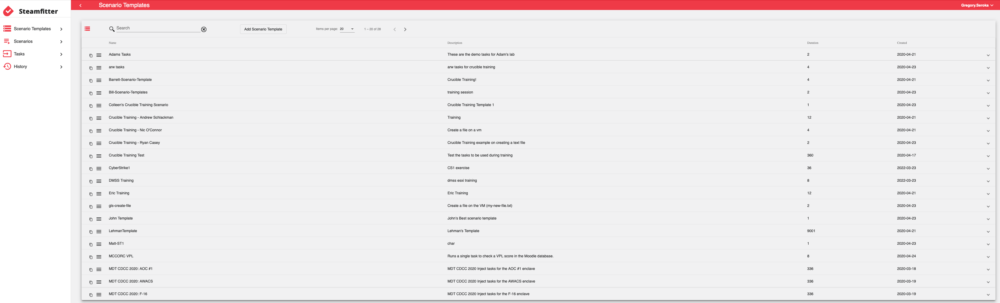

# {: style="height:75px;width:75px"} **Steamfitter:** Crafting a Scenario

## Overview

**Steamfitter** gives content developers the ability to create scenarios consisting of a series of scheduled tasks, manual tasks, and injects which run against virtual machines during an event. These scenarios enable the content developer to automate assessments and configurations.

In the Steamfitter UI, four major functional sections help you manage content:

- Scenario Templates: Organize tasks into groups that you can reuse on demand.
- Scenarios: Display all planned, running, and completed scenarios.
- Tasks: Let users create and execute ad-hoc tasks.
- History: Shows the results of all tasks executed by all users.

## Roles and Permissions

- **Superadmin:** Has the rights to perform all actions in Steamfitter.
- **Rangetech Admin:** Create, manage, and import scenarios or scenario templates; assign and remove users from scenarios and scenario templates; and create or manage groups.
- **Content Developer:** Create scenario templates and scenarios, and assign or remove users from the scenarios or templates they create.
- **Read-Only User:** View only the projects assigned to them. They cannot edit any templates or run tasks.

### Steamfitter Permissions

When a user visits the Steamfitter URL, Steamfitter automatically adds them to the user list with no permissions. Only a Steamfitter Superadmin can grant another user elevated permissions.

1. In Steamfitter, in the top-right corner, select your user name, then **Administration**.
2. Check the boxes for **RangetechAdmin**, **ContentDeveloper**, or **ReadOnly** next to the name of the user, depending on the required access.
3. Select your user name, then **Exit Administration**.

!!! note

    Steamfitter roles only apply to the Steamfitter application—they do not grant permissions in any other Crucible application.

### StackStorm Integration

Behind the scenes, Steamfitter uses [StackStorm](https://stackstorm.com/) to execute these tasks. StackStorm is an open-source application that connects applications, services, and workflows. Steamfitter uses StackStorm to send commands to guest VMs via the vSphere Action Pack. This ensures that no communication for the tasks run by StackStorm occurs over the network.

## Administrator Guide

Steamfitter is primarily an administrative tool. Content Developers and Rangetech Admins manage templates and scenarios, while Read-Only Users can observe assigned projects without making changes.

### Scenario Templates

Scenario templates group predefined tasks so you can create scenarios and run them on demand. To create a new scenario template, provide a **Name**, **Description**, and **Duration**.

After adding the new scenario template, you can **Create a Scenario**, **Copy** a scenario template to create a duplicate, **Edit** it, and **Delete** it.

Add tasks in the Scenario Templates screen by clicking the **+** icon. Complete the same task information as you did to create a new task.

### Scenarios

Scenarios group predefined tasks that you can execute against a required view's VMs.

Define tasks in the scenario template, then create the *scenario*. Note that the scenario template is the *plan*; the scenario is the actual *instance*. One template can yield multiple scenarios. Associate these scenarios with one or more Player views.

In the **Scenarios** screen, Steamfitter names the created scenario `scenario template name` - `your username` by default.

Select the newly added scenario from the scenario list. You can edit the **Name** and **Description** and use the **View** dropdown. Associate each scenario with one specific Player view.

You can change the **Start** and **End** dates and times here.

!!! success

    The scenario inherits the tasks you attached to the scenario template. If you edit them in the scenario, the changes apply only to that scenario. To update every scenario based on the template, edit the tasks in the scenario template.

#### Starting a Scenario

Start the scenario to execute its tasks.

!!! info

    If the **Start Scenario** button stays disabled, you have not associated the scenario with a Player view.

When you start the scenario, Steamfitter marks it **Active** and adds a new **Execute** option to the Task context menu.

After you execute tasks, the results display in the task details. Each task is expandable. You will see a result listed for every execution of the task.

#### Ending a Scenario

You can also end scenarios. After you start a scenario, the **Start Scenario** button changes to **End Scenario Now**.

### Tasks

A *task* is an action or command that executes against one or more topology resources (that is, a VM). Each task has a *result*. The result captures the output generated when the task runs against a single topology resource—such as one VM—and indicates success or failure. The output typically includes text describing the outcome.

A task has no results until you execute it.

A task can produce multiple results:

- a task defined to run against one VM generates one result for each execution
- a task defined to run against multiple VMs generates one result per VM each time the task runs. For example, a task that targets four VMs and runs three times yields 12 results.

#### Adding a Task

- **Name:** Describe what this task does.
- **Description:** Provide additional details about the task.

##### Action

- **Select an Action:** Power on a VM, power off a VM, read a file, etc. StackStorm refers to a single task/command as an *action*.
- **Trigger Condition:**

       - *Time:* Steamfitter executes a timed trigger automatically after the specified *delay* in seconds. A timed trigger can run multiple *iterations* on a specific interval.
       - *Manual:* A manual trigger runs only when a user intervenes—for example, by clicking a button to fire off a task.
       - *Completion:* When the parent task completes, the dependent task runs—regardless of success or failure.
       - *Success:* If the actual output contains the expected output, the dependent task runs.
       - *Failure:* Runs only when the actual output does not include the expected output.

- **Expected Output:** Enter the text that indicates success. If the actual output contains that text, the task counts as a success; otherwise it counts as a failure.

##### Delay / Iteration / Expiration

- **Delay:** Specify the number of seconds before the task executes.
- **Number of Iterations:** Enter how many times you want the task to execute when you configure it to iterate.
- **Interval Between Iterations:** Specify the time in seconds between iterations.
- **Iteration Termination:**

      - *IterationCountTask:* The task executes exactly the number of iteration times specified above, regardless of success or failure.
      - *UntilSuccess:* The task iterates until the command completes successfully.
      - *UntilFailure:* The task iterates until the command fails.

- **Expiration Timeout:** The time in seconds where, in the absence of a response, the task expires (times out).

##### VM Selection

- **VM Mask:** Steamfitter runs tasks against Player VMs that include the text you enter here.
- **Choose Actual VMs:** Enable Choose Actual VMs to select specific VMs from the Player view.

#### Task Menu and Dependent Tasks

Clicking the Task Menu on the newly created task opens the context menu: **Edit**, **Copy**, **Cut**, **New**, **Delete**, and **Execute**. Selecting **New** here creates a new *dependent* task, which waits to run until the parent task meets its condition.

You can copy and paste a task between scenario templates, scenarios, or other tasks.

### History

The default History view shows task results for the current user sorted in reverse chronological order. However, you can also view history by **User**, **View**, and **VM**. Sorting and filtering are also available in the history results.

## Glossary

This glossary defines key terms and concepts used in the Steamfitter application.

**Delay:** set in seconds before the task executes.

**Execute:** to carry out the task.

**Expiration:** when a task times out.

**Iteration:** an execution of a task given the task specification to iterate x number of times.

**Scenario:** groupings of predefined tasks that execute against a required view's VMs.

**Scenario Template:** location for grouping predefined tasks; scenario templates create scenarios that can run on-demand.

**StackStorm:** an open source application that can connect applications, services, and workflows.

**Task:** an action or command that executes against one or more topology resources.
