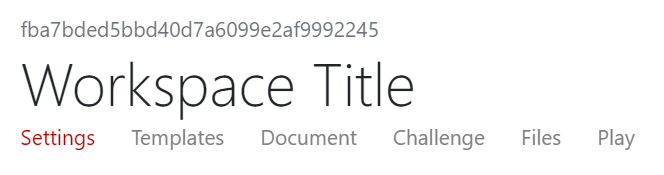
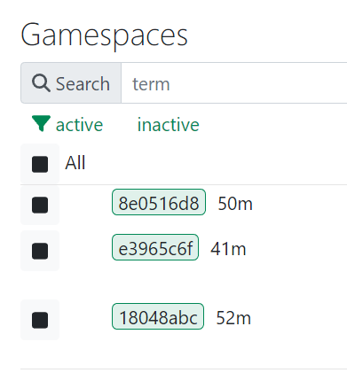
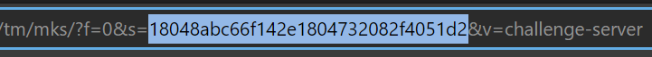

# TopoMojo Docs

This documentation introduces users to the TopoMojo environment and provides information necessary to launch existing labs and create new topologies.

## About TopoMojo

TopoMojo--*Topo* for short--is a web application used for creating and delivering cybersecurity training labs and exercises. With TopoMojo, users can build and deploy labs in an isolated and secure virtual-machine environment.

TopoMojo allows for the same functionality and connectivity that users would experience with real, physical devices. Network topologies can utilize not only IP and Ethernet, but also custom protocol solutions like 802.11 wireless packet simulation.

New topologies can be rapidly deployed using existing templates or built from the ground up with user-provided ISO's and VM specifications.

**Go to the TopoMojo repository:** [github.com/cmu-sei/TopoMojo](https://github.com/cmu-sei/TopoMojo).

## TopoMojo concepts

### Workspace and Gamespace

You build your content in a *workspace*, but you "play" (complete the lab, do the activity) in a *gamespace*. The workspace is where a virtual topology is built. Here engineers and lab developers add VMs, save updates, author a guide in Markdown, and configure questions/answers to turn the topology into a lab or *challenge*.

A *gamespace* is where someone else plays through the lab. They get their own, isolated, read-only copies of all workspace resources. Players in a gamespace can interact with VMs and answer questions to complete a lab, but they can't save anything in the environment. 

In short: a *gamespace* is a read-only copy of a *workspace* where a player (user) interacts with the lab content.

### Isolation Tag

A unique identifier TopoMojo uses to identify a workspace or gamespace. 

- For a workspace: the *isolation tag* is the workspace id visible above the Workspace Title when viewing the workspace. See screen print 1.
- For a gamespace: the *isolation tag* is the gamespace id partially visible from the **Admin**, **Gamespaces** view (see screen print 2) and fully visible in the URL bar when viewing a VM console that belongs to a gamespace (highlighted in screen print 3).  

The id's used for isolation tags uniquely identify each workspace and gamespace in the TopoMojo database. Additionally, each resource (e.g., virtual machine, virtual network, etc.) associated with a workspace or gamespace will have the isolation tag appended to the resource name.  

For example: a VM named `challenge-sever` in the gamespace with id (isolation tag) `18048abc66f142e1804732082f4051d2`, has the name `challenge-server#18048abc66f142e1804732082f4051d2`. Appending the isolation tag to workspace/gamespace resources ensures environment isolation -- VMs and networks cannot have the same name, so there will never be accidental sharing of VM/network resources.

*Screen print 1:*

*Screen print 2:*

*Screen print 3:*

### Challenge

The term *challenge* refers to when both Gameboard and TopoMojo are integrated to execute a cyber competition. In this scenario, Gameboard is a consumer of content made in TopoMojo. More information on that is available elsewhere in the Foundry documentation.