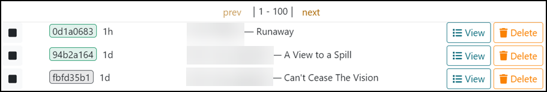

# Admin Gamespaces

The **Gamespaces** tab is where the admin can search for, and filter by, **active** and **inactive** gamespaces. Once gamespaces are found, the admin can perform certain actions. By default, the search is for *active* gamespaces. Green indicates *active* gamespaces and gray indicates *inactive* gamespaces.

**Refresh:** Refreshes your search.

**Delete Selected:** Check the box next to **All** to select all gamespaces for deletion or check a box next to individual gamespaces to select for deletion.

Gamespaces in the table show the gamespace id or support code in Gameboard (e.g. `e9416013`), the time remaining (if active), the user who is interacting with (or *had* interacted with) the gamespace; and the title of the *workspace* that the *gamespace* was deployed from. The screen print below, several active and inactive gamespaces are shown. User names have been redacted.

## View (expanded)

**View:** Selecting **View** expands the gamespace information where a list of all the VMs associated with the gamespace and their state. Additional information on how the View works is found below.

- **refresh:** Refreshes the VM instance.
- **console:** Allows you to interact with the VM (a user's gamespace).
- **stop:** Stops a powered on VM.
- **revert:** Reverts to last saved state.
- **delete:** Deletes a running VM instance.
- **Json:** Shows detailed information about the gamespace, including: answers to questions, variables associated with the challenge, submitted answers, challenge questions and expected answers, and if questions were answered correctly or incorrectly.
- **Dispatcher:** Used to issue commands to a VM from TopoMojo provided that the TopoMojo agent program is running on that VM. The VM requires an internet connection which allows the agent program to establish a connection with TopoMojo. `target` is the hostname of the VM that you want to run the command on. `command` is any command you wish to run. See TopoMojo's [GitHub repository](https://github.com/cmu-sei/TopoMojo/tree/main/src/TopoMojo.Agent) for more information on TopoMojo's agent.

## Delete

**Delete:** As you would expect, deletes the gamespace and associated VMs.