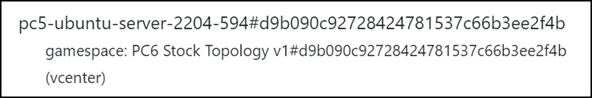

# Admin Machines

This tab lists all VMs TopoMojo is tracking and the gamespaces they belong to, without using the vSphere Client.

- `gamespace` tells you this is a *gamespace* VM.
- `pc5-ubuntu-server-2204-594` is the name of the VM.
- `#d9b090c92728424781537c66b3ee2f4b` after the hash tag is the gamespace GUID.

The **Machines** tab is helpful when you want to find all the VMs related to a gamespace (e.g., `PC6 Stock Topology v1` in the screen print above). You can copy the gamespace GUID and paste it into the **Search** field. Note that you cannot interact with the VMs from this tab.

## "Orphaned" VMs

VMs tagged with `__orphaned` are VMs that still exist; however, they are not connected to anything. TopoMojo may have attached these VMs to an expired gamespace, and when it tried to remove them vSphere failed to respond. Orphaned VMs should be manually deleted in vSphere.

To identify orphaned VMs, search for "orphaned" in the Search field, identify the VMs to clean up in vSphere, and delete them. Once deleted in vSphere, they won't appear on the **Machines** tab again.
