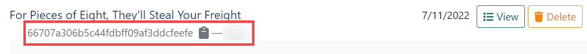

# Admin Workspaces

The **Workspaces** tab is where the admin can search for workspaces and perform limited actions. Workspaces are where challenges (or labs) are built. Here, an admin can view every workspace.

!!! note

    Only users who are admins can view the list of workspaces on the Admin panel. Non-admin users will use the search feature on the left navigation pane.

In the left navigation pane, you can use the **Search** field to locate a workspace. However, searching here only returns workspaces you have created or have been invited to join.

**Create:** Create a new workspace from the Admin Workspaces panel.For additional help, see [Building a new workspace](building-a-workspace.md).

Selecting a workspace takes you the **Settings** tab of that particular workspace where you can edit it. For additional help on the **Settings** tab, see [Building a new workspace](building-a-workspace.md).

The *workspace identifier* is present here too. The workspace identifier matches the directory name used to store workspace files like unlinked virtual machines, Markdown documents, images, etc. Copying it to the clipboard is useful if you need to use it in a terminal when navigating the filesystem. The workspace identifier is called out in the screen capture below.

## View (expanded)

**Template Limit:** Defines the number of VMs that can be in the workspace.

**Template Scope:** Limits a workspace to using templates that have the given scope.

**Audience:** Limits who can deploy a gamespace as a workspace.

**VMs:** Refresh, deploy, view the console, start/stop, revert and delete from here.
- **Refresh**: Queries the state of the VM from the hypervisor.
- **Deploy**: Deploys that virtual machine into your workspace.
- **Console:** Opens the console for the virtual machine.
- **Stop/Start:** Power off/on the VM, but leaves the resource deployed on the hypervisor. Clicking **stop** results in the hypervisor showing a deployed VM in a powered-off state.  Clicking **start** powers on the deployed VM.
- **Revert:** Reverts the VM to its last saved state. All changes made since the last commit are lost.
- **Delete:** Deletes a running VM instance.