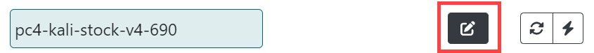
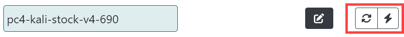
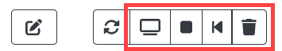
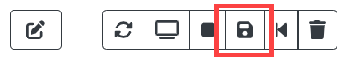

# Building a new workspace

The workspace interface contains six tabs: Settings, Templates,  Document, Challenge, Files, and Play. To build a new Topo workspace click **Home**, then **New Workspace**.

## Settings

The Settings tab holds the metadata for your lab.

**Title:** The title of your workspace; remember that the title should be unique.

**Description:** A brief description of your workspace to display when browsing titles. The **Description** is viewable to everyone, and when used in conjunction with Gameboard, visible there too.

**Tags:** Internal metadata to add data about the lab; for example, if using for a cyber competition, then your tag may be something like `cyber-cup c01`. Now, you can search for that challenge (or lab) using that tag.

**Authorship:** Your name and the names of others who may have assisted you.

**Audience:** A space-delimited list of administrator-defined groups that have permission to deploy gamespaces from the workspace. Administrators define an *audience* with any name here. Only users with a *scope* matching one of the provided *audiences* are permitted to deploy gamespaces from the workspace. `Everyone` is the global audience that allows all users to deploy gamespaces from the workspace. For more information, see the [Admin Dashboard - Users](admin-users.md) documentation.  

**Duration:** Recommended length of time in minutes that it takes to play through a gamespace launched from your workspace.

**Collaboration:** To share your workspace with others click **Generate invitation**. Paste the link into an email and send. Collaborators are shown here alongside the author. When a collaborator is connected to your workspace, you'll see them `connected` in the top right corner of the workspace.

**Clone:** Clones your workspace; `-CLONE` is appended to the title of the new workspace.

**Delete:** Deletes an existing workspace.

## Templates

The template selector allows you to add virtual machine templates to your workspace. The templates here are "starting point" virtual machines that you can customize. There are blank disc templates for installing your own operating system plus other VMs with operating systems pre-installed.

### Adding and editing templates

To add a template to your workspace:

1. On the Templates tab, click **Add Templates**.
2. Search for and add the templates you need for your topology. 
3. Click the **edit** icon to expand the template(s) to make changes. 

### Template field definitions

The list below explains the fields in the VM template.

- **Name:** Edit the name here. Remember that the name should be unique within the workspace.
- **Description:** The Description should contain the credentials for the virtual machine and the purpose of the virtual machine.
- **Networks:** The Networks fields allows you to add a space-delimited list of networks where the virtual machines connect. These names should be the same for all systems in your lab that need to connect to the same network.
- **Guest Settings:** List key value pairs in the form of `key=value` to pass data into deployed VMs via VMware guestinfo Variables. The **Guest Settings** field uses VMware Guest Info Variables to inject content into virtual machines. Key/value pairs are placed here. The *key* is the name of the guest variable you want to define, and the *value* is value, information, setting, of the variable.  For example, `var1=test` is a guest setting named “var1” with a value of “test”.
   
    *Transforms* allow you to define dynamic variables that are generated based on certain criteria or types. To add the concept of transforms here, select **Challenge** and see **Transforms**. The **info** icon in the Transforms section describes the transform types that are available. See also the "Transforms" topic [here](challenge.md/#transforms).
    
    Guest info variables can be accessed from a Gamespace VM by using VMware Tools such as `open-vm-tools`and the `vmtoolsd` command. See [Open VM Tools](https://docs.vmware.com/en/VMware-Tools/12.3.0/com.vmware.vsphere.vmwaretools.doc/GUID-8B6EA5B7-453B-48AA-92E5-DB7F061341D1.html) and [VMware Tools daemon help](https://helpmanual.io/help/vmtoolsd/).

    

- **Replicas:** Set this number to deploy copies of the same VM template. For example: to deploy three copies of a VM template when a *gamespace* is started, set **Replicas** to "3". To deploy one copy of the VM template for each team member that the gamespace is started for, set **Replicas** to "-1".
- **Variant:** Specify that the VM template should only be deployed for a particular variant. For example: when **Variant** is set to "2",  the VM template will only be deployed when TopoMojo deploys variant 2 of the challenge.
- **Iso:** Use the Iso Selector to attach an ISO image to your virtual machine.
- **Console Access:** Toggle **Hidden** to hide a specific VM from being accessible by the person completing the lab. This is useful for systems like a DHCP server that do not require user interaction.
- **Linked:** *Unlinking* creates a new a new copy of the template that can be saved and customized. Toggle **Unlink** for any virtual machine that will not use the default disk included with the template.
- **Delete Template:** Deletes the template.                                        |

### Refresh and Deploy

Once the template is in the appropriate state:

- **Refresh**: (arrows) Refresh queries the state of the VM from the hypervisor. This is useful if you run a `shutdown` command in the VM and the TopoMojo UI icons haven't updated to reflect the powered-off state of the VM yet. 
- **Deploy**: (lightning bolt) Deploys that virtual machine into your workspace. 

From left to right, the following additional icons are used in the deployed virtual machine:

- **Console:** Opens the console for the virtual machine.
- **Stop/Start:** Power off/on the VM, but leaves the resource deployed on the hypervisor. Clicking **stop** results in the hypervisor showing a deployed VM in a powered-off state.  Clicking **start** powers on the deployed VM. 
- **Revert:** Reverts the VM to its last saved state. All changes made since the last commit are lost. 
- **Delete:** Deletes a running VM instance. Before you click **delete**, make sure you have saved any changes to the disk.

### Save

The **save** icon appears only when an unlinked disk is being used; changes can't be saved to a linked disk. The **save** icon removes the last disk snapshot and creates a new snapshot that saves all changes made to the VM.