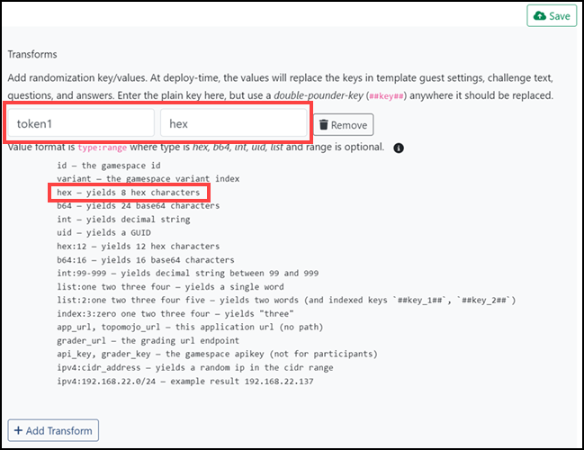
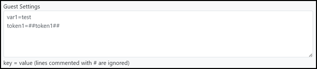

# Challenge tab

The *Challenge* tab in the Topo workspace is used when both Gameboard and TopoMojo are integrated to execute a cyber competition. More information on linking those two applications together can be found elsewhere in the Foundry documentation. The Challenge tab is where you create random key/values, embed them in a *gamespace* at deploy time, and ask questions and answers of competitors (players).

## Transforms

**Transforms** allow you to define dynamic variables that are generated based on certain criteria or types. Transforms are also a key/value pair definition – the **key** is the name of your transform and the **value** is the type of the transform.  The screen print below shows a transform named “token1” that will have a value of 8 random hexadecimal characters. 

*Screen print 1:*

To access transforms, use the referenced "*double-pounder-key* (`##key##`)" notation. When TopoMojo deploys a gamespace, the engine generates the random values for all transforms, looks for double-pounder-keys, then replaces them with the randomly generated values for that deployment.

Any of the sections on the Challenge tab (e.g., Transforms, Markdown, Questions, Answers) can contain *double-pounder-keys* that will be replaced with transform values at deploy time. You can also use transform *double-pounder-keys* in the *Guest Settings* field of a template to inject random variables into VM guest info variables when deploying a gamespace (transforms aren’t generated when deploying workspace VMs, so the value of the variable will be the *double-pounder-key*). 

The screen print below shows the Guest Settings of a VM template configured to use two guest info variables: `var1` and `token1`. `Var1` has a value of “test” and `token1` will have a random 8-character hexadecimal string assigned when a gamespace is deployed.

*Screen print 2:*

Click [here](building-a-workspace.md/#template-field-definitions) to learn more about Guest Settings.

## Markdown

The markdown you enter here gets appended to the gamespace document.

## Variants

A *variant* describes a different version of a challenge. Variants can contain different ISO attachments, different virtual machines, and different questions and answers. Each time a challenge is deployed, a variant is randomly selected for the deployment. For example, two competitors can attempt the same challenge, but one competitor may receive *variant #1* and the other competitor may receive *variant #2*.  When creating a challenge using variants, make sure all variants test the same competitor skills at the same difficulty level. That is, variant #1 should test the same skills as variant #2 and one variant shouldn't be harder to solve than another variant.

## Question Set

**Move Up, Move Down, Remove:** These functions are self-explanatory. Use them to position the question in the sequence of questions for that set or remove it.

**Question:** Enter the question you expect the participant to answer here. Your question should be specific, so that there is only one correct answer.

**Answer:** Enter the correct answer that the competitor must submit to earn a score.

These options are revealed when **Detail** is selected.

**Hidden:** Select **Hidden** to prevent the question from appearing when playing the challenge. Hidden questions do not appear when playing in TopoMojo or via Gameboard.

**Grader:** Select the grading type here. The Grader determines if players submitted the correct answer to a question. Select one of four types:

- `Match`: The submission must exactly match what is in the **Answer** field. Use this when there is exactly one possible answer to a question.
- `MatchAny`: The submission must match one of the pipe-delimited answers in the **Answer** field. Use this when there is more than one possible answer to a question.
- `MatchAll`: The submission must match all of the pipe-delimited answers in the **Answer** field. Use this when a list of answers to a question is expected.
- `MatchAlpha`: The submission must exactly match what is in the **Answer** field *after* all non-alphanumeric characters are removed. This is useful if the user might submit symbols that don't affect the validity of an answer. For example, `C:/Users` and `C:\Users` are both valid answers and the symbols (`/` vs `\`) don't matter.

All four graders are case-insensitive, meaning that all answers and submissions are converted to lower-case by the grader before the submission is compared to the expected answer in all grader types.

### Weight

Weight is the percentage of total for this question. The value should be between `0 and 1` or `0 and 100`. The weights of all questions within the set must add up to 100% or one (1). Zero (`0`) values are calculated evenly.

### Example

Providing an example answer helps players understand the required answer format. For instance, sometimes a file needs both the name and the extension, while other times only the name is necessary.