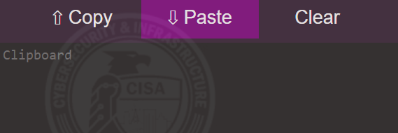
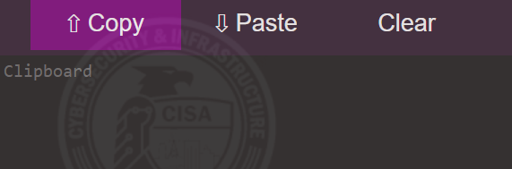

# Copy and paste

The procedures below show you how to:

- Copy text from a local machine (an *out of game* computer) and paste it into an *in game* virtual machine
- Copy text from a virtual machine and paste it into a local machine

*The VM console cog icon:*

## From local ("out of game") to "in game"  

1. On your local machine select, then copy, the content you want to place into a launched virtual machine.
2. In the VM console tab, select the cog icon (the **Tools**). Under **Clipboard** paste in the clip using right-click Paste or `ctrl+V`. 
3. In the VM, select where you want the copied text to go (this can be a new file or an open application, etc.).
4. Under **Clipboard**, click **Paste**. This inserts the copied content into the virtual machine.

## From "in game" to "out of game"

1. On the VM, select the content you would like to copy. Copy the content *first* to the VM's clipboard (right-click Copy or `ctrl+C`).
2. Once you've copied your text to the VM clipboard select the cog icon (the **Tools**), place your cursor in that clipboard, and click **Copy**. This transfers the VM clip to your local clipboard.

3. On your local machine, paste the copied text into an application using right-click Paste or `ctrl+V`.