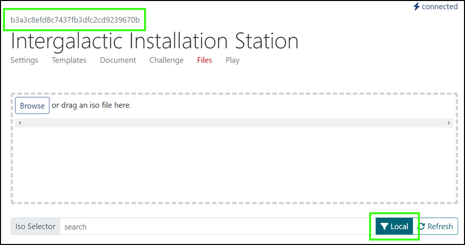

The **Files** page in the Topo workspace allows you to upload files from your system to TopoMojo to include in your lab. These files are used as ISOs that can be attached to VMs in the workspace. If your files aren’t already in an ISO file format, TopoMojo wraps them in an ISO after upload.

!!! note

    For ISO uploads to work, TopoMojo needs an NFS (Network File System) datastore presented to vSphere and Topo must be able to access it. 

The **Files** tab in TopoMojo is where ISO files are uploaded to attach to virtual machines. Supply the ISO that you want to attach to your VM here to provide additional resources to a VM that might not be included in the original VM. ISO files are disk images that can be mounted as virtual CD drives on the VM. You want to attach an ISO when you need additional software, datasets, or other resources.

**Drag and Drop:** Admins drag their ISO file into the box on Files tab or browse to locate it on their own device.

By default, the **Local** filter is applied so it only displays ISOs available in the current workspace. 

When you upload an ISO file in the box, TopoMojo creates a folder with *this* GUID--called out in green in screen print 1 below--in the folder name in the NFS datastore. TopoMojo puts your ISO in that folder. Only the current workspace, that is, *your* workspace has access to the ISO file. 

*Screen print 1: GUID and Local filter applied*

When the **Local** filter is removed, *all* of the ISOs in the global folder on the NFS data store can be seen. (The folder name will contain a GUID of all zeros.) These global ISOs are available to every workspace in TopoMojo.

ISOs can be attached to a VM in the challenge workspace **Templates** tab. See "Adding and editing templates" in the [Building a new Workspace](building-a-workspace.md) chapter of this guide. When an ISO is selected here, the ISO will be attached to the VM upon its deployment.

ISOs can also be attached to a VM by using the workspace **Challenge** tab's **Variant Detail** function. This is called "dynamic ISO attachment" and gives you the ability to attach a variant-specific ISO file to a template. You *must* specify a target(s) here. See also "Variants" in the [Challenge tab](challenge.md) chapter of this guide.