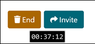

# Finding a space

Once you're in Topo, you can browse for existing TopoMojo workspaces and gamespaces. In the left panel (`Ctrl-L`) , enter terms into the **Search** field. TopoMojo automatically searches for a workspace or a gamespace that matches your terms. Click **workspace** or **gamespace** to filter results. Topo labs are sorted alphabetically by name.

Select a gamespace, then click **Start**. You can "play" the lab now -- start by reading the instructions and launching a gamespace resource. You can end play by clicking **End**. You can invite others to play in your gamespace. Click **Invite** to copy an invitation link. Provide the other person(s) with the link.

The timer counts down how much remaining time you have before the gamespace expires.