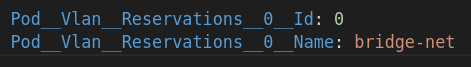

# Getting Started

## What's New

Get the latest TopoMojo source code and its accompanying release notes [here](https://github.com/cmu-sei/TopoMojo).

## Installing

Installing TopoMojo is a matter of installing the Helm chart found [here](https://github.com/cmu-sei/helm-charts/tree/main/charts/topomojo) on the SEI's GitHub page. The CMU-SEI Helm charts repo is a public repository on GitHub for anyone to access and use. The TopoMojo chart contains two sub-charts: `topomojo-api` and `topomojo-ui`. The `api` and the `ui` are different apps and you should deploy them separately.

!!! info

    This structure is consistent with the other Foundry apps: there is an `api` piece and a `ui` piece.

**`TopoMojo values.yaml`:** Contains default configurations for the `api` and the `ui`. To deploy TopoMojo, configure the **`Values.yaml`** file according to your needs and `helm install` TopoMojo.

## Persistent/Shared Networks

We recommend having a persistent/shared network available to all TopoMojo workspaces/gamespaces. The administrator defines a persistent/shared network at the time they deploy the TopoMojo API.

For example, you could create a persistent/shared network that provides internet access to all TopoMojo VMs that specify the network name. `bridge-net` typically signifies bridging the traditionally isolated TopoMojo VM to the internet.

Use the `Pod__Vlan__Reservations` environment variable to define the name of a persistent/shared network. See screen print 1 below.

- `Pod__Vlan__Reservations__0__Id:` defines the vlan Id (from the hypervisor) that corresponds to the shared/persistent network.
- `Pod__Vlan__Reservations__0__Name:` defines the name of the persistent/shared network.

You can define more than one shared/persistent network by incrementing the variable name (`Pod__Vlan__Reservations__1__Id` and `Pod__Vlan__Reservations__1__Name`). To connect VMs to shared/persistent networks, users must have at least **Builder** permissions.

!!! note "A note about bridge-net"

    "bridge-net" is not always reserved. It is reserved by the SEI because we configured it that way, and it is convenient to refer to in the TopoMojo documentation.

*Screen print 1:*

