# {: style="height:75px;width:75px"} TopoMojo: Building Virtual Labs

This documentation introduces users to the TopoMojo environment and provides information necessary to launch existing labs and create new topologies.

## Overview

TopoMojo is a web application used for creating and delivering cybersecurity training labs and exercises. With TopoMojo, users can build and deploy labs in an isolated and secure virtual machine environment.

TopoMojo allows for the same functionality and connectivity that users would experience with real, physical devices. Network topologies can utilize not only IP and Ethernet, but also custom protocol solutions like 802.11 wireless packet simulation.

New topologies can be rapidly deployed using existing templates or built from the ground up with user-provided ISO's and VM specifications.

TopoMojo uses a hypervisor in the backend to deploy virtual machines and configure virtual networks. Supported hypervisors are VMware vSphere and Proxmox.

Go to the TopoMojo repository: [github.com/cmu-sei/TopoMojo](https://github.com/cmu-sei/TopoMojo).

## TopoMojo Concepts

### Workspace and Gamespace

In a _workspace_, engineers add VMs, save updates, author guides, and configure questions/answers to turn the topology into a lab or challenge.

Users play through a lab in a _gamespace_. Users get their own, isolated, read-only copies of all resources in the workspace. Players in a gamespace can interact with VMs and answer questions to complete the lab, but they cannot save changes to the environment.

### Isolation Tag

The "Isolation Tag" is a unique identifier TopoMojo uses to identify a workspace or gamespace. This ID uniquely identifies each workspace and gamespace in the TopoMojo database.

- For a workspace: the _isolation tag_ is the workspace id visible above the Workspace Title when viewing the workspace.
  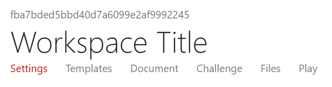

- For a gamespace: the _isolation tag_ is the gamespace id partially visible from the **Admin**, **Gamespaces** view and fully visible in the URL bar when viewing a VM console that belongs to a gamespace.
  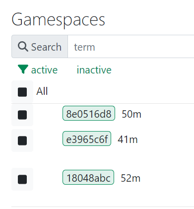
  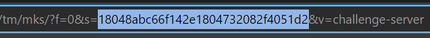

Each resource (e.g., virtual machine, virtual network, etc.) associated with a workspace or gamespace will have the isolation tag appended to the resource name. For example: a VM named `challenge-sever` in the gamespace with id (isolation tag) `18048abc66f142e1804732082f4051d2`, has the name `challenge-server#18048abc66f142e1804732082f4051d2`. Appending the isolation tag to workspace/gamespace resources ensures environment isolation and unique resource naming.

### Labs and Challenges

A _lab_ or _challenge_ is a TopoMojo workspace built to teach or test hands-on cybersecurity skills. _Labs_ are typically designed to be instructional with detailed documents that might resemble a full walkthrough. _Challenges_ are typically skills assessments with minimal instructions designed to test a user's skills or be used as part of a competition (e.g., Capture the Flag competition).

Labs and challenges can be deployed by 3rd party consumers of TopoMojo content, like [Gameboard](../gameboard/) and [Moodle](../integrations/index.md#moodle).

## Getting Started

### What's New

Get the latest TopoMojo source code and its accompanying release notes from the [GitHub repository](https://github.com/cmu-sei/TopoMojo).

### Installing

TopoMojo is installed using the [Helm chart](https://github.com/cmu-sei/helm-charts/tree/main/charts/topomojo). The TopoMojo chart contains two sub-charts: `topomojo-api` and `topomojo-ui` which are configured and deployed separately.

!!! info

    This `api`/`ui` structure is consistent with the other Crucible apps.

**`TopoMojo values.yaml`:** Contains default configurations for the `api` and the `ui`. To deploy TopoMojo, configure the **`Values.yaml`** file according to your needs then `helm install`. More details on how to configure the values file is [available in the helm charts repository](https://github.com/cmu-sei/helm-charts/tree/main/charts/topomojo).

### Persistent/Shared Networks

We recommend having a persistent/shared network available to all TopoMojo workspaces/gamespaces. The administrator defines a persistent/shared network at the time they deploy the TopoMojo API.

For example, you could create a persistent/shared network that provides internet access to TopoMojo VMs connected to the network named `bridge-net`.

Use the `Pod__Vlan__Reservations` environment variable to define the name of a persistent/shared network.

- `Pod__Vlan__Reservations__0__Id:` defines the vlan Id (from the hypervisor) that corresponds to the shared/persistent network.
- `Pod__Vlan__Reservations__0__Name:` defines the name of the persistent/shared network.

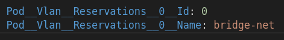

You can define more than one shared/persistent network by incrementing the variable name (`Pod__Vlan__Reservations__1__Id` and `Pod__Vlan__Reservations__1__Name`). To connect VMs to shared/persistent networks, users must have at least **Builder** permissions.

!!! note "A note about bridge-net"

    `bridge-net` is just an example based on SEI's network naming convention for this persistent/shared network. It is not always configured as a reserved vlan by TopoMojo.

### Using a VM Console

TopoMojo provides web-based consoles for interacting with virtual machines using only a modern web browser. The control panel on the left of the VM console offers additional options for using the VM console.

- **Settings ( <i class="fa-solid fa-gear" aria-label="settings-icon" role="img"></i> ):** Configure behavior/preferences for the console interface.
  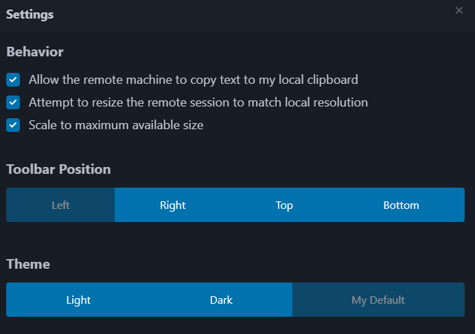
- **Reconnect ( <i class="fa-solid fa-arrow-rotate-right" aria-label="reconnect-icon" role="img"></i> ):** Refresh the connection to the VM.
- **Keyboard ( <i class="fa-regular fa-keyboard" aria-label="keyboard-icon" role="img"></i> ):** Send keystrokes to the VM (e.g., `ctrl + alt + del`).
- **Clipboard ( <i class="fa-regular fa-copy" aria-label="clipboard-icon" role="img"></i> ):** Copy/paste with this VM by selecting text to copy out of the VM to your host or paste text from your host to the VM.
  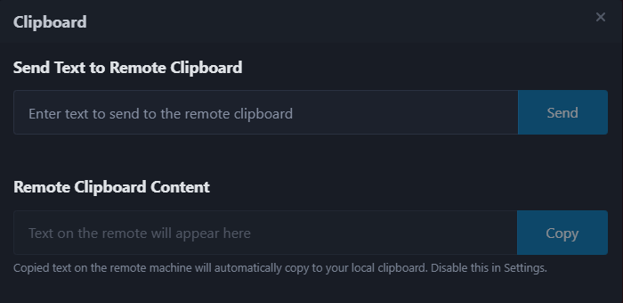
- **Networks ( <i class="fa-solid fa-network-wired" aria-label="networks-icon" role="img"></i> ):** Change the networks a VMs network interface card is attached to.
- **Screenshot ( <i class="fa-solid fa-camera" aria-label="screenshot-icon" role="img"></i> ):** Take a screenshot of the VM. The screenshot is automatically copied to your host clipboard.
- **Record (<i class="fa-solid fa-expand fa-stack-2x"></i><i class="fa-solid fa-circle fa-stack-1x"></i>):** Record the VMs screen and save the recording to your computer.
- **Fullscreen ( <i class="fa-solid fa-expand" aria-label="fullscreen-icon" role="img"></i> ):** Maximize the console's screen.

## Finding a Space

You can browse for existing TopoMojo workspaces and gamespaces using the **Search** field in left panel. Enter search terms then click **workspace** or **gamespace** to filter results. The **workspace** section shows workspaces where you are an editor. The **gamespace** section shows spaces that you have permission to deploy as a gamespace (more information on permissions)

Select a gamespace, then click **Start** to "play" the lab -- start by reading the instructions and launching a gamespace resource. You can invite others to play in your gamespace. Click **Invite** to copy an invitation link for sharing. When you're finished, click **End** to destroy your gamespace. The timer counts down how much time remains before the gamespace expires.

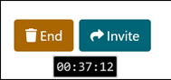

## Building a New Workspace

To build a new TopoMojo workspace click **New Workspace** from the homepage. The workspace interface contains six tabs: Settings, Templates, Document, Challenge, Files, and Play.

### Settings

The Settings tab holds configuration metadata for your lab.

**Title:** The title of your workspace. While not enforced, the title should be unique to prevent confusion when searching for spaces.

**Description:** A brief description of your workspace to display when browsing titles.

**Tags:** Space-delimited metadata added to help with searching and cataloging spaces. For example, if working several challenges for the "cyber-cup" project, you may tag a workspace with `cyber-cup c01` where `cyber-cup` is the name of the project and `c01` is a challenge number/ID.

**Authorship:** The names of the challenge authors.

**Audience:** A space-delimited list of administrator-defined groups that have permission to deploy gamespaces from the workspace. Administrators define an _audience_ with any name here. Users can deploy gamespaces from the workspace only if their _scope_ matches one of the provided _audiences_. `Everyone` is the global audience that allows all users to deploy gamespaces from the workspace.

**Duration:** Recommended length of time, in minutes, that it takes to play through the challenge/lab.

**Collaboration:** To share your workspace with others, click **Generate invitation** and send the link to collaborators. TopoMojo shows Collaborators alongside the author. When a collaborator connects to your workspace, you'll see them `connected` in the top right corner of the workspace.

**Clone:** Create a copy of your workspace. The cloned workspace VMs will be **linked** to the parent workspace's VMs. All other settings from the parent will be copied to the clone. TopoMojo appends `-CLONE` to the title of the new workspace, but you can change this title.

**Delete:** Delete the workspace.

### Templates

The template selector allows you to add virtual machine templates to your workspace. Templates are "starting point" virtual machines that engineers can add to their workspace and customize as needed. A typical TopoMojo deployment might contain the following types of templates: base install operating systems with no additional software/configurations (these serve as a known-good starting point for customization), templates with customized configurations for a specific purpose (e.g., a web server that is already configured to serve content), and blank discs (allow engineers to install an operating system that isn't already available). Administrators can publish individual templates (e.g., a standalone base install of Kali Linux) or a template set that contains multiple VMs meant to be used as a single "stock topology" (e.g., a full enterprise network with routers, firewalls, services, and a security monitoring suite).

#### Adding and Editing Templates

To add a template to your workspace:

1. On the Templates tab, click **Add Templates**.
2. Search for and add the templates you need for your topology.
3. Click the **edit** icon to expand the template metadata and make changes. Making changes inside the VM requires [deploying the VM](#refresh-and-deploy).
   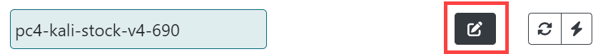

#### Template Field Definitions

The list below explains the fields in the VM template.

- **Name:** The **name** of the VM must be unique within the workspace and should be descriptive of the resource.
- **Description:** A short description of the VM. It is best practice to include the credentials and purpose for the VM. The description is not visible to users playing the lab - it is only visible in the workspace editor.
- **Networks:** A space-delimited list of networks on which the VM will have a network interface. These names should be the same for all systems in your lab that need to connect to the same network. TopoMojo will create the networks on the hypervisor when the VM/lab is deployed.
- **Guest Settings:** Key-value pairs in the form of `key=value` to pass data into deployed VMs via [VMware guestinfo variables](https://techdocs.broadcom.com/us/en/vmware-cis/vsphere/tools/12-5-0/vmware-tools-administration-12-5-0/configuring-vmware-tools-components/using-vmware-tools-configuration-utility/view-virtual-machine-status-information/query-information-using-guestinfo-variable.html) or the [QEMU Firmware Configuration Device](https://www.qemu.org/docs/master/specs/fw_cfg.html) for Proxmox. The _key_ is the name of the guest setting. For example, `var1=test` is a guest setting named "var1" with a value of "test". Guest settings values can be randomized using [TopoMojo Transforms](#transforms).

  When using VMware as a backing hypervisor, use [VMware Tools](https://helpmanual.io/help/vmtoolsd/), such as the `vmtoolsd` command from the [open-vm-tools package](https://docs.vmware.com/en/VMware-Tools/12.3.0/com.vmware.vsphere.vmwaretools.doc/GUID-8B6EA5B7-453B-48AA-92E5-DB7F061341D1.html), to access guest info variables from a VM.

  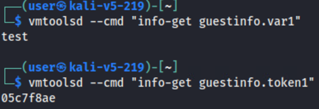

  When using Proxmox as a backing hypervisor, use the [QEMU Firmware Configuration (`fw_cfg`) Device](https://www.qemu.org/docs/master/specs/fw_cfg.html) with commands similar to the following, where `variable` is the key of the Guest Setting to read: `sudo cat /sys/firmware/qemu_fw_cfg/by_name/opt/guestinfo.variable/raw`

- **Replicas:** Set this number to deploy copies of the same VM template. For example: to deploy three copies of a VM template when TopoMojo starts a _gamespace_, set **Replicas** to "3". To deploy one copy of the VM template for each member of the team owning the gamespace, set **Replicas** to "-1".
- **Variant:** Specify that TopoMojo should deploy the VM template only for a particular variant. For example, if the Variant is "2", TopoMojo deploys the VM template only when it launches variant 2 of the challenge.
- **ISO:** Use the ISO Selector to attach an ISO image to your virtual machine.
- **Console Access:** Toggle **Hidden** to hide a specific VM from view while completing the lab. This is useful for backend systems like a DHCP server that do not require user interaction or other systems where the user should not have direct console access. _Note: These VMs may still be visible/accessible over the network - users just aren't able to click into a console via the lab interface._
- **Linked:** _Unlinking_ creates a new a new clone of the template which you can save and customize. **Unlink** any virtual machine that will not use the default disk included with the template (i.e., the VM requires changes to be saved).
- **Delete Template:** Deletes the template from the workspace.

#### Refresh and Deploy

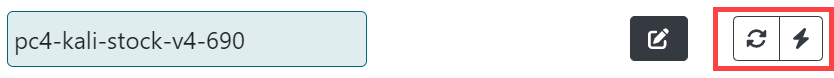

Once the template is in the appropriate state:

- **Refresh ( <i class="fa-solid fa-arrows-rotate" aria-label="refresh-icon" role="img"></i> ):** Refresh queries the state of the VM from the hypervisor. This is useful if you run a `shutdown` command in the VM and the TopoMojo UI icons haven't updated to reflect the powered-off state of the VM yet.
- **Deploy ( <i class="fa-solid fa-bolt" aria-label="deploy-icon" role="img"></i> ):** Deploys that virtual machine into your workspace.

#### Deployed VM Actions

The deployed virtual machine displays the following additional icons from left to right:
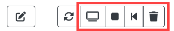

- **Console ( <i class="fa-solid fa-tv" aria-label="console-icon" role="img"></i> ):** Opens the console for the virtual machine.
- **Stop/Start ( <i class="fa-solid fa-stop" aria-label="stop-icon" role="img"></i> / <i class="fa-solid fa-play" aria-label="play-icon" role="img"></i> ):** Power off/on the VM, but leaves the resource deployed on the hypervisor. Clicking **stop** results in the hypervisor showing a deployed VM in a powered-off state. Clicking **start** powers on the deployed VM.
- **Revert ( <i class="fa-solid fa-backward-step" aria-label="revert-icon" role="img"></i> ):** Reverts the VM to its last saved state. You lose all changes made since the last commit. VMs can only be reverted back to their last saved state - there is no history of all previous saved states.
- **Delete ( <i class="fa-solid fa-trash" aria-label="delete-icon" role="img"></i> ):** Deletes a running VM instance. Before you click **delete**, make sure you have saved any changes to the disk.
- **Save ( <i class="fa-solid fa-save" aria-label="save-icon" role="img"></i> ):** Save any changes made to the VM. Sometimes, this is referred to as "taking a snapshot", though the technical implementation of this feature may not resemble a true "snapshot" on the hypervisor. The **save** icon is only available when you're using an unlinked disk, since you can't save changes to a linked disk. Clicking **save** removes the last saved state and creates a new one with all VM changes.
  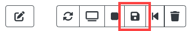

## Lab Document

The **Document** tab in a TopoMojo workspace is where you write the lab instructions using Markdown syntax in TopoMojo's built-in collaborative editor. Authoring in Markdown enables you to create a formatted document using just plain text.

Because TopoMojo's built-in editor is collaborative, multiple people can work on the documentation at the same time. As long as you are "connected" (see the top-right corner) TopoMojo automatically saves your updates to the document.

For more information about Markdown, including the syntax guide, see [markdownguide.org](https://www.markdownguide.org/).

### Inserting an Image

To insert an image into your document:

1. Click **Images**, then click **Browse** (you can drag and drop too).
2. After browsing to upload an image, you should see a preview of the image.
3. Place your cursor in the document where you want the image, hover over the image, and click **Insert**.

### Previewing the Doc

To see how your instructions will look to players when they "play" your lab, click the **Preview** button. The first screen capture shows the Markdown editor. The second screen capture shows the document in preview mode.

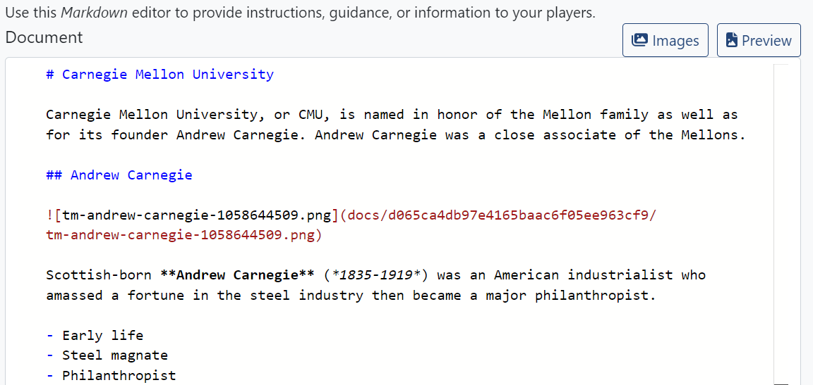

and

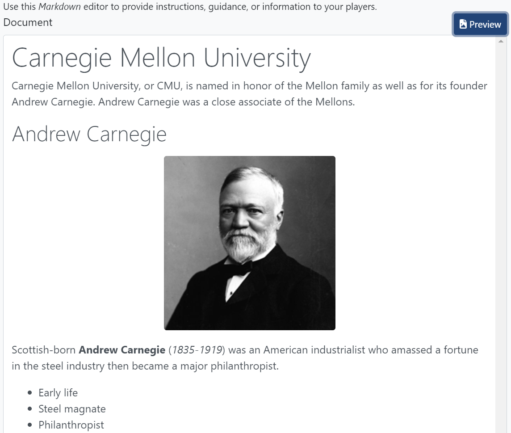

## Challenge Tab

The _Challenge_ tab in the TopoMojo workspace is where engineers configure randomized challenge configuration (_transforms_) and questions for the lab/challenge.

### Transforms

**Transforms** allow you to define dynamic variables that TopoMojo generates at _gamespace_ deploy time. Transforms are key/value pairs –- the **key** is the name of your transform and the **value** is the type of the transform. Expand the tooltip under the transforms text box to see details about the available transform data types. The screenshot below shows a transform named "token1" that will have a value of 8 random hexadecimal characters.

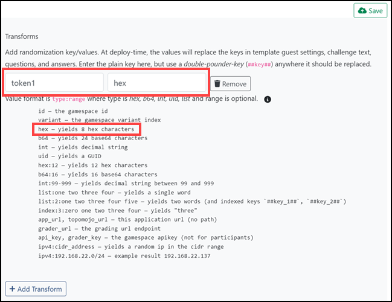

To access transforms in the challenge, use the referenced "_double-pounder-key_ (`##key##`)" notation. When TopoMojo deploys a gamespace, the engine generates random values for all transforms, looks for double-pounder-keys, then replaces them with the randomly generated values for that deployment.

Sections on the Challenge tab (e.g., Transforms, Markdown, Questions, Answers) can contain _double-pounder-keys_ that TopoMojo replaces with transform values at deploy time. You can also use transform _double-pounder-keys_ in the _Guest Settings_ field of a template to inject random variables into VM guest info variables when deploying a gamespace. **Transforms aren't generated when deploying workspace VMs, so the value of the variable will be the _double-pounder-key_.**

The screenshot below shows the Guest Settings of a VM template configured to use two guest info variables: `var1` and `token1`. `Var1` has a value of "test" and `token1` will have a random 8-character hexadecimal string assigned when TopoMojo deploys a gamespace.

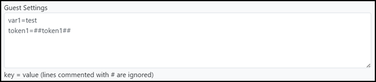

There is a detailed [Guest Settings](#template-field-definitions) portion of the Workspace documentation.

### Markdown

The markdown you enter here gets appended to the gamespace document at deploy time. This section is useful for appending randomized documentation using transforms to the base lab document authored in the **Document** section. For example, if a system's password is randomized via a transform, you can document the randomly generated password in this section using the _double-pounder-key_ notation for transforms.

### Variants

A _variant_ describes a different version of a challenge. Variants can contain different ISO attachments, different virtual machines, and different questions and answers. Each time TopoMojo deploys a challenge, a variant is randomly selected for the deployment. When creating a challenge using variants, make sure all variants test the same competitor skills at the same difficulty level. That is, variant #1 should test the same skills as variant #2 and one variant shouldn't be harder to solve than another variant.

Use the **Clone ( <i class="fa-solid fa-copy"  aria-label="copy-icon" role="img"></i> )** button to create a new variant that is a copy of an existing variant. This makes minor edits between variants easy to facilitate.

### Question Set

**Move Up, Move Down, Remove:** Use these functions to position the question in the sequence of questions for that set or remove it.

**Question:** Enter the question you expect the participant to answer here. Your question should be specific, so that there is only one correct answer.

**Answer:** Enter the correct answer that the competitor must submit to earn a score.

You will see these options when you select **Detail ( <i class="fa-solid fa-ellipsis-vertical"  aria-label="detail-icon" role="img"></i> )**.

**Hidden:** Select **Hidden** to prevent the question from appearing when playing the challenge. Hidden questions do not appear when playing in TopoMojo or via Gameboard.

**Grader:** Select the grading type here. The Grader determines if players submitted the correct answer to a question. Select one of four types:

- `Match`: The submission must exactly match what is in the **Answer** field. Use this when there is exactly one possible answer to a question.
- `MatchAny`: The submission must match one of the pipe-delimited answers in the **Answer** field. Use this when there is more than one possible answer to a question.
- `MatchAll`: The submission must match all of the pipe-delimited answers in the **Answer** field. Use this for questions expecting a list of answers.
- `MatchAlpha`: The submission must exactly match what is in the **Answer** field _after_ the grader removes all non-alphanumeric characters. This is useful if the user might submit symbols that don't affect the validity of an answer. For example, `C:/Users` and `C:\Users` are both valid answers and the symbols (`/` vs `\`) don't matter.

_All four grader types are case-insensitive - the grader converts all answers and submissions to lowercase before comparing them to the expected answer._

#### Weight

Weight is the percentage of the total score for this question. The value should be between `0 and 1` or `0 and 100`. The weights of all questions within the set must add up to 100% or one (1). TopoMojo calculates zero (`0`) values evenly.

#### Example

Providing an example answer helps players understand the required answer format. For instance, sometimes a file needs both the name and the extension, while other times only the name is necessary.

## Files

The **Files** tab in the TopoMojo workspace allows you to upload files from your system to TopoMojo to include in your lab. You can use these files as ISOs to attach to VMs in the workspace. If your files aren't already in an ISO file format, TopoMojo wraps them in an ISO after upload. When a template has an ISO selected, the VM will deploy with the ISO attached to the CD Drive. You can attach an ISO to upload software, datasets, or other resources to the VM.

!!! note

    For ISO uploads to work, TopoMojo needs an NFS (Network File System) datastore presented to the hypervisor.

By default, the **Local** filter displays only ISOs available to the current workspace. When you upload a local ISO file, TopoMojo creates a folder named by the workspace GUID--highlighted in green below--in the NFS datastore. Only the current workspace has access to local ISO files in the workspace-named folder.

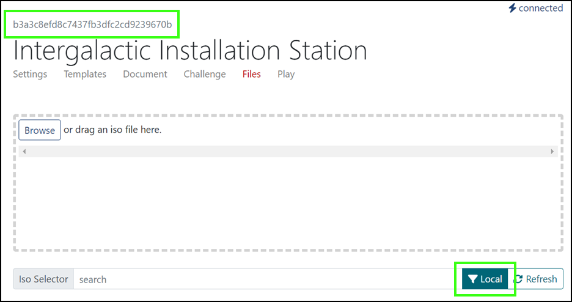

When you remove the **Local** filter, you see ISOs in the global folder on the NFS data store. The global folder is named with a GUID of all zeros. These global ISOs are available to every workspace in TopoMojo and should be used for commonly reused ISOs, like operating system installers, to prevent re-uploading the same artifact in multiple workspace folders.

You can attach an ISO to a VM in the challenge workspace **Templates** tab. See the [Adding and editing templates](#adding-and-editing-templates) section of this guide. When you select an ISO here, TopoMojo attaches the ISO to the VM upon its deployment.

You can also attach an ISO to a VM using the workspace **Challenge** tab's **Variant Detail** function. This "dynamic ISO attachment" gives you the ability to attach a variant-specific ISO file to a template. You _must_ specify a target(s) here. See the [Variants](#variants) section of this guide.

## Play

The **Play** tab is where you can interact with your lab in the same way others will when they launch your content or "play" through your challenge. Play deploys a _gamespace_, a read-only copy of all virtual machines in the _workspace_. See more about _gamespaces_ in the [Workspace and Gamespace](#workspace-and-gamespace) section.

**Variant:** Specify which variant of the challenge you wish to play (if it is a _variant_ challenge). Variant **0** will deploy a random variant.

**Max Attempts:** The maximum number of submission attempts allowed when answering questions.

**Max Minutes:** The maximum number of minutes permitted to play before the gamespace expires.

**Point Value:** Suggested number of points earned for successfully answering all questions. Consumers (e.g., [Gameboard](../gameboard/) and [Moodle](../integrations/index.md#moodle)) can request any point value when they deploy a gamespace.

**Start:** Starts the gamespace by deploying virtual machines, displaying the Markdown document, making challenge questions available, and starting the timer for the user that clicked **Start**.

**Reset:** Destroys and resets the gamespace.

## Administrator Guide

Access the **Admin Dashboard** by clicking **Admin** in the top right corner of the navigation bar. You need the `admin` role assigned to your user to see the **Admin** navigation option.

### Hub Connections

**Hub connections** informs TopoMojo admins about which users are currently logged into TopoMojo.

### Announcement

The **Announcement** feature allows TopoMojo admins to broadcast important messages to everyone in TopoMojo. Announcements appear in the TopoMojo interface. In the Message field, enter the content of the announcement and click **Send**.

### Janitor

The **Janitor** service cleans up unused resources (e.g., a workspace VM that has been idle for a long time) in TopoMojo.

**Cleanup Report:** Provides a log of the Janitor's activity.

### Gamespaces Tab

The **Gamespaces** tab is where the admin can search for, and filter by, **active** and **inactive** gamespaces. By default, the search is for _active_ gamespaces. Green indicates _active_ gamespaces and gray indicates _inactive_ gamespaces. An _active_ gamespace is one where the player can still interact with VMs and answer questions. An _inactive_ gamespace is one that is completed (the player has answered all questions) or expired.

**Refresh:** Refreshes your search.

**Delete Selected:** Check the box next to **All** to select all gamespaces for deletion or check a box next to individual gamespaces to select for deletion.

Gamespaces in the table show the following information:

- Gamespace id (e.g. `e9416013`)
- Time remaining (if active)
- User who owns the gamespace
- Title of the _workspace_ that the _gamespace_ corresponds to

The screenshot below shows several active and inactive gamespaces (usernames redacted).

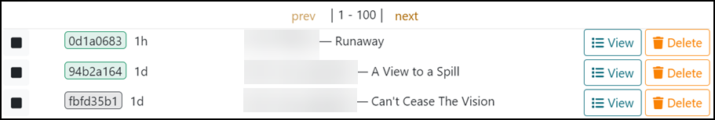

#### View (Expanded)

**View:** Selecting **View** expands the gamespace information where a list of all the VMs associated with the gamespace and their state.

- **Refresh ( <i class="fa-solid fa-arrows-rotate" aria-label="refresh-icon" role="img"></i> ):** Refresh the state of the VM from the hypervisor.
- **Console ( <i class="fa-solid fa-tv" aria-label="console-icon" role="img"></i> ):** Opens the console for the virtual machine, allowing interaction.
- **Stop/Start ( <i class="fa-solid fa-stop" aria-label="stop-icon" role="img"></i> / <i class="fa-solid fa-play" aria-label="play-icon" role="img"></i> ):** Power off/on the VM, but leaves the resource deployed on the hypervisor. Clicking **stop** results in the hypervisor showing a deployed VM in a powered-off state. Clicking **start** powers on the deployed VM.
- **Revert ( <i class="fa-solid fa-backward-step" aria-label="revert-icon" role="img"></i> ):** Reverts the VM to its last saved state.
- **Delete ( <i class="fa-solid fa-trash" aria-label="delete-icon" role="img"></i> ):** Deletes a running VM instance.
- **JSON ( <i class="fa-solid fa-code" aria-label="code-icon" role="img"></i> ):** Shows detailed information about the gamespace, including: answers to questions, variables associated with the challenge, submitted answers, challenge questions and expected answers, and if the participant answered questions correctly or incorrectly.
- **Dispatcher ( <i class="fa-solid fa-keyboard" aria-label="keyboard-icon" role="img"></i> ) :** Used to issue commands to a VM from TopoMojo provided that the [TopoMojo agent program](https://github.com/cmu-sei/TopoMojo/tree/main/src/TopoMojo.Agent) is running on that VM. The VM requires an internet connection which allows the agent program to establish a connection with TopoMojo. `target` is the hostname of the VM that you want to run the command on. `command` is any command you wish to run. See TopoMojo's [GitHub repository](https://github.com/cmu-sei/TopoMojo/tree/main/src/TopoMojo.Agent) for more information on TopoMojo's agent.

#### Delete

**Delete ( <i class="fa-solid fa-trash" aria-label="delete-icon" role="img"></i> ):** Deletes the gamespace and associated VMs. This results in the full gamespace record being deleted from TopoMojo's database.

### Workspaces Tab

The **Workspaces** tab is where the admin can search for workspaces. An admin can view every workspace using this menu, regardless of being invited as a collaborator. Admins and non-admins use the search feature in the left navigation pane to view workspaces where they are a collaborator. See [Finding a Space](#finding-a-space) for more details.

- **Create ( <i class="fa-solid fa-plus" aria-label="create-icon" role="img"></i> ):** Create a new workspace from the Admin Workspaces panel. For additional help, see [Building a new workspace](#building-a-new-workspace).
- **Upload Zip ( <i class="fa-solid fa-file" aria-label="file-icon" role="img"></i> ):** Upload a workspace export zip to import workspaces into TopoMojo.
- **Download ( <i class="fa-solid fa-download" aria-label="download-icon" role="img"></i> ):** Download a zipped workspace export. Workspace exports can contain one or more workspaces. TopoMojo will automatically include additional dependent workspaces and templates for workspaces that contain linked resources.

Selecting a workspace takes you the **Settings** tab of that workspace. For additional help on the **Settings** tab, see [Building a new workspace](#building-a-new-workspace).

The _workspace id_ is visible below the workspace title. The workspace identifier matches the directory name used to track the workspace in the database, store files on the file system, and track associated VMs. Click the ID to copy it to your clipboard.

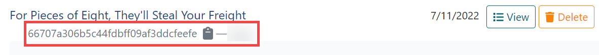

#### View (Expanded)

**Template Limit:** Defines the number of VM templates that can be added to the workspace.

**Template Scope:** Limits a workspace to using templates that have the given scope.

**Audience:** Limits who can deploy a gamespace as a workspace.

**VMs:** Refresh, deploy, view the console, start/stop, revert and delete from here. Functions are the same as [previously described](#view-expanded).

### Templates Tab

The **Templates** tab is where you can view all of the templates that exist in TopoMojo.

**Search:** Search for templates by workspace or name. You can apply filters to narrow your search. In the screenshot below, the filter is for linked VMs with a parent template of `kali-201901`.

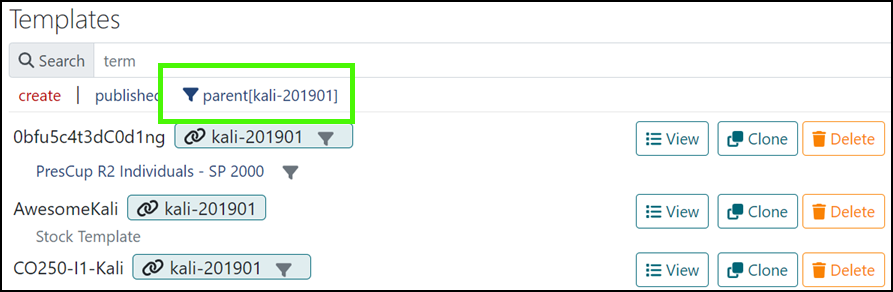

Filter for all templates from a workspace by clicking the _name_ of the of the workspace in the list.

!!! note "Linked and unlinked templates"

    The chain link icon ( <i class="fa-solid fa-link" aria-label="link-icon" role="img"></i> ) next to a template name indicates the VM is *linked*. Use linked VMs when the prebuilt, stock templates included with TopoMojo meet your needs. Linked VMs save resources when VMs don't require custom configurations when deployed. Changes can't be saved to linked VMs when deployed. Changes can only be saved to *unlinked* VMs.

    Unlinked VMs are marked with the unlinked icon ( <i class="fa-solid fa-unlink" aria-label="unlink-icon" role="img"></i> ) and show the parent template name.

#### Template Properties

See [Template Field Definitions](#template-field-definitions) for details on template configuration.

### Machines Tab

This tab lists VMs TopoMojo is tracking for all workspaces and gamespaces.

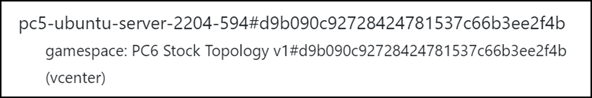

- `gamespace` indicates this VM belongs to a _gamespace_.
- `pc5-ubuntu-server-2204-594` is the name of the VM.
- `#d9b090c92728424781537c66b3ee2f4b` is the gamespace GUID appended to the VM name for ease of tracking.

#### "Orphaned" VMs

VMs tagged with `__orphaned` are VMs that still exist but are not associated with a workspace or gamespace. VMs can become orphaned when there is an error or disconnection from the hypervisor during TopoMojo's cleanup process. Orphaned VMs should be manually removed from the hypervisor.

To quickly identify orphaned VMs, search for "orphaned" in the Search field.

### Users Tab

The **Users** tab shows all TopoMojo users. You can create new users and assign users permissions here. To search for a user, enter the term into the **Search** field or filter by _role_ or _audience_. Recall from [workspace Settings](#settings) that _audience_ is a list of clients who can launch the workspace as a gamespace.

- **View ( <i class="fa-solid fa-list" aria-label="list-icon" role="img"></i> ):** Select **View** to see the properties for the user.
- **Delete ( <i class="fa-solid fa-trash" aria-label="delete-icon" role="img"></i> ):** Deletes the user.

#### Roles

- **User:** No extra permissions in TopoMojo. This is the TopoMojo default.
- **Builder:** Can connect to [reserved networks](#persistentshared-networks) such as `bridge-net`.
- **Creator:** Same permissions as _builder_ with additional permissions to bypass building limits such as the number of owned workspaces and workspace template limits.
- **Observer:** Allows a user to view and use the _Observe_ tab for viewing gamespaces. The _scope_ of the user (see below) limits access to gamespaces with a matching _audience_.
- **Admin:** Full administrative access to TopoMojo.
- **Disabled:** No permissions in TopoMojo.

Users that are building workspaces and using TopoMojo to troubleshoot deployed gamespaces should be granted the _Creator_ role.

#### Create a New User

- **Name:** Enter a new user name here.
- **Scope:** A space-delimited list of administrator-defined groups the user belongs to. Administrators can define a _scope_ with any name here. A user's scope determines which workspaces they have permission to deploy gamespaces from. Users can only deploy a gamespace from a workspace if the user has a _scope_ that matches an _audience_ defined in the workspace. See also: [Building a new workspace](#building-a-new-workspace).
- **Workspace Limit:** The maximum number of workspaces this user can manage.
- **Gamespace Limit:** The maximum number of concurrent active gamespaces allowed for this user.
- **Gamespace Max Duration:** The maximum amount of minutes allowed for a gamespace.
- **Gamespace Cleanup Grace time:** The number of minutes between gamespace expiration and when TopoMojo tears down the associated VMs.
- **Generate ApiKey:** Generate API keys for users to programmatically interact with the TopoMojo API without needing to log in interactively.

### Settings Tab

Upload a custom background image to change TopoMojo's theme.

### Log Tab

The **Log** tab is useful from the admin point of view when trying to troubleshoot. The Log tab only shows errors here, not every log line.
