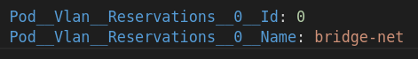
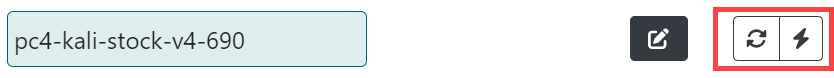
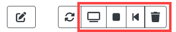
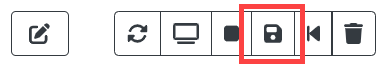
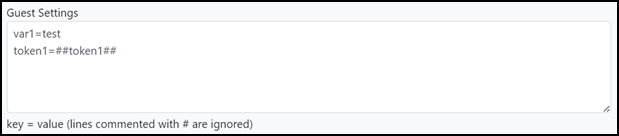
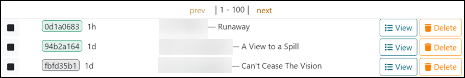
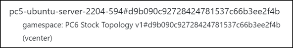

# {: style="height:75px;width:75px"} TopoMojo: Building Virtual Labs

This documentation introduces users to the TopoMojo environment and provides information necessary to launch existing labs and create new topologies.

## Overview

TopoMojo is a web application used for creating and delivering cybersecurity training labs and exercises. With TopoMojo, users can build and deploy labs in an isolated and secure virtual-machine environment.

TopoMojo allows for the same functionality and connectivity that users would experience with real, physical devices. Network topologies can utilize not only IP and Ethernet, but also custom protocol solutions like 802.11 wireless packet simulation.

New topologies can be rapidly deployed using existing templates or built from the ground up with user-provided ISO's and VM specifications.

Go to the TopoMojo repository: [github.com/cmu-sei/TopoMojo](https://github.com/cmu-sei/TopoMojo).

## TopoMojo Concepts

### Workspace and Gamespace

You build your content in a *workspace*, but you "play" (complete the lab, do the activity) in a *gamespace*. In the workspace, engineers and lab developers add VMs, save updates, author a guide in Markdown, and configure questions/answers to turn the topology into a lab or *challenge*.

A *gamespace* is where someone else plays through the lab. They get their own, isolated, read-only copies of all workspace resources. Players in a gamespace can interact with VMs and answer questions to complete a lab, but they can't save anything in the environment.

In short: a *gamespace* is a read-only copy of a *workspace* where a player (user) interacts with the lab content.

### Isolation Tag

A unique identifier TopoMojo uses to identify a workspace or gamespace.

- For a workspace: the *isolation tag* is the workspace id visible above the Workspace Title when viewing the workspace. See screen print 1.
- For a gamespace: the *isolation tag* is the gamespace id partially visible from the **Admin**, **Gamespaces** view (see screen print 2) and fully visible in the URL bar when viewing a VM console that belongs to a gamespace (highlighted in screen print 3).

The id's used for isolation tags uniquely identify each workspace and gamespace in the TopoMojo database. Additionally, each resource (e.g., virtual machine, virtual network, etc.) associated with a workspace or gamespace will have the isolation tag appended to the resource name.

For example: a VM named `challenge-sever` in the gamespace with id (isolation tag) `18048abc66f142e1804732082f4051d2`, has the name `challenge-server#18048abc66f142e1804732082f4051d2`. Appending the isolation tag to workspace/gamespace resources ensures environment isolation -- VMs and networks cannot have the same name, so there will never be accidental sharing of VM/network resources.

Screen print 1

Screen print 2

Screen print 3

### Challenge

The term *challenge* refers to when users integrate Gameboard and TopoMojo to execute a cyber competition. In this scenario, Gameboard is a consumer of content made in TopoMojo. More information on that is available elsewhere in the documentation.

## Getting Started

### What's New

Get the latest TopoMojo source code and its accompanying release notes from the [GitHub repository](https://github.com/cmu-sei/TopoMojo).

### Installing

Installing TopoMojo is a matter of installing it's [Helm chart](https://github.com/cmu-sei/helm-charts/tree/main/charts/topomojo) on the SEI's GitHub page. The CMU-SEI Helm charts repo is a public repository on GitHub for anyone to access and use. The TopoMojo chart contains two sub-charts: `topomojo-api` and `topomojo-ui`. The `api` and the `ui` are different apps and you should deploy them separately.

!!! info

    This structure is consistent with the other Foundry apps: there is an `api` piece and a `ui` piece.

**`TopoMojo values.yaml`:** Contains default configurations for the `api` and the `ui`. To deploy TopoMojo, configure the **`Values.yaml`** file according to your needs and `helm install` TopoMojo.

### Persistent/Shared Networks

We recommend having a persistent/shared network available to all TopoMojo workspaces/gamespaces. The administrator defines a persistent/shared network at the time they deploy the TopoMojo API.

For example, you could create a persistent/shared network that provides internet access to all TopoMojo VMs that specify the network name. `bridge-net` typically signifies bridging the traditionally isolated TopoMojo VM to the internet.

Use the `Pod__Vlan__Reservations` environment variable to define the name of a persistent/shared network. See screen print 1 below.

- `Pod__Vlan__Reservations__0__Id:` defines the vlan Id (from the hypervisor) that corresponds to the shared/persistent network.
- `Pod__Vlan__Reservations__0__Name:` defines the name of the persistent/shared network.

You can define more than one shared/persistent network by incrementing the variable name (`Pod__Vlan__Reservations__1__Id` and `Pod__Vlan__Reservations__1__Name`). To connect VMs to shared/persistent networks, users must have at least **Builder** permissions.

!!! note "A note about bridge-net"

    "bridge-net" is not always reserved. It is reserved by the SEI because we configured it that way, and it is convenient to refer to in the TopoMojo documentation.

*Screen print 1:*

## Finding a Space

Once you're in TopoMojo, you can browse for existing TopoMojo workspaces and gamespaces. In the left panel (`Ctrl-L`) , enter terms into the **Search** field. TopoMojo automatically searches for a workspace or a gamespace that matches your terms. Click **workspace** or **gamespace** to filter results. TopoMojo sorts labs alphabetically by name.

Select a gamespace, then click **Start**. You can "play" the lab now -- start by reading the instructions and launching a gamespace resource. You can end play by clicking **End**. You can invite others to play in your gamespace. Click **Invite** to copy an invitation link. Provide the other person(s) with the link.

The timer counts down how much remaining time you have before the gamespace expires.

## Building a New Workspace

The workspace interface contains six tabs: Settings, Templates, Document, Challenge, Files, and Play. To build a new TopoMojo workspace click **Home**, then **New Workspace**.

### Settings

The Settings tab holds the metadata for your lab.

**Title:** The title of your workspace; remember that the title should be unique.

**Description:** A brief description of your workspace to display when browsing titles. The **Description** is viewable to everyone, and when used in conjunction with Gameboard, visible there too.

**Tags:** Internal metadata to add data about the lab; for example, if using for a cyber competition, then your tag may be something like `cyber-cup c01`. Now, you can search for that challenge (or lab) using that tag.

**Authorship:** Your name and the names of others who may have assisted you.

**Audience:** A space-delimited list of administrator-defined groups that have permission to deploy gamespaces from the workspace. Administrators define an *audience* with any name here. Users can deploy gamespaces from the workspace only if their *scope* matches one of the provided *audiences*. `Everyone` is the global audience that allows all users to deploy gamespaces from the workspace.

**Duration:** Recommended length of time in minutes that it takes to play through a gamespace launched from your workspace.

**Collaboration:** To share your workspace with others click **Generate invitation**. Paste the link into an email and send. TopoMojo shows Collaborators here alongside the author. When a collaborator connects to your workspace, you'll see them `connected` in the top right corner of the workspace.

**Clone:** Clones your workspace; TopoMojo appends `-CLONE` to the title of the new workspace.

**Delete:** Deletes an existing workspace.

### Templates

The template selector allows you to add virtual machine templates to your workspace. The templates here are "starting point" virtual machines that you can customize. There are blank disc templates for installing your own operating system plus other VMs with operating systems pre-installed.

#### Adding and Editing Templates

To add a template to your workspace:

1. On the Templates tab, click **Add Templates**.
2. Search for and add the templates you need for your topology.
3. Click the **edit** icon to expand the template(s) to make changes.

#### Template Field Definitions

The list below explains the fields in the VM template.

- **Name:** Edit the name here. Remember that the name should be unique within the workspace.
- **Description:** The Description should contain the credentials for the virtual machine and the purpose of the virtual machine.
- **Networks:** The Networks fields allows you to add a space-delimited list of networks where the virtual machines connect. These names should be the same for all systems in your lab that need to connect to the same network.
- **Guest Settings:** List key value pairs in the form of `key=value` to pass data into deployed VMs via [VMware guestinfo variables](https://techdocs.broadcom.com/us/en/vmware-cis/vsphere/tools/12-5-0/vmware-tools-administration-12-5-0/configuring-vmware-tools-components/using-vmware-tools-configuration-utility/view-virtual-machine-status-information/query-information-using-guestinfo-variable.html) or the [QEMU Firmware Configuration Device](https://www.qemu.org/docs/master/specs/fw_cfg.html) for Proxmox. The **Guest Settings** field uses VMware guestinfo Variables to inject content into virtual machines. Place key/value pairs here. The *key* is the name of the guest variable you want to define, and the *value* is the value, information, setting, of the variable. For example, `var1=test` is a guest setting named "var1" with a value of "test".

  *Transforms* allow you to define dynamic variables that TopoMojo generates based on certain criteria or types. To add the concept of transforms here, select **Challenge** and see **Transforms**. The **info** icon in the Transforms section describes the transform types that are available. See also [TopoMojo Transforms](#transforms).

  Use VMware Tools, such as `open-vm-tools` and the `vmtoolsd` command, to access guest info variables from a Gamespace VM. See [Open VM Tools](https://docs.vmware.com/en/VMware-Tools/12.3.0/com.vmware.vsphere.vmwaretools.doc/GUID-8B6EA5B7-453B-48AA-92E5-DB7F061341D1.html) and [VMware Tools daemon help](https://helpmanual.io/help/vmtoolsd/).

  

- **Replicas:** Set this number to deploy copies of the same VM template. For example: to deploy three copies of a VM template when TopoMojo starts a *gamespace*, set **Replicas** to "3". To deploy one copy of the VM template for each team member that TopoMojo starts the gamespace for, set **Replicas** to "-1".
- **Variant:** Specify that TopoMojo should deploy the VM template only for a particular variant. For example, if the Variant is "2", TopoMojo deploys the VM template only when it launches variant 2 of the challenge.
- **ISO:** Use the ISO Selector to attach an ISO image to your virtual machine.
- **Console Access:** Toggle **Hidden** to hide a specific VM from being accessible by the person completing the lab. This is useful for systems like a DHCP server that do not require user interaction.
- **Linked:** *Unlinking* creates a new a new copy of the template which you can save and customize. Toggle **Unlink** for any virtual machine that will not use the default disk included with the template.
- **Delete Template:** Deletes the template.

#### Refresh and Deploy

Once the template is in the appropriate state:

- **Refresh**: (arrows) Refresh queries the state of the VM from the hypervisor. This is useful if you run a `shutdown` command in the VM and the TopoMojo UI icons haven't updated to reflect the powered-off state of the VM yet.
- **Deploy**: (lightning bolt) Deploys that virtual machine into your workspace.

The deployed virtual machine displays the following additional icons from left to right:

- **Console:** Opens the console for the virtual machine.
- **Stop/Start:** Power off/on the VM, but leaves the resource deployed on the hypervisor. Clicking **stop** results in the hypervisor showing a deployed VM in a powered-off state. Clicking **start** powers on the deployed VM.
- **Revert:** Reverts the VM to its last saved state. You lose all changes made since the last commit.
- **Delete:** Deletes a running VM instance. Before you click **delete**, make sure you have saved any changes to the disk.

#### Save

The **save** icon only when you're using an unlinked disk, since you can't save changes to a linked disk. Clicking **save** removes the last snapshot and creates a new one with all VM changes.

## Lab Document

The **Document** tab in a TopoMojo workspace is where you write the instructions that correspond with your lab. You author instructions in Markdown using TopoMojo's built-in editor. Authoring in Markdown enables you to create a nicely formatted document without writing HTML.

The TopoMojo editor is a collaborative editor. Multiple people can work on the documentation at the same time. As long as you are "connected" (see the top-right corner) TopoMojo saves your updates to the document.

For more information about Markdown, including the syntax guide, see [markdownguide.org](https://www.markdownguide.org/).

### Inserting an Image

To insert an image into your document:

1. Click **Images**, then click **Browse** (you can drag and drop too).
2. After browsing to upload an image, you should see a preview of the image.
3. Place your cursor in the document where you want the image, hover over the image, and click **Insert**.

### Previewing the Doc

To see how your instructions will look to players when they "play" your lab, click the **Preview** button. The first screen capture shows the Markdown editor. The second screen capture shows the document in preview mode.

and

## Challenge Tab

The *Challenge* tab in the TopoMojo workspace is where event organizers integrate Gameboard and TopoMojo to execute a cyber competition. Here, you create random key/values, embed them in a *gamespace* at deploy time, and ask questions and answers of competitors (players).

### Transforms

**Transforms** allow you to define dynamic variables that TopoMojo generates based on certain criteria or types. Transforms are also a key/value pair definition –- the **key** is the name of your transform and the **value** is the type of the transform. The screen print below shows a transform named "token1" that will have a value of 8 random hexadecimal characters.

*Screen print 1:*

To access transforms, use the referenced "*double-pounder-key* (`##key##`)" notation. When TopoMojo deploys a gamespace, the engine generates the random values for all transforms, looks for double-pounder-keys, then replaces them with the randomly generated values for that deployment.

Any of the sections on the Challenge tab (e.g., Transforms, Markdown, Questions, Answers) can contain *double-pounder-keys* that TopoMojo replaces with transform values at deploy time. You can also use transform *double-pounder-keys* in the *Guest Settings* field of a template to inject random variables into VM guest info variables when deploying a gamespace. (Transforms aren't generated when deploying workspace VMs, so the value of the variable will be the *double-pounder-key*.)

The screen print below shows the Guest Settings of a VM template configured to use two guest info variables: `var1` and `token1`. `Var1` has a value of "test" and `token1` will have a random 8-character hexadecimal string assigned when TopoMojo deploys a gamespace.

*Screen print 2:*

There is a detailed [Guest Settings](#template-field-definitions) portion of the Workspace documentation.

### Markdown

The markdown you enter here gets appended to the gamespace document.

### Variants

A *variant* describes a different version of a challenge. Variants can contain different ISO attachments, different virtual machines, and different questions and answers. Each time TopoMojo deploys a challenge, a variant is randomly selected for the deployment. For example, two competitors can attempt the same challenge, but one competitor may receive *variant #1* and the other competitor may receive *variant #2*. When creating a challenge using variants, make sure all variants test the same competitor skills at the same difficulty level. That is, variant #1 should test the same skills as variant #2 and one variant shouldn't be harder to solve than another variant.

### Question Set

**Move Up, Move Down, Remove:** These functions are self-explanatory. Use them to position the question in the sequence of questions for that set or remove it.

**Question:** Enter the question you expect the participant to answer here. Your question should be specific, so that there is only one correct answer.

**Answer:** Enter the correct answer that the competitor must submit to earn a score.

You will see these options when you select **Detail**.

**Hidden:** Select **Hidden** to prevent the question from appearing when playing the challenge. Hidden questions do not appear when playing in TopoMojo or via Gameboard.

**Grader:** Select the grading type here. The Grader determines if players submitted the correct answer to a question. Select one of four types:

- `Match`: The submission must exactly match what is in the **Answer** field. Use this when there is exactly one possible answer to a question.
- `MatchAny`: The submission must match one of the pipe-delimited answers in the **Answer** field. Use this when there is more than one possible answer to a question.
- `MatchAll`: The submission must match all of the pipe-delimited answers in the **Answer** field. Use this for questions expecting a list of answers.
- `MatchAlpha`: The submission must exactly match what is in the **Answer** field *after* the grader removes all non-alphanumeric characters. This is useful if the user might submit symbols that don't affect the validity of an answer. For example, `C:/Users` and `C:\Users` are both valid answers and the symbols (`/` vs `\`) don't matter.

The Grader converts all answers and submissions to lowercase before comparing them to the expected answer. All four grader types are case-insensitive.

#### Weight

Weight is the percentage of total for this question. The value should be between `0 and 1` or `0 and 100`. The weights of all questions within the set must add up to 100% or one (1). TopoMojo calculates zero (`0`) values evenly.

#### Example

Providing an example answer helps players understand the required answer format. For instance, sometimes a file needs both the name and the extension, while other times only the name is necessary.

## Files

The **Files** page in the TopoMojo workspace allows you to upload files from your system to TopoMojo to include in your lab. You can use these files as ISOs to attach to VMs in the workspace. If your files aren't already in an ISO file format, TopoMojo wraps them in an ISO after upload.

!!! note

    For ISO uploads to work, TopoMojo needs an NFS (Network File System) datastore presented to vSphere and TopoMojo must be able to access it.

The **Files** tab in TopoMojo is where you upload ISO files to attach to virtual machines. Supply the ISO you want to attach to your VM. The ISO adds extra resources that the original VM might not include. ISO files are disk images TopoMojo mounts as virtual CD drives on the VM. You want to attach an ISO when you need additional software, datasets, or other resources.

**Drag and Drop:** Admins drag their ISO file into the box on Files tab or browse to locate it on their own device.

By default, the **Local** filter only displays ISOs available in the current workspace.

When you upload an ISO file, TopoMojo creates a folder with *this* GUID--called out in green in screen print 1 below--in the folder name in the NFS datastore. TopoMojo puts your ISO in that folder. Only the current workspace, that is, *your* workspace has access to the ISO file.

Screen print 1: GUID and Local filter applied

When you remove the **Local** filter, you can see *all* of the ISOs in the global folder on the NFS data store. (The folder name will contain a GUID of all zeros.) These global ISOs are available to every workspace in TopoMojo.

You can attach an ISO to a VM in the challenge workspace **Templates** tab. See the [Adding and editing templates](#adding-and-editing-templates) section of this guide. When you select an ISO here, TopoMojo attaches the ISO to the VM upon its deployment.

You can also attach an ISO to a VM using the workspace **Challenge** tab's **Variant Detail** function. This "dynamic ISO attachment" gives you the ability to attach a variant-specific ISO file to a template. You *must* specify a target(s) here. See the [Variants](#variants) section of this guide.

## Play

The **Play** page is where you can interact with your lab in the same way others will when they launch your content or "play" through your challenge. Play deploys a read-only copy of all virtual machines in the workspace; this gives the player their own deployed configurations.

**Variant:** Specify which variant of the challenge you wish to play (if it is a *variant* challenge).

**Max Attempts:** The maximum number of submission attempts allowed when answering questions.

**Max Minutes:** The maximum number of minutes permitted to play before the gamespace expires.

**Point Value:** The point value assigned for this challenge when used with Gameboard in a cyber competition scenario. <!--need more detail here.-->

**Start:** Starts up the gamespace which includes setting the timer, deploying virtual machines, displaying the Markdown document, and making challenge questions available. Individuals get their own Play tab, so when playing, the gamespace environment is unique to you.

**Reset:** Resets the gamespace.

## Administrator Guide

TopoMojo has an admin interface called **Admin Dashboard**. To access the Admin Dashboard, you'll need the `admin` role. In the top-right corner, click the **Admin** button. TopoMojo provides the initial `admin` role to the first user who authenticates successfully.

### Hub Connections

**Hub connections** informs TopoMojo admins about which users are currently logged into TopoMojo.

### Announcement

The **Announcement** feature allows TopoMojo admins to broadcast important messages to everyone in TopoMojo. Announcements appear in the TopoMojo interface. In the Message field, enter the content of the announcement and click **Send**.

### Import/Export

This is future functionality for the TopoMojo UI. The API equivalent of import/export is available for use.

### Janitor

The **Janitor** service cleans up unused resources (e.g., a workspace VM that has been idle for a long time) in TopoMojo.

**Cleanup Report:** Provides a log of the Janitor's activity.

### Gamespaces Tab

The **Gamespaces** tab is where the admin can search for, and filter by, **active** and **inactive** gamespaces. By default, the search is for *active* gamespaces. Green indicates *active* gamespaces and gray indicates *inactive* gamespaces.

**Refresh:** Refreshes your search.

**Delete Selected:** Check the box next to **All** to select all gamespaces for deletion or check a box next to individual gamespaces to select for deletion.

Gamespaces in the table show the following information:

- Gamespace id or support code in Gameboard (e.g. `e9416013`)
- Time remaining (if active)
- User who is interacting with (or *had* interacted with) the gamespace
- Title of the *workspace* that deployed the *gamespace*

The screen print below shows several active and inactive gamespaces (usernames redacted).

#### View (Expanded)

**View:** Selecting **View** expands the gamespace information where a list of all the VMs associated with the gamespace and their state.

- **refresh:** Refreshes the VM instance.
- **console:** Allows you to interact with the VM (a user's gamespace).
- **stop:** Stops a powered on VM.
- **revert:** Reverts to last saved state.
- **delete:** Deletes a running VM instance.
- **JSON:** Shows detailed information about the gamespace, including: answers to questions, variables associated with the challenge, submitted answers, challenge questions and expected answers, and if the participant answered questions correctly or incorrectly.
- **Dispatcher:** Used to issue commands to a VM from TopoMojo provided that the TopoMojo agent program is running on that VM. The VM requires an internet connection which allows the agent program to establish a connection with TopoMojo. `target` is the hostname of the VM that you want to run the command on. `command` is any command you wish to run. See TopoMojo's [GitHub repository](https://github.com/cmu-sei/TopoMojo/tree/main/src/TopoMojo.Agent) for more information on TopoMojo's agent.

#### Delete

**Delete:** As you would expect, deletes the gamespace and associated VMs.

### Workspaces Tab

The **Workspaces** tab is where the admin can search for workspaces and perform limited actions. Workspaces are where you build challenges and labs. Here, an admin can view every workspace.

!!! note

    Only users who are admins can view the list of workspaces on the Admin panel. Non-admin users will use the search feature on the left navigation pane.

In the left navigation pane, you can use the **Search** field to locate a workspace. However, searching here only returns workspaces you created or workspaces others invited you to join.

**Create:** Create a new workspace from the Admin Workspaces panel. For additional help, see [Building a new workspace](#building-a-new-workspace).

Selecting a workspace takes you the **Settings** tab of that particular workspace where you can edit it. For additional help on the **Settings** tab, see [Building a new workspace](#building-a-new-workspace).

The *workspace identifier* is present here too. The workspace identifier matches the directory name used to store workspace files like unlinked virtual machines, Markdown documents, images, etc. Copying it to the clipboard is useful if you need to use it in a terminal when navigating the filesystem.

#### View (Expanded)

**Template Limit:** Defines the number of VMs that can be in the workspace.

**Template Scope:** Limits a workspace to using templates that have the given scope.

**Audience:** Limits who can deploy a gamespace as a workspace.

**VMs:** Refresh, deploy, view the console, start/stop, revert and delete from here. - **Refresh**: Queries the state of the VM from the hypervisor. - **Deploy**: Deploys that virtual machine into your workspace. - **Console:** Opens the console for the virtual machine. - **Stop/Start:** Power off/on the VM, but leaves the resource deployed on the hypervisor. Clicking **stop** results in the hypervisor showing a deployed VM in a powered-off state. Clicking **start** powers on the deployed VM. - **Revert:** Reverts the VM to its last saved state. You will lose all changes made since the last commit. - **Delete:** Deletes a running VM instance.

### Templates Tab

The **Templates** tab is where you can view all of the templates that exist in TopoMojo.

**Search:** Search for templates by workspace. Notice that you can apply filters here to further narrow down your search. In the screen print below, the filter is for linked VMs with a parent template of a VM called `kali-201901`.

You can filter for specific workspaces here too. Clicking the *name* of the of the workspace takes you directly to the workspace.

!!! note "Linked and unlinked templates"

    The chain link icon next to a template name indicates the VM is *linked*. Use linked VMs when the prebuilt, stock templates included with TopoMojo meet your needs. Linked VMs save resources when VMs don't require custom configurations when deployed. Changes can't be saved to linked VMs when deployed. Changes can only be saved to *unlinked* VMs.

#### Template Properties

**Name:** The VM name can't contain spaces; TopoMojo will replace spaces in a name with a `-`.

**Description:** Not visible to users; use the *Description* in a way that meets your needs. For example, include VM credentials here.

**Networks:** A space delimited list of network names. When TopoMojo deploys a VM, it will have *one* network interface for each of the named networks. TopoMojo creates networks on the hypervisor at VM-deploy time if they don't already exist.

TopoMojo appends the isolation tag of the workspace/gamespace to network names to ensure network isolation.

TopoMojo does not append the isolation tag to persistent/shared networks listed here; the VM connects to the existing shared/persistent network.

For more information on *isolation tags*, see the [Isolation Tag](#isolation-tag) section.

**Guest Settings:** List key value pairs in the form of `key=value` to pass data into deployed VMs via VMware guestinfo Variables. The **Guest Settings** field uses VMware Guest Info Variables to inject content into virtual machines. Place key/value pairs here. The *key* is the name of the guest variable you want to define, and the *value* is value, information, setting, of the variable. For example, `var1=test` is a guest setting named "var1" with a value of "test".

**Replicas:** *Replicas* indicates how many copies of the VM get deployed in a gamespace. This will vary according to your needs. You may need two copies of the VM per gamespace or you may need 10. E.g.: two users are working a TopoMojo lab together; we want to set Replicas to `2` to ensure that each user has their own VM to work with. If set to `1`, then the two users could encroach on each other's work on the single VM.

When deciding how many replicas you need, keep resources in mind. If, as in our example above, we only need two copies of the VM at any given time don't set Replicas to `5`. TopoMojo will deploy five, two will get used, and the other three won't get used.

`-1`: Setting Replicas to `-1` means TopoMojo will deploy one VM template copy per user. If there are two users, then TopoMojo deploys two copies; if there are 10 users, then 10 copies. TopoMojo does not deploy extra VMs. Use this setting in conjunction with the Gameboard app, where Gameboard informs TopoMojo on how many copies to make based upon the Gameboard team size.

The value set in **Replicas** only applies to the template you are editing; not every template in the workspace. So, if you want the same number of copies deployed in a gamespace for each template, you'll have to edit each template individually.

### Machines Tab

This tab lists all VMs TopoMojo is tracking and the gamespaces they belong to, without using the vSphere Client.

- `gamespace` tells you this is a *gamespace* VM.
- `pc5-ubuntu-server-2204-594` is the name of the VM.
- `#d9b090c92728424781537c66b3ee2f4b` after the hash tag is the gamespace GUID.

The **Machines** tab is helpful when you want to find all the VMs related to a gamespace (e.g., `PC6 Stock Topology v1` in the screen print above). You can copy the gamespace GUID and paste it into the **Search** field. Note that you cannot interact with the VMs from this tab.

#### "Orphaned" VMs

VMs tagged with `__orphaned` are VMs that still exist; however, they are not connected to anything. TopoMojo may have attached these VMs to an expired gamespace, and when it tried to remove them vSphere failed to respond. Orphaned VMs should be manually deleted in vSphere.

To identify orphaned VMs, search for "orphaned" in the Search field, identify the VMs to clean up in vSphere, and delete them. Once deleted in vSphere, they won't appear on the **Machines** tab again.

### Users Tab

The **Users** tab shows all current TopoMojo users. You can create new users here and assign them permissions. The **Search** feature allows TopoMojo admins to search on the name of a TopoMojo user. To search for a user across all of TopoMojo, enter the term into the **Search** field or filter by *role* or *audience*.

Recall from workspace Settings that "audience" is a list of clients who can launch the workspace as a gamespace. Selecting an audience filter results in users who are part of that audience.

**View:** Select **View** to see the properties for the user.

**Delete:** Deletes the user.

#### Roles

All permissions are *additive*; meaning a Creator can do everything a Builder can do and an Observer can do everything a Builder and Creator can do.

- **Admin:** Highest level of permission in TopoMojo; can do everything the other roles can do.
- **Observer:** Allows a user to view and use the Gamespaces tab. However, the *scope* of the user (see below) limits access too. An observer can deploy gamespaces with a matching *audience* and these are the only gamespaces the user can observe.
- **Creator:** Can have as many workspaces and templates as wanted.
- **Builder:** Can connect to bridge-net.
- **User:** No extra permissions in TopoMojo. This is the TopoMojo default.
- **Disabled:** No permissions in TopoMojo.

#### Create a New User

**Name:** Enter a new user name here.

**Scope:** A space-delimited list of administrator-defined groups the user belongs to. Administrators can define a *scope* with any name here. A user's scope determines which workspaces they have permission to deploy gamespaces from. Users can only deploy a gamespace from a workspace if the user has a *scope* that matches an *audience* defined in the workspace. See also: [Building a new workspace](#building-a-new-workspace).

**Workspace Limit:** The maximum number of workspaces this user can manage.

**Gamespace Limit:** The maximum number of concurrent gamespaces allowed for this user.

**Gamespace Max Duration:** The maximum amount of minutes allowed for a gamespace.

**Gamespace Cleanup Grace time:** The number of "grace" minutes between the time the gamespace expires and when TopoMojo tears it down.

**Generate ApiKey:** Generate API keys here. This allows users to programmatically interact with the TopoMojo API without needing to log in.

### Log Tab

The **Log** tab is useful from the admin point of view when trying to troubleshoot. The Log tab only shows errors here, not every log line.

### Copy and Paste

The procedures below show you how to:

- Copy text from a local machine (an *out of game* computer) and paste it into an *in game* virtual machine
- Copy text from a virtual machine and paste it into a local machine

*The VM console cog icon:*

#### From Local ("Out of Game") to "In Game"

1. On your local machine select, then copy, the content you want to place into a launched virtual machine.
2. In the VM console tab, select the cog icon (the **Tools**). Under **Clipboard** paste in the clip using right-click Paste or `ctrl+V`.
3. In the VM, select where you want the copied text to go (this can be a new file or an open application, etc.).
4. Under **Clipboard**, click **Paste**. This inserts the copied content into the virtual machine.
   

#### From "In Game" to "Out of Game"

1. On the VM, select the content you would like to copy. Copy the content *first* to the VM's clipboard (right-click Copy or `ctrl+C`).
2. Once you've copied your text to the VM clipboard select the cog icon (the **Tools**), place your cursor in that clipboard, and click **Copy**. This transfers the VM clip to your local clipboard.
   
3. On your local machine, paste the copied text into an application using right-click Paste or `ctrl+V`.
