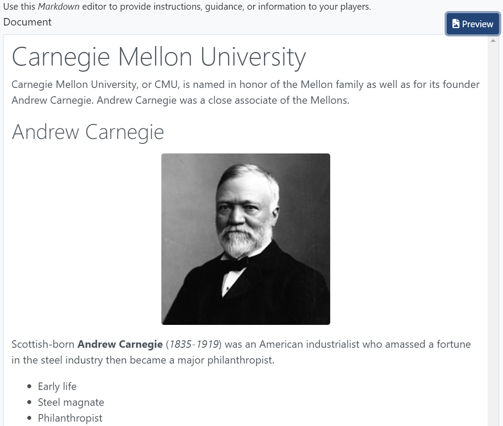

# Lab Document

The **Document** tab in a Topo workspace is where you write the instructions that correspond with your lab. Instructions are authored in Markdown using Topo's built-in editor. Authoring in Markdown enables you to create a nicely formatted document without writing HTML. 

The Topo editor is a collaborative editor. Multiple people can work on the documentation at the same time. As long as you are "connected" (see the top-right corner) your updates to the document are being saved.

More information about Markdown, including the syntax guide, can be found at [markdownguide.org](https://www.markdownguide.org/).

## Inserting an image

To insert an image into your document:

1. Click **Images**, then click **Browse** (you can drag and drop too).
2. After browsing to upload an image, you should see a preview of the image. 
3. Place your cursor in the document where you want the image, hover over the image, and click **Insert**.

## Previewing the doc

To see how your instructions will look to players when they "play" your lab, click the **Preview** button. The first screen capture shows the Markdown editor. The second screen capture shows the document in preview mode. 

and

