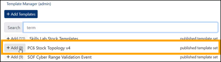
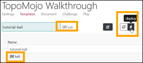
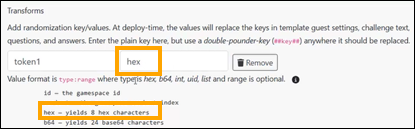
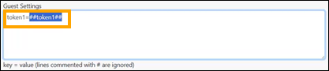
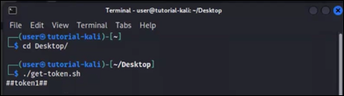
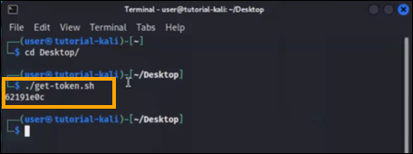

# Creating a TopoMojo Challenge

This tutorial shows you how to create and configure a cybersecurity challenge in [TopoMojo](../../topomojo/index.md), from defining the workspace and resources to preparing the challenge for participant use.

## Assumptions

This tutorial assumes the following:

- You have access to a TopoMojo instance
- You have the `Creator` role or greater in TopoMojo
- You have a basic understanding of virtualization and networking concepts
- You are familiar with supported hypervisors like VMware and Proxmox

:blue_book: As you work through this tutorial, you may want to learn more about the Crucible applications or features. If so, refer to the [Related Resources](#related-resources) section below for additional detail and reference information.

!!! example

     This tutorial uses screenshots with sample data to illustrate the steps. Any values shown in a monospace font and wrapped in backticks (for example, `TopoMojo Walkthrough` and `A small example TopoMojo Walkthrough`) are placeholders. Replace these values with your own to follow along and produce a working TopoMojo challenge.

## Step 1: Creating and Configuring Your Workspace

1. Log in to your TopoMojo instance.
2. Click **+New Workspace** to create an empty workspace for the challenge.
3. Enter the workspace metadata. The list below describes some key settings. For additional detail, see the TopoMojo documentation, [Building a New Workspace](../../topomojo/index.md#building-a-new-workspace).

   - **Title**: Enter a title that identifies the challenge (for example, "Network Traffic Analysis"). For the purposes of this tutorial, we'll enter: `TopoMojo Walkthrough`.
   - **Description**: Enter a short description of the challenge (1–3 sentences). We'll enter: `A small example TopoMojo Walkthrough`.
   - **Tags**: Add tags to make the challenge easier to find. Use a space-delimited list (for example, "cyber-defense-analysis incident-response"). Tags are typically hidden from TopoMojo participants unless a consuming application, such as Gameboard, looks for specific tags. We'll enter: `walkthrough`.
   - **Audience**: Select the audience to control which users can view or play the challenge. For a complete list of the settings, see the TopoMojo documentation, [Settings](../../topomojo/index.md#settings).

## Step 2: Adding Virtual Machine Templates

TopoMojo templates are starting-point virtual machines that you can customize. When a user deploys a gamespace, they receive read-only copies of all templates in the workspace from the template's last saved state. For full field descriptions and functions, see [Templates](../../topomojo/index.md#templates) in the TopoMojo Guide.

1. In your TopoMojo workspace, click the **Templates** tab.
2. Click **+ Add Templates** to add VMs to your challenge. We'll search for, then add: `kali` from the PC6 Stock Topology.
3. Click **Edit**.

    - **Name:** We'll enter `tutorial kali`.
    - **Description:** We'll use the **Description** field to record the VM's credentials and provide a brief explanation. This field is not visible to end users. We'll enter: `creds: user/tartans`.
    - **Networks:** To keep it simple, we'll enter `lan`. The network name is arbitrary. VMware or Proxmox create the network with that name at deployment time. Templates in the same workspace that share the network name can communicate with each other.
    - **Guest Settings:** We'll cover guest settings in the sections below.
    - **Linked/Unlinked:** We'll click `Unlink` because we want TopoMojo to create a new disk instead of referencing the parent template's disk.

!!! tip

    A template set groups multiple published templates from the same workspace into a single, one-click deployment. This lets you add an entire topology at once instead of selecting each template individually.

    

### Editing and Saving Template Changes

*Unlinking* gives the VM its own independent copy, which is where you make edits and save changes. The **Initialize** button appears at the top of the page because TopoMojo knows it needs a new disk but *has not created it yet*.

1. Click **Initialize**. Initializing tells VMware or Proxmox to create a new disk and copy the backend artifacts. Once initialized, the **Deploy** button becomes available.
2. Click **Deploy**. Deploying the VM creates it in the workspace, where you make and save all edits to the challenge.

     

3. Click **Console**. For the purposes of this tutorial, we'll make two edits to the VM. We'll add a file called `example.txt` on the Desktop and we'll add a script called `some script` that reads from the guest info variables.

     

4. In the new browser tab, on the VM console's Desktop:

     - Create a new `.txt` file called `example.txt`.
     - Create a new script called `get-token.sh`.
         - `#!/usr/bin` tells the operating system to run the file using Bash.
         - `vmtoolsd --cmd "info-get guestinfo.token1"` reads a VMware guestinfo variable named `token1`.
     - Your script should look like this:

         ```bash
         #!/bin/bash
         vmtoolsd --"info-get guestinfo.token"
         ```

5. Make `get-token.sh` executable by running `chmod` from a terminal.

     - Open a terminal in the VM.
     - Change to the directory that contains your script. For example:

         ```bash
         cd ~/Desktop
         ```
     - Run the script:

         ```bash
         chmod +x get-token.sh
         ```

6. Test the script.

     ```bash
     ./get-token.sh
     ```

We get `No value found` because we haven't configured the guest info variables yet.

After unlinking, initializing, and deploying, and editing the VM, TopoMojo shows a **Save** icon for the template. Clicking **Save** creates a VM snapshot on the hypervisor. TopoMojo supports only one snapshot, and saving overwrites the previously saved state.


!!! warning

    Always shut down the VM from within the console operating system before saving changes in TopoMojo. Saving in TopoMojo while the VM is powered on is similar to cutting power abruptly and can result in inconsistent state or unexpected behavior.

In TopoMojo, click **Save**. The changes we made to the VM, including the two files we added to the Desktop, will persist the next time TopoMojo deploys the VM.

## Step 3: Configuring Transforms, Guest Settings, and Questions

### Adding a Transform

If you recall, the script we wrote reads the value of a guest info variable named `token1`. You configure this variable in the **Transforms** section of the **Challenge** tab.


1. Navigate to the **Transforms** section of the challenge.
2. Set the **Key** (name) to `token1`. The key is the name of the variable.
3. Next to the **Value**, expand the tool tip (the **i**). The tool tip what kind of value TopoMojo generates. You can use values such as a game space ID, variant ID, hexadecimal or base64 strings, random integers, or universally unique identifiers. You can also constrain values, for example by generating exactly 12 hexadecimal characters (hex:12) or a number within a specific range (such as 99–999).
4. Set the **Value** to `hex`. That generates 8 hexadecimal characters inside a variable called `token1`.



### Adding a Question

We can now add a question that asks for the value of `token1`.

1. Navigate to the **Question Set** section on the **Challenge tab**.
2. In the **Question** field, enter `What is the value of token1?`
3. In the **Answer** field, enter `##token1##`. We us the "double-pound" notation because we want to reference the transform value in the answer. This double-pound syntax performs variable replacement at grading time.
4. For **Grader**, use the **Match** grading type so the participant must enter the value exactly as it appears.
5. For **Example**, enter `abcd1234`. Because the transform generates an 8-character hexadecimal value, we want to show participants what the answer format should look like.
6. Click **Save**.

!!! note

     The other **Grader** types are fully documented in the *TopoMojo Guide* under the [Question Set](../../topomojo/index.md/#question-set) section.

### Updating the Guest Settings

After saving the changes on the Challenge tab, the transform becomes available for use.

1. Click the **Templates** tab. We're going to configure our Kali template to receive that transform through its guest settings.
2. Under **Guest Settings**, enter `token1=##token1`. The guest info variable requires two pieces of information: a name (`key`) and a `value`. TopoMojo now knows to insert the value of the token1 transform into the guest settings when it deploys the virtual machine.
3. Click **Deploy**.



At this point, the behavior differs slightly depending on where TopoMojo deploys the VM. When TopoMojo deploys a *gamespace*, it performs variable replacement across the entire gamespace. TopoMojo replaces the `##token1##` template with a randomly generated value, and that value appears everywhere TopoMojo references the template.

This replacement does not occur in a *workspace*. As a result, when *you* (the TopoMojo admin who is building the challenge) run the grading script (`./get-token.sh`) in a workspace, the script returns the literal value `##token1##`. This confirms that you've set up the guest info variable correctly. This expected behavior provides a valid way to test the challenge while working in a workspace.

1. Opening a terminal in the VM (the one you just deployed).
2. Change to the directory that contains your script. For example:

     ```bash
     cd ~/Desktop
     ```

3. Run the script:

     ```bash
     ./get-token.sh
     ```



## Step 4: Writing the Challenge Document

Every good lab or challenge should include a document that gives participants clear, structured instructions for understanding the objectives and completing the exercise effectively.

1. Click the **Document** tab.
2. In the editor, type the following:

     ```text
     This is a TopoMojo Walkthrough.

     Visit the Desktop of the provided Kali VM via the command line (use the command `cd ~/Desktop` from a terminal). Then run `./get-token.sh` to get the value of token1.

     Submit your answer in the question box.
     ```

3. Click **Save**.

Your lab document should look like this.


!!! tip "Using a Cut Line"

     TopoMoJo supports a special "cut line" using an HTML comment: `<!-- cut -->`. TopoMoJo shows document content above the cut line as a preview before users deploy the challenge and hides the remaining instructions until the challenge starts. Use a cut line to give participants an overview without revealing all of the details up front.

     

## Step 5: Playing the Challenge

At this point, the challenge includes a transform, guest info variable, instructions, and a question to answer. We're ready to "play" our challenge to test it.

1. Click the **Play** tab. Notice that only the top portion of the document - everything above the cut line - is visible. As part of testing, you can adjust settings such as **Variant** (if the challenge supports variants, you can select a specific variant to deploy; selecting `0` chooses a random variant); **Max Attempts**, **Max Minutes** (i.e., challenge duration), and **Point Value**.  These controls exist only for developer testing. End users do not see this interface, and any changes made here do not persist if you switch tabs.
2. Click **Start**. Once the game space finishes deploying, you can view the full challenge document.
3. Follow the lab instructions.

     - Launch the Kali VM.
     - Run `get-token.sh` to retrieve the generated value.
     - Copy it from the VM using the clipboard in the **Settings cog**.
     - Paste it into the answer field in TopoMojo.
     - **Submit** the answer. When you submit the correct answer, TopoMojo marks the challenge complete and automatically cleans up the gamespace.

The screen print below shows the terminal in the gamespace after running `get-token.sh`. The script outputs a randomly generated value, confirming that the transform replaced the placeholder template syntax with an actual value at deployment time.



At this point, you have a complete, working TopoMojo challenge and the tools to build on it!

## Beyond the Basics (Optional)

### Adding an Additional Transform

As a more advanced example, you can add an additional transform. Still in our `TopoMojo Walkthrough` workspace:

1. Go to the **Challenge** tab.
2. Click **Add Transform** and add a new transform of type `int` (an integer between 100 and 500) called `token2`.

     

3. Scroll down to the **Markdown** section just below **Transforms** section. This Markdown field is special: TopoMojo appends it to the end of the main challenge document when it deploys the gamespace. Unlike the main document section, this Markdown supports transform substitution, which lets you reference values such as `##token2##` directly in the instructions. You can use this area to add extra guidance or follow-on questions without revealing them before deployment. In this Markdown field, enter:

    

(The code fences are not necessary, but we included for formatting purposes.)

### Adding a New Question

After adding the transform, create a new question that asks for the value of `token2`.

1. Click **Add Question** and type the following: `What is the value of token2?`.
2. For the **Answer**, enter `##token2##`.
3. For the **Example**, enter `100`.
4. Click **Save**.

Question 2 should look like the screen print below.


To see how Question 2 behaves, you'll "play" the challenge again.

Click the **Play** tab. The original document ends at `Submit your answer in the question box.` but our *new* markdown appears too.


The transform value resolves to the generated number, in this example, `270`.

Submit `270` as the answer to Question 2: `What is the value of token2?`.

### Introducing Variants

<!-- Start here on Monday morning. -->

### Guest Settings

Guest Settings pass information to deployed VMs using VMware `guestinfo` variables or the QEMU firmware configuration device on Proxmox. Expand a VM template's options to define guest settings using a `key=value` format. You can use transforms to insert randomized values.

!!! example

    ```text
    token1=##token1##
    ipaddr=1.2.3.4
    ```

VMs can use scripts to access guest settings using hypervisor-specific commands.

!!! example "Querying VMware guestinfo variables"

    ```bash
    vmware-toolsd --cmd "info-get guestinfo.<variable-name>"
    ```

!!! example "Querying the QEMU firmware configuration device on Proxmox"

    ```bash
    sudo cat /sys/firmware/qemu_fw_cfg/by_name/opt/guestinfo.<variable-name>/raw
    ```

### Template Replicas

You can configure **Replicas** for team-based challenges where multiple team members work simultaneously. Each replica starts with the same state, configuration, and guest settings. TopoMojo deploys the specified number of VM replicas in each gamespace and appends a `_#` suffix to running VM names (for example, `kali_1`, `kali_2`). As a best practice, set the replica count to `-1` so TopoMojo deploys one replica per team member. This prevents deploying more replicas than the team can use.

??? tip "Template Best Practices"

    - **Unlinking Templates:** Use linked templates whenever possible. Linked templates reduce backend storage use and provide a shared, consistent VM environment that users can become familiar with across challenges.
    - **Use a Challenge Server:** Use a dedicated *challenge server* VM as the control point for the challenge. A challenge server can run startup scripts, host grading logic or websites, collect logs, and perform automation. This approach lets you maximize the use of linked templates by placing configuration, automation, and grading on a single unlinked VM. Carnegie Mellon University's Software Engineering Institute provides a reference challenge server on GitHub: [github.com/cmu-sei/Challenge-Server](https://github.com/cmu-sei/Challenge-Server).
    - **Template Visibility:** Set templates as *visible* or *hidden*. Visible templates expose a UI console to users. Hidden templates do not expose a UI console but may remain accessible over the network. Hide templates that users should not access directly, such as attacker or backend systems.
    - **Template Naming:** Use clean, descriptive names for templates. Avoid tags, IDs, or internal details in visible template names. Use unique or structured names for hidden templates to help administrators identify resources during troubleshooting.
    - **Template Count:** Add VM templates only when required. Fewer templates reduce infrastructure usage and keep challenges easier to understand and maintain.
    - **Clean Before Saving:** Clean templates before saving them. Remove command and browser history, delete logs, and remove development artifacts or files to prevent unintended hints or shortcuts.

## Step 3: Configuring Transforms

The **Challenge** tab lets you configure transforms and challenge questions.

Transforms generate dynamic values, like tokens, that make each deployed challenge unique. TopoMojo creates randomized values for configured transforms when it deploys a gamespace. Using transforms increases challenge reusability by preventing users from relying on known answers and sharing solutions.

Most text fields on the Challenge tab support transform substitution using a double-pound notation (for example, `##transform-name##`). The **Markdown** and **Variant** sections let you add challenge content that also supports transforms, enabling dynamic challenge documents. Challenge questions and answers can include transforms to generate dynamic text and answers. For applying transforms in VM configuration, see the [Guest Settings](#guest-settings) section.

## Step 4: Adding Challenge Questions

Also on the Challenge tab, add the questions that users must answer. Always configure an example answer for each question to show the expected answer format.

You can assign an optional **Weight** to each question to control how TopoMojo distributes points. By default, questions have a weight of `0`, which gives all questions an equal share of the total points. Use values from `0–100` to allocate a percentage of the total score (for example, a weight of `60` assigns 60% of the challenge points to that question).

!!! warning "Question Weights"

    If question weights do not add up to 100, the challenge may behave unexpectedly.

Each question uses a **Grader** type, which defines how the system evaluates answers. For additional details on supported grader types, see [Question Set](../../topomojo/index.md#question-set) in the *TopoMojo Guide*.

You can reference transform variables in question text and answers, as described in the [transforms section](#step-3-configuring-transforms). Transforms allow each challenge deployment to generate unique questions and answers.

You can also use variants to randomize challenges in a more controlled way than transforms. Variants can define different documentation, VM attachments (such as ISOs), and question sets. When deploying a gamespace, TopoMojo randomly selects a variant. For additional details, see [Variants](../../topomojo/index.md#variants) in the *TopoMojo Guide*.

Prefer transforms over variants. Variants increase development and testing effort because you must build and validate each variant. Use variants when:

1. Challenge artifacts can't change dynamically through scripting or transforms.
2. VM configurations must differ in ways that scripting at boot can't support.

## Troubleshooting Common Issues

### VM Changes Don't Persist

1. Confirm that you unlinked the template.
2. Confirm that clicking **Save** does not produce an error in the TopoMojo UI.
3. Review TopoMojo API logs and hypervisor logs (VMware or Proxmox) for errors related to saving the VM.

### Transform Values Don't Appear in VMs

1. Remember that TopoMojo applies transform values at gamespace deploy time; they do not appear in workspaces.
2. Confirm that you configured guest settings correctly and that variable names match exactly (case sensitive).
3. Confirm that you use the [correct command for your hypervisor](#guest-settings).

## Related Resources

- [Challenge Development Guidelines for Cybersecurity Competitions](https://www.sei.cmu.edu/library/challenge-development-guidelines-for-cybersecurity-competitions): This paper draws on the SEI's experience to provide general-purpose guidelines and best practices for developing effective cybersecurity challenges.
- [Crucible Documentation](../../index.md)
- [TopoMojo Guide](../../topomojo/index.md)
- [TopoMojo GitHub Repository](https://github.com/cmu-sei/TopoMojo)
